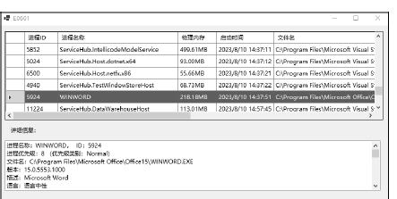
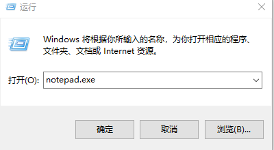

# 实验4: 任务管理器（进程管理）
## 实验内容
编写WinForms 应用程序实现以下功能。

（1）获取本机所有进程信息，并用LisView显示进程ID、姓名、内存等信息。

（2）增加【关闭进程】功能。选中待关闭的进程，点击【关闭进程】按钮，关闭指定进程。

（3）增加【启动进程】功能。点击【启动进程】按钮，结合OpenFileDialog选择需要启动的进程可执行文件。
## 实验目标
通过编程实践，掌握Process类的用法及ListView的用法。
## 补充说明
1、复现代码

获取本机所有进程信息。

2、增加关闭进程功能

下方增加按钮，点击按钮，关闭选中进程。

3、增加启动进程功能

下方增加启动进程按钮，弹出模式对话框窗体，实现类似功能。界面仅为推荐不限制，可以根据全路径信息，启动进程即可。

