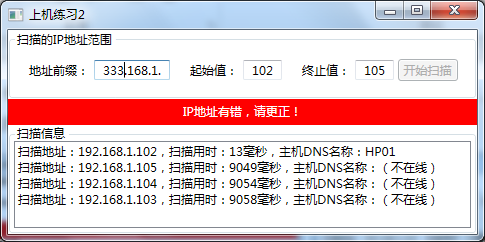
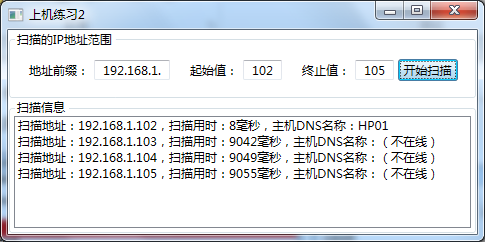

# 实验5: 多线程IP地址解析
## 实验内容
编写WinForms 应用程序实现以下功能。

（1）单线程IP地址扫描

设计单线程IP地址扫描窗体。注册【单线程】按钮的事件，由主线程负责IP地址扫描任务。利用Dns类在事件中对指定的IP地址范围内IP进行解析，找到对应IP地址的主机名。如果主机不在线，则捕获异常，提示“主机不在线”。在for循环开始扫描前，利用StopWarch开始计时，在所有IP地址扫描完毕后，结束计时，并获取所有IP扫描所需要的时间。

（2）多线程IP地址扫描

注册【多线程】按钮的事件，利用多线程编程实现并发IP地址扫描。每个线程负责一个IP地址的扫描。在for循环开始扫描前，利用StopWarch开始计时，在所有IP地址扫描完毕后，结束计时，并获取所有IP扫描所需要的时间。

（3）分析多线程及单线程所消耗的总时间是否基本一致，并分析原因。

（4）分析单线程扫描机制下界面卡顿的原因。

 

(a) 输入地址不正确时用红底白字提示 (b) 单击开始扫描后的显示信息示意