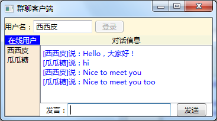
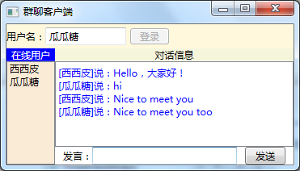

# 实验6: TCP即时通信程序
## 实验内容
客户端编写WinForms应用程序，服务端编写控制台应用程序。服务端利用TcpListener对象在本机监听指定端口，客户端利用TcpClient连接服务端，构架C/S模式架构。设计Login,TalkToOne,Talk,List等命令，实现登录、单聊、群聊、用户列表显示等功能。
## 实验目标
使学生掌握网络编程基础、TCP协议的理解、多线程与异步编程、WinForms应用程序的网络功能、错误处理与异常管理等方面的知识和技能，并提升实验设计与实践能力。
## 详细说明
在同一个解决方案中，分别编写服务端程序和客户端程序，利用TCP实现简单的群聊功能。客户端程序运行效果如图所示。

(a) 客户端主界面

 

(b) 客户端1 (c) 客户端2

###### 运行效果

具体要求如下：

（1）服务端、客户端程序选择【Windows窗体应用程序】模板。

（2）客户端与服务端连接成功后，通过服务端获取已经在线的用户，并将其显示在客户端的在线用户列表中。

（3）不论哪个用户发送聊天消息，其他所有用户都能看到该消息。

（4）当某个用户退出后，在线用户列表中自动移除该用户。