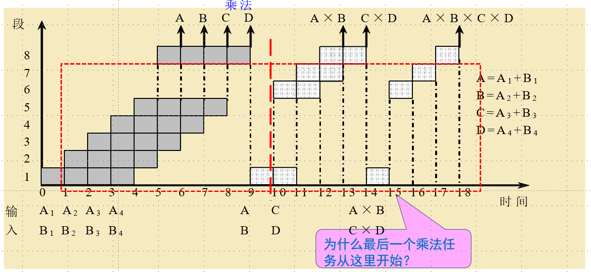

# 计算机体系结构习题集

## 第1章 计算机系统结构基础知识 (20250901)

1. 指令系统的确定属于（ A ）

A. 计算机系统结构

B. 计算机组成

C. 计算机实现

D. 其他

2. 指令的实现（取指令、分析指令、取操作数等）属于（ B ）

A. 计算机系统结构

B. 计算机组成

C. 计算机实现

D. 其他

---

## 第2章 指令系统的设计 (20250917更新)

1. 不需要编址的数据存储空间是（ D ）

A. CPU中的通用寄存器

B. 主存储器

C. I/O接口中的寄存器

D. 堆栈

2. 信息按整数边界存储的主要优点是（ A ）

A. 访存速度快

B. 节约主存单元

C. 指令字的规整化

D. 指令的优化

3. 以下关于复杂指令集计算机（Complex Instruction Set Computer, CISC）的叙述中正确的是（ D ）

A. 只设置使用频度高的一些简单指令，不同指令执行时间差别很小

B. CPU中设置大量寄存器，利用率低

C. 常采用执行速度更快的组合逻辑实现控制器

D. 指令长度不固定，指令格式和寻址方式多

4. 关于 MIPS 指令系统说法错误的是（ B ）

A. MIPS属于精简指令系统

B. 三种类型的MIPS指令操作码长度各不相同

C. MIPS指令长度固定

D. MIPS指令的寻址方式蕴含在操作码中

5. MIPS 指令不包含哪类指令？（ D ）

A. Load 和 Store

B. ALU 操作

C. 分支与跳转

D. 向量指令

---

## 第3章 流水线技术 (20251015)

1. 动态流水线一定是多功能流水线（ A ）

A. 正确

B. 错误

2. 计算题：

一条各流水段时间均为 $\Delta t$ 的 7 段线性流水线，连续执行了 10 个任务。若不考虑数据与控制冲突，则实际加速比为 [填空1] （精确到小数点后两位）。

3. 以下哪个原因不会导致静态多功能流水线性能下降（ C ）

A. 功能切换开销

B. 建立时间与排空时间

C. Cache 命中

D. 指令冲突

**4. 例题 3.1 分析**

> 题目描述：
>
> 设在静态流水线上计算：
>
> $$
> \prod_{i=1}^{4} (A_i + B_i)
> $$
>
> **流水线结构：**
>
> * **乘法通路** ：1, 6, 7, 8 段（共4段）
> * **加减法通路** ：1, 2, 3, 4, 5, 8 段（共6段）
> * 每段处理时间均为 **$\Delta t$**。
>
> **任务分解：**
>
> * **加法任务** ：4个，即 **$(A_1+B_1)$** 到 **$(A_4+B_4)$**
> * **乘法任务** ：3个，即 2次中间结果相乘，1次最终结果相乘。
>
> **请计算其吞吐率 (TP)、加速比 (S) 和效率 (E)。**

**【解答】**

1. **确定时间参数** ：

* 总任务数 **$n = 4 \text{ (加法)} + 3 \text{ (乘法)} = 7$**。
* 串行执行时间（不用流水线）：
  加法需 $6\Delta t$，乘法需 $4\Delta t$。
  $$
  T_{串行} = (4 \times 6\Delta t) + (3 \times 4\Delta t) = 36\Delta t
  $$
* 流水线执行时间（根据时空图排布）：
  加法先行，乘法需等待加法结果。完成所有7个任务的总时间为 $18\Delta t$。

1. **性能指标计算** ：

* 吞吐率 (TP)：

  $$
  TP = \frac{n}{T_{流水}} = \frac{7}{18\Delta t}
  $$
* 加速比 (S)：

  $$
  S = \frac{T_{串行}}{T_{流水}} = \frac{36\Delta t}{18\Delta t} = 2
  $$
* 效率 (E)：

  $$
  E = \frac{\text{任务实际占用时空面积}}{\text{总时空面积}}
  $$

  $$
  E = \frac{(4 \times 6) + (3 \times 4)}{8 \text{ (段)} \times 18 \text{ (时间)}} = \frac{36}{144} = 0.25
  $$

5. 作图题：

请对上题尝试画出时空图，5分钟时间。拍照上传。

1. 以下哪种冲突不属于流水线冲突（ C ）

A. 结构冲突

B. 数据冲突

C. 条件冲突

D. 控制冲突

7. 以下哪种说法是错误的？（ B ）

A. 写后读冲突是数据相关造成的

B. 输出相关可能造成读后写冲突

C. 读后写冲突是由反相关造成的

D. 反相关可能造成读后写冲突

8. 关于控制冲突，下列说法错误的是？（ C ）

A. 控制冲突是由于分支指令引起的

B. 流水线的设计决定了控制冲突的延迟周期数

C. 总是预测分支成功能够消除所有控制冲突延迟

D. 冻结流水线是解决控制冲突的方法之一

---

## 第4章 向量处理机 (20251019)

1. Cray-1 的流水线是（ A ）

A. 多条单功能流水线

B. 一条单功能流水线

C. 多条多功能流水线

D. 一条多功能流水线

2. Cray-1 的两条向量指令：

$$
V1 \leftarrow V2 + V3
$$

$$
V4 \leftarrow V1 \times V5
$$

属于（ B ）

A. 没有功能部件冲突和源向量冲突，可以并行

B. 没有功能部件冲突和源向量冲突，可以链接

C. 没有源向量冲突，可以交换执行顺序

D. 有向量冲突，只能串行

---

## 第5章 指令级并行及其开发——硬件方法 (20251019)

1. 在基本流水线中，指令能够被正常流出，必须确保（ C ）

A. 没有结构冲突

B. 没有数据冲突

C. 二者都没有

D. 以上都不对

2. “流出”段流出指令的条件是（ A ）

A. 保留站空闲

B. 指令已就绪

C. 数据无相关

D. 以上都不是

3. 填空题：

解决流水线的冲突有以下方法：

[填空1] 技术，[填空2] 技术，[填空3] 调度，[填空4] 调度。

---

## 第6章 指令级并行的开发——软件方法 (20251205)

1. 填空题：

编译时指令调度 [填空1] （会/不会）真正消除指令间的相关。

2. 填空题：

编译时指令调度 [填空1] （能/不能）跨越分支指令。调度到分支槽中的指令 [填空2] （属于/不属于）跨越分支指令的情况。

---

## 第8章 输入输出系统

1. 关于 RAID 技术的主要目标，以下描述最准确的是？（ C ）

A. 仅仅是为了提升磁盘的读写速度

B. 仅仅是为了防止磁盘故障导致数据丢失

C. 通过多磁盘并行和冗余校验，同时提高性能和可靠性

D. 以上都不对

2. RAID 1 通过什么技术实现数据保护？（ B ）

A. 字节级条带化

B. 磁盘镜像

C. 分布式奇偶校验

D. 双重奇偶校验

3. 在存储系统中，RAID 和 Cache 的主要作用分别对应以下哪一项（ B ）

A. RAID提升CPU速度，Cache提供数据冗余

B. RAID提供存储可靠性/性能，Cache提升数据访问速度

C. RAID是内存的一种，Cache是硬盘的一种

D. RAID用于备份，Cache用于加密

4. 使用 4 块 1TB 的磁盘组建 RAID 10 阵列，其可用存储容量为多少？（ C ）

A. 4TB

B. 3TB

C. 2TB

D. 1TB

5. 下面说法正确的是（ B ）

A. 同步总线上，地址和数据在同一时钟周期传输

B. 同步总线上，地址在一个周期传输，数据在后续周期传输

C. 同步意味着所有信号同时变化

D. 同步总线不需要考虑时序

6. 在同步总线中，总线时钟频率必须按总线上最慢设备的速度来确定。（ A ）

A. 对

B. 错

7. 以下哪种场景最适合采用异步总线设计？（ C ）

A. CPU与一级缓存之间的超高速连接

B. DDR内存接口

C. 连接速度差异很大的各种I/O设备

D. GPU核心与显存之间的连接

8. 在长距离通信中（如计算机网络），更倾向于采用类似哪种总线的思想？为什么？（ B ）

A. 同步总线，因为时序简单，延迟可预测

B. 异步总线，因为可以避免时钟偏移问题，适应不同的传输延迟

C. 同步总线，因为传输速率更高

D. 异步总线，因为需要的控制信号线更少

9. 关于这两种编址方式（统一编址/独立编址），以下说法正确的是（ C ）

A. 统一编址中内存访问指令不能操作I/O

B. 独立编址中容易与内存访问产生地址冲突

C. 统一编址可能导致可用于物理内存的地址空间减少

D. 独立编址不需要用专门的I/O指令

10. 通道处理机的核心目标是？（ C ）

A. 提高CPU的主频

B. 增加内存的容量

C. 实现CPU与I/O设备之间的并行操作

D. 替代操作系统的功能

11. 在通道处理机工作过程中启动一次 I/O 操作，CPU 主要执行的工作是？（ C ）

> 注：此处原题答案为C（全程监控?）通常CPU职责是编制程序+启动指令(B)，但根据您提供的答案键，此处保留C，或请复核原题库答案是否为B。

> (修正：根据标准计算机组成原理，通常选 B，即CPU编制通道程序并执行启动I/O指令，随后由通道接管。若您的标准答案是C，请以您的题库为准。此处按您提供的 C 整理)

A. 直接控制设备完成所有数据传输

B. 编制通道程序，并执行一条启动I/O的指令

C. 全程监控通道程序的每条命令执行

D. 管理设备控制器的寄存器

12. 连接高速磁盘阵列（如多个磁盘）最适合使用哪种类型的通道？（ B ）

A. 字节多路通道

B. 数组多路通道

C. 选择通道

D. 以上都可以
