# 实验二

## 实验信息

| 项目 | 内容 |
| --- | --- |
| 实验题目 | 实验二 流水线及其流水线冲突 |
| 课程 |  |
| 专业 | 22级 |
| 实验时间 | 2024年11月1日 |
| 实验地点 |  |
| 实验环境 | MIPSsim模拟器 |

## 实验目的

1. 加深对计算机流水线基本概念的理解
2. 理解MIPS结构如何用5段流水线来实现，理解各段的功能和基本操作
3. 加深对数据冲突、结构冲突的理解，理解这两类冲突对CPU性能的影响
4. 进一步理解解决数据冲突的方法，掌握如何应用定向技术来减少数据冲突引起的停顿

## 实验内容

载入pipeline.s，在模拟器上分析其对应的微指令，统计数据冲突种类并进行详细分析。

## 实验步骤

1. 启动MIPSsim模拟器
2. 载入pipeline.s程序
3. 单步执行，观察流水线各阶段执行情况
4. 记录时钟周期图和统计数据
5. 分析RAW、WAW、WAR冲突
6. 针对每种冲突举例分析原因和改进方法

| 指令 | 功能 | IF取指 | ID解码/读取寄存器 | EX执行 | MEM访存 | WB写回 |
| --- | --- | --- | --- | --- | --- | --- |
| ADDI $r2, $r0, 100 | 立即数 100 加r0 ，结果存入 r2，r2置为100，r0值为0 | 取指令 | 解码指令，读取r0，r0值为0 | r0 + 100 | 无操作 | 结果写入r2，r2置为100 |
| ADD $r3, $r0, $r0 | 置r3为0，r3每次循环加4 | 取指令 | 解码指令，读取r0 | r0 + r0 | 无操作 | 结果写入r3 |
| ADDI $r4, $r0, 16 | 立即数 16 加到r0 中，结果存入r4 | 取指令 | 解码指令，读取 r0 | r0 + 16 | 无操作 | 结果写入r4 |
| LW $r1, 0($r2) | 以r2 内容指向的内存地址取一个数据到r1 | 取指令 | 解码指令，读取 r2 | r2 + 0 | 访问内存，将数据加载到 r1 | 结果写入r1 |
| ADDI $r1, $r1, 1 | r1 中的数据加1，结果存入r1 | 取指令 | 解码指令，读取 r1 | r1 + 1 | 无操作 | 将结果写入r1 |
| SW $r1, 0($r2) | r1中的数据存回r2 指向的内存地址 | 取指令 | 解码指令，读取 r2 | r2 + 0 | 将r1 的值存入内存 | 无操作 |
| ADDI $r2, $r2, 4 | r2加4，指向下一个数据 | 取指令 | 解码指令，读取 r2 | r2 + 4 | 无操作 | 结果写入r2 |
| ADDI $r3, $r3, 4 | r3 加 4 | 取指令 | 解码指令，读取 r3 | r3 + 4 | 无操作 | 结果写入r3 |
| SUB $r5, $r4, $r3 | 判断r4是否大于r3，结果存入r5 | 取指令 | 解码指令，读取 r4 | r4 - r3 | 无操作 | 结果写入r5 |
| BGTZ $r5, loop | 若r5 > 0，则跳转到标签 loop | 取指令 | 解码指令，读取 r5 | 比较 r5和 0 | 无操作 | 如果条件成立，更新 PC |
| TEQ $r0, $r0 | 自陷指令，停止程序 | 取指令 | 解码指令，读取 r0 | 比较r0和r0 | 无操作 | 无操作 |

## 实验截图

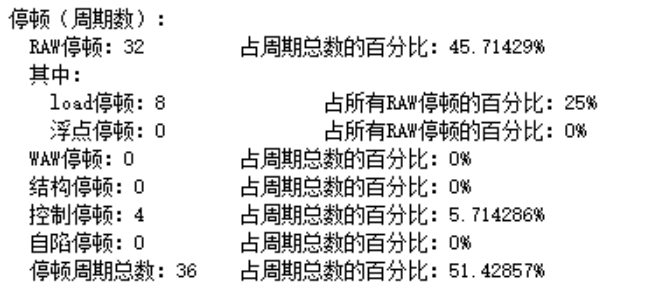

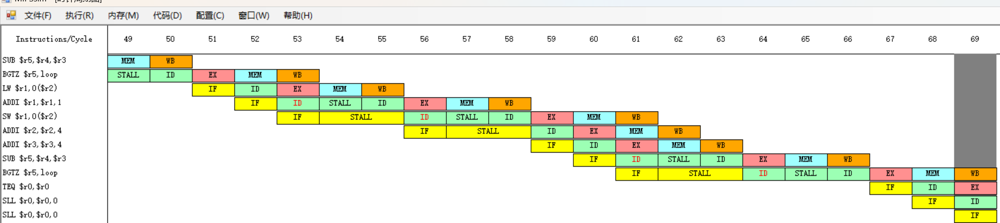

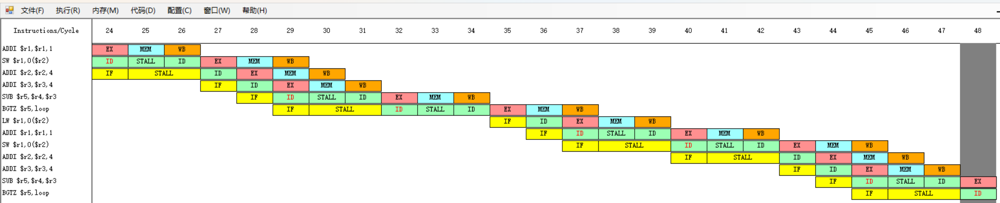

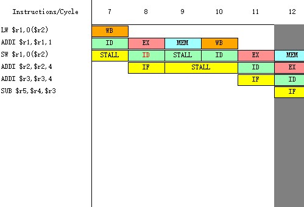

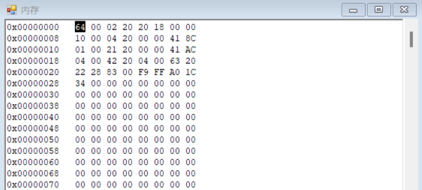

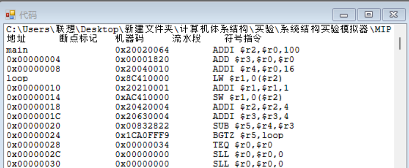

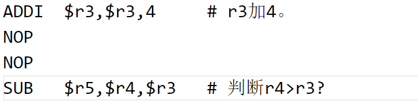

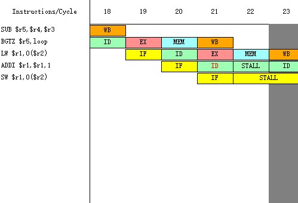

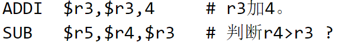

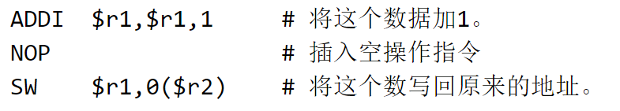

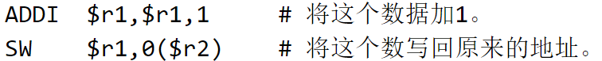

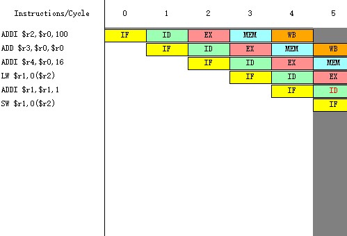

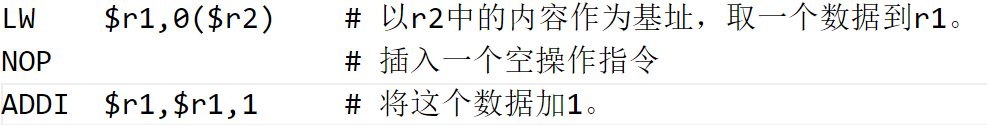

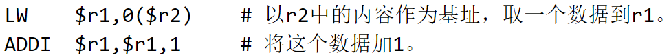

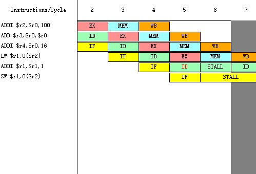

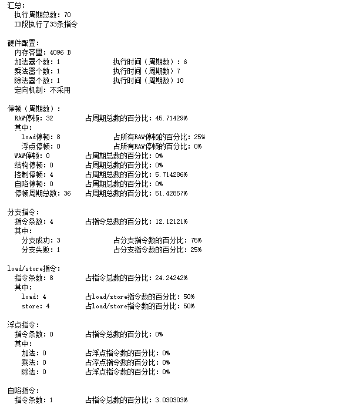
