# 实验三

## 实验信息

| 项目 | 内容 |
| --- | --- |
| 实验题目 | 实验三 指令调度与延迟分支 |
| 课程 |  |
| 专业 | 22级 |
| 实验时间 | 2024年11月8日 |
| 实验地点 |  |

| 冲突指令1(原因) | 冲突指令2(结果) | 导致冲突发生的原因 |
| --- | --- | --- |
| ADDIU $r1, $r0, A | LW $r2, 0($r1) | Read after write数据相关 |
| LW $r2, 0($r1) | ADD $r4, $r0, $r2 | Read after write数据相关 |
| ADD $r4, $r0, $r2 | SW $r4, 0($r1) | Read after write数据相关 |
| LW $r6, 4($r1) | ADD $r8, $r6, $r1 | Read after write数据相关 |
| MUL $r12, $r10, $r1 | ADD $r16, $r12, $r1 | Read after write数据相关 |
| ADD $r16, $r12, $r1 | ADD $r18, $r16, $r1 | Read after write数据相关 |
| ADD $r18, $r16, $r1 | SW $r18, 16($r1) | Read after write数据相关 |
| LW $r20, 8($r1) | MUL $r22, $r20, $r14 | Read after write数据相关 |

| 冲突指令1(原因) | 冲突指令2(结果) | 导致冲突发生的原因 |
| --- | --- | --- |
| ADDIU $r1, $r0, A | LW $r2, 0($r1) | Read after write数据相关 |

| 冲突指令1(原因) | 冲突指令2(结果) | 导致冲突发生的原因 |
| --- | --- | --- |
| ADDI $r1, $r1, 1 | SW $r1, 0($r2) | Read after write数据相关 |
| ADDI $r3, $r3, 4 | SUB $r5, $r4, $r3 | Read after write数据相关 |
| SUB $r5, $r4, $r3 | BGTZ $r5, loop | Read after write数据相关 |

## 实验截图

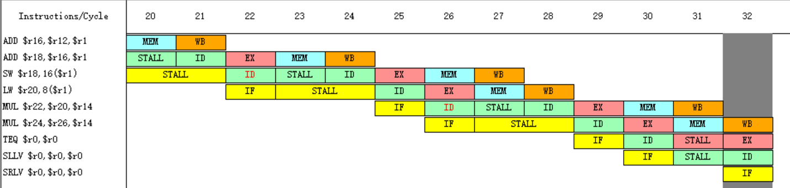

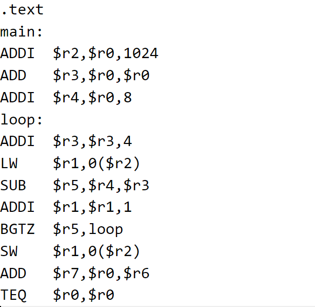

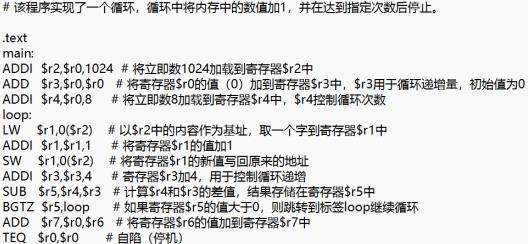

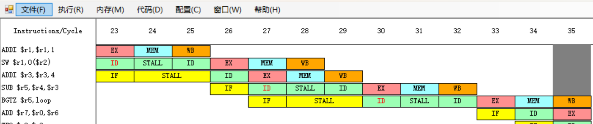

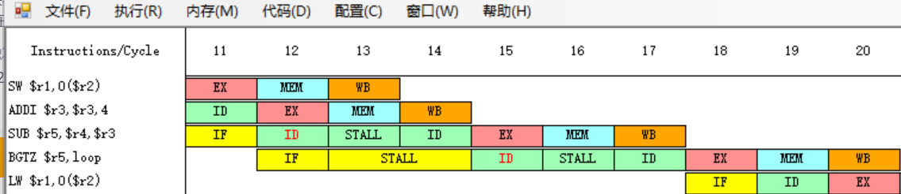

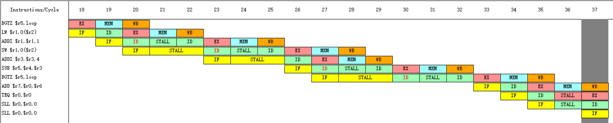

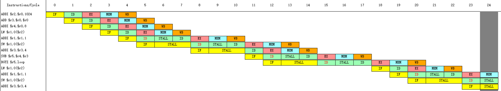

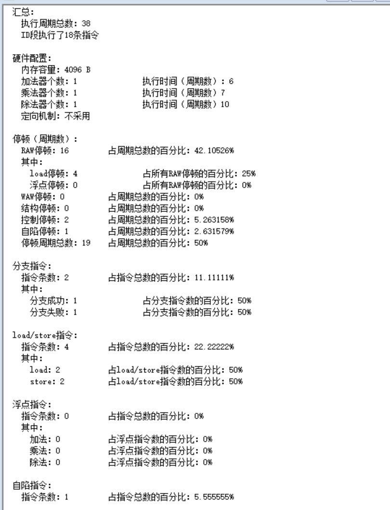

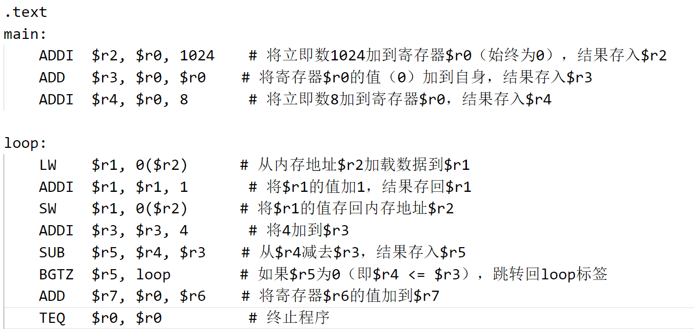

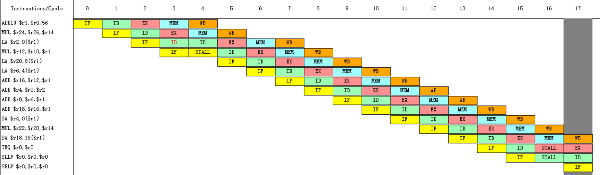

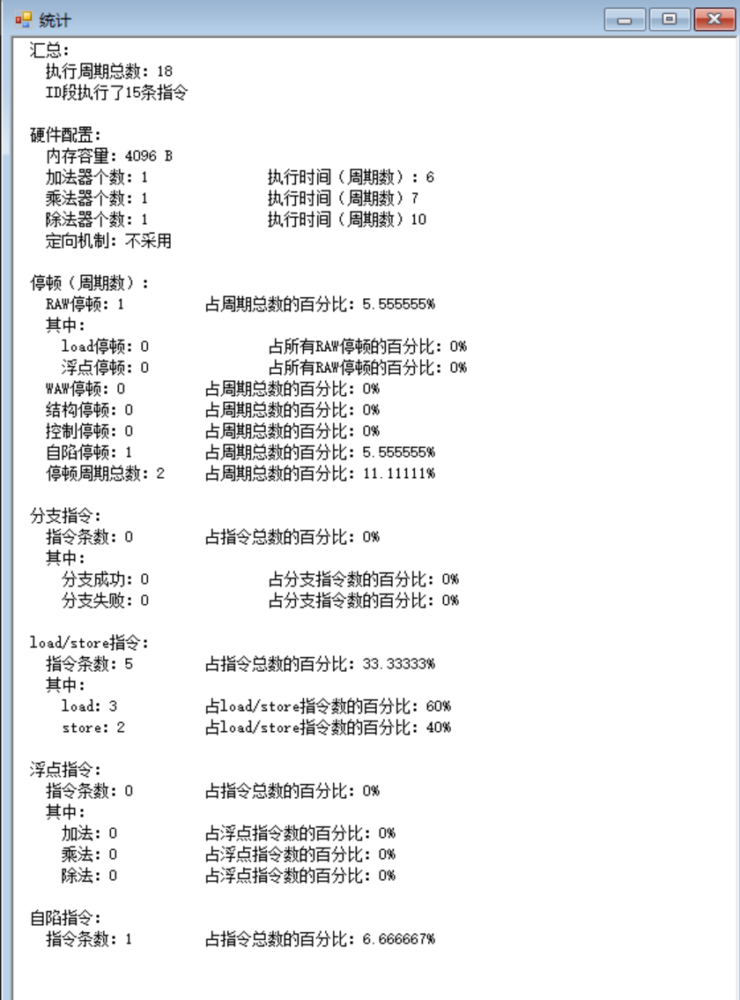

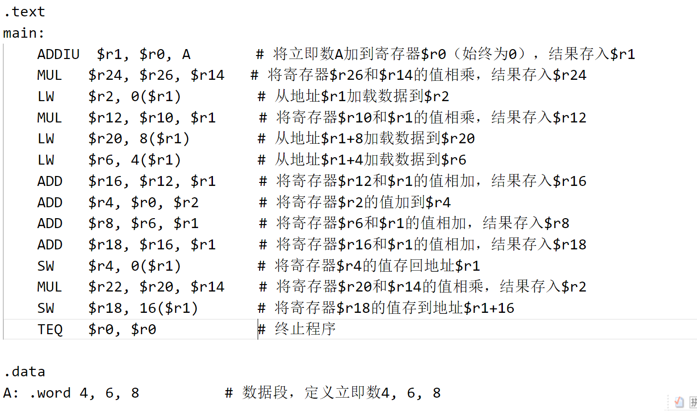

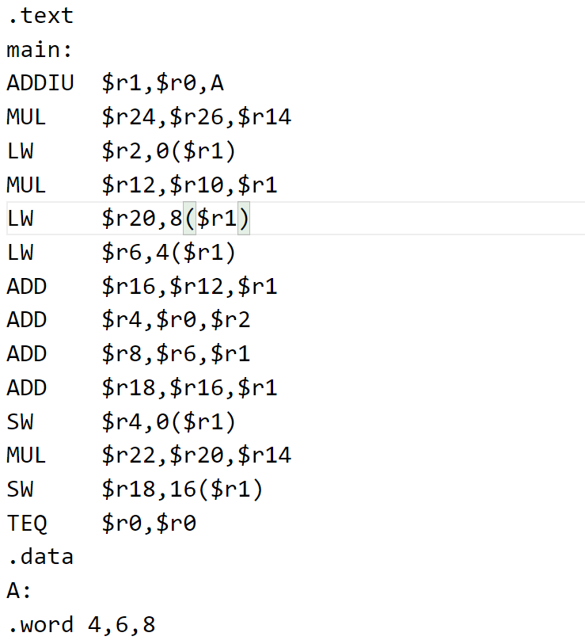
