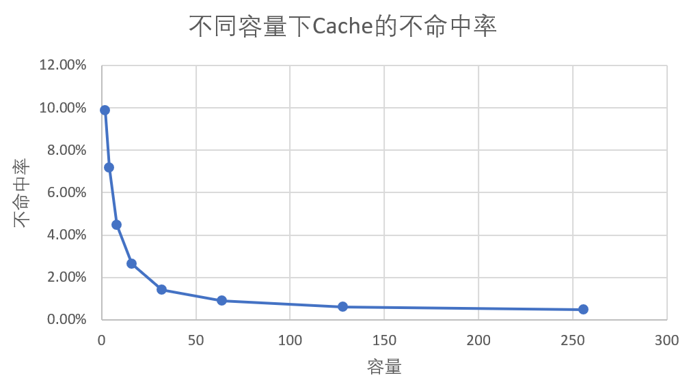
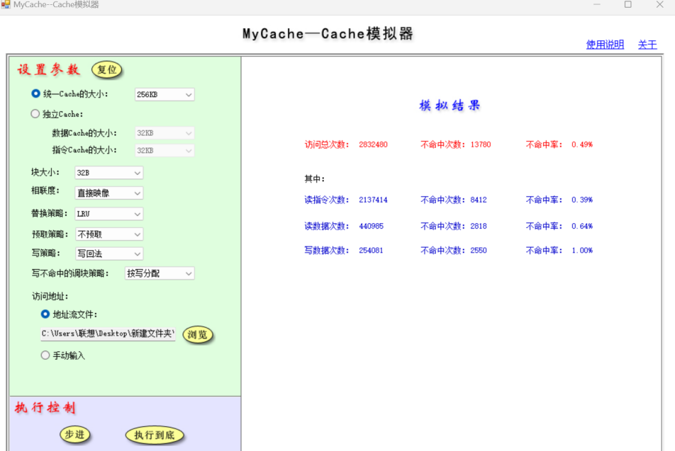
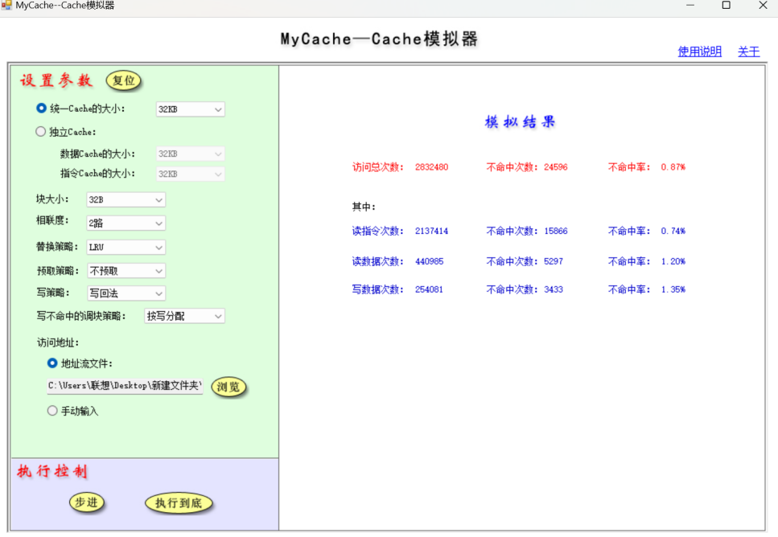

# 实验五

## 实验信息

| 项目 | 内容 |
| --- | --- |
| 实验题目 | Cache性能分析 |
| 课程 |  |
| 专业 | 22级 |
| 实验时间 | 2024年12月20日 |
| 实验地点 |  |

| Cache容量（KB） | 2 | 4 | 8 | 16 | 32 | 64 | 128 | 256 |
| --- | --- | --- | --- | --- | --- | --- | --- | --- |
| 不命中率 | 9.87% | 7.19% | 4.48% | 2.65% | 1.42% | 0.89% | 0.60% | 0.49% |

| 相联度 | 2 | 4 | 8 | 16 | 32 |
| --- | --- | --- | --- | --- | --- |
| 不命中率 | 0.87% | 0.69% | 0.62% | 0.61% | 0.60% |

| 相联度 | 2 | 4 | 8 | 16 | 32 |
| --- | --- | --- | --- | --- | --- |
| 不命中率 | 0.53% | 0.47% | 0.45% | 0.44% | 0.44% |

| 相联度 | 2 | 4 | 8 | 16 | 32 |
| --- | --- | --- | --- | --- | --- |
| 不命中率 | 0.38% | 0.36% | 0.36% | 0.35% | 0.35% |

| 块大小
KB | Cache容量（KB） | Cache容量（KB） | Cache容量（KB） | Cache容量（KB） | Cache容量（KB） |
| --- | --- | --- | --- | --- | --- |
| 块大小
KB | 2 | 8 | 32 | 128 | 512 |
| 16 | 12.02% | 5.79% | 1.86% | 0.95% | 0.71% |
| 32 | 9.87% | 4.48% | 1.42% | 0.60% | 0.42% |
| 64 | 9.36% | 4.03% | 1.20% | 0.43% | 0.27% |
| 128 | 10.49% | 4.60% | 1.08% | 0.35% | 0.20% |
| 256 | 13.45% | 5.35% | 1.19% | 0.34% | 0.16% |

| Cache容量（KB） | 相联度 | 相联度 | 相联度 | 相联度 | 相联度 | 相联度 |
| --- | --- | --- | --- | --- | --- | --- |
| Cache容量（KB） | 2路 | 2路 | 4路 | 4路 | 8路 | 8路 |
| Cache容量（KB） | LRU | 随机算法 | LRU | 随机算法 | LRU | 随机算法 |
| 16 | 1.71% | 2.52% | 1.33% | 2.55% | 1.21% | 3.77% |
| 64 | 0.53% | 0.74% | 0.47% | 0.80% | 0.45% | 0.82% |
| 256 | 0.38% | 0.40% | 0.36% | 0.40% | 0.36% | 0.36% |
| 1M | 0.35% | 0.35% | 0.35% | 0.35% | 0.35% | 0.35% |

## 实验截图

