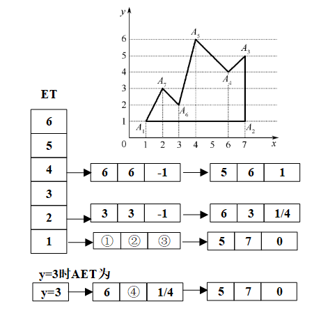
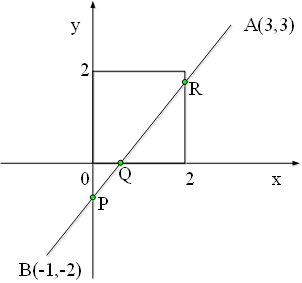
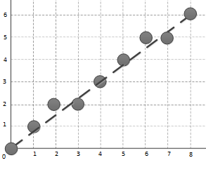

# 《计算机图形学》雨课堂随堂测试 - CG-3 光栅图形学

---

## 一、 单选题

1. 用射线法判断一个点是否在多边形内时，若该射线与多边形的交点数目为（），则该点在多边形内部。
   - A. 奇数
   - B. 偶数

2. 下列哪种现象不是走样现象？
   - A. 倾斜的直线和区域的边界处呈现阶梯状、锯齿状的效果
   - B. 本应均匀间隔的纹理图案，造成了不均匀的间隔显示
   - C. 一些非常细的线或很小的点由于低于分辨率而不能被显示出来
   - D. 当比较接近水平的线与比较接近垂直的线汇合时，汇合处外角有缺口

3. 用DDA算法绘制直线段P0(1,1)-P1(5,2)，下面表格给出了绘制点列(x,y)的变化过程：
   | x | y |
   | :---: | :---: |
   | 1 | 1 |
   | 2 | 1 |
   | ① | ② |
   | 4 | 2 |
   | 5 | 2 |
   易求得①②处的值分别是：
   - A. 2，1
   - B. 3，1
   - C. 3，2
   - D. 4，2

4. 用Bresenham算法绘制直线段P0(1,1)-P1(5,2)， 下面表格给出了绘制点列(x,y)和误差判别项d的变化过程。
   | x | y | d |
   | :---: | :---: | :---: |
   | 1 | 1 | -2 |
   | 2 | 1 | 0 |
   | 3 | ① | ② |
   | 4 | 2 | -4 |
   | 5 | 2 | -2 |
   易求得①②处的值分别是：
   - A. 1，2
   - B. 2，-6
   - C. 1，-6
   - D. 2，2

5. 用中点画线算法绘制直线段P0(1,1)-P1(5,2)，误差判别项d的初值是：
   - A. 2
   - B. 6
   - C. -2
   - D. 0

6. 活动边表算法中多边形的水平边不装入边表ET. 请对如图多边形，补充完整ET和AET中几处数据。
   
   ①②③④处的值分别为：
   - A. 1,3,0.5,3.25
   - B. 3,1,0.5,3.25
   - C. 1,3,2,3.25
   - D. 3,1,2,3.25

7. 用Cohen-Sutherland编码裁剪算法裁剪下图所示线段AB，首先对线段两端点编码。
   易知端点A、B的编码分别为：
   
   - A. 1010, 0101
   - B. 0101, 1010
   - C. 1100, 0011
   - D. 1001, 0110

8. 用Cohen-Sutherland编码裁剪算法裁剪下图所示线段AB，端点编码后，从端点A开始顺序考察与各边交点。P,Q,R被求出的顺序是：
   
   - A. P, Q, R
   - B. P, R, Q
   - C. R, P, Q
   - D. R, Q, P

9. 用Liang-Barsky参数化裁剪算法裁剪下图所示线段AB，需要求出线段与各边交点的参数。
   设A点参数为0，那么线段AB与左边界交点的参数u1为：
   
   - A. 3/4
   - B. 1/4
   - C. 3/5
   - D. 1/5

10. 用Liang-Barsky参数化裁剪算法裁剪下图所示线段AB，设A点参数为0, 那么“入点”参数umax为：
    
    - A. 3/4
    - B. 1/4
    - C. 3/5
    - D. 1/5

11. 用编码裁剪法裁剪二维线段时，判断下列直线段采用哪种处理方法。假设直线段两个端点M、N的编码为1000和1001（按TBRL顺序）。
    - A. 直接保留
    - B. 直接舍弃
    - C. 对MN再分割求交
    - D. 不能判断

12. 直线的编码裁剪算法中，判断直线是否位于同一边界外侧的表达式是什么？
    - A. (c1&&c2)!=0
    - B. (c1||c2)!=0
    - C. (c1&c2)!=0
    - D. (c1|c2)!=0

13. 根据Cohen-Sutherland算法，如右图所示的直线和裁剪窗口，A、B两点的区域编码分别是？
    
    - A. 0110，0000
    - B. 0101，0000
    - C. 1010，1111
    - D. 1001，1111

14. 右图中最外层的窗口设为显示器窗口大小，用三类大小的窗口采用编码裁剪算法裁剪直线，其效率排序应为：
    
    - A. 3>1>2
    - B. 3>2>1
    - C. 1>2>3
    - D. 2>1>3

15. 直线裁剪的Liang-Barsky算法中，“入点”的参数umax=max(0,uk|pk<0)；“出点”的参数umin=min(1,uk|pk>0). 下面错误的说法是：
    - A. umax>umin时，直线段位于窗口外
    - B. p1<0时，umax不小于直线与窗口左边界(或延长线)的交点参数
    - C. p1>0时，umin不大于直线与窗口左边界(或延长线)的交点参数
    - D. 直线段平行于坐标轴时，umax<=umin

16. 在多边形的Sutherland-Hodgeman算法（逐边裁剪算法）中，根据多边形的边（从顶点S到顶点P）与裁剪线（窗口的边）的位置关系，有不同的输出。请问下列哪种说法是错误的？
    - A. S和P均在可见的一侧，则输出S和P
    - B. S和P均在不可见的一侧，则不输出
    - C. S在可见一侧，P在不可见一侧，则输出（线段SP与裁剪线的）交点
    - D. S在不可见的一侧，P在可见的一侧，则输出（线段SP与裁剪线的）交点和P

---

## 二、 多选题

17. 用射线法判断一个点是否在多边形内时，该射线与多边形的交点数满足一定的计数规则。若交点是多边形的顶点，则交点个数取值正确的情况是（）。
    - A. 两边都在射线的同一侧，计数1次
    - B. 两边都在射线的同一侧，计数2次
    - C. 两边在射线的两侧，计数1次
    - D. 两边在射线的两侧，计数2次

18. 直线段光栅化算法中，直线段P0(0,0)-P1(8,6)的绘制点列如下图的算法有：
    
    - A. DDA算法
    - B. Bresenham算法
    - C. 中点画线算法
    - D. 以上三算法均不是

---

## 三、 判断题

19. 增强图像像素的显示亮度能够获得反走样效果。
    - A. 正确 (True)
    - B. 错误 (False)

---

## 四、 填空题

20. 对图形进行光栅化时，用离散的像素表示连续的直线或区域边界引起的失真现象称为 ______ (填空1) ，用于减少或者消除走样的技术称为 ______ (填空2) 。
