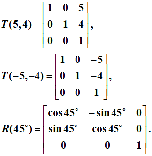

# 《计算机图形学》雨课堂随堂测试 - CG-4 二维与三维几何变换

---

## 一、 单选题

1. 点P的齐次坐标为 (6, -2, 2)，其对应的普通坐标是：
   - A. (6,-2,1)
   - B. (3,-1,1)
   - C. (6,-2)
   - D. (3,-1)

2. 将下图所示四边形ABCD绕点P(5,4)逆时针旋转45度，涉及到三个变换矩阵，则三个矩阵复合的顺序是？
   
   
   - A. $T(-5, -4)R(45^\circ)T(5, 4)$
   - B. $R(45^\circ)T(-5, -4)T(5, 4)$
   - C. $T(5, 4)R(45^\circ)T(-5, -4)$
   - D. $T(5, 4)T(-5, -4)R(45^\circ)$

3. 将下图所示四边形ABCD绕点P(5,4)逆时针旋转45度的代码是：
   
   - A. 
     ```cpp
     glLoadIdentity();
     glTranslatef(5, 4, 0);
     glRotatef(45, 0.0f, 0.0f, 1.0f);
     glTranslatef(-5, -4, 0);
     DrawQuadrangle();
     ```
   - B. 
     ```cpp
     glLoadIdentity();
     glTranslatef(-5, -4, 0);
     glRotatef(45, 0.0f, 0.0f, 1.0f);
     glTranslatef(5, 4, 0);
     DrawQuadrangle();
     ```

4. 如下图所示，欲使OB绕X轴旋转至XOZ坐标平面内，旋转角度应为多少？
   
   - A. ∠AOB
   - B. ∠EOB
   - C. ∠EOB′
   - D. ∠AOB′

5. 在三维旋转变换中，关于x轴旋转90°时变换特点描述正确的是什么？
   - A. y'=-z
   - B. y'=z
   - C. y坐标不变
   - D. x、y、z坐标都不变

6. 空间四面体ABCD几何变换关于点S(-2, 2, 2)整体放大2倍的变换矩阵为：
   - A. $$\begin{bmatrix} 1 & 0 & 0 & -2 \\ 0 & 1 & 0 & 2 \\ 0 & 0 & 1 & 2 \\ 0 & 0 & 0 & 1 \end{bmatrix} \begin{bmatrix} 1 & 0 & 0 & 0 \\ 0 & 1 & 0 & 0 \\ 0 & 0 & 1 & 0 \\ 0 & 0 & 0 & 2 \end{bmatrix} \begin{bmatrix} 1 & 0 & 0 & 2 \\ 0 & 1 & 0 & -2 \\ 0 & 0 & 1 & -2 \\ 0 & 0 & 0 & 1 \end{bmatrix}$$
   - B. $$\begin{bmatrix} 1 & 0 & 0 & -2 \\ 0 & 1 & 0 & 2 \\ 0 & 0 & 1 & 2 \\ 0 & 0 & 0 & 1 \end{bmatrix} \begin{bmatrix} 1 & 0 & 0 & 0 \\ 0 & 1 & 0 & 0 \\ 0 & 0 & 1 & 0 \\ 0 & 0 & 0 & 1/2 \end{bmatrix} \begin{bmatrix} 1 & 0 & 0 & 2 \\ 0 & 1 & 0 & -2 \\ 0 & 0 & 1 & -2 \\ 0 & 0 & 0 & 1 \end{bmatrix}$$
   - C. $$\begin{bmatrix} 1 & 0 & 0 & 2 \\ 0 & 1 & 0 & -2 \\ 0 & 0 & 1 & -2 \\ 0 & 0 & 0 & 1 \end{bmatrix} \begin{bmatrix} 1 & 0 & 0 & 0 \\ 0 & 1 & 0 & 0 \\ 0 & 0 & 1 & 0 \\ 0 & 0 & 0 & 2 \end{bmatrix} \begin{bmatrix} 1 & 0 & 0 & -2 \\ 0 & 1 & 0 & 2 \\ 0 & 0 & 1 & 2 \\ 0 & 0 & 0 & 1 \end{bmatrix}$$
   - D. $$\begin{bmatrix} 1 & 0 & 0 & 2 \\ 0 & 1 & 0 & -2 \\ 0 & 0 & 1 & -2 \\ 0 & 0 & 0 & 1 \end{bmatrix} \begin{bmatrix} 2 & 0 & 0 & 0 \\ 0 & 2 & 0 & 0 \\ 0 & 0 & 2 & 0 \\ 0 & 0 & 0 & 1 \end{bmatrix} \begin{bmatrix} 1 & 0 & 0 & -2 \\ 0 & 1 & 0 & 2 \\ 0 & 0 & 1 & 2 \\ 0 & 0 & 0 & 1 \end{bmatrix}$$

7. 下面哪项不是齐次坐标的特点？
   - A. 用n+1维向量表示一个n维向量
   - B. 将图形的变换统一为图形的坐标矩阵与某一变换矩阵相乘的形式
   - C. 易于表示无穷远点
   - D. 一个n维向量的齐次坐标表示是唯一的

8. 经过三维几何变换，使得图1中的图形成为如图2所示的图形，其几何变换是什么？
   
   - A. 先沿x轴方向平移1个单位，再绕y轴逆时针旋转45度
   - B. 先绕y轴逆时针旋转45度，再沿x轴方向平移1个单位
   - C. 先沿x轴方向平移1个单位，再绕y轴顺时针旋转45度
   - D. 先绕y轴顺时针旋转45度，再沿x轴方向平移1个单位

9. 空间四面体ABCD关于x轴进行对称变换的变换矩阵为：
   - A. $$\begin{bmatrix} -1 & 0 & 0 & 0 \\ 0 & 1 & 0 & 0 \\ 0 & 0 & 1 & 0 \\ 0 & 0 & 0 & 1 \end{bmatrix}$$
   - B. $$\begin{bmatrix} 1 & 0 & 0 & 0 \\ 0 & -1 & 0 & 0 \\ 0 & 0 & 1 & 0 \\ 0 & 0 & 0 & 1 \end{bmatrix}$$
   - C. $$\begin{bmatrix} 1 & 0 & 0 & 0 \\ 0 & -1 & 0 & 0 \\ 0 & 0 & -1 & 0 \\ 0 & 0 & 0 & 1 \end{bmatrix}$$
   - D. $$\begin{bmatrix} -1 & 0 & 0 & 0 \\ 0 & -1 & 0 & 0 \\ 0 & 0 & -1 & 0 \\ 0 & 0 & 0 & 1 \end{bmatrix}$$

---

## 二、 填空题

10. 基本几何变换都是相对于 ______ (填空1) 和坐标轴进行的几何变换。
