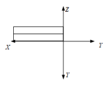
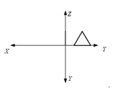

# 《计算机图形学》雨课堂随堂测试 - CG-5 投影与三维视口变换

---

## 一、 单选题

1. 在二维变换中，根据窗口和视区的关系，下列说法正确是什么？
   - A. 窗口不变，视区变大，则图形缩小
   - B. 窗口不变，视区变大，则图形放大
   - C. 视区不变，窗口变大，则图形放大
   - D. 视区不变，窗口缩小，则图形缩小

2. 斜二测投影时，和投影面垂直的任何直线段，其投影的长度为原来的（）。
   - A. 2倍
   - B. 不变
   - C. 1/2
   - D. 1/4

3. 在透视投影中，主灭点的最多个数是多少？
   - A. 1个
   - B. 2个
   - C. 3个
   - D. 多个

4. 图1所示物体的俯视图是：
   
   - A. 
   - B. 
   - C. 
   - D. 

5. 对三维物体各点坐标进行变换，矩阵T中各元素在变换中的具体作用不同，不正确的是：
   $$T = \begin{bmatrix} a & b & c & l \\ d & e & f & m \\ h & i & j & n \\ p & q & r & s \end{bmatrix}$$
   - A. 左上角9个数a~j, 对应旋转、比例、对称、错切变换
   - B. 第四列前3个数l~m, 对应平移变换
   - C. 第四行前3个数p~q, 对应透视变换
   - D. 右下角数s, 表示整体比例变换s倍

6. 若空间点D(1,1,1)在xoy面的正投影点是P，在xoy面的斜二测投影点是Q，则线段PQ的长度是：
   - A. 1
   - B. 0.5
   - C. 2
   - D. 不确定

7. 下列有关平面几何投影的叙述语句中，正确的论述是：
   - A. 在平面几何投影中，若投影中心移到距离投影面无穷远处，则成为平行投影
   - B. 透视投影与平行投影相比，视觉效果更有真实感，而且能真实地反映物体精确的尺寸和形状
   - C. 透视投影变换中，一组平行线投影在与之平行的投影面上，可以产生灭点
   - D. 对三维空间中的物体进行透视投影变换，可能产生三个以上主灭点

---

## 二、 判断题

8. 透视投影可以分解成透视和正投影的复合。
   - A. 正确 (True)
   - B. 错误 (False)

9. 空间相互平行的直线，在透视投影之后可以不平行。
   - A. 正确 (True)
   - B. 错误 (False)

10. 视区定义在世界坐标系中，窗口定义在设备坐标系中。
    - A. 正确 (True)
    - B. 错误 (False)
