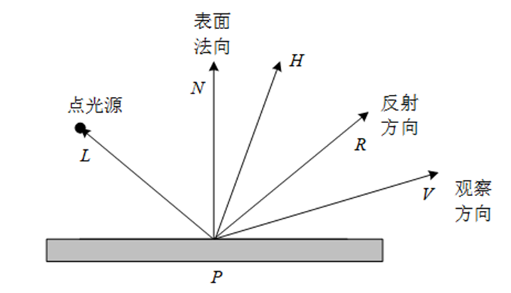

# 《计算机图形学》雨课堂随堂测试 - CG-6&7 三维造型、消隐与真实感图形学

---

## 一、 单选题

1. 一个有效的实体应该具有的性质包括？
   ①刚性②具有封闭的边界③内部连通④占据有限的空间⑤集合运算后仍是有效的实体
   - A. ①②③⑤
   - B. ①②③
   - C. ②③④⑤
   - D. ①②③④⑤

2. 在简单光照明模型中，由物体表面上点反射到视点的光强是哪几项之和？
   ①环境光 ②漫反射光 ③镜面反射光 ④物体间的反射光
   - A. ①②
   - B. ①③
   - C. ①②③
   - D. ①②③④

3. 当观察光照下的光滑物体表面时，在某个方向上看到高光或强光，这个现象称为什么？
   - A. 漫反射
   - B. 镜面反射
   - C. 环境光
   - D. 折射

4. 粗糙的物体表面往往将反射光向各个方向散射，这种光线散射的现象称为：
   - A. 漫反射
   - B. 折射
   - C. 衍射
   - D. 透射

5. 对象空间有k个物体，图像空间的屏幕分辨率为m*n，则图像空间消隐算法的复杂度是：
   - A. O(m*n*k)
   - B. O(k*k)
   - C. O(m*n)
   - D. O(m*n*m*n)

6. Whitted光照模型中包括哪些光强度？
   ①环境光②漫反射光③镜面反射光④环境镜面反射光⑤环境透射光
   - A. ①②③
   - B. ①④⑤
   - C. ②③④⑤
   - D. ①②③④⑤

7. （ ）明暗处理采用了法矢量双线性插值的方法先求出多边形内部各点法矢量再求颜色， （ ）明暗处理采用了亮度双线性插值的方法求出多边形内部各点颜色。
   - A. Gouraud，Phong
   - B. Phong，Flat
   - C. Phong，Gouraud
   - D. Flat，Gouraud

8. 关于 Ray Tracing 算法，描述错误的是：
   - A. 采用逆向跟踪技术完成整个场景的绘制
   - B. 采用Whitted整体光照模型计算对应像素点的光强度
   - C. 无法实现场景中交相辉映的景物、透明等显示
   - D. 当光线与离视点最近的场景物体表面交点为理想漫射面时跟踪结束

9. 在光线跟踪（Ray Tracing）算法中，在哪种情况下不再跟踪光线？
   ①光线未碰到任何物体；②光线的光强度已经很弱；③光线的深度已经很深；④光线遇到背景；⑤光线遇到某一物体
   - A. ①②
   - B. ①②③
   - C. ①②③④
   - D. ①②③④⑤

10. Phong光照明模型之漫反射光强 $I_d = I_p K_d (L \cdot N)$ 中 $K_d$ 是：
    
    - A. 环境光反射系数
    - B. 光源光强的漫反射分量
    - C. P点材质的漫反射系数
    - D. P点材质的镜面反射系数

11. Phong光照明模型之镜面反射光强 $I_s = I_p K_s \cos^n(\alpha)$ 中，$\alpha$ 是：
    
    - A. L与N的夹角
    - B. N与H的夹角
    - C. H与R的夹角
    - D. R与V的夹角

12. Phong多边形着色方法中，点a处的法向量插值公式Na是：
    
    - A. $$N_a = \frac{y_2 - y_a}{y_2 - y_1} N_1 + \frac{y_a - y_1}{y_2 - y_1} N_2$$
    - B. $$N_a = \frac{y_2 - y_s}{y_1 - y_2} N_1 + \frac{y_s - y_1}{y_1 - y_2} N_2$$
    - C. $$N_a = \frac{x_2 - x_a}{x_1 - x_2} N_1 + \frac{x_a - x_1}{x_1 - x_2} N_2$$
    - D. 以上都不是

---

## 二、 判断题

13. 实体的扫描表示法用一个物体和该物体的一条移动轨迹来描述一个新的物体。
    - A. 正确 (True)
    - B. 错误 (False)

14. 光线跟踪算法采用逆向跟踪技术完成整个场景的绘制。
    - A. 正确 (True)
    - B. 错误 (False)

15. 光线跟踪算法递归中采用Whitted整体光照模型计算交点的光强度，环境镜面反射光或环境规则透视光有时为零。
    - A. 正确 (True)
    - B. 错误 (False)

16. Z-Buffer算法不仅需要帧缓冲区存放像素的亮度值，还需要一个Z缓冲区存放每个像素的深度值。
    - A. 正确 (True)
    - B. 错误 (False)

17. 画家算法的基本思想是先将屏幕赋值为背景色，然后把物体各个面按其到视点距离远近排序，再按由远到近的顺序绘制。
    - A. 正确 (True)
    - B. 错误 (False)

---

## 三、 填空题

18. 由简单实体间通过集合运算组合成新的实体的方法称为 ______ (填空1) 。

19. ______ (填空1) 是指光滑表面的花纹图案， ______ (填空2) 是指粗糙表面的不规则凹凸细节。
