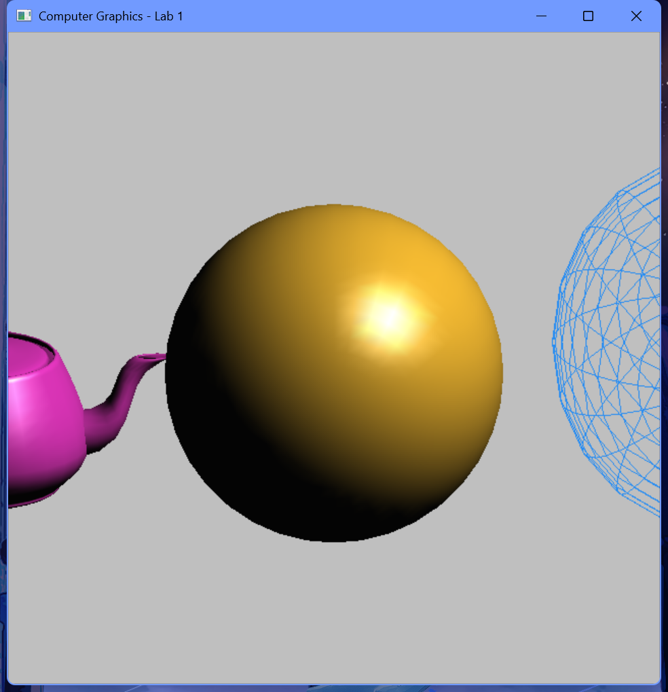

# 实验1 实验环境的熟悉

## 一、实验要求：
1、实验目的：
熟悉编程环境；了解光栅图形显示器的特点；了解计算机绘图的特点；掌握GLUT工具包的安装过程；利用GLUT开发库，使用编译OpenGL程序。

2、实验要求：
1. 将实验代码输入到编程环境中运行，得到运行结果。
2. 在main函数中的各语句，除了最后的return之外，其余全部以glut开头。这种以glut开头的函数都是GLUT工具包所提供的函数，分析代码中出现的glut和gl开头的函数以及参数的含义是什么。
3. 修改函数的参数，得到不同颜色和不同大小的模型。

## 二、实验内容及步骤：
### 实验内容：
1、选择编译环境
现在Windows系统的主流编译环境有Visual C++、C++ Builder、Dev-C++等，它们都是支持OpenGL的。这里选择Visual C++作为学习OpenGL的实验环境。
2、安装GLUT工具包
GLUT不是OpenGL所必须的，但它会给学习带来一定的方便，推荐安装。
Windows环境下安装GLUT的步骤：
（1）将下载的压缩包解开，将得到5个文件。
（2）把解压得到的glut.h文件放在安装目录下面的"include/GL"文件夹中（如果没有"GL"文件，则自己建一个）。
（3）把解压得到的glut.lib和glut32.lib放到安装目录下面的静态函数库"lib"所在文件夹。
（4）把解压得到的glut.dll和glut32.dll放到操作系统目录下面的SysWOW64/System32文件夹内。
3、建立一个OpenGL工程
VC6.0：选择File->New->Project，然后选择Win32 Console Application，选择一个名字，然后按OK。在弹出的对话框左边点Application Settings，找到Empty project并勾上，选择Finish。然后向该工程添加一个代码文件，取名为"OpenGL.cpp"。
CodeBlocks：选择file新建工程，选GLUT project；选定项目路径，取名为"OpenGL"；选择GLUT的路径，即CodeBlocks的MinGW目录下，最后Finish。测试运行结果。
打开包含main函数的主文件，输入代码并运行。

### 1、实验思路和实验步骤（重点）：
#### 实验思路：
为了在同一图形窗口内清晰地进行多图元和材质对比，实验提取了一个材质设置辅助函数 `setMaterial`，用以统一设置反射属性。在同一视口中设计并排列了三个不同形状、不同颜色及不同绘制方式的图元（洋红色实体茶壶、金色实体球、蓝色线框球）。为突出线框球的线条色彩，在绘制它时临时关闭光照，并直接用 `glColor3f` 赋色。正交投影采用保持长宽比的缩放公式，使得窗口拉伸时物体比例保持稳定。

#### 算法步骤（注意：不是代码，是算法流程）：
1. **GLUT 环境初始化**：调用 `glutInit` 初始化 GLUT，并利用 `glutInitDisplayMode` 设置双缓冲模式、RGB 颜色模式和深度缓存。
2. **窗口创建与标题设定**：通过 `glutInitWindowPosition` 和 `glutInitWindowSize` 设定窗口初始位置与大小，调用 `glutCreateWindow` 建立以学号和姓名命名的图形窗口。
3. **状态初始化与光源配置**：在 `init` 函数中，开启深度测试 `glEnable(GL_DEPTH_TEST)`，设置 `GL_LIGHT0` 的平行光源方向为 `(1.0, 1.0, 1.0)` 并使能光照状态。
4. **注册回调函数**：使用 `glutReshapeFunc` 和 `glutDisplayFunc` 分别注册视口改变回调 `reshape` 与画面绘制回调 `display`。
5. **视口变换与正交投影**：在 `reshape` 函数中建立正交投影 `glOrtho`，根据当前视口的长宽比，动态调整左右边界值，保证图元不发生拉伸畸变。
6. **图元渲染与变换**：
   - 清除颜色和深度缓冲区。
   - 重置模型视图矩阵并做基本平移和微调旋转。
   - 对**左侧实体茶壶**：使用 `glPushMatrix` 保护矩阵，平移至左侧，使用 `setMaterial` 设定洋红色高光材质，调用 `glutSolidTeapot(0.35)` 渲染，然后 `glPopMatrix` 恢复。
   - 对**中间实体球**：平移至中心，设定金色漫反射材质，调用 `glutSolidSphere(0.52, 36, 36)` 渲染。
   - 对**右侧线框球**：平移至右侧，并使用 `glScalef` 纵向拉伸，利用 `glDisable(GL_LIGHTING)` 关闭光照，调用 `glColor3f` 指定鲜蓝色，利用 `glutWireSphere(0.48, 20, 20)` 渲染，最后重新使能光照。
7. **双缓冲交换**：调用 `glutSwapBuffers` 将后台渲染完毕的帧交换到前台显示。

### 2、实验数据记录：
- **视口与投影范围**：
  - 窗口尺寸：640 * 640 像素。
  - 正交投影范围：当 aspect >= 1.0 时为 `glOrtho(-aspect, aspect, -1.0, 1.0, -2.0, 2.0)`。
- **光源数据**：
  - 平行光源 `GL_LIGHT0` 方向：`(1.0f, 1.0f, 1.0f, 0.0f)`。
- **材质反射数据**：
  - 公用材质：环境光反射系数 `{0.08f, 0.08f, 0.08f, 1.0f}`，高光反射系数 `{0.9f, 0.9f, 0.9f, 1.0f}`。
  - 洋红色茶壶（左侧）：漫反射 `{0.90f, 0.20f, 0.75f, 1.0f}`，尺寸为 `0.35`，光泽度为 `48.0f`。
  - 金色实体球（中心）：漫反射 `{0.95f, 0.72f, 0.18f, 1.0f}`，半径为 `0.52`，切片数与堆栈数为 `36, 36`，光泽度为 `64.0f`。
  - 蓝色线框球（右侧）：无光照材质，直接着色 `{0.15f, 0.55f, 0.95f}`，半径为 `0.48`，经纬线数 `20, 20`，缩放因子 `(1.0f, 1.2f, 1.0f)`。

### 3、实验结果与分析：
在窗口灰色背景中自左向右依次显示了洋红色的实体茶壶、金色的实体球、以及高亮蓝色的纵向拉伸线框球，三个物体排布均匀，材质反光和高光效果清晰。

#### 运行结果截图：

## 三、心得体会：
1. **双缓冲机制的作用**：实验中通过 `GLUT_DOUBLE` 启用了双缓冲。双缓冲在后台缓冲区渲染画面，完成后进行画面交换。这对于三维渲染可以避免屏幕闪烁，使画面刷新更加平滑。
2. **光照与材质的协同**：只有同时开启光源和物体的材质属性，才能呈现出真实的表面反光和光泽度。对于线框模型，如果不关闭光照，线条会因为光照计算而显得暗淡，因此在绘制前需要关闭光照并使用 `glColor3f` 指定底色。
3. **乱码控制经验**：在使用 CodeBlocks 编译器处理含有中文字符的窗口标题时，由于源文件通常为 UTF-8 编码，直接输入中文极易导致乱码。本实验通过调用 Windows 原生的 `SetWindowTextW` 接口配合 Unicode 宽字符，成功解决了标题乱码问题，使得学号和姓名在任何系统环境下都能正常显示。
