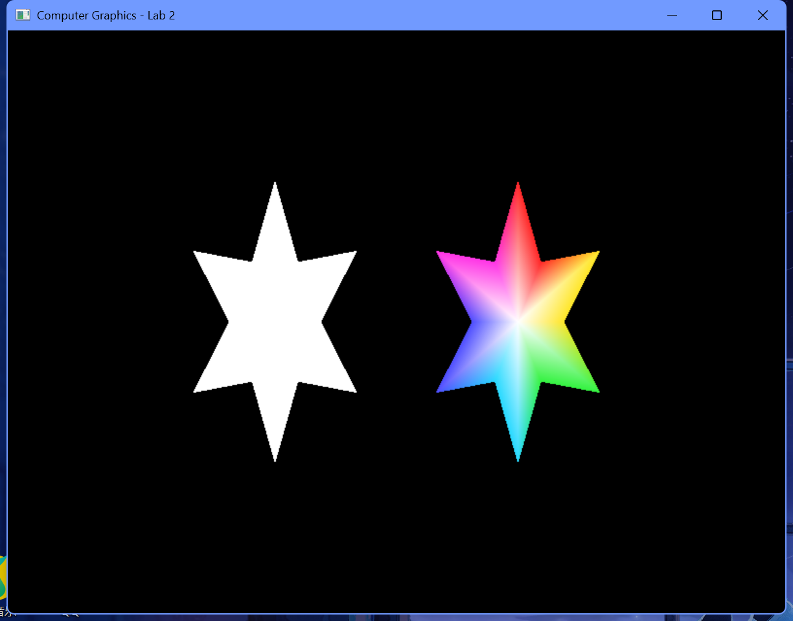

# 实验2 OpenGL中图形的绘制

## 一、实验要求：
1、实验目的：
掌握理解简单的OpenGL程序结构；掌握OpenGL提供的基本图形函数，尤其是生成点、线、面的函数。

2、实验要求：
1. 将实验代码输入到编程环境中运行，得到运行结果。
2. 学会按照GLUT开发库，并使用C++编译OpenGL程序。

## 二、实验内容及步骤：
### 实验内容：
1、完成头歌实训平台"OpenGL点和直线的绘制"实验内容。
2、编译已有项目工程，并编写代码生成填充多边形图形，如图1所示。
3、在此基础上，修改各顶点颜色，使得每个顶点颜色不一样，多边形内部颜色渐变，如图2所示（该程序可考虑使用双缓存区）。

### 1、实验思路和实验步骤（重点）：
#### 实验思路：
为了同时展现白色填充和渐变色填充的多边形效果，本实验在同一窗口中并排绘制两个几何完全相同的六角星。六角星是一个凹多边形，直接使用 `GL_POLYGON` 可能会在某些硬件上出现错误的填充结果。为此，采用外半径和内半径交替的方法，以数学公式生成六角星的 12 个轮廓顶点。绘制时以中心点 `(0,0)` 为原点，使用 `GL_TRIANGLE_FAN`（三角扇）方式向 12 个轮廓顶点展开填充，保证凹多边形在任何平台下均能完美且高效地填充。左侧的星形每个顶点均指定为纯白色以实现纯白填充；右侧的星形为 6 个不同的外顶点依次指定红、黄、绿、青、蓝、品红六种不同颜色，结合 `glShadeModel(GL_SMOOTH)` 平滑着色，使得颜色自动在多边形内部进行双线性插值，形成极为美观的由中心白向外放射的渐变效果。

#### 算法步骤（注意：不是代码，是算法流程）：
1. **顶点生成算法 (makeStarVertices)**：
   - 设定六角星顶点总数 $N = 12$。
   - 循环迭代 $i$ 从 0 到 11：
     - 若 $i$ 为偶数，取半径为外半径 $R_{\text{outer}} = 0.78$；若为奇数，取半径为内半径 $R_{\text{inner}} = 0.38$。
     - 计算旋转弧度 $\theta = \frac{\pi}{2} - i \cdot \frac{\pi}{6}$。
     - 利用极坐标公式计算直角坐标：$x_i = R \cdot \cos(\theta)$，$y_i = R \cdot \sin(\theta)$。
2. **多边形绘制算法 (drawStar)**：
   - 启动三角扇渲染：`glBegin(GL_TRIANGLE_FAN)`。
   - 提交中心顶点：颜色设为纯白 `(1.0, 1.0, 1.0)`，坐标设为 `(0.0, 0.0)`。
   - 依次循环提交 12 个轮廓顶点：
     - 如果启用渐变，则为偶数索引（外侧尖角）指定对应的六种色表颜色（红、黄、绿、青、蓝、品红之一），奇数索引（内侧转折点）根据相邻色插值或设为白色；如果不启用渐变，则全部硬编码为白色 `(1.0, 1.0, 1.0)`。
     - 提交轮廓点坐标 `glVertex2f(x_i, y_i)`。
   - 闭合渲染环：再次提交第 0 个顶点坐标闭合多边形，调用 `glEnd()` 结束绘制。
3. **渲染流程 (display)**：
   - 清除颜色缓冲区。
   - 重置模型视图矩阵。
   - 调用 `glPushMatrix` 保护矩阵，使用 `glTranslatef(-1.0f, 0.0f, 0.0f)` 平移至左侧，调用 `drawStar(vertices, false)` 绘制纯白填充六角星，并 `glPopMatrix`。
   - 使用 `glTranslatef(1.0f, 0.0f, 0.0f)` 平移至右侧，调用 `drawStar(vertices, true)` 绘制彩色渐变六角星。
   - 调用 `glutSwapBuffers` 实现平滑画面交换。

### 2、实验数据记录：
- **几何尺寸数据**：
  - 六角星顶点数：12。
  - 外半径 $R_{\text{outer}} = 0.78$。
  - 内半径 $R_{\text{inner}} = 0.38$。
- **色彩数据记录**：
  - 纯白色值：`{1.0f, 1.0f, 1.0f}`。
  - 右侧渐变星形六角尖部的色彩配置：
    - 顶点 0 (正上)：红色 `{1.0f, 0.15f, 0.15f}`
    - 顶点 2 (右上)：黄色 `{1.0f, 0.9f, 0.15f}`
    - 顶点 4 (右下)：绿色 `{0.2f, 0.95f, 0.25f}`
    - 顶点 6 (正下)：青色 `{0.15f, 0.85f, 1.0f}`
    - 顶点 8 (左下)：蓝色 `{0.3f, 0.3f, 1.0f}`
    - 顶点 10 (左上)：品红 `{1.0f, 0.2f, 0.9f}`

### 3、实验结果与分析：
窗口内并排显示了两个六角星。左侧的六角星为纯白色填充；右侧的六角星的六个尖角呈现出彩色，并向中心的白色自然过渡，色彩平滑均匀。

#### 运行结果截图：

## 三、心得体会：
1. **凹多边形填充技巧**：六角星这类非凸多边形，直接使用 `GL_POLYGON` 可能会因为硬件填充机制或凹角计算导致填充出错。而将六角星拆解为以中心点为起点的三角扇（`GL_TRIANGLE_FAN`），利用共用尖顶的形式可以安全地填充任意复杂星形。
2. **平滑着色机制**：平滑着色是实现渐变色的核心。只要给多边形的不同顶点赋予不同的颜色，OpenGL 就会在光栅化阶段在这些顶点之间进行色彩的双线性插值，自动形成平滑渐变的效果。如果选用单色着色模式（`GL_FLAT`），则只会显示单一的底色。
