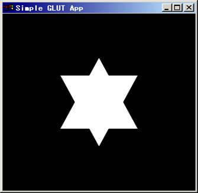
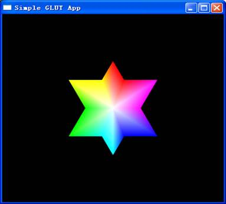

# 实验2 OpenGL中图形的绘制

## 一、实验目的

掌握理解简单的OpenGL程序结构；掌握OpenGL提供的基本图形函数，尤其是生成点、线、面的函数。

## 二、实验要求

1. 将实验代码输入到编程环境中运行，得到运行结果。

2. 学会按照GLUT开发库，并使用C++编译OpenGL程序。

## 三、实验学时

4学时

## 四、实验内容

1、完成头歌实训平台“OpenGL点和直线的绘制”实验内容。

2、编译已有项目工程，并编写代码生成以下图形，如图1所示：



图1 填充多边形

代码框架如下：

```cpp
#include <GL/glut.h>

void Display(void)
{
    glClear(GL_COLOR_BUFFER_BIT);
    glColor3f(1,1,1);

    //补充代码

    glutSwapBuffers();
}

void reshape(GLsizei w, GLsizei h)
{
    glViewport(0, 0, w, h);
    glMatrixMode(GL_PROJECTION);
    glLoadIdentity();
    glOrtho(-1.0, 1.0, -1.0, 1.0, -1.0, 1.0);
    glMatrixMode(GL_MODELVIEW);
}
```

```cpp
int main (int argc, char *argv[])
{
    glutInit(&argc, argv);
    glutInitDisplayMode(GLUT_RGB | GLUT_DOUBLE);

    glutInitWindowPosition(100, 100);
    glutInitWindowSize(400, 400);
    glutCreateWindow("Simple GLUT App");

    glutReshapeFunc(reshape);
    glutDisplayFunc(Display);
    glutMainLoop();
    return 0;
}
```

3、在此基础上，修改各顶点颜色，使得每个顶点颜色不一样，多边形内部颜色渐变，如图2所示（该程序可考虑使用双缓存区）。



图2 渐变多边形