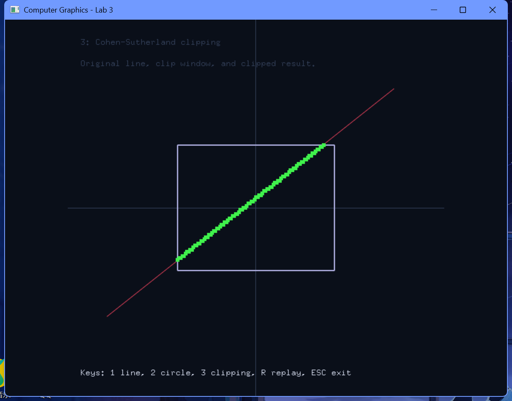

# 实验3 基本图形生成算法

## 一、实验要求：
1、实验目的：
了解opengl图形软件包绘制图形的基本过程及其程序框架，并在已有的程序框架中添加代码实现直线和圆的生成算法，演示直线和圆的生成过程，从而加深对直线和圆等基本图形生成算法的理解，掌握多边形填充方法。

2、实验要求：
1. 理解glut程序框架；
2. 理解Opengl实现动画的原理；
3. 添加代码实现中点Bresenham算法画直线；
4. 添加代码实现改进Bresenham算法画直线；
5. 添加代码实现圆的绘制（可以适当对框架坐标系进行修改）；
6. 适当修改代码实现具有宽度的图形（线刷子和方刷子，选作）。
7. 利用OpenGL输出不同属性的点和线段。
8. 利用OpenGL输出字符。
9. 利用OpenGL实现反走样技术。

## 二、实验内容及步骤：
### 实验内容：
1、基本图元生成程序框架，补充代码完成图形的绘制。
2、完成头歌实训平台实验内容：
（1）CG1-v1.0-直线光栅化算法
（2）多边形填充v1.0
3、利用OpenGL实现不同属性的点和线、字符显示、反走样技术：
主要代码：
（1）不同属性的点和线
（2）字符显示
（3）反走样技术
4、完成头歌实训平台实验内容：直线裁剪v1.0

### 1、实验思路和实验步骤（重点）：
#### 实验思路：
本实验的核心在于在离散的像素网格中模拟传统的连续图形算法。设计了三个交互演示场景，通过键盘按键 `1`/`2`/`3` 切换：
1. **直线光栅化**：使用中点 Bresenham 算法计算离散像素坐标，并通过定时器控制依次显示的点数，形成逐步绘制的动画。
2. **圆周光栅化**：使用中点圆生成算法计算第一象限的八分圆，通过八对称性一次映射出八个对称点，同样通过动画逐步揭示整个圆。
3. **线段裁剪**：通过 Cohen-Sutherland 区域编码对线段两端点进行编码（上、下、右、左四位），剔除完全在窗口外的线段，对相交线段求出交点并截断，用不同颜色渲染原线段、裁剪框与裁剪后的有效线段。

为了直观观察离散像素点，使用 `glPointSize` 将像素点放大，使得栅格化效果清晰可见。

#### 算法步骤（注意：不是代码，是算法流程）：
1. **中点 Bresenham 画线算法 (rasterizeLine)**：
   - 输入：起点 (x₀, y₀)，终点 (x₁, y₁)。
   - 计算 dx = |x₁ - x₀|，步进方向 sx = (x₀ < x₁) ? 1 : -1。
   - 计算 dy = -|y₁ - y₀|，步进方向 sy = (y₀ < y₁) ? 1 : -1。
   - 误差判别初值 error = dx + dy。
   - 循环迭代：
     - 将当前点 (x₀, y₀) 记录至顶点容器。
     - 若到达终点 (x₀ == x₁ 且 y₀ == y₁)，终止循环。
     - 判定双倍误差：若 2 · error ≥ dy，误差累加 dy，当前 x₀ 累加 sx；若 2 · error ≤ dx，误差累加 dx，当前 y₀ 累加 sy。
2. **中点画圆算法 (rasterizeCircle)**：
   - 输入：圆心 (x_c, y_c)，半径 r。
   - 初始化：x = 0，y = r，决策因子 d = 1 - r。
   - 当 x ≤ y 时执行循环：
     - 利用**八向对称性**，向容器插入八个对称点坐标：(x_c ± x, y_c ± y)、(x_c ± y, y_c ± x)。
     - 递增 x：x = x + 1。
     - 若 d < 0，决策因子累加 2x + 1；若 d ≥ 0，递减 y (y = y - 1)，决策因子累加 2(x - y) + 1。
3. **Cohen-Sutherland 直线裁剪算法 (clipLine)**：
   - 输入：裁剪窗口的边界值，以及待裁剪线段端点 P₀, P₁。
   - **区域编码规则**：定义 4 位二进制码 `TBRL`（上下右左）。根据端点 x, y 坐标，小于左界 L 设为 `0001`，大于右界 R 设为 `0010`，小于下界 B 设为 `0100`，大于上界 T 设为 `1000`。
   - 循环求交：
     - 计算两端点区域编码 Code₀, Code₁。
     - 若 Code₀ | Code₁ == 0，线段完全在窗口内，接收并退出。
     - 若 Code₀ & Code₁ ≠ 0，线段完全在窗口同侧的外侧，直接舍弃并退出。
     - 若不属于上述两类，则代表线段与边界相交。选择一个在外侧的点（编码不为 0 的点），计算其与窗口边界延长线的交点：
       - 若上方溢出（第 4 位为 1）：x = x₀ + (x₁ - x₀) · (T - y₀) / (y₁ - y₀)，y = T。
       - 同理计算下、右、左边界相交点。
     - 用求得的交点替换该端点，重新开始下一轮区域判定。

### 2、实验数据记录：
- **视口配置**：长 240 像素，宽 180 像素的虚拟二维网格。
- **画线场景数据**：
  - 直线起点：`(-90, -45)`，终点：`(75, 40)`。
  - 点大小 (`glPointSize`)：`5.0f`，颜色：黄色 `{1.0f, 0.78f, 0.2f}`。
- **画圆场景数据**：
  - 圆心：`(0, 0)`，半径 r = 42。
  - 点大小：`4.5f`，颜色：青绿色 `{0.35f, 0.95f, 0.85f}`。
- **线段裁剪场景数据**：
  - 裁剪窗口边界：`Left = -50, Right = 50, Bottom = -30, Top = 30`。
  - 原始线段端点：起点 `(-95, -52)`，终点 `(88, 57)`。颜色：红色 `{0.9f, 0.25f, 0.35f}`。
  - 裁剪后有效线段点大小：`5.5f`，颜色：绿色 `{0.25f, 0.95f, 0.3f}`。

### 3、实验结果与分析：
- 按键 `1` 演示直线光栅化，黄色像素点逐步画出一条倾斜直线。
- 按键 `2` 演示圆形光栅化，每次同时绘制 8 个对称位置的点并形成圆周。
- 按键 `3` 演示 Cohen-Sutherland 裁剪过程，裁剪框内的线段绘制为绿色，超出框外的红色线段被裁去。
- 线条渲染平滑，且下方均有操作说明。

#### 运行结果截图：

## 三、心得体会：
1. **图形生成算法的动画实现**：中点 Bresenham 算法和中点圆算法是底层光栅化的基石。为了更清晰地观察离散像素逼近连续几何线条的过程，实验中结合 `glutTimerFunc` 定时器，实现了像素点逐步画出的动画演示，对算法执行过程有了更直观的理解。
2. **裁剪算法的效率优势**：Cohen-Sutherland 算法通过对区域进行 4 位二进制编码，利用位运算能够迅速完成完全在窗口外或窗口内线段的接受与舍弃判定，极大减少了求交点时的除法运算。
3. **反走样的视觉效果**：在裁剪窗口的线条渲染中，通过开启 `GL_LINE_SMOOTH` 并设置混合模式，能够起到反走样的效果，使线条阶梯状的边缘显示得更加平滑。
