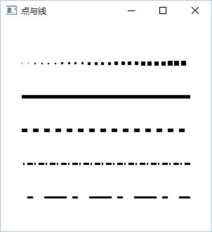
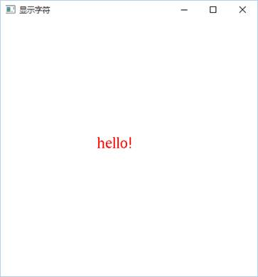
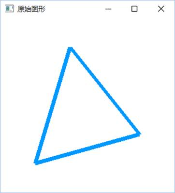
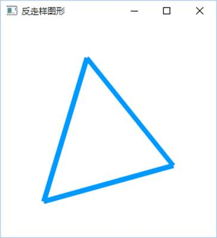

# 实验3 基本图形生成算法

## 一、实验目的

了解opengl图形软件包绘制图形的基本过程及其程序框架，并在已有的程序框架中添加代码实现直线和圆的生成算法，演示直线和圆的生成过程，从而加深对直线和圆等基本图形生成算法的理解，掌握多边形填充方法。

## 二、实验要求

1. 理解glut程序框架；

2. 理解Opengl实现动画的原理；

3. 添加代码实现中点Bresenham算法画直线；

4. 添加代码实现改进Bresenham算法画直线；

5. 添加代码实现圆的绘制（可以适当对框架坐标系进行修改）；

6. 适当修改代码实现具有宽度的图形（线刷子和方刷子，选作）。

7. 利用OpenGL输出不同属性的点和线段。

8. 利用OpenGL输出字符。

9. 利用OpenGL实现反走样技术。

## 三、实验学时

8学时

## 四、实验程序框架

1、基本图元生成程序框架，补充代码完成图形的绘制。

```cpp
#include <windows.h>
#include <gl/glut.h>
#include <iostream>
using namespace std;

int m_pointnumber = 0; //动画时绘制点的数目
int m_drawmode = 1;    //绘制模式   1    DDA算法画直线
                       //           2    中点Bresenham算法画直线
                       //           3    改进Bresenham算法画直线
                       //           4    八分法绘制圆
                       //           5    四分法绘制椭圆(选作)

//绘制坐标线
void DrawCordinateLine(void)
{
	int i = 0 ;
	//坐标线为黑色
	glColor3f(0.0f, 0.0f ,0.0f);
	glBegin(GL_LINES);
	for (i=10;i<=250;i=i+10)
	{
		glVertex2f((float)(i), 0.0f);
		glVertex2f((float)(i), 250.0f);
		glVertex2f(0.0f, (float)(i));
		glVertex2f(250.0f, (float)(i));
	}
	glEnd();
}

//绘制一个点，这里用一个正方形表示一个点。
void PutPixel(GLsizei x, GLsizei y)
{
	glRectf(10*x,10*y,10*x+10,10*y+10);
}

///////////////////////////////////////////////////////////////////
//dda画线算法                                                    //
//参数说明：x0,y0  起点坐标                                      //  
//          x1,y1  终点坐标                                      // 
//          num    扫描转换时从起点开始输出的点的数目，用于动画  //
//          w      线段的宽度                                    //
/////////////////////////////////////////////////////////////////// 
void DDAcreateLine(GLsizei x0, GLsizei y0, GLsizei x1, GLsizei y1, GLsizei num, GLsizei w)
{
	//设置颜色
	glColor3f(1.0f,0.0f,0.0f);
	
	//对画线动画进行控制
	if(num == 1)
		cout<<"DDA画线算法：各点坐标
";
	else if(num==0)
		return;
	
	//算法的实现
	GLsizei dx,dy,epsl,k;
	GLfloat x,y,xincre,yincre;
	
	dx = x1-x0;
	dy = y1-y0;
	x = x0;
	y = y0;
	
	if(abs(dx) > abs(dy)) epsl = abs(dx);
	else epsl = abs(dy);
	xincre = (float)dx / epsl ;
	yincre = (float)dy / epsl ;
	
	for(k = 0; k<=epsl; k++)
	{
		PutPixel((int)(x+0.5), (int)(y+0.5));
		//画具有宽度的线段，使用垂直线刷子
		if(w%2==0)
		{
			for(int i=1;i<=w/2;i++)
			{
				PutPixel((int)(x+0.5), (int)(y+0.5)+i);
				PutPixel((int)(x+0.5), (int)(y+0.5)-(i-1));
			}
		}
		else
			for(int i=1;i<=w/2;i++)
			{
				PutPixel((int)(x+0.5), (int)(y+0.5)+i);
				PutPixel((int)(x+0.5), (int)(y+0.5)-i);
			}

		if (k>=num-1) 
		{
			cout<<"x="<<x<<",y="<<y
				<<";取整后"<<"x="<<(int)(x+0.5)
				<<",y="<<(int)(y+0.5)<<endl;
			break;
		}
		x += xincre;
		y += yincre;
		
		if(x >= 25 || y >= 25) break;
	}
}

///////////////////////////////////////////////////////////////////
//中点算法画直线(0<=k<=1)                               //
//参数说明：x0,y0  起点坐标                                      //  
//          x1,y1  终点坐标                                      // 
//          num    扫描转换时从起点开始输出的点的数目，用于动画  //
/////////////////////////////////////////////////////////////////// 
void BresenhamLine(GLsizei x0, GLsizei y0, GLsizei x1, GLsizei y1, GLsizei 

num)
{
	glColor3f(1.0f,0.0f,0.0f);
	
	if(num == 1)
		cout<<"中点算法画直线：各点坐标及判别式的值
";
	else if(num==0)
		return;

	//算法的实现
	GLsizei dx,dy,d;
	GLsizei UpIncre,DownIncre;
	GLsizei x,y,k;
	if(x0>x1)
	{
		x=x1; x1=x0; x0=x;
		y=y1; y1=y0; y0=y;
	}
	dx = x1-x0;
	dy = y1-y0;
	x = x0;
	y = y0;
	d=dx-2*dy;
	UpIncre=2*dx-2*dy;
	DownIncre=-2*dy;
	k=0;
	while(x<=x1)
	{
		PutPixel(x,y);
		if (k>=num-1) 
		{
			cout<<"x="<<x<<",y="<<y<<endl;
			break;
		}
		k++;
		x++;
		if(d<0)
		{
			y++;
			d+=UpIncre;
		}
		else
			d+=DownIncre;
		if(x >= 25 || y >= 25) break;
	}
	
}
///////////////////////////////////////////////////////////////////
//Bresenham算法画直线(0<=k<=1)                             //
//参数说明：x0,y0  起点坐标                                      //  
//          x1,y1  终点坐标                                      // 
//          num    扫描转换时从起点开始输出的点的数目，用于动画  //
/////////////////////////////////////////////////////////////////// 
void Bresenham2Line(GLsizei x0, GLsizei y0, GLsizei x1, GLsizei y1, GLsizei 

num)
{
	glColor3f(1.0f,0.0f,0.0f);
	
	if(num == 1)
		cout<<"Bresenham算法画直线：各点坐标及判别式的值
";
	else if(num==0)
		return;

	//算法的实现
	GLsizei x,y,dx,dy;
	GLsizei e,k;
	
	dx = x1-x0;
	dy = y1-y0;
	e=-dx;
	x=x0;y=y0;
	k=0;
	while(x<=x1)
	{
		PutPixel(x,y);
		if (k>=num-1) 
		{
			cout<<"x="<<x<<",y="<<y<<",e="<<e<<endl;
			break;
		}
		k++;
		x++;
		e+=2*dy;
		if(e>0)
		{
			y++;
			e-=2*dx;
		}
		if(x >= 25 || y >= 25) break;
	}
}

///////////////////////////////////////////////////////////////////
//Bresenham算法画圆                                              //
//参数说明：x,y    圆心坐标                                      //  
//          r      圆半径                                        // 
//          num    扫描转换时从起点开始输出的点的数目，用于动画  //
/////////////////////////////////////////////////////////////////// 
void BresenhamCircle(GLsizei x1, GLsizei y1, GLsizei r, GLsizei num)
{
	glColor3f(1.0f,0.0f,0.0f);
	
	if(num == 1)
		cout<<"Bresenham算法画圆：各点坐标及判别式的值
";

	//算法的实现
	GLsizei x,y,d,k;
	x=0;
	y=r;
	d=1-r;
	k=0;
	while(y>x) //y>x即第一象限的第2区八分圆
	{
		PutPixel(x+x1,y+y1); //圆心(x1,y1),画点时直接相加平移,画2区
        PutPixel(y+x1,x+y1); //画1区
        PutPixel(-x+x1,y+y1); //画3区
        PutPixel(-y+x1,x+y1); //画4区
        PutPixel(-x+x1,-y+y1); //画5区
        PutPixel(-y+x1,-x+y1); //画6区
        PutPixel(x+x1,-y+y1); //画7区
        PutPixel(y+x1,-x+y1); //画8区
		if (k>=num-1) 
		{
			cout<<"x="<<x<<",y="<<y<<endl;
			break;
		}
        if(d<0)
			d+=2*x+3; //d的变化
		else
		{
			d+=2*(x-y)+5; //d<=0时,d的变化
			y--; //y坐标减1
		}
		x++; //x坐标加1
		k++;
		if(x >= 25 || y >= 25) break;
	}
}

///////////////////////////////////////////////////////////////////
//中点Bresenham算法画椭圆                                        //
//参数说明：x1,y1    圆心坐标                                    //  
//          a,b      长半轴为a,短半轴为b                         // 
//          num    扫描转换时从起点开始输出的点的数目，用于动画  //
/////////////////////////////////////////////////////////////////// 
void MidBresenhamEllipse(GLsizei x1, GLsizei y1, GLsizei a, GLsizei b, GLsizei num)
{
	glColor3f(1.0f,0.0f,0.0f);
	
	if(num == 1)
		cout<<"中点Bresenham算法画椭圆：各点坐标及判别式的值
";

	//算法的实现


	GLsizei x,y,k;
	GLfloat d1,d2;
	x=0; y=b;
	k=0;
	d1=b*b+a*a*(-b+0.25);

	PutPixel(x1+x,y1+y); PutPixel(x1+x,y1-y);
	PutPixel(x1-x,y1+y); PutPixel(x1-x,y1-y);

	while(b*b*(x+1)<a*a*(y-0.5))
	{
		if(d1<0)
		{
			d1+=b*b*(2*x+3);	
		}
		else
		{
			d1+=b*b*(2*x+3)+a*a*(-2*y+2);
			y--;
		}
		x++;
		PutPixel(x1+x,y1+y); PutPixel(x1+x,y1-y);
		PutPixel(x1-x,y1+y); PutPixel(x1-x,y1-y);
		if (k>=num-1) 
		{
			cout<<"x="<<x<<",y="<<y<<endl;
			break;
		}
		k++;
	}

	d2=b*b*(x+0.5)*(x+0.5)+a*a*(y-1)*(y-1)-a*a*b*b;
	while(y>0)
	{
		if(d2<=0)
		{
			d2+=b*b*(2*x+2)+a*a*(-2*y+3);
			x++;
		}
		else
		{
			d2+=a*a*(-2*y+3);
		}
		y--;
		PutPixel(x1+x,y1+y); PutPixel(x1+x,y1-y);
		PutPixel(x1-x,y1+y); PutPixel(x1-x,y1-y);
		if (k>=num-1) 
		{
			cout<<"x="<<x<<",y="<<y<<endl;
			break;
		}
		k++;
	}
}

//初始化窗口
void Initial(void)
{
	// 设置窗口颜色为白色
	glClearColor(1.0f, 1.0f, 1.0f, 1.0f);
}

// 窗口大小改变时调用的登记函数
void ChangeSize(GLsizei w, GLsizei h)
{
	if(h == 0)
		h = 1;
	// 设置视区尺寸
	glViewport(0, 0, w, h);
	
	// 重置坐标系统
	glMatrixMode(GL_PROJECTION);
	glLoadIdentity();
	
	//建立修剪空间的范围
	if (w <= h) 
		glOrtho(0.0f, 250.0f, 0.0f, 250.0f*h/w, 1.0, -1.0);
	else
		glOrtho(0.0f, 250.0f*w/h, 0.0f, 250.0f, 1.0, -1.0);
}

// 在窗口中绘制图形
void Redraw(void)
{
	//用当前背景色填充窗口
	glClear(GL_COLOR_BUFFER_BIT);
	
	//画出坐标线
	DrawCordinateLine();
	
	switch(m_drawmode)
	{
	case 1:
		DDAcreateLine(0,0,20,15,m_pointnumber,3);break;
	case 2:
		BresenhamLine(0,0,20,15,m_pointnumber);break;
	case 3:
		Bresenham2Line(0,0,5,2,m_pointnumber);break;
	case 4:
		BresenhamCircle(12,12,10,m_pointnumber);break;
	case 5:
		MidBresenhamEllipse(12,12,10,6,m_pointnumber);break;
	default:
		break;
	}
	glutSwapBuffers();
}

//设置时间回调函数
void TimerFunc(int value)
{
	if(m_pointnumber == 0)
		value = 1;
	m_pointnumber = value;
	glutPostRedisplay();
	glutTimerFunc(500, TimerFunc, value+1);
}

//设置键盘回调函数
void Keyboard(unsigned char key, int x, int y)   
{
	if (key == '1')		m_drawmode = 1;
	if (key == '2')		m_drawmode = 2;
	if (key == '3')		m_drawmode = 3;
	if (key == '4')		m_drawmode = 4;
	if (key == '5')		m_drawmode = 5;
	
	m_pointnumber = 0;
	glutPostRedisplay();
}

//void main(void)
int main(int argc, char* argv[])
{
	glutInit(&argc, argv);
	
	//初始化glut库opengl窗口的显示模式
	glutInitDisplayMode(GLUT_DOUBLE | GLUT_RGB); 
	glutInitWindowSize(600,600);
	glutInitWindowPosition(100,100);
	
	glutCreateWindow("基本图元绘制程序"); 
	glutDisplayFunc(Redraw); 
	glutReshapeFunc(ChangeSize); 
	glutKeyboardFunc(Keyboard);//键盘响应回调函数
	glutTimerFunc(500, TimerFunc, 1);    
	
	//窗口初始化
	Initial();
	glutMainLoop(); //启动主glut事件处理循环
 return 0;
}
```

2、完成头歌实训平台实验内容：

（1）CG1-v1.0-直线光栅化算法

（2）多边形填充v1.0

3、利用OpenGL实现不同属性的点和线、字符显示、反走样技术：

 

 

主要代码：

（1）不同属性的点和线

```cpp
#include <GL/glut.h>
int winWidth = 400, winHeight = 300;     //窗口的宽度和高度
void myDisplay(void)
{
	glClearColor(1.0f, 1.0f, 1.0f, 1.0f);
	glClear(GL_COLOR_BUFFER_BIT); //用当前背景色填充窗口
   	glColor3f(0.0f, 0.0f, 0.0f); //设置当前的绘图绘图RGB颜色

	//绘制不同大小的点
	GLfloat sizes[2];  //保存绘制点的尺寸范围
	GLfloat step;      //保存绘制点尺寸的步长
	GLfloat curSize;   //当前绘制的点的大小
	glGetFloatv(GL_POINT_SIZE_RANGE,sizes);
	glGetFloatv(GL_POINT_SIZE_GRANULARITY,&step);

	curSize=sizes[0];
	
	for (int i=0;i<25;i++)
	{
		glPointSize(curSize);
		glBegin(GL_POINTS);
			glVertex3f(25.0+i*8,200.0,0.0);
		glEnd();
		curSize +=step*2;
	}

	//绘制一条宽度为5的直线
	glLineWidth(5);
	glBegin(GL_LINES);
		glVertex3f(25.0,160.0,0.0);
		glVertex3f(225.0,160.0,0.0);
	glEnd();

	//绘制一条虚线
	glEnable(GL_LINE_STIPPLE);
	glLineStipple(1,0x00FF);
	glBegin(GL_LINES);
		glVertex3f(25.0,120.0,0.0);
		glVertex3f(225.0,120.0,0.0);
	glEnd();

	//绘制一条宽度为3的点划线
	glLineWidth(3);
	glLineStipple(1,0xFF0C);
	glBegin(GL_LINES);
		glVertex3f(25.0,80.0,0.0);
		glVertex3f(225.0,80.0,0.0);
	glEnd();

	//增加重复因子绘制的点划线
	glLineStipple(4,0xFF0C);
	glBegin(GL_LINES);
		glVertex3f(25.0,40.0,0.0);
		glVertex3f(225.0,40.0,0.0);
	glEnd();
	glDisable(GL_LINE_STIPPLE);

	glFlush();//刷新OpenGL命令队列

}

void ChangeSize(int w, int h)
{
	winWidth = w;	winHeight = h;
	glViewport(0, 0, w, h);           //指定窗口显示区域
	glMatrixMode(GL_PROJECTION);      //设置投影参数
	glLoadIdentity();
	gluOrtho2D(0.0,winWidth,0.0,winHeight);
}

int main(int argc, char *argv[])
{
    glutInit(&argc, argv);
    glutInitDisplayMode(GLUT_RGB | GLUT_SINGLE);
    glutInitWindowPosition(100, 100);
    glutInitWindowSize(400, 300);
    glutCreateWindow("点与线");
    glutDisplayFunc(myDisplay);
    glutReshapeFunc(ChangeSize);
    glutMainLoop();
    return 0;
}
```

（2）字符显示

```cpp
#include <gl/glut.h>
#include <string.h>

int winWidth = 400, winHeight = 300;     //窗口的宽度和高度

void Initial(void)
{
	glClearColor(1.0f, 1.0f, 1.0f, 1.0f);    
	glColor3f(0.0f, 0.0f, 0.0f);
}

void output(int x, int y, char *string)
{
	int len, i;
	glRasterPos2f(x, y);
	len = (int) strlen(string);
	for (i = 0; i < len; i++)
	{
		glutBitmapCharacter(GLUT_BITMAP_TIMES_ROMAN_24, string[i]);
	}
}
void Display(void)
{
	glClear(GL_COLOR_BUFFER_BIT); //用当前背景色填充窗口 
	glColor3f(1.0f, 0.0f, 0.0f); //设置当前的绘图绘图 RGB 颜色
	output(100,100,"hello!");
	glFlush();//刷新 OpenGL命令队列 
}

void ChangeSize(int w, int h)
{
	winWidth = w;	winHeight = h;
	glViewport(0, 0, w, h);           //指定窗口显示区域
	glMatrixMode(GL_PROJECTION);      //设置投影参数
	glLoadIdentity();
	gluOrtho2D(0.0,winWidth,0.0,winHeight);
}

int main(int argc, char* argv[])
{
	glutInit(&argc, argv);
	glutInitDisplayMode(GLUT_SINGLE | GLUT_RGB);  
	glutInitWindowSize(400,400);                  
	glutInitWindowPosition(100,100);              
	glutCreateWindow("显示字符");
	glutDisplayFunc(Display);
	glutReshapeFunc(ChangeSize);
	Initial();                                    
	glutMainLoop();                               
	return 0;
}
```

（3）反走样技术

```cpp
#include <gl/glut.h>
GLuint lineList; //指定显示列表ID
void Initial()
{
	glClearColor(1.0f, 1.0f, 1.0f, 0.0f);
	glLineWidth(12.0f);
	glColor4f (0.0, 0.6, 1.0, 1.0);
	lineList = glGenLists(1);
	glNewList(lineList, GL_COMPILE);  //定义显示列表
		glBegin(GL_LINE_LOOP);
			glVertex2f(1.0f, 1.0f);
			glVertex2f(4.0f, 2.0f);
			glVertex2f(2.0f, 5.0f);
		glEnd();
	glEndList();
}

void ChangeSize(GLsizei w, GLsizei h)
{
	if(h == 0)		h = 1;
   	glViewport(0, 0, w, h);
	glMatrixMode(GL_PROJECTION);
	glLoadIdentity();
	if(w<=h)
		gluOrtho2D(0.0, 5.0, 0.0, 6.0*(GLfloat)h/(GLfloat)w);
	else
		gluOrtho2D(0.0, 5.0*(GLfloat)w/(GLfloat)h, 0.0, 6.0);
	glMatrixMode(GL_MODELVIEW);
	glLoadIdentity();
}

void Displayt(void)
{	
	glClear(GL_COLOR_BUFFER_BIT);
	glCallList(lineList);
    	glFlush();
}

void Displayw(void)
{
	glClear(GL_COLOR_BUFFER_BIT);
	glEnable(GL_LINE_SMOOTH);      //使用反走样
	glEnable (GL_BLEND);             //启用混合函数
	glBlendFunc(GL_SRC_ALPHA, GL_ONE_MINUS_SRC_ALPHA);  //指定混合函数
	glCallList(lineList);
    	glFlush();
}

void main(void)
{
	glutInitDisplayMode(GLUT_SINGLE | GLUT_RGB); 
	glutInitWindowSize(300, 300);
	glutCreateWindow("原始图形");
	glutDisplayFunc(Displayt);
    	glutReshapeFunc(ChangeSize);
   	Initial();

	glutInitDisplayMode(GLUT_SINGLE | GLUT_RGB); 
	glutInitWindowPosition(300, 300);
	glutInitWindowSize(300, 300);
	glutCreateWindow("反走样图形");
	glutDisplayFunc(Displayw);
   	glutReshapeFunc(ChangeSize);
	Initial();
	glutMainLoop();
}
```

4、完成头歌实训平台实验内容：直线裁剪v1.0