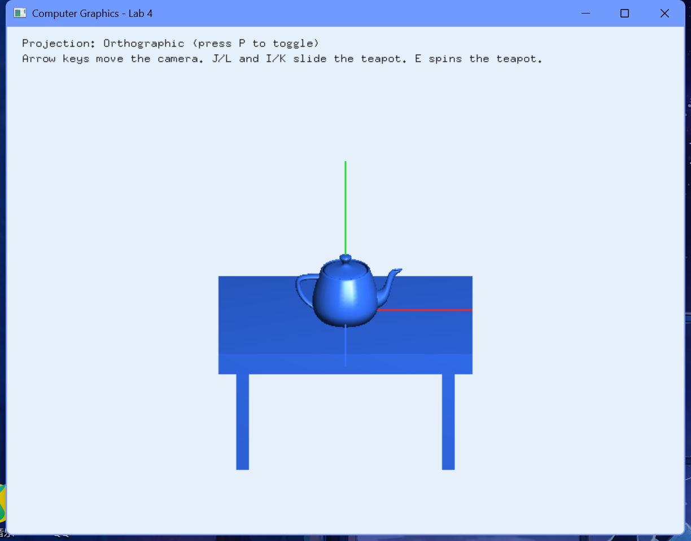

# 实验4 图形几何变换

## 一、实验要求：
1、实验目的：
加深对常用的二维几何变换的理解，如平移、旋转、放大缩小等；掌握变换顺序和变换矩阵。了解OpenGL二维图形变换的三个函数及其计算机图形学的理论基础；尝试利用OpenGL编写一个二维图形变换的小程序；掌握直线段的编码裁减算法的高级语言程序设计方法；在模型变换实验的基础上，掌握OpenGL中三维观察、透视投影、正交投影的参数设置，验证课程中三维观察的内容；进一步加深对OpenGL三维坐标和矩阵变换的理解和应用。

2、实验要求：
1. 通过二维几何变换的数学模型，编写平移、旋转、放缩、对称变换的变换矩阵。
2. 理解矩阵堆栈、图形变换函数的原理，掌握其用法。

## 二、实验内容及步骤：
### 实验内容：
1、完成头歌实训平台实验内容：
（1）CG2-v1.0-二维几何变换
（2）投影变换v1.0
2、在模型变换实验的基础上，通过实现下述实验内容，掌握OpenGL中三维观察、透视投影、正交投影的参数设置。
要求：
1）添加键盘对场景的控制（上、下、左、右移动），并能使用键盘移动观察相机，在透视投影和正交投影间切换。
2）添加键盘对茶壶的控制，主要是茶壶沿着桌面的平移操作和茶壶绕自身轴的旋转操作；按键为：l, j, I, k, e。

### 1、实验思路和实验步骤（重点）：
#### 实验思路：
几何变换是计算机图形学的核心，通常分为模型变换、观察变换和投影变换三大步。
- **二维变换矩阵**：在数学设计上，使用齐次坐标表示二维点，将平移、缩放、旋转和对称用 3×3 矩阵的乘法进行统一表示，并在报告中完整书写。
- **三维场景搭建**：在 OpenGL 场景中，使用层次矩阵堆栈搭建了一个包含桌面和四个桌腿的写实桌子，桌面上方放置一个实体茶壶。
- **观察变换 (相机控制)**：相机的移动由全局变量 `g_cameraX` 和 `g_cameraZ` 控制，配合 `gluLookAt` 设定视点，用键盘方向键改变相机坐标。
- **模型变换 (茶壶控制)**：茶壶的移动由变量 `g_teapotX`、`g_teapotZ` 和旋转角 `g_teapotRotation` 控制。通过矩阵变换 `glTranslatef` 和 `glRotatef`，让茶壶在桌面上滑动和自转。
- **投影变换**：按 `P` 键切换投影模式，在 `reshape` 函数中重新生成 `glOrtho`（正投影）或 `gluPerspective`（透视投影）矩阵。

#### 算法步骤（注意：不是代码，是算法流程）：
1. **二维齐次几何变换矩阵推导**：
   - **平移矩阵 T(t_x, t_y)**：
     ```text
T(t_x, t_y) = 
┌             ┐
│  1   0  t_x │
│  0   1  t_y │
│  0   0   1  │
└             ┘
```
   - **缩放矩阵 S(s_x, s_y)**：
     ```text
S(s_x, s_y) = 
┌             ┐
│ s_x  0   0  │
│  0  s_y  0  │
│  0   0   1  │
└             ┘
```
   - **旋转矩阵 R(θ)** (绕原点逆时针)：
     ```text
R(θ) = 
┌                     ┐
│  cos(θ)  -sin(θ)  0 │
│  sin(θ)   cos(θ)  0 │
│     0        0    1 │
└                     ┘
```
   - **关于 x 轴对称矩阵 M_x**：
     ```text
M_x = 
┌             ┐
│  1   0   0  │
│  0  -1   0  │
│  0   0   1  │
└             ┘
```
2. **观察与视角控制**：
   - 在 `display` 中首先调用 `glLoadIdentity()`，再执行观察变换：
     `gluLookAt(g_cameraX, 2.1, g_cameraZ,  g_cameraX, -0.2, 0.0,  0.0, 1.0, 0.0)`。
3. **茶壶模型变换步骤**：
   - 载入模型视图矩阵并使用 `glPushMatrix` 保护。
   - 沿桌面平移：`glTranslatef(g_teapotX, -0.28f, g_teapotZ)`。
   - 绕自身垂直 Y 轴旋转：`glRotatef(g_teapotRotation, 0.0f, 1.0f, 0.0f)`。
   - 绘制茶壶：`glutSolidTeapot(0.42)`。
   - `glPopMatrix` 弹出矩阵。
4. **键盘事件响应 (keyboard)**：
   - 按键 `j` / `J`：茶壶左移 `g_teapotX -= 0.12`。
   - 按键 `l` / `L`：茶壶右移 `g_teapotX += 0.12`。
   - 按键 `i` / `I`：茶壶前移 `g_teapotZ -= 0.12`。
   - 按键 `k` / `K`：茶壶后移 `g_teapotZ += 0.12`。
   - 按键 `e` / `E`：茶壶自转角增加 `g_teapotRotation += 12.0f`。
   - 按键 `p` / `P`：反转布尔变量 `g_usePerspective` 并触发 `reshape` 重新配置投影。
5. **特殊键响应 (special)**：
   - 特殊按键 `GLUT_KEY_LEFT` 和 `GLUT_KEY_RIGHT` 改变 `g_cameraX`（相机左右平移）。
   - `GLUT_KEY_UP` 和 `GLUT_KEY_DOWN` 改变 `g_cameraZ`（相机前后缩放，范围限制在 3.2 到 10.0 内防止穿模）。

### 2、实验数据记录：
- **桌面三维几何数据**：
  - 桌面尺寸：`glTranslatef(0.0f, -0.65f, 0.0f)`，缩放因子 `(3.2f, 0.2f, 2.2f)`。
  - 四个桌腿位置：`glTranslatef(±1.3f, -1.25f, ±0.9f)`，缩放因子 `(0.16f, 1.0f, 0.16f)`。
- **相机视点配置**：
  - 相机坐标：`(g_cameraX, 2.1f, g_cameraZ)`。
  - 观察中心点：`(g_cameraX, -0.2f, 0.0f)`。
  - 向上向量：`(0.0f, 1.0f, 0.0f)`。
- **正投影矩阵**：`glOrtho(-3.2 * aspect, 3.2 * aspect, -2.4, 2.4, 1.0, 30.0)`。
- **透视投影矩阵**：`gluPerspective(45.0, aspect, 1.0, 30.0)`。

### 3、实验结果与分析：
- 按“P”键可以在正交投影和透视投影模式之间切换。
- 正交投影模式下，视角拉近时物体没有大小变化；透视投影模式下，茶壶展现出近大远小的三维透视效果。
- 键盘方向键可以移动相机视角；“J/L/I/K”键控制茶壶在桌面滑动，“E”键控制茶壶自转。

#### 运行结果截图：


## 三、心得体会：
1. **三维几何变换与矩阵栈**：在进行三维变换时，矩阵的压栈（`glPushMatrix`） 和 出栈（`glPopMatrix`）十分重要。对于桌子和茶壶等多个物体的相对变换，先保护好父级坐标系的状态，再进行局部坐标变换，最后恢复状态，能够保证变换逻辑的正确。
2. **投影模式的差异**：通过对比正交投影和透视投影，深刻理解了两者的差异。正交投影没有近大远小的透视收缩，主要用于工程图纸设计；而透视投影符合人眼的视觉规律，展现出真实的空间纵深感。
3. **协同变换控制**：在交互式变换中，视口相机参数（`gluLookAt`）和物体自身的平移自转需要协同进行。让相机的焦点随相机平移同步改变，可以防止平移后物体偏离视线中心。
