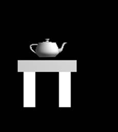
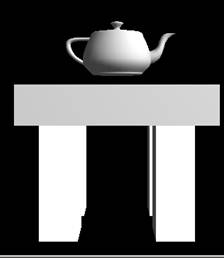
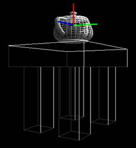

# 实验4 图形几何变换

## 一、实验目的

加深对常用的二维几何变换的理解，如平移、旋转、放大缩小等；掌握变换顺序和变换矩阵。了解OpenGL二维图形变换的三个函数及其计算机图形学的理论基础；尝试利用OpenGL编写一个二维图形变换的小程序；掌握直线段的编码裁减算法的高级语言程序设计方法；在模型变换实验的基础上，掌握OpenGL中三维观察、透视投影、正交投影的参数设置，验证课程中三维观察的内容；进一步加深对OpenGL三维坐标和矩阵变换的理解和应用。

## 二、实验要求

1. 通过二维几何变换的数学模型，编写平移、旋转、放缩、对称变换的变换矩阵。

2. 理解矩阵堆栈、图形变换函数的原理，掌握其用法。

## 三、实验学时

8学时

## 四、实验内容

1、完成头歌实训平台实验内容：

（1）CG2-v1.0-二维几何变换

（2）投影变换v1.0

2、在模型变换实验的基础上，通过实现下述实验内容，掌握OpenGL中三维观察、透视投影、正交投影的参数设置。

要求：1）添加键盘对场景的控制（上、下、左、右移动），并能使用键盘移动观察相机，在透视投影和正交投影间切换，如图1、2所示。

2）添加键盘对茶壶的控制，主要是茶壶沿着桌面的平移操作（如图4-4中绿色和蓝色标示）和茶壶绕自身轴（如图3中红色标示）的旋转操作；按键为：l, j, I, k, e。

  

图1 正投影 图2 透视投影 图3 茶壶的控制

程序框架：

```cpp
#include <stdlib.h>
#include <gl/glut.h>


float fTranslate;
float fRotate;
float fScale     = 1.0f;	// set inital scale value to 1.0f

bool bPersp = false;
bool bAnim = false;
bool bWire = false;

int wHeight = 0;
int wWidth = 0;

//todo
//hint: some additional parameters may needed here when you operate the teapot
bool isTeapotRotate = false;
float teapotRotate = 0.0;
float teapotPos[] = {0, 0};

void Draw_Leg()
{
	glScalef(1, 1, 3);
	glutSolidCube(1.0);
}

void Draw_Scene()
{
	glPushMatrix();

	//在绘制场景时，使用teapotPos[] 变量控制茶壶的位置
	glTranslatef(teapotPos[0], 0, 4+1+teapotPos[1]); 
	glRotatef(teapotRotate, 0, 0, 1);
	glRotatef(90, 1, 0, 0);
	glutSolidTeapot(1);
	glPopMatrix();

	//绘制桌子
	glPushMatrix();
	glTranslatef(0, 0, 3.5);
	glScalef(5, 4, 1);
	glutSolidCube(1.0);
	glPopMatrix();

	glPushMatrix();
	glTranslatef(1.5, 1, 1.5);
	Draw_Leg();
	glPopMatrix();

	glPushMatrix();
	glTranslatef(-1.5, 1, 1.5);
	Draw_Leg();
	glPopMatrix();
	
	glPushMatrix();
	glTranslatef(1.5, -1, 1.5);
	Draw_Leg();
	glPopMatrix();
	
	glPushMatrix();
	glTranslatef(-1.5, -1, 1.5);
	Draw_Leg();
	glPopMatrix();

}

void updateView(int width, int height)
{
	glViewport(0,0,width,height);	//Reset The Current Viewport

	glMatrixMode(GL_PROJECTION);	//Select The Projection Matrix					
	glLoadIdentity();				//Reset The Projection Matrix				
	
	//计算宽高比
	float whRatio = (GLfloat)width/(GLfloat)height;
	
	//选择透视模式还是正交模式
	if (bPersp)
	{
		//todo when 'p' operation,hint:use FUNCTION glutPerspective
		gluPerspective(45.0f,whRatio,0.1f,100.0f);
	}
	else
	    glOrtho(-3 ,3, -3, 3,-100,100);

	//选择视图模式矩阵
	glMatrixMode(GL_MODELVIEW);							// Select The Modelview Matrix
}

void reshape(int width, int height)
{
	if (height==0)										// Prevent A Divide By Zero By
	{
		height=1;										// Making Height Equal One
	}

	wHeight = height;
	wWidth = width;

	updateView(wHeight, wWidth);
}

void idle()
{
	glutPostRedisplay();
}

float eye[] = {0, 0, 8};
float center[] = {0, 0, 0};
//todo;hint:you may need another ARRAY when you operate the teapot

void key(unsigned char k, int x, int y)
{
	switch(k)
	{
	case 27:
	case 'q': 
		{
			exit(0); 
			break; 
		}
	case 'p': 
		{
			bPersp = !bPersp;
			updateView(wHeight, wWidth);
			break; 
		}

	case ' ': 
		{
			bAnim = !bAnim; 
			break;
		}
	case 'o': 
		{
			bWire = !bWire; 
			break;
		}

	case 'a': 
		{
			//todo, hint: eye[] and center[] are the keys to solve the problems
			eye[0] += 0.2;
			center[0] += 0.2;
			break;
		}
	case 'd': 
		{
			//todo
			eye[0] -= 0.2;
			center[0] -= 0.2;
			break;
		}
	case 'w': 
		{
			//todo
			eye[1] -= 0.2;
			center[1] -= 0.2;
			break;
		}
	case 's': 
		{
			//todo
			eye[1] += 0.2;
			center[1] += 0.2;
			break;
		}
	case 'z': 
		{
			//todo
			eye[2] -= 0.2;
			break;
		}
	case 'c': 
		{
			//todo
			eye[2] += 0.2;
			break;
		}

	//茶壶相关操作
	case 'l': 
		{
			//todo, hint:use the ARRAY that you defined, and notice the teapot can NOT be moved out the range of the table.
			if( teapotPos[0] < 2.0)
				teapotPos[0] += 0.1;
			break;
		}
	case 'j': 
		{
			//todo
			if( teapotPos[0] > -2.0)
				teapotPos[0] -= 0.1;
			break;
		}
	case 'i': 
		{
			//todo
			if( teapotPos[1] < 1.5)
				teapotPos[1] += 0.1;
			break;
		}
	case 'k': 
		{	
			//todo
			if( teapotPos[1] > -1.5)
				teapotPos[1] -= 0.1;
			break;
		}
	case 'e': 
		{
			//todo
			isTeapotRotate = !isTeapotRotate;
			break;
		}
	}
}


void redraw()
{

	glClear(GL_COLOR_BUFFER_BIT | GL_DEPTH_BUFFER_BIT); 
	glLoadIdentity();									//重置颜色与深度

	gluLookAt(eye[0], eye[1], eye[2],
		center[0], center[1], center[2],
		0, 1, 0);				// 视点中心改由eye[] 控制，场景中心改由center[] 控制，Y轴向上

	if (bWire) {
		glPolygonMode(GL_FRONT_AND_BACK, GL_LINE);    // 设置两面均为边缘绘制方式
	}
	else {
		glPolygonMode(GL_FRONT_AND_BACK, GL_FILL);	   //设置两面均为填充方式
	}

	glEnable(GL_DEPTH_TEST);	//开启深度测试
	glEnable(GL_LIGHTING);      //开启光源系统
    GLfloat white[] = { 1.0, 1.0, 1.0, 1.0 };
	GLfloat light_pos[] = {5,5,5,1};

	glLightfv(GL_LIGHT0, GL_POSITION, light_pos);   //设置环境光位置
	glLightfv(GL_LIGHT0, GL_AMBIENT, white);   //设置环境光颜色
	glEnable(GL_LIGHT0);     //开启环境光

	glRotatef(fRotate, 0, 1.0f, 0);	
	glRotatef(-90, 1, 0, 0);
	glScalef(0.2, 0.2, 0.2);
	Draw_Scene();						//按照新模式与参数绘制场景

	if (bAnim) 
		fRotate    += 0.5f;    //场景自转

	if(isTeapotRotate)  //茶壶转角增加
		teapotRotate += 0.5f;
	glutSwapBuffers();
}

int main (int argc,  char *argv[])
{
	glutInit(&argc, argv);
	glutInitDisplayMode(GLUT_RGBA | GLUT_DEPTH | GLUT_DOUBLE);
	glutInitWindowSize(480,480);
	int windowHandle = glutCreateWindow("Simple GLUT App");

	glutDisplayFunc(redraw);
	glutReshapeFunc(reshape);	
	glutKeyboardFunc(key);
	glutIdleFunc(idle);

	glutMainLoop();
	return 0;
}
```