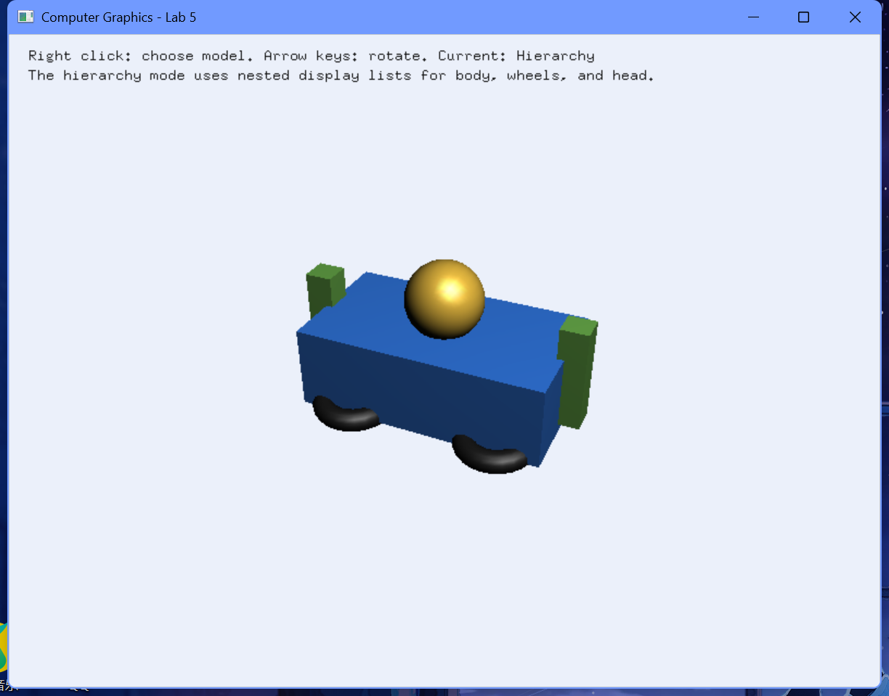

# 实验5 三维造型

## 一、实验要求：
1、实验目的：
了解常用的图形交互技术及实现方法，学习用户接口的程序设计；理解OpenGL中鼠标、键盘注册函数的使用；理解图形的层次模型的实现。

2、实验要求：
1. 使用键盘和菜单功能绘制不同的几何图形。
2. 使用多级显示列表绘制模型。

## 二、实验内容及步骤：
### 实验内容：
1、使用键盘和菜单功能绘制不同的几何图形，键盘的上、下、左、右键控制图形旋转，使用菜单选择绘制不同的图形。
2、完成头歌实训平台实验内容：CG4-v1.0-三维造型（选做）。

### 1、实验思路和实验步骤（重点）：
#### 实验思路：
三维造型的建模效率在工业设计中至关重要。本实验结合交互式展示与层次模型复用，设计思路如下：
- **右键菜单交互**：注册一个右键弹出菜单，提供四个选择条目（Cube, Sphere, Torus, Hierarchy Model），方便用户随时切换当前显示的几何体。
- **键盘旋转控制**：使用全局旋转变量 `g_rotationX` 和 `g_rotationY` 控制视角。注册特殊键回调，通过键盘方向键的上、下、左、右动态控制模型绕 X 轴和 Y 轴连续旋转。
- **多级显示列表建模 (层次模型展示)**：为了复用图元并提高渲染性能，预先将层次模型的各个部件编译成独立的显示列表：
  - `kBodyList`：编译渲染蓝色的长方体车身。
  - `kWheelList`：编译渲染黑色的圆环车轮。
  - `kHeadList`：编译渲染黄色的球体车头。
  在绘制层次模型时，首先调用 `kBodyList` 绘制车身；然后在一个嵌套循环中，平移 4 个不同的偏移坐标，在垂直状态下重复调用 4 次 `kWheelList` 挂接车轮；最后在车身上方平移并调用 `kHeadList` 挂接车头。这完美展示了部件复用与坐标嵌套。

#### 算法步骤（注意：不是代码，是算法流程）：
1. **多级显示列表的编译与创建 (buildDisplayLists)**：
   - 启用列表编译：调用 `glNewList(ID, GL_COMPILE)`。
   - 对 `kBodyList`（车身）：设置蓝色材质，使用 `glPushMatrix` 配合 `glScalef(1.8f, 0.6f, 1.0f)` 缩放并调用 `glutSolidCube(1.0f)` 生成长方体车身，然后 `glPopMatrix`。
   - 对 `kWheelList`（车轮）：设置黑色低反光材质，调用 `glutSolidTorus(0.08, 0.22, 18, 24)` 渲染圆环。
   - 对 `kHeadList`（车头）：设置金色材质，调用 `glutSolidSphere(0.28, 30, 30)` 渲染球体。
   - 结束编译：调用 `glEndList()`。
2. **层次模型的组装算法 (drawHierarchyModel)**：
   - 步骤一：直接调用 `glCallList(kBodyList)` 渲染车身。
   - 步骤二：利用双重嵌套循环，生成 X 方向的对称符号 x_sign ∈ {-1, 1} 和 Z 方向的对称符号 z_sign ∈ {-1, 1}：
     - 使用 `glPushMatrix` 保护车身局部坐标系。
     - 平移至轮胎轮毂处：`glTranslatef(0.55f * x_sign, -0.28f, 0.38f * z_sign)`。
     - 绕 X 轴旋转 90 度以使圆环立起来：`glRotatef(90.0f, 1.0f, 0.0f, 0.0f)`。
     - 重复调用车轮列表：`glCallList(kWheelList)`。
     - `glPopMatrix` 弹出保护。
   - 步骤三：使用 `glPushMatrix`，平移至车身上方：`glTranslatef(0.0f, 0.5f, 0.0f)`，调用 `glCallList(kHeadList)` 渲染车头球体，然后 `glPopMatrix`。
   - 步骤四：平移并用立方体绘制左右对称的绿机械臂。
3. **右键弹出菜单注册**：
   - 在 `main` 函数中，调用 `glutCreateMenu(menu)` 绑定菜单动作回调函数。
   - 调用 `glutAddMenuEntry` 分别添加立方体 (Cube)、球体 (Sphere)、圆环 (Torus) 以及层次模型 (Hierarchy Model) 条目。
   - 调用 `glutAttachMenu(GLUT_RIGHT_BUTTON)` 绑定鼠标右键触发。
4. **模型整体旋转控制**：
   - 在特殊按键回调 `special` 中，捕获 `GLUT_KEY_LEFT` / `GLUT_KEY_RIGHT` 递减/递增 `g_rotationY`，捕获 `GLUT_KEY_UP` / `GLUT_KEY_DOWN` 递减/递增 `g_rotationX`。每次操作后重绘，以此实现整体姿态操纵。

### 2、实验数据记录：
- **视口与视图配置**：
  - 相机坐标：`(0.0, 1.5, 5.5)`，目标点：`(0.0, 0.0, 0.0)`，向上向量：`(0.0, 1.0, 0.0)`。
- **显示列表常量配置**：
  - `kBodyList` ID：1
  - `kWheelList` ID：2
  - `kHeadList` ID：3
- **层次车轮平移矩阵偏置**：
  - X 轴偏置：±0.55f。
  - Y 轴偏置：-0.28f。
  - Z 轴偏置：±0.38f。
- **机械臂配置**：
  - 偏置位置：`glTranslatef(±0.95f, 0.15f, 0.0f)`，尺寸因子 `(0.2f, 0.75f, 0.2f)`，材质漫反射 `{0.45f, 0.75f, 0.32f, 1.0f}`。

### 3、实验结果与分析：
- 右键菜单可以切换显示立方体、球体、圆环以及层级模型机器人。
- 按方向键可以控制模型在三维空间中旋转。
- 在层级模型（Hierarchy Model）中，由车身、车轮和头部组合而成的机器人模型在整体旋转时，各部件联动正常，车轮和车身保持正确的相对位置。

#### 运行结果截图：

## 三、心得体会：
1. **显示列表的机制**：在需要绘制包含多个部件的复杂三维物体时，使用显示列表（`Display Lists`）能够提高渲染效率。将立方体、车轮、头部的绘制分别录制进不同的显示列表中，在渲染循环中直接调用，大大减轻了数据通信开销。
2. **层级建模方法**：层级建模是三维造型的核心方法。通过矩阵栈对子部件坐标系进行平移和旋转，可以让车轮、头部等子部位的局部变换基于车身坐标系进行，使各个关节随车身平移旋转而保持联动。
3. **GLUT 右键菜单交互**：GLUT 的右键菜单机制非常方便。通过绑定菜单项和对应的回调，利用 `glutPostRedisplay` 即可轻松实现 UI 选项切换与模型状态重绘的交互逻辑。
