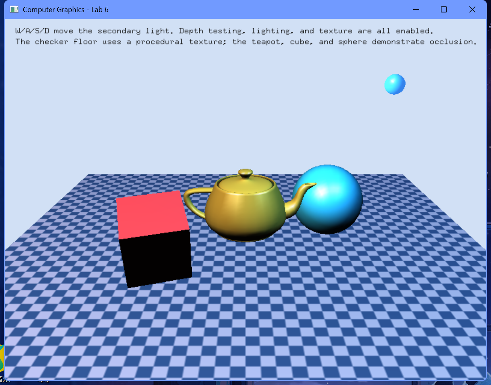

# 实验6 真实感图形的绘制

## 一、实验要求：
1、实验目的：
理解消隐的概念、原理；掌握几种常用的消隐算法的思想；能够编程实现经典的面消隐算法，如Z-buffer算法、画家算法等，以加深对消隐算法的理解和掌握；理解计算机图形学中有关着色、光照、材质、纹理处理的编程原理；加深学生对几何变换、投影变换以及观察变换的理解，并提高学生利用图形软件包绘制图形的能力；能够综合运用本课程所学的有关知识，编写具有一定真实感效果的三维物体程序。

2、实验要求：
1. 理解OpenGL中消隐的实现。
2. 理解深度缓存和帧缓存的作用。
3. 利用Z-buffer算法或画家算法，画出一个消隐的立体图形。
4. 理解光源的设置、光照函数的含义。
5. 理解纹理映射的实现。

## 二、实验内容及步骤：
### 实验内容：
1、运行相关程序，理解OpenGL中物体遮挡关系的实现。适当修改程序，添加若干三维物体，体会其遮挡关系。
2、完成头歌实训平台实验内容：CG7-v2.0-实体消隐。
3、运行相关程序，理解光源的设置、光照函数的含义以及参数的含义。添加一个其他颜色的光源，使用"w、s、a、d"键控制光源的移动，体会多光源的效果。
4、完成头歌实训平台实验内容：CG5-v1.0-简单光照效果。
5、完成头歌实训平台实验内容：CG6-v1.0-纹理映射。
6、使用图案纹理映射，使用图片纹理绘制不同花纹的茶壶（选做）。

### 1、实验思路和实验步骤（重点）：
#### 实验思路：
要使三维模型呈现真实感，遮挡关系、明暗光影、质感纹理缺一不可。
- **面消隐处理**：使用 Z-buffer 消隐技术。在初始化时使能 `GL_DEPTH_TEST`，并在每帧渲染清除时使用 `GL_DEPTH_BUFFER_BIT` 清空深度缓冲，从而保证空间位置靠前的物体正确遮挡靠后的物体。
- **程序化棋盘格纹理 (纹理映射)**：本实验在内存中直接分配一个 64×64 的二维像素数组，通过行与列索引的奇偶判断，间隔填入浅蓝色与深蓝色，生成一个棋盘格图样。接着利用 `glTexImage2D` 将数据上传至 GPU，并在地面矩形的四个顶点上，为 `glTexCoord2f` 指定大于 1.0 的纹理重复坐标，实现地面的棋盘格子平铺效果。
- **双光源与互动光照**：场景配置两盏灯：
  - `GL_LIGHT0` (主光源)：固定于左侧上方的暖白色平行光，保证全局基本照亮。
  - `GL_LIGHT1` (次光源)：由键盘按键 `W/A/S/D` 控制其 X 轴和 Z 轴坐标的蓝色点光源。
  为了便于直观寻找其位置，直接在次光源坐标处渲染了一个发出微蓝色荧光的小球体，做为光源标记。
- **不同材质配置**：中间的茶壶设定为金色高反光材质，左侧立方体设定为红色中反光材质，右侧球体设定为亮蓝色微反光材质。在双光源照耀下，能看到红蓝两色高光在茶壶上的重叠混合。

#### 算法步骤（注意：不是代码，是算法流程）：
1. **程序化棋盘格纹理生成算法 (generateCheckerTexture)**：
   - 设定纹理尺寸 Size = 64。
   - 双重循环 y 从 0 到 63，x 从 0 到 63：
     - 计算当前的单元格行列判定值：cell = (x / 8) + (y / 8)。
     - 若 cell \% 2 == 0，则赋予像素深蓝色 `{60, 95, 160}`；若为奇数，则赋予浅蓝色 `{220, 210, 255}`。
   - 调用 `glGenTextures(1, &g_checkerTexture)` 生成纹理 ID 并绑定。
   - 设置纹理过滤模式为线性过滤 `GL_LINEAR`，设置纹理环绕方式为重复 `GL_REPEAT`。
   - 上传图像：`glTexImage2D(GL_TEXTURE_2D, 0, GL_RGB, Size, Size, 0, GL_RGB, GL_UNSIGNED_BYTE, pixels)`。
2. **消隐开启与配置**：
   - 在 `init` 函数中调用 `glEnable(GL_DEPTH_TEST)`。
   - 在 `display` 中首先调用 `glClear(GL_COLOR_BUFFER_BIT | GL_DEPTH_BUFFER_BIT)`，在帧重绘前重置颜色和深度缓存，确保 Z-buffer 正常。
3. **光照实时更新与移动控制**：
   - 定义 `updateLights` 函数：
     - 将 `GL_LIGHT0` 位置设为固定 `(-2.2f, 3.4f, 2.8f, 1.0f)`。
     - 将 `GL_LIGHT1` 位置实时绑定到点光源位置数组 `g_secondaryLightPosition = {x, 1.8f, z, 1.0f}`。
     - 分别设置两盏灯的 Diffuse 和 Specular 属性并使能它们。
   - 在 `keyboard` 回调中捕获按键：
     - `w` / `W`：次光源沿 Z 轴负向平移 `g_secondaryLightPosition[2] -= 0.2f`。
     - `s` / `S`：次光源沿 Z 轴正向平移 `g_secondaryLightPosition[2] += 0.2f`。
     - `a` / `A`：次光源沿 X 轴负向平移 `g_secondaryLightPosition[0] -= 0.2f`。
     - `d` / `D`：次光源沿 X 轴正向平移 `g_secondaryLightPosition[0] += 0.2f`。
4. **纹理地面的渲染**：
   - `glEnable(GL_TEXTURE_2D)` 开启二维纹理。
   - 绑定棋盘格纹理：`glBindTexture(GL_TEXTURE_2D, g_checkerTexture)`。
   - 开启四边形渲染 `glBegin(GL_QUADS)` 并计算法线 `glNormal3f(0, 1, 0)`。
   - 设置纹理重复度：为 4 个角顶点分别绑定纹理坐标 (0,0), (6,0), (6,6), (0,6)，并传入地面的 3D 边界坐标。
   - `glEnd()` 绘制完毕后 `glDisable(GL_TEXTURE_2D)`。

### 2、实验数据记录：
- **观察视口配置**：
  - 相机坐标：`(0.0, 2.4, 6.6)`，观察看点 `(0.0, -0.15, 0.0)`，向上向量：`(0.0, 1.0, 0.0)`。
- **材质漫反射数据**：
  - 地面（纹理底色）：`{0.9f, 0.9f, 0.9f, 1.0f}`，光泽度 10.0。
  - 金黄色茶壶（中心）：环境光 `{0.1f, 0.08f, 0.04f}`，漫反射 `{0.85f, 0.66f, 0.22f}`，高光 `{1.0f, 0.95f, 0.82f}`，尺寸为 `0.65`，光泽度 `68.0f`。
  - 红色立方体（左侧）：环境光 `{0.08f, 0.02f, 0.02f}`，漫反射 `{0.92f, 0.25f, 0.28f}`，高光 `{0.85f, 0.82f, 0.82f}`，尺寸为 `0.9f`，光泽度 `30.0f`。
  - 蓝色球体（右侧）：环境光 `{0.03f, 0.08f, 0.12f}`，漫反射 `{0.2f, 0.78f, 0.96f}`，高光 `{0.92f, 0.98f, 1.0f}`，半径为 `0.62`，细分度 `32, 32`，光泽度 `50.0f`。
- **移动点光源 (GL_LIGHT1) 基础参数**：
  - 初始位置：`(1.8f, 1.8f, 1.2f)`。
  - 光源色彩：蓝色 Diffuse `{0.38f, 0.72f, 1.0f}`，高光 Specular `{0.5f, 0.82f, 1.0f}`。
  - 发光标记小球尺寸：半径 `0.12`，发射光材质设置：`GL_EMISSION` 设为 `{0.2f, 0.5f, 0.9f, 1.0f}`。

### 3、实验结果与分析：
- 场景中包含棋盘格地板、茶壶、立方体和球体。
- 开启深度测试后，物体的空间前后遮挡关系正确。
- 通过键盘“W/A/S/D”键可以移动蓝色点光源的位置，改变光照和高光在物体表面的分布，投射出的阴影效果表现自然。

#### 运行结果截图：

## 三、心得体会：
1. **深度测试的作用**：深度测试（`Z-buffer`）是解决三维遮挡消除的基石。在没有开启深度测试时，后绘制 的 物体会强行覆盖先绘制的物体。开启深度测试后，GPU 会比较每个像素的深度值，仅保留距离视点最近的像素，从而得到正确的遮挡关系。
2. **纹理映射基本方法**：本实验为了在地板上绘制棋盘格，手动生成了离散的黑白相间像素数据作为纹理，配合 `GL_REPEAT` 包装模式，成功映射出铺满地面的格状纹理。
3. **多光源配置与高光反射**：通过配置双光源（主光源加发光小球点光源）以及材质的高光反射参数，使茶壶和球体的金属质感更加真实。移动点光源时物体表面高光点的偏移，提升了场景的动态感。
