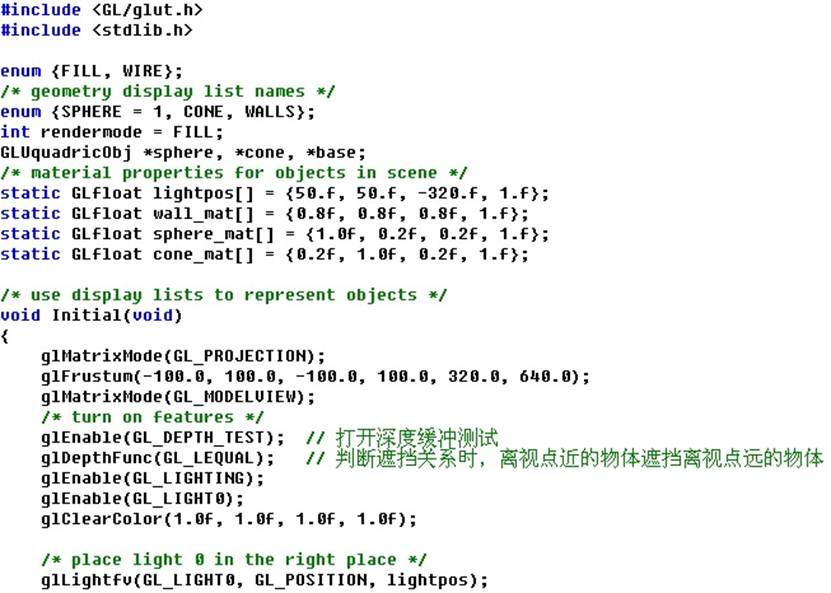
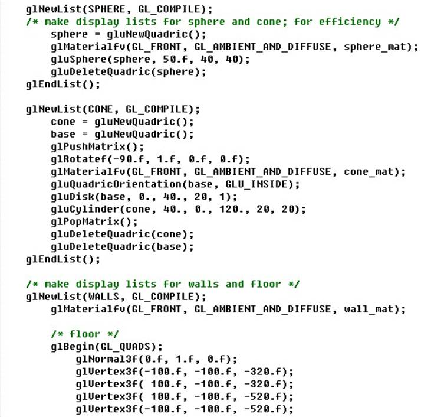
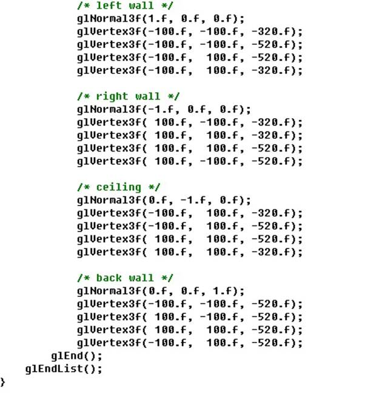
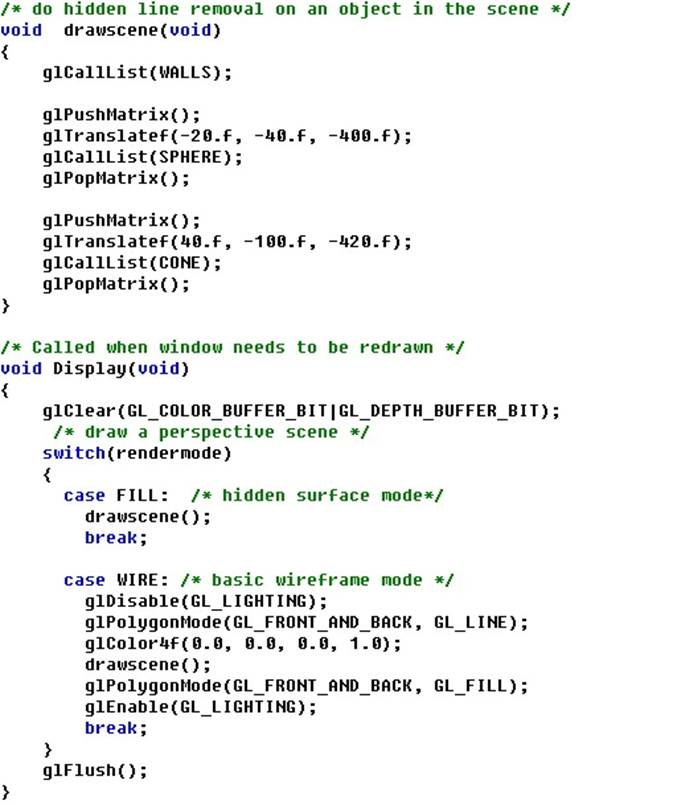
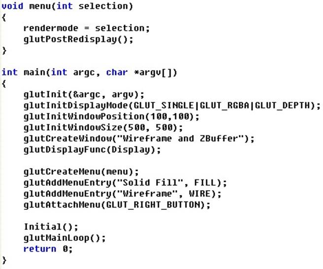
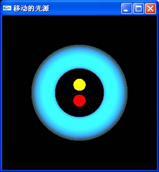
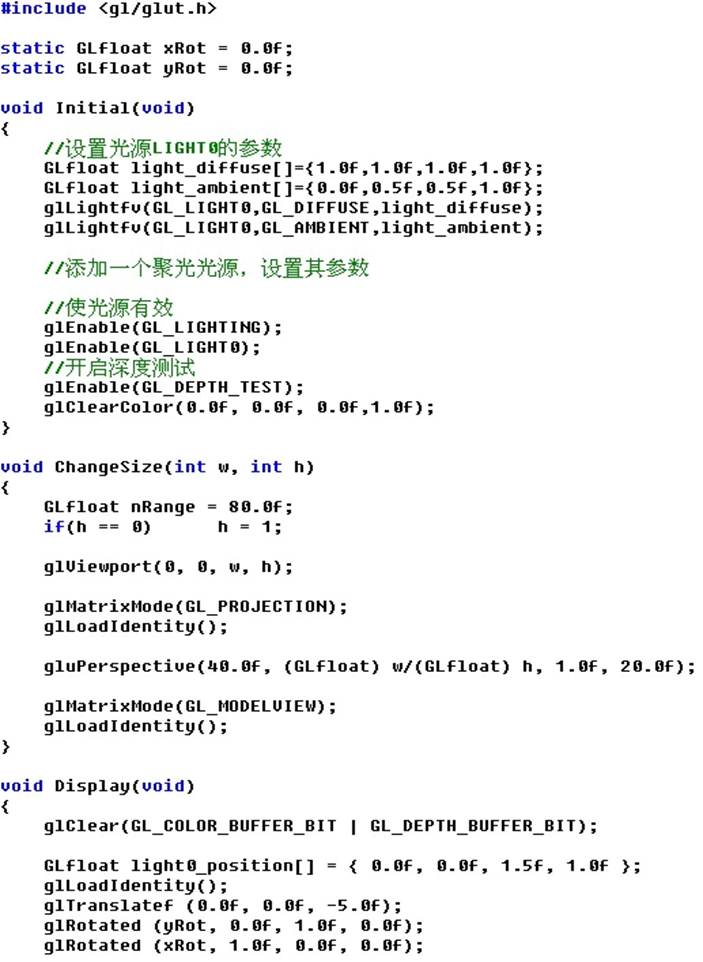
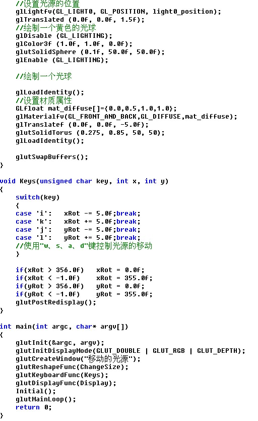
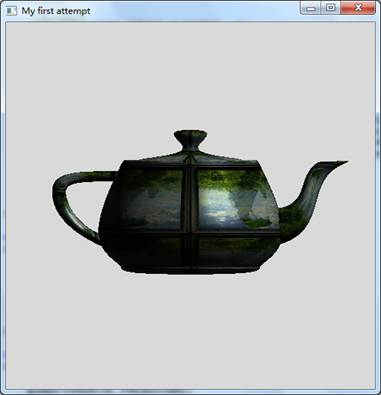

# 实验6 真实感图形的绘制

## 一、实验目的

理解消隐的概念、原理；掌握几种常用的消隐算法的思想；能够编程实现经典的面消隐算法，如Z-buffer算法、画家算法等，以加深对消隐算法的理解和掌握；理解计算机图形学中有关着色、光照、材质、纹理处理的编程原理；加深学生对几何变换、投影变换以及观察变换的理解，并提高学生利用图形软件包绘制图形的能力；能够综合运用本课程所学的有关知识，编写具有一定真实感效果的三维物体程序。

## 二、实验要求

1. 理解OpenGL中消隐的实现。

2. 理解深度缓存和帧缓存的作用。

3. 利用Z-buffer算法或画家算法，画出一个消隐的立体图形。

4. 理解光源的设置、光照函数的含义。

5. 理解纹理映射的实现。

## 三、实验学时

8学时

## 四、实验程序框架

1、运行下列程序，理解OpenGL中物体遮挡关系的实现。适当修改下列程序，添加若干三维物体，体会其遮挡关系。

程序框架：







2、完成头歌实训平台实验内容：CG7-v2.0-实体消隐。

3、运行下列程序，理解光源的设置、光照函数的含义以及参数的含义。添加一个其他颜色的光源，使用“w、s、a、d”键控制光源的移动，体会多光源的效果，如图1所示。  


图1 多光源效果

程序框架：



4、完成头歌实训平台实验内容：CG5-v1.0-简单光照效果。

5、完成头歌实训平台实验内容：CG6-v1.0-纹理映射。

6、使用图案纹理映射，使用图片纹理绘制不同花纹的茶壶，如图2所示（选做）。



图2 带有图案的茶壶

程序框架：

```cpp
#include <stdio.h>
#include <windows.h>
#include <GL/glut.h>
//读纹理函数：
#define BITMAP_ID 0x4D42
#define TEX_NUM 4
GLuint Texture[TEX_NUM];
char *TextureName[] = {
	"d:\Textures\teapot1.bmp",
	"d:\Textures\teapot2.bmp",
	"d:\Textures\teapot3.bmp",
	"d:\Textures\teapot4.bmp",
};

// 读纹理函数
// 纹理标示符数组，保存两个纹理的标示符
// 描述: 通过指针，返回filename 指定的bitmap文件中数据。
// 同时也返回bitmap信息头.（不支持-bit位图）
unsigned char *LoadBitmapFile(char *filename, BITMAPINFOHEADER *bitmapInfoHeader)
{
	FILE *filePtr;	// 文件指针
	BITMAPFILEHEADER bitmapFileHeader;	// bitmap文件头
	unsigned char	*bitmapImage;		// bitmap图像数据
	unsigned int	imageIdx = 0;		// 图像位置索引
	unsigned char tempRGB;	// 交换变量

	// 以“二进制+读”模式打开文件filename
	filePtr = fopen(filename, "rb");
	if (filePtr == NULL) return NULL;
	// 读入bitmap文件图
	fread(&bitmapFileHeader, sizeof(BITMAPFILEHEADER), 1, filePtr);
	// 验证是否为bitmap文件
	if (bitmapFileHeader.bfType != BITMAP_ID) {
		fprintf(stderr, "Error in LoadBitmapFile: the file is not a bitmap file
");
		return NULL;
	}

	// 读入bitmap信息头
	fread(bitmapInfoHeader, sizeof(BITMAPINFOHEADER), 1, filePtr);
	// 将文件指针移至bitmap数据
	fseek(filePtr, bitmapFileHeader.bfOffBits, SEEK_SET);
	// 为装载图像数据创建足够的内存
	bitmapImage = new unsigned char[bitmapInfoHeader->biSizeImage];
	// 验证内存是否创建成功
	if (!bitmapImage) {
		fprintf(stderr, "Error in LoadBitmapFile: memory error
");
		return NULL;
	}

	// 读入bitmap图像数据
	fread(bitmapImage, 1, bitmapInfoHeader->biSizeImage, filePtr);
	// 确认读入成功
	if (bitmapImage == NULL) {
		fprintf(stderr, "Error in LoadBitmapFile: memory error
");
		return NULL;
	}

	//由于bitmap中保存的格式是BGR，下面交换R和B的值，得到RGB格式
	for (imageIdx = 0; imageIdx < (bitmapInfoHeader->biSizeImage); imageIdx += 3) {
		tempRGB = bitmapImage[imageIdx];
		bitmapImage[imageIdx] = bitmapImage[imageIdx + 2];
		bitmapImage[imageIdx + 2] = tempRGB;
	}
	// 关闭bitmap图像文件
	fclose(filePtr);
	return bitmapImage;
}

//加载纹理的函数：
void texload(int i, char *filename)
{

	BITMAPINFOHEADER bitmapInfoHeader;                                 // bitmap信息头
	unsigned char*   bitmapData;                                       // 纹理数据

	bitmapData = LoadBitmapFile(filename, &bitmapInfoHeader);
	glBindTexture(GL_TEXTURE_2D, Texture[i]);
	// 指定当前纹理的放大/缩小过滤方式
	glTexParameteri(GL_TEXTURE_2D, GL_TEXTURE_MAG_FILTER, GL_NEAREST);
	glTexParameteri(GL_TEXTURE_2D, GL_TEXTURE_MIN_FILTER, GL_NEAREST);

	glTexImage2D(GL_TEXTURE_2D,
		0, 	    //mipmap层次(通常为，表示最上层) 
		GL_RGB,	//我们希望该纹理有红、绿、蓝数据
		bitmapInfoHeader.biWidth, //纹理宽带，必须是n，若有边框+2 
		bitmapInfoHeader.biHeight, //纹理高度，必须是n，若有边框+2 
		0, //边框(0=无边框, 1=有边框) 
		GL_RGB,	//bitmap数据的格式
		GL_UNSIGNED_BYTE, //每个颜色数据的类型
		bitmapData);	//bitmap数据指针
}

GLint GenTeapotList()
{

	GLint lid = glGenLists(1);
	glNewList(lid, GL_COMPILE);

	GLfloat mat_ambient[] = { 1.0, 1.0, 1.0, 1.0 };
	GLfloat mat_diffuse[] = { 0.55, 0.55, 0.55, 1.0 };
	GLfloat mat_specular[] = { 1.0, 1.0, 1.0, 1.0 };
	GLfloat mat_shininess[] = { 90.0 };
	glColorMaterial(GL_FRONT, GL_AMBIENT_AND_DIFFUSE);
	glMaterialfv(GL_FRONT, GL_DIFFUSE, mat_diffuse);
	glMaterialfv(GL_FRONT, GL_SPECULAR, mat_specular);
	glMaterialfv(GL_FRONT, GL_SHININESS, mat_shininess);

	glutSolidTeapot(0.5);
	glEndList();
	return lid;
}

//定义纹理的函数：
void init(void) //
{
	glEnable(GL_DEPTH_TEST);//打开深度测试

	//定义光源
	GLfloat position1[] = { 1.0, 1.0, 1.0, 0.0 };
	glLightfv(GL_LIGHT0, GL_POSITION, position1);
	glEnable(GL_LIGHTING);
	glEnable(GL_LIGHT0);

	//定义纹理
	glPixelStorei(GL_UNPACK_ALIGNMENT, 1);
	glGenTextures(TEX_NUM, Texture);
	for (int i = 0; i < TEX_NUM; i++) {
		texload(i, TextureName[i]);
		glBindTexture(GL_TEXTURE_2D, Texture[i]);

		//设置像素存储模式控制所读取的图像数据的行对齐方式.
		glPixelStorei(GL_UNPACK_ALIGNMENT, 1); 
		glTexParameteri(GL_TEXTURE_2D, GL_TEXTURE_MAG_FILTER, GL_LINEAR);
		glTexParameteri(GL_TEXTURE_2D, GL_TEXTURE_MIN_FILTER, GL_LINEAR);
		glTexParameteri(GL_TEXTURE_2D, GL_TEXTURE_WRAP_S, GL_REPEAT);
		glTexParameteri(GL_TEXTURE_2D, GL_TEXTURE_WRAP_T, GL_REPEAT);
	}

	glDisable(GL_TEXTURE_2D);

}

void display(void)
{
	glClearColor(0.85f, 0.85f, 0.85f, 1.0f);
	glClear(GL_COLOR_BUFFER_BIT | GL_DEPTH_BUFFER_BIT);
	glEnable(GL_TEXTURE_2D);
	glBindTexture(GL_TEXTURE_2D, Texture[3]); //选择纹理图案
	glCallList(GenTeapotList());
	glFlush();
}

void reshape(GLsizei w, GLsizei h)
{
	glViewport(0, 0, w, h);
	glMatrixMode(GL_PROJECTION);
	glLoadIdentity();
	glOrtho(-1.0, 1.0, -1.0, 1.0, -1.0, 1.0);
	glMatrixMode(GL_MODELVIEW);
}

int main(int argc, char** argv)
{
	glutInit(&argc, argv);										//初始化工具包
	glutInitDisplayMode(GLUT_SINGLE | GLUT_RGB | GLUT_DEPTH);	//设置显示模式
	glutInitWindowPosition(0, 0);								//设置窗口在屏幕上的位置
	glutInitWindowSize(500, 500);								//设置窗口的大小
	glutCreateWindow("My first attempt");						//打开屏幕窗口


	glutReshapeFunc(reshape);
	glutDisplayFunc(display); //调用绘图函数
	init();				//必要的其他初始化函数
	glutMainLoop();		//进入循环

	return 0;
}
```