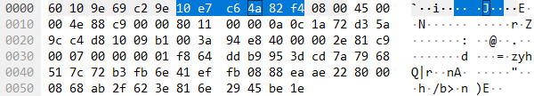
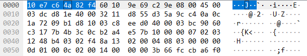
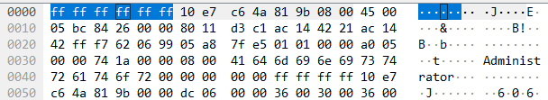
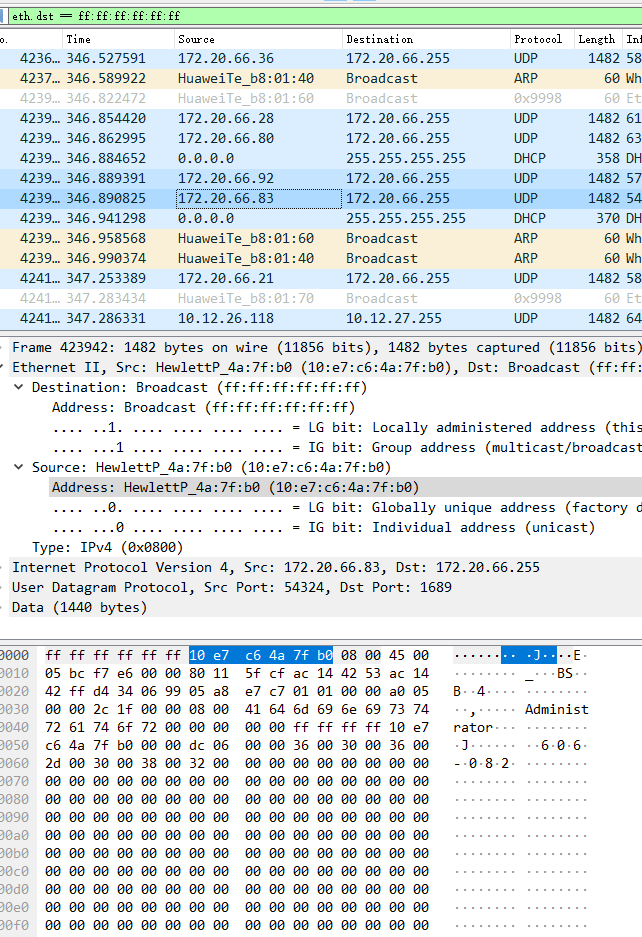

# 实验2：分析MAC帧格式

## 实验报告信息

| 字段 | 内容 |
|------|------|
| 课程 | 计算机网络 |
| 实验地点 | 计算机大楼606 |
| 实验时间 | 2025年10月29日第9-10节 |
| 座位号 | 第10组5号 |
| 实验题目 | 实验2 分析MAC帧格式 |

## 实验目的

1. 了解MAC帧首部的格式
2. 理解MAC帧固定部分的各字段含义
3. 根据MAC帧的内容确定MAC地址类型
4. 初步掌握利用工具软件进行协议分析和网络运行状态监测的方法

## 实验环境

- 联网主机
- Winpcap、Wireshark等工具软件

## 实验步骤

> 打开wireshark，选择以太网2，然后点击左上角的鱼鳍即可进行抓包

## 实验数据记录

### 1、协议分析软件信息

**软件名称**：Wireshark
**版本号**：V 3.6.3 (v 3.6.3-0-g6d)

### 2、本机MAC地址

```
10-E7-C6-4A-82-F4
```

### 3、捕获的MAC帧

#### （1）从本机发出的数据帧



| 字段 | 字节数 | 内容 |
|------|--------|------|
| 目的地址 | 6 | 60 10 9e 69 c2 9e |
| 源地址 | 6 | 10 e7 c6 4a 82 f4 |
| 类型 | 2 | 08 00 |
| 剩下的字节 | 46-1500 | 数据，不够就补到46 |

#### （2）发送给本机的数据帧



| 字段 | 字节数 | 内容 |
|------|--------|------|
| 源地址 | 6 | 10 e7 c6 4a 82 f4 |
| 目的地址 | 6 | 60 10 9e 69 c2 9e |
| 类型 | 2 | 08 00 |
| 剩下的字节 | 46-1500 | 数据，不够就补到46 |

#### （3）广播帧



| 字段 | 字节数 | 内容 |
|------|--------|------|
| 目的地址 | 6 | ff ff ff ff ff ff |
| 源地址 | 6 | 10 e7 c6 4a 82 f4 |
| 类型 | 2 | 08 00 |
| 剩下的字节 | 46-1500 | 数据，不够就补到46 |

## 问题讨论

### 1、Wireshark工具软件使用中，如何捕获广播帧？列出你所知道的所有方法。

**方法一**：使用过滤，eth.src或者eth.dst
```
eth.dst == ff:ff:ff:ff:ff:ff
```

**方法二**：使用相关的协议进行过滤，例如ARP，UDP过滤



### 2、所捕获到的MAC帧有FCS吗？如果有，举例列出所捕获一个帧的FCS是多少。如果没有，试分析原因。

**没有**

FCS是MAC帧的最后一个字段（4字节），它由发送方网卡计算并附加到帧的末尾，用于接收方网卡校验数据在传输过程中是否出错。

这个校验过程是在物理硬件层面完成的。当数据帧到达本机的网卡时，网卡硬件会：
1. 读取数据帧，并计算它自己的FCS值
2. 将计算出的FCS与帧末尾附加的FCS进行比较
3. 如果数据无误：网卡会去掉FCS字段，然后将剩余的、干净的数据帧传递给操作系统，Wireshark再从操作系统中获取数据
4. 如果数据损坏：网卡会直接丢弃这个损坏的帧

## 实验心得

抓包的过程中，电脑会很卡，如何解决或者缓解？

最近刚好学了操作系统，因为抓包直接抓的好多数据，而且是实时更新的，所以会一直占用资源，而实验室的旧电脑配置不咋行，因此可以降低wireshark的优先级，或者是在捕获到自己想要的数据之后就直接暂停抓包，在左上角有一个鱼鳍的旁边的红色方块暂停按钮。
