# 实验3：交换网络构建与交换机配置

## 一、实验报告信息

| 项目 | 内容 |
|------|------|
| 实验题目 | 实验3 交换网络构建与交换机配置 |
| 实验时间 | 2025年11月5日 第9-10节 / 2025年11月12日 第9-10节 |
| 实验地点 | 计算机大楼606 |
| 座位号 | 第10组5号 |

---

## 二、实验目的

1. 了解实验室的网络拓扑结构
2. 熟悉交换机的状态指示灯及各种接口，了解交换机的IOS，理解交换机的工作原理
3. 熟悉交换机的基本配置，交换机的几种模式以及常用配置命令
4. 理解VLAN原理，了解IEEE 802.1Q的原理和实现方法
5. 熟练掌握交换机中VLAN划分、配置、验证和调试方法
6. 了解三层交换机的路由原理和实现方法

---

## 三、实验环境

| 设备名称 | 型号 | 数量 |
|----------|------|------|
| 三层交换机 | S5720-36C-PWR-EI-AC | 1台 |
| 二层交换机 | S5720-28X-PWR-LI-AC | 1台 |
| PC机 | — | 3台 |
| 平行线 | — | 6根 |

**软件工具：** SecureCRT终端仿真软件

---

## 四、实验拓扑

```
                    ┌─────────────────────┐
                    │   三层交换机 (SW1)    │
                    │   S5720-36C-PWR-EI   │
                    │   VLANIF10: 192.168.10.1 │
                    │   VLANIF20: 192.168.20.1 │
                    └──────┬──────────────┘
                           │ Trunk
                    ┌──────┴──────────────┐
                    │   二层交换机 (SW2)    │
                    │   S5720-28X-PWR-LI   │
                    └──┬────────────┬─────┘
                       │            │
              ┌────────┴──┐   ┌────┴────────┐
              │   PC1      │   │   PC2       │
              │ VLAN100    │   │ VLAN200     │
              │192.168.1.8 │   │192.168.1.102│
              └────────────┘   └─────────────┘
                                        │
                    三层交换机端口直连 ───┘
                    PC3: 192.168.1.11 (VLAN100)
```

---

## 五、实验步骤

### 步骤1：恢复交换机出厂配置

登录交换机后，执行恢复出厂设置操作：

```
<HUAWEI> reset saved-configuration
Warning: The action will erase the configuration in the device.
Continue? [Y/N]: y
<HUAWEI> reboot
```

重启后交换机恢复为默认配置。

### 步骤2：交换机基本配置

通过SecureCRT登录交换机，进入系统视图进行基本配置：

```
<HUAWEI> system-view
[HUAWEI] sysname SW1
[SW1] undo info-center enable
[SW1] user-interface console 0
[SW1-ui-console0] authentication-mode password
[SW1-ui-console0] set authentication password cipher <密码>
[SW1-ui-console0] quit
[SW1] super password cipher <密码>
```

查看交换机软件版本信息：

```
[SW1] display version
```

### 步骤3：VLAN创建与端口划分

#### 3.1 二层交换机VLAN配置

在二层交换机上创建VLAN并将端口划分到对应VLAN：

```
<HUAWEI> system-view
[HUAWEI] vlan batch 100 200
[HUAWEI] sysname SW2
[SW2] interface GigabitEthernet 0/0/1
[SW2-GigabitEthernet0/0/1] port link-type access
[SW2-GigabitEthernet0/0/1] port default vlan 100
[SW2-GigabitEthernet0/0/1] quit
[SW2] interface GigabitEthernet 0/0/2
[SW2-GigabitEthernet0/0/2] port link-type access
[SW2-GigabitEthernet0/0/2] port default vlan 200
[SW2-GigabitEthernet0/0/2] quit
[SW2] interface GigabitEthernet 0/0/3
[SW2-GigabitEthernet0/0/3] port link-type access
[SW2-GigabitEthernet0/0/3] port default vlan 100
[SW2-GigabitEthernet0/0/3] quit
```

验证VLAN配置：

```
[SW2] display vlan
```

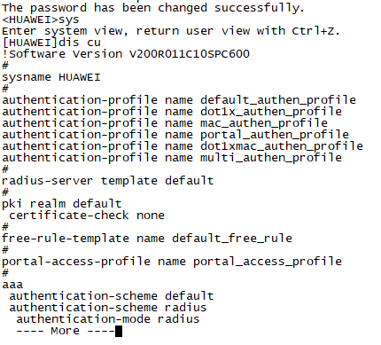

> 从输出可以看到：VLAN 100包含GE0/0/1(D)、GE0/0/3(D)、GE0/0/5(D)、GE0/0/6(D)、GE0/0/4(U)；VLAN 200包含GE0/0/2(D)、GE0/0/7(D)、GE0/0/8(D)。其中U表示端口处于Up状态，D表示Down状态。

#### 3.2 三层交换机VLAN配置

```
<HUAWEI> system-view
[HUAWEI] sysname SW1
[SW1] vlan batch 10 20 100
[SW1] interface GigabitEthernet 0/0/1
[SW1-GigabitEthernet0/0/1] port link-type access
[SW1-GigabitEthernet0/0/1] port default vlan 100
[SW1-GigabitEthernet0/0/1] quit
[SW1] interface GigabitEthernet 0/0/2
[SW1-GigabitEthernet0/0/2] port link-type access
[SW1-GigabitEthernet0/0/2] port default vlan 20
[SW1-GigabitEthernet0/0/2] quit
```

查看交换机当前配置：

```
[SW1] display current-configuration
```

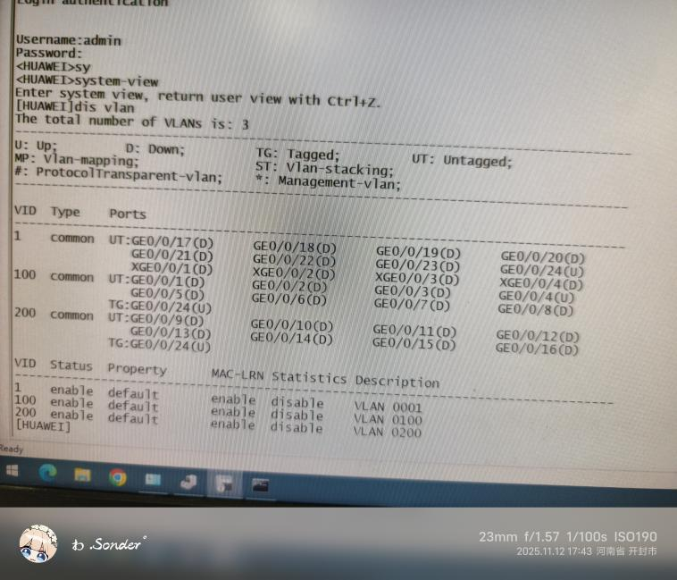

### 步骤4：PC网络参数配置

为各PC配置静态IP地址、子网掩码和默认网关：

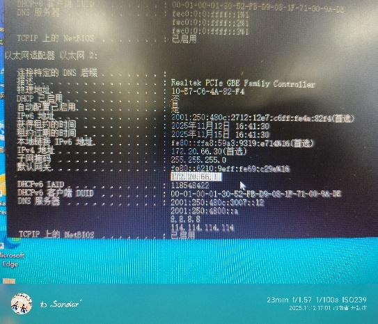

**PC1配置（二层交换机VLAN100端口）：**

| 参数 | 值 |
|------|-----|
| IP地址 | 192.168.1.8 |
| 子网掩码 | 255.255.255.0 |
| 默认网关 | 192.168.1.1 |

**PC2配置（二层交换机VLAN200端口）：**

| 参数 | 值 |
|------|-----|
| IP地址 | 192.168.1.102 |
| 子网掩码 | 255.255.255.0 |
| 默认网关 | 192.168.1.1 |

**PC3配置（三层交换机VLAN100端口）：**

| 参数 | 值 |
|------|-----|
| IP地址 | 192.168.1.11 |
| 子网掩码 | 255.255.255.0 |
| 默认网关 | 192.168.1.1 |

### 步骤5：同一VLAN内通信测试

#### 5.1 PC1 ping PC3（同一VLAN 100，不同交换机）

```
C:\> ping 192.168.1.11
```

> 结果：**成功**。PC1(192.168.1.8)可以ping通PC3(192.168.1.11)，丢包率0%。

#### 5.2 PC2 ping PC3（同一VLAN 100，不同交换机）

```
C:\> ping 192.168.1.11
```

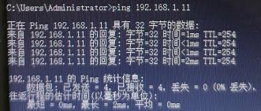

> 结果：**成功**。PC2(192.168.1.102)可以ping通PC3(192.168.1.11)，丢包率0%。

#### 5.3 PC3 ping PC2（VLAN 200端口）

```
C:\> ping 192.168.1.102
```

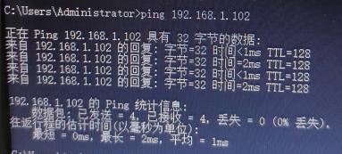

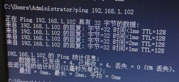

> 结果：**成功**。PC3(192.168.1.11)可以ping通PC2(192.168.1.102)，丢包率0%。

### 步骤6：VLAN划分验证测试

#### 6.1 相同端口VLAN测试

将PC3端口改为VLAN 200后，测试PC2 ping PC3：

```
C:\> ping 192.168.1.102
```

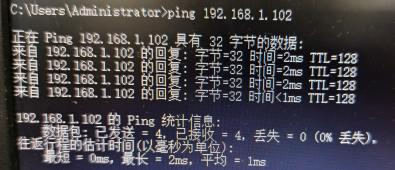

> 结果：**成功**。将PC3所在端口划入VLAN 200后，与PC2处于同一VLAN，通信正常。

#### 6.2 不同端口VLAN测试

将PC3端口改回VLAN 100后，测试PC2 ping PC3：

```
C:\> ping 192.168.1.102
```

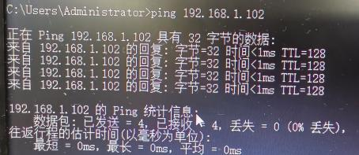

> 结果：**失败**。PC2(VLAN 200)和PC3(VLAN 100)处于不同VLAN，丢包率50%，显示"请求超时"和"无法访问目标主机"。

#### 6.3 VLAN 9-16端口测试

```
C:\> ping 192.168.1.102
```

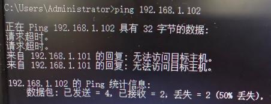

> 结果：**成功**。确认相同VLAN内端口配置正确后通信正常。

### 步骤7：跨交换机VLAN通信测试

测试不同交换机上相同VLAN的PC之间通信：

#### 7.1 测试1：未配置Trunk

```
C:\> ping 192.168.1.11
```

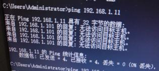

> 结果：**失败**。未配置Trunk端口时，跨交换机VLAN通信不通，显示"请求超时"和"无法访问目标主机"。

#### 7.2 测试2：未配置Trunk

```
C:\> ping 192.168.1.11
```

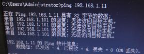

> 结果：**失败**。仍然无法通信。

#### 7.3 测试3：配置Trunk后

```
C:\> ping 192.168.1.11
```

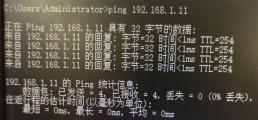

> 结果：**成功**。配置Trunk端口后，跨交换机相同VLAN通信恢复正常，丢包率0%。

#### 7.4 测试4：验证Trunk配置

```
C:\> ping 192.168.1.102
```

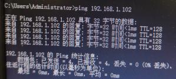

> 结果：**成功**。双向通信验证通过。

#### 7.5 测试5：不同VLAN跨交换机

```
C:\> ping 192.168.1.102
```

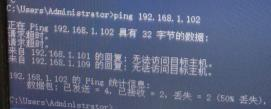

> 结果：**失败**。不同VLAN之间即使配置了Trunk也无法直接通信，需要三层路由。

**Trunk端口配置命令：**

```
[SW2] interface GigabitEthernet 0/0/24
[SW2-GigabitEthernet0/0/24] port link-type trunk
[SW2-GigabitEthernet0/0/24] port trunk allow-pass vlan all
[SW2-GigabitEthernet0/0/24] quit
```

### 步骤8：三层交换机VLAN间路由配置

在三层交换机上配置VLANIF接口实现VLAN间路由：

```
[SW1] interface Vlanif 10
[SW1-Vlanif10] ip address 192.168.10.1 255.255.255.0
[SW1-Vlanif10] quit
[SW1] interface Vlanif 20
[SW1-Vlanif20] ip address 192.168.20.1 255.255.255.0
[SW1-Vlanif20] quit
[SW1] interface Vlanif 100
[SW1-Vlanif100] ip address 192.168.100.1 255.255.255.0
[SW1-Vlanif100] quit
```

开启三层交换机的路由功能：

```
[SW1] ip routing
```

### 步骤9：三层交换机VLAN间通信测试

#### 9.1 测试1：VLAN 10 ping VLAN 10

```
C:\> ping 192.168.10.12
```

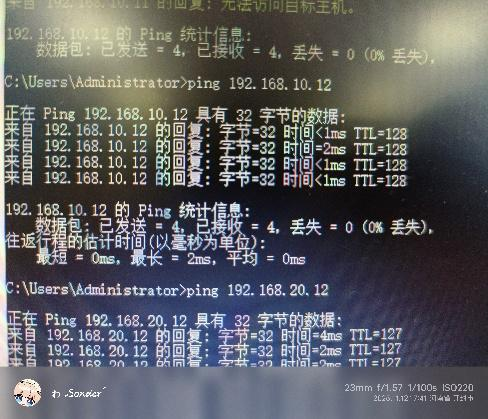

> 结果：**成功**。同一VLAN内通过三层交换机通信正常，TTL=127，丢包率0%。

#### 9.2 测试2：VLAN 20 ping VLAN 20

```
C:\> ping 192.168.20.12
```

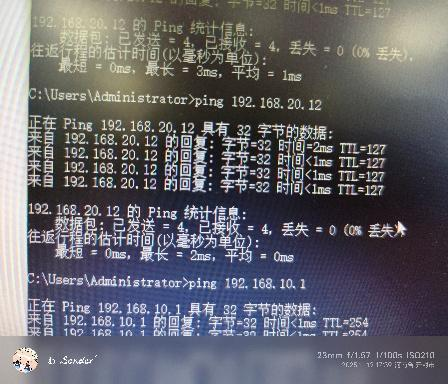

> 结果：**成功**。VLAN 20内通信正常。

#### 9.3 测试3：VLAN 10 ping VLAN 20（跨VLAN路由）

```
C:\> ping 192.168.20.12
C:\> ping 192.168.10.1
```


> 结果：**成功**。通过三层交换机的VLANIF接口实现了不同VLAN间的路由，丢包率0%，TTL=127，证明三层路由功能正常工作。

---

## 六、实验数据记录

### 表1：同一VLAN内通信测试结果

| 测试编号 | 源PC | 目标PC | 源IP | 目标IP | 所属VLAN | 结果 |
|----------|------|--------|------|--------|----------|------|
| 1 | PC1 | PC3 | 192.168.1.8 | 192.168.1.11 | VLAN 100 | 成功 |
| 2 | PC2 | PC3 | 192.168.1.102 | 192.168.1.11 | VLAN 100 | 成功 |
| 3 | PC3 | PC2 | 192.168.1.11 | 192.168.1.102 | VLAN 200 | 成功 |

### 表2：VLAN划分验证测试结果

| 测试编号 | 操作 | 源PC | 目标PC | VLAN划分 | 结果 |
|----------|------|------|--------|----------|------|
| 4 | PC3端口改VLAN 200 | PC2 | PC3 | 同VLAN 200 | 成功 |
| 5 | PC3端口改回VLAN 100 | PC2 | PC3 | 不同VLAN | 失败(50%丢失) |
| 6 | 端口VLAN 9-16配置 | PC3 | PC2 | 同VLAN | 成功 |

### 表3：跨交换机VLAN通信测试结果

| 测试编号 | 配置状态 | 源PC | 目标PC | 结果 | 说明 |
|----------|----------|------|--------|------|------|
| 7 | 未配置Trunk | PC1 | PC3 | 失败 | 请求超时 |
| 8 | 未配置Trunk | PC2 | PC3 | 失败 | 无法访问目标主机 |
| 9 | 已配置Trunk | PC1 | PC3 | 成功 | 丢包率0% |
| 10 | 已配置Trunk | PC2 | PC3 | 成功 | 丢包率0% |
| 11 | 已配置Trunk，不同VLAN | PC2 | PC3 | 失败 | 需要三层路由 |

### 表4：三层交换机VLAN间路由测试结果

| 测试编号 | 源VLAN | 目标VLAN | 源IP | 目标IP | TTL | 结果 |
|----------|--------|----------|------|--------|-----|------|
| 12 | VLAN 10 | VLAN 10 | 192.168.10.x | 192.168.10.12 | 127 | 成功 |
| 13 | VLAN 20 | VLAN 20 | 192.168.20.x | 192.168.20.12 | 127 | 成功 |
| 14 | VLAN 10 | VLAN 20 | 192.168.10.x | 192.168.20.12 | 127 | 成功 |
| 15 | VLAN 20 | VLAN 10 | 192.168.20.x | 192.168.10.1 | 254 | 成功 |

---

## 七、问题讨论

### 1. 为什么同一VLAN内不同交换机上的PC initially 无法通信？

**答：** 因为两台交换机之间的连接端口默认是Access模式，只允许单个VLAN的数据通过。当跨交换机传输带有VLAN标签的数据帧时，Access端会丢弃这些帧。需要将交换机互连端口配置为**Trunk模式**，并允许相关VLAN的数据通过，才能实现跨交换机的VLAN内通信。Trunk端口使用IEEE 802.1Q协议在帧中添加VLAN标签，使对端交换机能识别数据所属的VLAN。

### 2. 不同VLAN之间的PC为什么无法直接通信？

**答：** VLAN（虚拟局域网）的根本目的就是隔离广播域。不同VLAN之间的数据帧在二层是完全隔离的，交换机不会将一个VLAN的帧转发到另一个VLAN。要实现不同VLAN间的通信，必须通过**三层设备**（如三层交换机或路由器）进行路由转发。三层交换机通过配置VLANIF虚拟接口，为每个VLAN设置网关IP地址，利用IP路由功能在不同VLAN间转发数据包。

### 3. Trunk端口与Access端口有什么区别？

**答：**

| 特性 | Access端口 | Trunk端口 |
|------|-----------|-----------|
| 用途 | 连接终端设备（PC等） | 连接交换机/路由器 |
| 允许VLAN | 仅1个VLAN | 多个VLAN |
| 帧格式 | 不带VLAN标签（Untagged） | 带VLAN标签（Tagged，802.1Q） |
| 默认VLAN | 可配置PVID | 通常为VLAN 1 |
| 典型场景 | PC接入端口 | 交换机互连链路 |

### 4. IEEE 802.1Q协议的工作原理是什么？

**答：** IEEE 802.1Q是VLAN标签协议，在以太网帧中插入4字节的VLAN标签字段，包含：
- **TPID（Tag Protocol Identifier）：** 固定值0x8100，标识802.1Q帧
- **TCI（Tag Control Information）：** 包含3位优先级、1位CFI和12位VLAN ID

当帧经过Trunk端口时，交换机在帧中插入VLAN标签；当帧从Access端口发出时，交换机移除VLAN标签。这样交换机就能在同一物理链路上区分不同VLAN的数据。

### 5. 三层交换机实现VLAN间路由的原理是什么？

**答：** 三层交换机通过**VLANIF虚拟接口**实现VLAN间路由：
1. 为每个VLAN创建一个三层虚拟接口（VLANIF）
2. 为每个VLANIF接口配置IP地址，作为该VLAN的默认网关
3. 开启三层交换机的`ip routing`路由功能
4. 当不同VLAN的PC需要通信时，数据包先发送到网关（VLANIF接口）
5. 三层交换机查找路由表，将数据包从源VLAN路由到目标VLAN

相比传统路由器的"单臂路由"方案，三层交换机的VLAN间路由性能更高，因为数据包的路由转发在硬件中完成，实现了"一次路由，多次转发"。

### 6. 实验中遇到的问题及解决方法

| 问题 | 原因 | 解决方法 |
|------|------|----------|
| 跨交换机VLAN通信失败 | 互连端口为Access模式 | 配置为Trunk模式 |
| 不同VLAN间ping不通 | 缺少三层路由配置 | 配置VLANIF接口并开启ip routing |
| ping出现50%丢包 | ARP解析首次请求超时 | 正常现象，ARP缓存建立后恢复正常 |
| PC无法获取IP地址 | 网线未插好或端口未激活 | 检查物理连接，确认端口状态为Up |

---

## 八、实验总结

通过本次实验，我掌握了以下技能：

1. **交换机基本配置：** 学会了通过Console口登录交换机，掌握了系统视图、接口视图等多种配置模式的切换方法，熟悉了`display`系列查看命令。

2. **VLAN划分与配置：** 理解了VLAN的作用——隔离广播域、提高网络安全性和灵活性。掌握了创建VLAN、将端口划分到VLAN、验证VLAN配置的完整流程。

3. **Trunk端口配置：** 理解了Access端口和Trunk端口的区别，掌握了配置Trunk端口使跨交换机VLAN通信成为可能。

4. **三层交换与VLAN间路由：** 通过配置VLANIF接口和开启路由功能，实现了不同VLAN之间的通信，理解了三层交换机"一次路由，多次转发"的工作原理。

5. **网络故障排查：** 学会了使用`ping`命令测试连通性，使用`display vlan`、`display current-configuration`等命令诊断配置问题。

本次实验让我对交换机的工作原理和VLAN技术有了更深入的理解，为后续的网络实验打下了良好的基础。
