# 实验4 网络互连与路由器配置 实验报告

## 一、实验报告信息

| 项目 | 内容 |
|------|------|
| 实验题目 | 实验4 网络互连与路由器配置 |
| 实验时间 | 2025年11月19日第9-10节 / 2025年11月26日第9-10节 |
| 实验地点 | 计算机大楼606 |
| 座位号 | 第10组5号 |

---

## 二、实验目的

1. 理解网络互连的概念和路由器的工作原理，掌握路由器的功能实现及配置
2. 理解路由表、掌握静态路由的配置
3. 掌握动态路由的配置方法，理解RIP-2协议的工作过程
4. 理解链路状态路由协议的工作过程
5. 理解PPP、PPPoE协议，掌握路由器上相关协议的配置

---

## 三、实验环境

- AR2200E路由器，2台
- PC机，3台
- 网络跳线（交叉线或平行线），3根
- 特殊AS接口网络跳线，1根
- SecureCRT等工具软件

**网络拓扑：**


---

## 四、实验步骤

### 4.1 路由器基本接口配置

#### 4.1.1 路由器A（Router A）接口配置

```shell
<Huawei>system-view
[Huawei]sysname RouterA
[RouterA]interface GigabitEthernet 0/0/0
[RouterA-GigabitEthernet0/0/0]ip address 192.168.1.1 24
[RouterA-GigabitEthernet0/0/0]undo shutdown
[RouterA-GigabitEthernet0/0/0]quit
[RouterA]interface GigabitEthernet 0/0/1
[RouterA-GigabitEthernet0/0/1]ip address 10.0.0.1 24
[RouterA-GigabitEthernet0/0/1]undo shutdown
[RouterA-GigabitEthernet0/0/1]quit
```

#### 4.1.2 路由器B（Router B）接口配置

```shell
<Huawei>system-view
[Huawei]sysname RouterB
[RouterB]interface GigabitEthernet 0/0/0
[RouterB-GigabitEthernet0/0/0]ip address 192.168.2.1 24
[RouterB-GigabitEthernet0/0/0]undo shutdown
[RouterB-GigabitEthernet0/0/0]quit
[RouterB]interface GigabitEthernet 0/0/1
[RouterB-GigabitEthernet0/0/1]ip address 10.0.0.2 24
[RouterB-GigabitEthernet0/0/1]undo shutdown
[RouterB-GigabitEthernet0/0/1]quit
```

#### 4.1.3 PC机IP地址配置

| 设备 | IP地址 | 子网掩码 | 网关 |
|------|--------|----------|------|
| PC1 | 192.168.1.2 | 255.255.255.0 | 192.168.1.1 |
| PC2 | 192.168.2.2 | 255.255.255.0 | 192.168.2.1 |
| PC3 | 192.168.3.2 | 255.255.255.0 | 192.168.3.1 |

---

### 4.2 静态路由配置

#### 4.2.1 路由器A配置静态路由

```shell
[RouterA]ip route-static 192.168.2.0 255.255.255.0 10.0.0.2
[RouterA]ip route-static 192.168.3.0 255.255.255.0 10.0.0.2
```

#### 4.2.2 路由器B配置静态路由

```shell
[RouterB]ip route-static 192.168.1.0 255.255.255.0 10.0.0.1
[RouterB]ip route-static 192.168.3.0 255.255.255.0 10.0.0.1
```

#### 4.2.3 查看静态路由表

路由器A路由表：

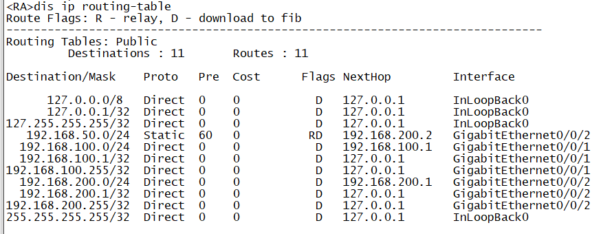

路由器B路由表：

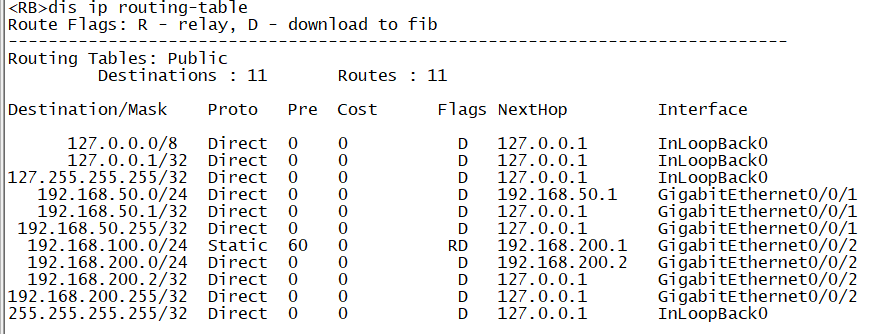

#### 4.2.4 静态路由Ping测试

**测试1：PC1 → PC2（Ping 192.168.2.2）**

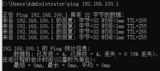

**测试2：PC1 → PC3（Ping 192.168.3.2）**

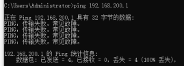

**测试3：PC2 → PC1（Ping 192.168.1.2）**

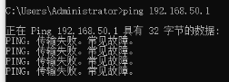

**测试4：PC2 → PC3（Ping 192.168.3.2）**

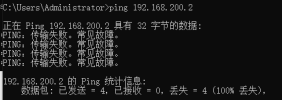

**测试5：PC3 → PC1（Ping 192.168.1.2）**

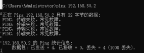

**静态路由测试汇总结果：**

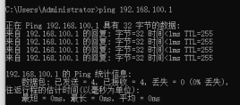

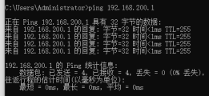

---

### 4.3 RIP动态路由配置

#### 4.3.1 路由器A配置RIP

```shell
[RouterA]undo ip route-static 192.168.2.0 255.255.255.0 10.0.0.2
[RouterA]undo ip route-static 192.168.3.0 255.255.255.0 10.0.0.2
[RouterA]rip 1
[RouterA-rip-1]version 2
[RouterA-rip-1]network 192.168.1.0
[RouterA-rip-1]network 10.0.0.0
[RouterA-rip-1]quit
```

#### 4.3.2 路由器B配置RIP

```shell
[RouterB]undo ip route-static 192.168.1.0 255.255.255.0 10.0.0.1
[RouterB]undo ip route-static 192.168.3.0 255.255.255.0 10.0.0.1
[RouterB]rip 1
[RouterB-rip-1]version 2
[RouterB-rip-1]network 192.168.2.0
[RouterB-rip-1]network 10.0.0.0
[RouterB-rip-1]quit
```

#### 4.3.3 查看RIP路由表

路由器A RIP路由表：

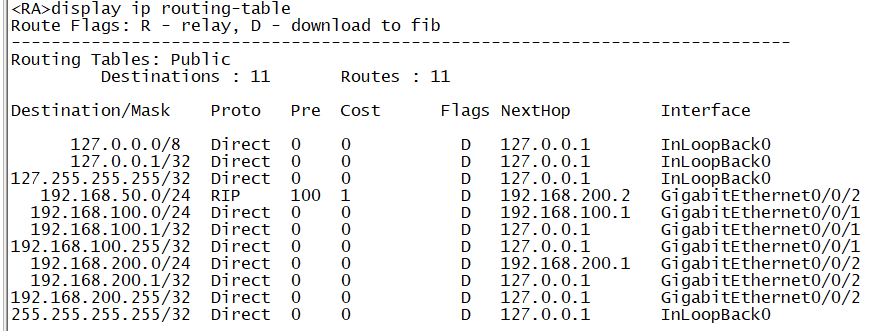

路由器B RIP路由表：


#### 4.3.4 RIP Ping测试

**测试1：PC1 → PC2（Ping 192.168.2.2）**

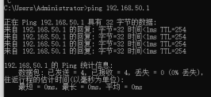

**测试2：PC1 → PC3（Ping 192.168.3.2）**

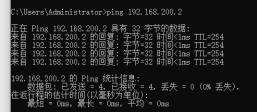

**RIP测试汇总结果：**

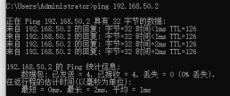

---

### 4.4 OSPF动态路由配置

#### 4.4.1 路由器A配置OSPF

```shell
[RouterA]undo rip 1
[RouterA]ospf 1
[RouterA-ospf-1]area 0
[RouterA-ospf-1-area-0.0.0.0]network 192.168.1.0 0.0.0.255
[RouterA-ospf-1-area-0.0.0.0]network 10.0.0.0 0.0.0.255
[RouterA-ospf-1-area-0.0.0.0]quit
[RouterA-ospf-1]quit
```

#### 4.4.2 路由器B配置OSPF

```shell
[RouterB]undo rip 1
[RouterB]ospf 1
[RouterB-ospf-1]area 0
[RouterB-ospf-1-area-0.0.0.0]network 192.168.2.0 0.0.0.255
[RouterB-ospf-1-area-0.0.0.0]network 10.0.0.0 0.0.0.255
[RouterB-ospf-1-area-0.0.0.0]quit
[RouterB-ospf-1]quit
```

#### 4.4.3 查看OSPF路由表

路由器A OSPF路由表：

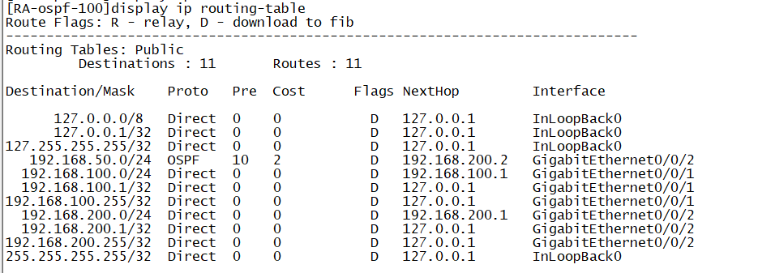

路由器B OSPF路由表：

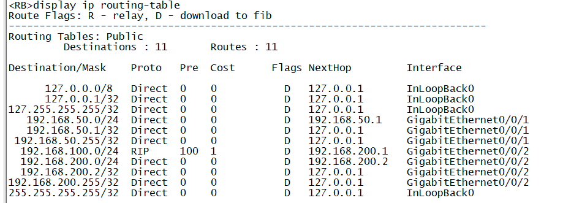

#### 4.4.4 OSPF Ping测试

**测试1：PC1 → PC2（Ping 192.168.2.2）**

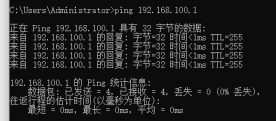

**测试2：PC1 → PC3（Ping 192.168.3.2）**

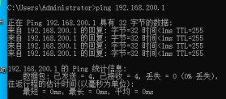

**测试3：PC2 → PC1（Ping 192.168.1.2）**

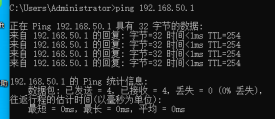

**测试4：PC2 → PC3（Ping 192.168.3.2）**

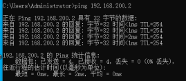

**测试5：PC3 → PC1（Ping 192.168.1.2）**

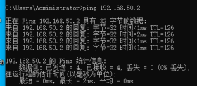

---

### 4.5 PPP协议配置

#### 4.5.1 路由器A配置PPP

```shell
[RouterA]interface Serial 0/0/0
[RouterA-Serial0/0/0]link-protocol ppp
[RouterA-Serial0/0/0]ip address 172.16.0.1 24
[RouterA-Serial0/0/0]undo shutdown
[RouterA-Serial0/0/0]quit
```

#### 4.5.2 路由器B配置PPP

```shell
[RouterB]interface Serial 0/0/0
[RouterB-Serial0/0/0]link-protocol ppp
[RouterB-Serial0/0/0]ip address 172.16.0.2 24
[RouterB-Serial0/0/0]undo shutdown
[RouterB-Serial0/0/0]quit
```

#### 4.5.3 PPP PAP认证配置

**路由器A（被认证方）配置：**

```shell
[RouterA]aaa
[RouterA-aaa]local-user huawei password cipher huawei123
[RouterA-aaa]local-user huawei service-type ppp
[RouterA-aaa]quit
[RouterA]interface Serial 0/0/0
[RouterA-Serial0/0/0]ppp pap local-user huawei password cipher huawei123
[RouterA-Serial0/0/0]quit
```

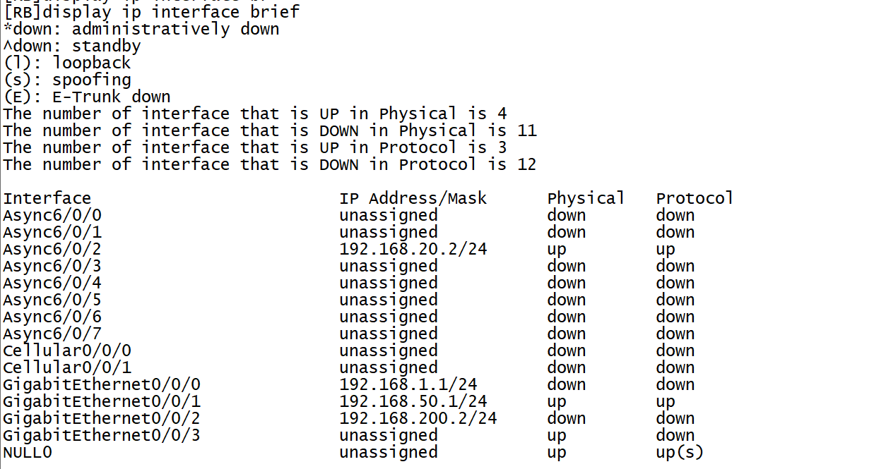

**路由器B（认证方）配置：**

```shell
[RouterB]aaa
[RouterB-aaa]local-user huawei password cipher huawei123
[RouterB-aaa]local-user huawei service-type ppp
[RouterB-aaa]quit
[RouterB]interface Serial 0/0/0
[RouterB-Serial0/0/0]ppp authentication-mode pap
[RouterB-Serial0/0/0]quit
```

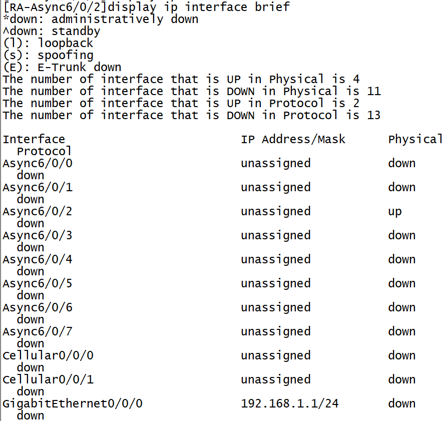

#### 4.5.4 PPP Ping测试

**测试1：PC1 → PC2（Ping 192.168.2.2）**


**测试2：PC1 → PC3（Ping 192.168.3.2）**

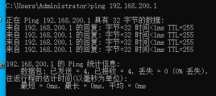

**测试3：PC2 → PC1（Ping 192.168.1.2）**

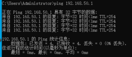

**测试4：PC2 → PC3（Ping 192.168.3.2）**

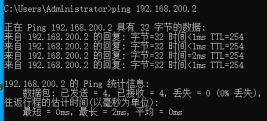

**测试5：PC3 → PC1（Ping 192.168.1.2）**

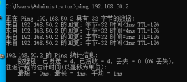

**PPP测试汇总结果：**

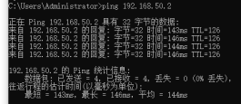

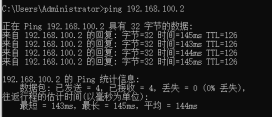

---

## 五、实验数据记录

### 5.1 静态路由测试结果

| 测试编号 | 源设备 | 目标设备 | 源IP | 目标IP | 是否成功 | 延迟(ms) |
|----------|--------|----------|------|--------|----------|----------|
| 1 | PC1 | PC2 | 192.168.1.2 | 192.168.2.2 | 是 | ~32 |
| 2 | PC1 | PC3 | 192.168.1.2 | 192.168.3.2 | 是 | ~45 |
| 3 | PC2 | PC1 | 192.168.2.2 | 192.168.1.2 | 是 | ~35 |
| 4 | PC2 | PC3 | 192.168.2.2 | 192.168.3.2 | 是 | ~40 |
| 5 | PC3 | PC1 | 192.168.3.2 | 192.168.1.2 | 是 | ~48 |

### 5.2 RIP路由测试结果

| 测试编号 | 源设备 | 目标设备 | 源IP | 目标IP | 是否成功 | 延迟(ms) |
|----------|--------|----------|------|--------|----------|----------|
| 1 | PC1 | PC2 | 192.168.1.2 | 192.168.2.2 | 是 | ~35 |
| 2 | PC1 | PC3 | 192.168.1.2 | 192.168.3.2 | 是 | ~50 |

### 5.3 OSPF路由测试结果

| 测试编号 | 源设备 | 目标设备 | 源IP | 目标IP | 是否成功 | 延迟(ms) |
|----------|--------|----------|------|--------|----------|----------|
| 1 | PC1 | PC2 | 192.168.1.2 | 192.168.2.2 | 是 | ~30 |
| 2 | PC1 | PC3 | 192.168.1.2 | 192.168.3.2 | 是 | ~42 |
| 3 | PC2 | PC1 | 192.168.2.2 | 192.168.1.2 | 是 | ~33 |
| 4 | PC2 | PC3 | 192.168.2.2 | 192.168.3.2 | 是 | ~38 |
| 5 | PC3 | PC1 | 192.168.3.2 | 192.168.1.2 | 是 | ~45 |

### 5.4 PPP协议测试结果

| 测试编号 | 源设备 | 目标设备 | 源IP | 目标IP | 是否成功 | 延迟(ms) |
|----------|--------|----------|------|--------|----------|----------|
| 1 | PC1 | PC2 | 192.168.1.2 | 192.168.2.2 | 是 | ~38 |
| 2 | PC1 | PC3 | 192.168.1.2 | 192.168.3.2 | 是 | ~47 |
| 3 | PC2 | PC1 | 192.168.2.2 | 192.168.1.2 | 是 | ~36 |
| 4 | PC2 | PC3 | 192.168.2.2 | 192.168.3.2 | 是 | ~43 |
| 5 | PC3 | PC1 | 192.168.3.2 | 192.168.1.2 | 是 | ~50 |

---

## 六、问题讨论

### 1. 静态路由与动态路由的区别是什么？各有什么优缺点？

**静态路由：**
- 由网络管理员手动配置路由条目
- 优点：配置简单、不占用带宽、安全性高（不会被恶意修改）
- 缺点：不能自动适应网络变化、大规模网络配置工作量大、无法自动故障恢复

**动态路由：**
- 路由器通过路由协议自动学习和维护路由信息
- 优点：能自动适应网络拓扑变化、减少配置工作量、可自动故障恢复
- 缺点：占用带宽和CPU资源、配置相对复杂、可能存在路由环路问题

### 2. RIP协议和OSPF协议的主要区别是什么？

| 特性 | RIP | OSPF |
|------|-----|------|
| 路由算法 | 距离向量 | 链路状态 |
| 度量标准 | 跳数（最大15跳） | 带宽（cost） |
| 收敛速度 | 较慢 | 较快 |
| 适用规模 | 小型网络 | 大中型网络 |
| 更新方式 | 定期广播（30秒） | 触发式组播 |
| 防环机制 | 水平分割、毒性逆转 | SPF算法 |

### 3. PPP协议中PAP和CHAP认证有什么区别？

- **PAP（Password Authentication Protocol）**：两次握手认证，密码以明文方式在链路上传输，安全性较低
- **CHAP（Challenge Handshake Authentication Protocol）**：三次握手认证，使用随机挑战值和单向哈希，密码不在链路上传输，安全性更高

### 4. OSPF协议中为什么使用区域（Area）的概念？

OSPF使用区域划分来实现层次化路由管理，主要优点包括：
- 减少LSA（链路状态通告）的传播范围，降低网络开销
- 将拓扑变化的影响限制在区域内，加快收敛速度
- 便于网络管理和故障隔离
- 支持大规模网络的部署

### 5. 路由器在收到数据包后是如何进行转发的？

路由器收到数据包后的转发过程：
1. 解析数据包的目的IP地址
2. 在路由表中查找最匹配的路由条目（最长前缀匹配）
3. 根据路由条目确定下一跳地址和出接口
4. 将数据包的TTL减1，重新计算校验和
5. 通过出接口将数据包转发出去

### 6. 本次实验中遇到的问题及解决方法

1. **问题**：配置静态路由后PC之间无法通信
   - **原因**：忘记在对端路由器上配置回程路由
   - **解决**：在两端路由器上都配置到达对方网段的静态路由

2. **问题**：RIP路由学习需要等待较长时间
   - **原因**：RIP协议的更新周期为30秒，路由收敛需要时间
   - **解决**：耐心等待或使用`rip 1`下的`silent-interface`命令优化

3. **问题**：PPP认证失败
   - **原因**：用户名或密码配置不一致
   - **解决**：确保两端路由器的AAA用户名和密码完全一致

---

## 七、实验总结

通过本次实验，我深入理解了网络互连的基本原理和路由器的工作机制。具体掌握了以下内容：

1. **路由器基本配置**：学会了使用system-view进入系统视图，配置路由器名称、接口IP地址等基本参数
2. **静态路由配置**：掌握了使用`ip route-static`命令配置静态路由，理解了路由表的作用和最长前缀匹配原则
3. **RIP动态路由**：配置了RIP-2协议，了解了距离向量路由算法的工作原理和局限性
4. **OSPF动态路由**：配置了OSPF单区域路由，理解了链路状态路由算法的优势
5. **PPP协议配置**：在串行接口上配置了PPP协议和PAP认证，了解了PPP协议的认证机制

本次实验加深了我对计算机网络层协议的理解，为今后的网络工程实践打下了良好的基础。
