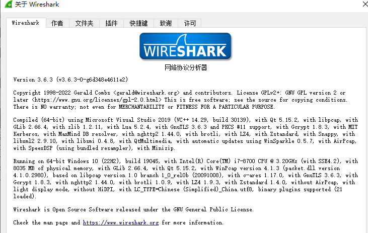
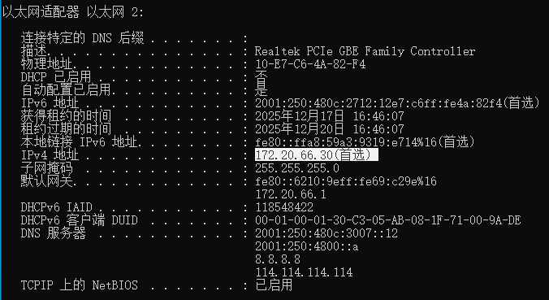
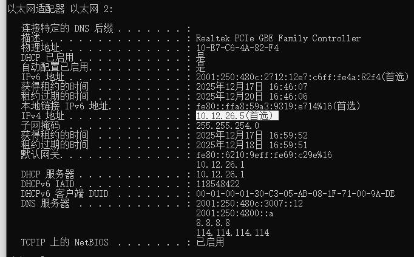
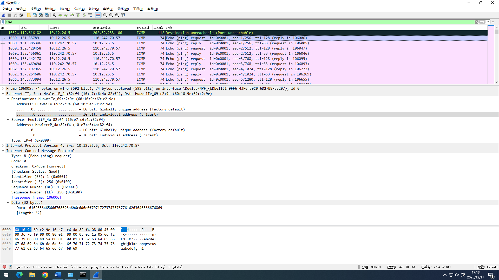
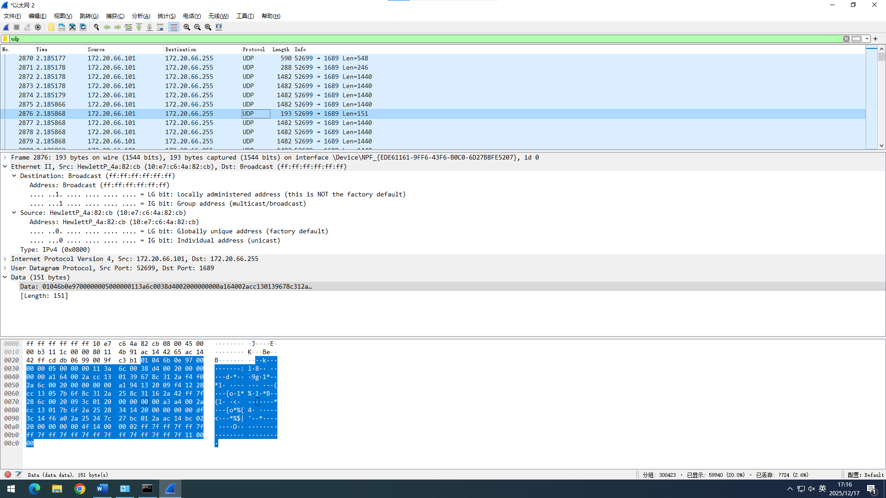
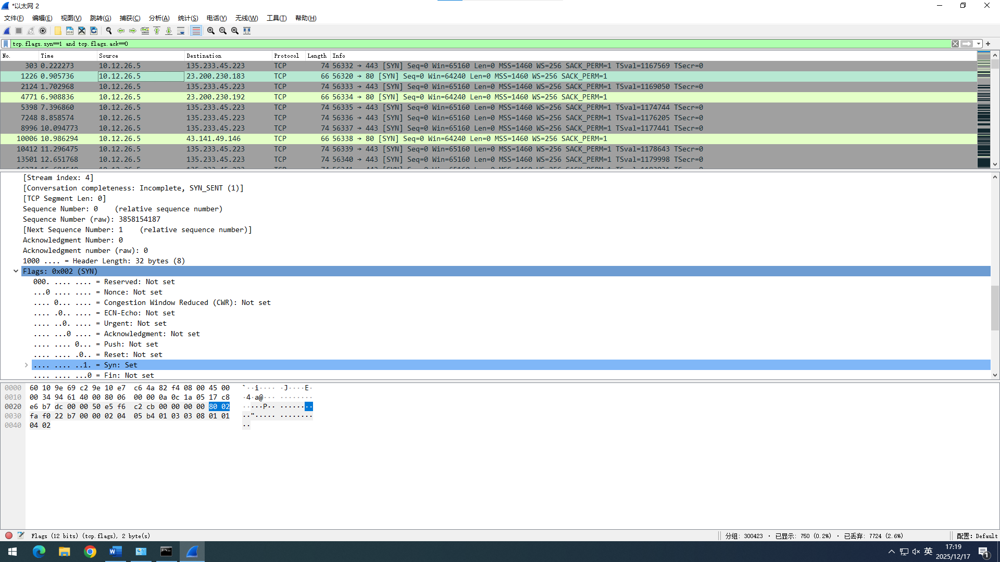
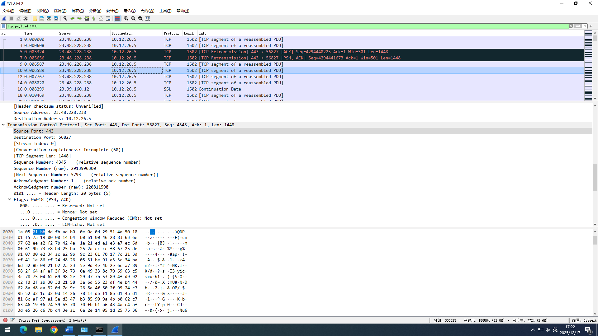
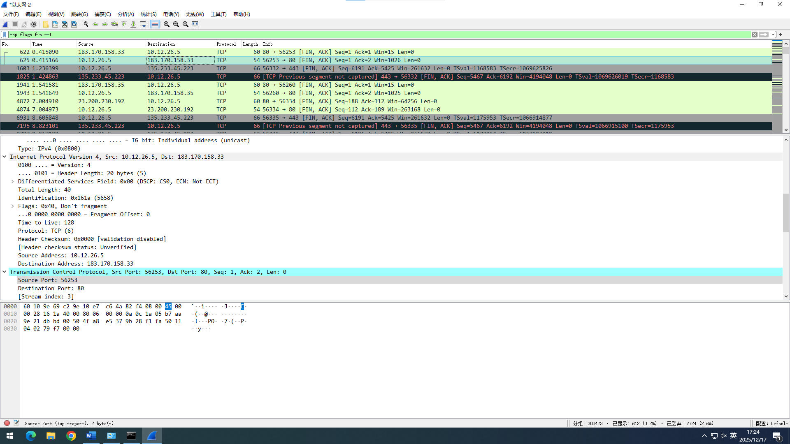

# 实验5：分析IP数据报

## 实验报告信息

| 字段 | 内容 |
|------|------|
| 课程 | 计算机网络 |
| 实验地点 | 计算机大楼606 |
| 实验时间 | 2025年12月17日第9-10节 |
| 实验题目 | 实验5 分析IP数据报 |

## 实验目的

1. 了解IP数据报的格式，理解IP各个数据项的含义
2. 了解TCP报文段各个字段的含义，理解TCP协议的工作原理
3. 了解UDP数据报各个字段的含义，理解UDP协议的工作原理
4. 了解ICMP报文各个字段的含义，理解ICMP协议的功能和作用

## 实验环境

- 联网主机
- Winpcap、Wireshark等工具软件

## 实验步骤

（实验步骤内容）

## 实验数据记录

### 1、协议分析软件信息

**软件名称**：Wireshark
**版本号**：v3.6.3

### 2、本机IP地址

**连校园网前：**

- 物理地址：10-E7-C6-4A-82-F4
- IPv4地址：172.20.66.30(首选)
- 子网掩码：255.255.255.0

**连校园网后：**

- IPv4地址：10.12.26.5(首选)
- 子网掩码：255.255.254.0
- DHCP服务器：10.12.26.1

### 3、ICMP报文

过滤器设置条件：`icmp`

**表5-2 IP数据报格式表（ICMP）：**

| 字段 | 值 |
|------|------|
| 版本 | 4 |
| 首部长度 | 20字节 |
| 服务类型 | 0x00 |
| 总长度 | 60 |
| 标识 | 0x7ef0 |
| 标志 | 0x00 |
| 片偏移 | 0 |
| 生存时间 | 53 |
| 协议 | 1(ICMP) |
| 首部校验和 | 0x2d95 |
| 源地址 | 110.242.70.57 |
| 目的地址 | 10.12.26.5 |
| 可选字段（长度可变） | 无 |
| 填充 | 无 |
| 数据部分 | 首部之后的部分，从00 00开始的内容(Ping的回复数据) |

### 4、UDP报文

过滤器设置条件：`udp`

（截图的跟我实际导出的不一样）

**表5-2 IP数据报格式表（UDP）：**

| 字段 | 值 |
|------|------|
| 版本 | 4 |
| 首部长度 | 20字节 |
| 服务类型 | 0x00 |
| 总长度 | 317 |
| 标识 | 0x10d7 |
| 标志 | 0x00 |
| 片偏移 | 0 |
| 生存时间 | 128 |
| 协议 | 17(UDP) |
| 首部校验和 | 0x4b4c |
| 源地址 | 172.20.66.101 |
| 目的地址 | 172.20.66.255 |
| 可选字段（长度可变） | 无 |
| 填充 | 无 |
| 数据部分 | 297字节 |

### 5、TCP建立连接报文

过滤器设置条件：`tcp.flags.syn==1 and tcp.flags.ack==0`

**表5-2 IP数据报格式表（TCP建立连接）：**

| 字段 | 值 |
|------|------|
| 版本 | 4 |
| 首部长度 | 20字节 |
| 服务类型 | 0x00 |
| 总长度 | 52 |
| 标识 | 0x9461 |
| 标志 | 0x40 |
| 片偏移 | 0 |
| 生存时间 | 128 |
| 协议 | 6(TCP) |
| 首部校验和 | 0x0000 |
| 源地址 | 10.12.26.5 |
| 目的地址 | 23.200.230.183 |
| 可选字段（长度可变） | 无 |
| 填充 | 无 |
| 数据部分 | 从dc 00开始的内容(TCP头部) |

### 6、TCP数据传送报文

过滤器设置条件：`tcp.payload != 0`

**表5-2 IP数据报格式表（TCP数据传送）：**

| 字段 | 值 |
|------|------|
| 版本 | 4 |
| 首部长度 | 20字节 |
| 服务类型 | 0x00 |
| 总长度 | 1488 |
| 标识 | 0xe6c7 |
| 标志 | 0x40 |
| 片偏移 | 0 |
| 生存时间 | 46 |
| 协议 | 6(TCP) |
| 首部校验和 | 0x4031 |
| 源地址 | 23.48.228.238 |
| 目的地址 | 10.12.26.5 |
| 可选字段（长度可变） | 无 |
| 填充 | 无 |
| 数据部分 | 包含1448字节的应用层数据 |

### 7、TCP连接释放报文

过滤器设置条件：`tcp.flags.fin ==1`

**表5-2 IP数据报格式表（TCP连接释放）：**

| 字段 | 值 |
|------|------|
| 版本 | 4 |
| 首部长度 | 20字节 |
| 服务类型 | 0x00 |
| 总长度 | 40 |
| 标识 | 0x161a |
| 标志 | 0x40 |
| 片偏移 | 0 |
| 生存时间 | 128 |
| 协议 | 6(TCP) |
| 首部校验和 | 0x0000 |
| 源地址 | 10.12.26.5 |
| 目的地址 | 183.170.158.33 |
| 可选字段（长度可变） | 无 |
| 填充 | 无 |
| 数据部分 | 从db bd开始的内容 |

## 问题讨论

**ICMP校验和字段是如何计算的，是否包括数据部分？**

ICMP校验和的计算**包括数据部分**。它覆盖了整个ICMP报文。这与IP首部校验和（只校验首部，不校验数据）是有区别的。

计算方法：
1. 首先，将校验和字段置为0
2. 将整个ICMP报文按16位为一组进行二进制反码求和
3. 如果数据部分的字节长度为奇数，则在末尾填充一个全0字节以凑成16位
4. 将计算出的结果取反码，即得到最终的校验和

## 实验心得

混淆了"总长度"和"首部长度"的概念。在填写表格时，通过Hex计算出的长度数值很大，与首部长度（通常是5，即20字节）不符。

**解决方法**：查阅教材得知，"首部长度"单位是4字节（所以0x5代表20字节），而"总长度"是IP首部加数据部分的总字节数。重新计算Hex字段（如0x05d0 = 1488字节）。
