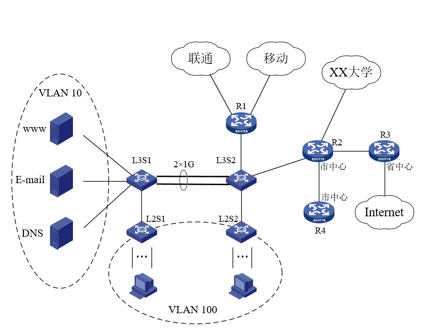

# 实验6：企业级网络构建与配置实现

## 实验报告信息

| 字段 | 内容 |
|------|------|
| 课程 | 计算机网络 |
| 实验地点 | 计算机大楼606 |
| 实验时间 | 2025年12月3日第9-10节 / 2025年12月10日第9-10节 |
| 实验题目 | 实验6：企业级网络构建与配置实现 |

## 实验目的

根据企业的网络建设需求，运用计算机网络课程中所学的理论知识与实践技能，用路由器和交换机等网络设备构建符合企业需求的物理网络，并进行正确的配置，保证整个网络系统能正常运行。

## 实验内容

用交换机和路由器等网络设备构建满足企业需求的复杂物理网络，对交换机和路由器进行正确配置实现企业级网络功能。并设计方案测试网络运行状态，有效处理和解决出现的问题，保证所构建的网络正常运行，满足企业网络的功能和性能需求。

本次实验要完成的主要任务有：
1. 设备命名和端口规划
2. IP地址规划 —— 对图6-1中的所有网络进行IP地址的分配和子网划分
3. VLAN划分与配置
4. 链路聚合配置
5. 网络路由设计与配置 —— 可采用静态路由或动态路由协议，要配置到Internet的默认路由。路由器和三层交换机都需要配置路由
6. 网络连通性测试 —— 网络设备配置完成后，要测试设备是否能按要需求正常运行。首先进行测试方案设计，并记录测试过程，分析测试结果

## 实验环境

- 路由器AR2220E —— 4台
- 三层交换机S5720-36C-PWR-EI-AC —— 2台
- 二层交换机S5720-28X-PWR-LI-AC —— 2台
- PC机 —— 若干台
- 网线 —— 若干根

## 网络拓扑结构图



## 实验任务分工

**表6-1 任务分工（组号：10）**

| 序号 | 任务 | 完成工作量排名 |
|------|------|----------------|
| 1 | 网络地址分配和子网划分，网络路由设计与配置 | 1 |
| 2 | 设备命名和端口规划 | 2 |
| 3 | **链路聚合配置** | 3 |
| 4 | VLAN划分与配置 | 4 |
| 5 | 网络连通性测试 | 5 |

## 实验步骤

（根据本人任务撰写）

## 实验数据记录

### （1）设备命名和端口规划

为方便对设备的管理和配置，对图6-1中所有设备进行命名，标注在图上并填入表6-2中。并对每台网络设备的连接端口进行规划，标注在图中同时填入表6-2中。

**表6-2 设备命名及端口规划**

| 设备类型 | 设备编号 | 设备名称 | 端口 | 连接设备 | 连接端口 |
|----------|----------|----------|------|----------|----------|
| 路由器 | R1 | Router-A | G0/0/0 | L3S1 | G0/0/1 |
| 路由器 | R1 | Router-A | G0/0/1 | L3S1 | G0/0/2 |
| 路由器 | R2 | Router-B | G0/0/0 | L3S2 | G0/0/1 |
| 路由器 | R2 | Router-B | G0/0/1 | R3 | G0/0/2 |
| 路由器 | R3 | Router-C | G0/0/0 | R2 | G0/0/1 |
| 路由器 | R3 | Router-C | G0/0/1 | Internet | — |
| 路由器 | R4 | Router-D | G0/0/0 | L2S3 | G0/0/1 |
| 三层交换机 | L3S1 | Switch1 | G0/0/1 | Vlan10 | G0/0/0 |
| 三层交换机 | L3S1 | Switch1 | G0/0/3 | Vlan100 | G0/0/2 |
| 三层交换机 | L3S1 | Switch1 | G0/0/5 | L2S2 | G0/0/4 |
| 三层交换机 | L3S2 | Switch2 | G0/0/4 | L3S1 | G0/0/5 |
| 三层交换机 | L3S2 | Switch2 | G0/0/2 | R1 | G0/0/1 |
| 三层交换机 | L3S2 | Switch2 | G0/0/1 | R2 | G0/0/0 |
| 三层交换机 | L3S2 | Switch2 | G0/0/3 | L2S2 | G0/0/1 |
| 二层交换机 | L2S1 | SwitchA | G0/0/1 | VLAN10 | G0/0/0 |
| 二层交换机 | L2S1 | SwitchA | G0/0/4 | L3S1 | G0/0/5 |
| 二层交换机 | L2S2 | SwitchB | G0/0/1 | VLAN10 | G0/0/0 |
| 二层交换机 | L2S2 | SwitchB | G0/0/4 | L3S2 | G0/0/5 |
| 二层交换机 | L2S2 | SwitchB | G0/0/3 | Vlan100 | G0/0/2 |

> 配置界面（截图）：

### （2）网络地址分配和子网划分

（网络地址分配内容）

> 配置界面（截图）：

### （3）VLAN划分与配置

（VLAN配置内容）

> 配置界面（截图）：

### （4）链路聚合配置

在两个三层交换机L3S1、L3S2之间连接两条1G链路，配置手动负载均衡模式进行链路聚合。

> 配置界面（截图）：

### （5）网络路由设计与配置

（路由配置内容）

> 配置界面（截图）：

### （6）网络连通性测试

（测试结果内容）

## 问题讨论

### 问题1：PC与交换机之间的单向Ping通问题（防火墙拦截）

**问题描述：**

在网络连通性测试阶段，发现VLAN 100内的PC可以成功Ping通接入层交换机L2S2，证明网络路由和物理链路是正常的。但是，反向操作时，使用L2S2去Ping PC却显示超时。

**原因分析：**

经过排查，确认网络层配置（IP地址、网关、路由协议）均无误。问题在于PC端的操作系统安全策略。Windows操作系统的防火墙默认策略会拦截来自外部网络（非本地子网）的ICMP回显请求。

**解决方法：** 关闭防火墙。修改后，双向Ping测试均恢复正常。

### 问题2：路由器之间直连Ping不通（物理端口与配置不匹配）

**问题描述：**

在配置完RIP路由协议后，发现R2和R3之间无法建立邻居关系，甚至连直连端口都无法Ping通。

**原因分析：**

检查配置命令，发现IP地址配置在错误的接口上。导致配置的逻辑端口与实际物理连接的端口不一致，数据包无法正确发送。

**解决方法：** 重新连线。

### 问题3：VLAN间通信失败（缺少默认路由）

**问题描述：**

配置好VLAN后，VLAN 10的PC无法Ping通VLAN 100的PC，也无法Ping通二层交换机的管理IP。

**原因分析：**

接入层二层交换机虽然配置了管理IP，但缺少指向核心层的默认路由。当二层交换机试图回复来自不同网段的Ping包时，由于不知道下一跳在哪里，导致丢包。

**解决方法：**

在二层交换机上配置静态默认路由命令：
```
ip route-static 0.0.0.0 0.0.0.0 192.168.1.1
```
