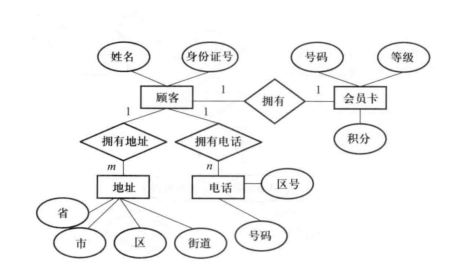

# 数据库雨课堂作业 - 第7章

---

**1. 数据流图是用于数据库设计中（ ）阶段的工具。**

* A. 概要设计
* B. 运行和实施
* C. 程序编码
* D. 需求分析

**正确答案：D**

---

**2. 数据库设计的概念设计阶段，表示概念结构的常用方法和描述工具是（ ）**

* A. 层次分析法和层次结构图
* B. 数据流程分析法和数据流程图
* C. 实体联系方法和E-R图
* D. 结构分析法和模块结构图

**正确答案：C**

---

**3. .在关系数据库设计中，设计关系模式是数据库设计中（ ）阶段的任务 。**

* A. 逻辑设计阶段
* B. 概念设计阶段
* C. 物理设计阶段
* D. 需求分析阶段

**正确答案：A**

---

**4. 数据库设计中，确定数据库存储结构，即确定关系、索引、聚簇、日志、备份等数据的存储安排和存储结构，这是数据库设计的（ ）。**

* A. 需求分析阶段
* B. 逻辑设计阶段
* C. 概念设计阶段
* D. 物理设计阶段

**正确答案：D**

---

**5. 数据库物理设计完成后，进入数据库实施阶段，下述工作中，（ ）一般不属于实施阶段的工作。**

* A. 建立库结构
* B. 系统调试
* C. 加载数据
* D. 扩充功能

**正确答案：D**

---

**6. 数据库设计的（     ）阶段的主要任务是调查和分析用户的应用需要，为概念结构设计做好充分准备。**

* A. 概要设计
* B. 运行和实施
* C. 逻辑设计
* D. 需求分析

**正确答案：D**

---

**7. 公司有多个部门和多名职员，每个职员只能属于一个部门，一个部门可以有多名职员，则部门和职员之间的联系类形是（ ） 。**

* A. 一对一
* B. 一对多
* C. 多对多
* D. 没有关系

**正确答案：B**

---

**8. 在E-R模型中，如果有3个不同的实体型，3个M：N联系，根据ER模型转换为关系模型的规则，转换为关系的数目是（ ）。**

* A. 4
* B. 5
* C. 6
* D. 7

**正确答案：C**

---

**9. 从E-R图导出关系模型时，如果实体间的联系是M：N的，下列说法中正确的是（ ）。**

* A. 将N方码和联系的属性纳入M方的属性中
* B. 将M方码和联系的属性纳入N方的属性中
* C. 增加一个关系表示联系，其中纳入M方和N方的码
* D. 在M方属性和N方属性中均增加一个表示级别的属性

**正确答案：C**

---

**10. 关系数据库的规范化理论主要解决的问题是（ ）。**

* A. 如何构造合适的数据逻辑结构
* B. 如何构造合适的数据物理结构
* C. 如何构造合适的应用程序界面
* D. 如何控制不同用户的数据操作权限

**正确答案：A**

---

**11. 某商场可以为顾客办理会员卡，每个顾客只能办理一张会员卡，顾客信息包括顾客姓名、身份证号；会员卡信息包括号码、等级、积分；顾客具有多个地址和多个电话号码，地址包括省、市、区、街道；电话号码包括区号、号码。画出该系统的E-R图并写出导出的关系模式。**

> 解析：
> 
>
> 关系模式包括：
>
> 顾客（身份证号，姓名，会员卡号码）
>
> 会员卡（号码，等级，积分）
>
> 地址（省，市，区，街道，顾客身份证号）
>
> 电话（区号，号码，顾客身份证号）

---
