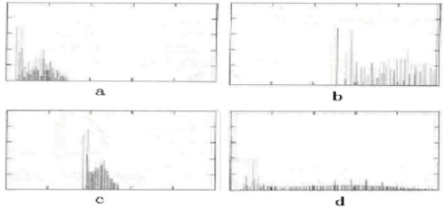

# 河南大学《数字图像处理》2021-2022学年第一学期期末试卷

**考试方式：闭卷** | **卷面总分：100 分** | **考试时间：120 分钟**

---

## 一、填空题（共 10 小题，每小空 1.5 分，共 30 分）

1. 在人类接受的信息中，图像等视觉信息所占的比重约达到（75）%。
2. 数字图像处理，即用（计算机）对图像进行处理。
3. 图像处理技术主要包括图像的（增强）、（复原）、（压缩）等技术。
4. 在计算机中，按颜色和灰度的多少可以将图像分为（二值图像）、（灰度图像）、（索引图像）、（真彩色图像）四种类型。
5. 在计算机中，数字图像处理的实质是对（二维像素矩阵）的处理。
6. 图像数字化过程包括三个步骤：（采样）、（量化）和（编码）。
7. 在 RGB 彩色空间的原点上，三个基色均没有（亮度），即原点为（黑）色。
8. 图像所有灰度级中处于中间的值叫做（中值）。
9. 模式识别包括（特征提取）和（分类）两方面的内容。
10. 线性系统应该满足（叠加）性和（齐次）性。

---

## 二、判断题（共 5 题，每小题 4 分，共 20 分）

1. 图像编码后对数据量进行了有效压缩，因此，图像编码是“有损压缩”。（ ✗ ）
2. 数学图像可以定义为由连续函数或离散函数生成的抽象图像。（ ✓ ）
3. 空移不变系统的传递函数是一个与频率无关的函数。（ ✗ ）
4. 傅立叶变换的可分离性可以将图像的二维变换分解为行和列方向的一维变换。（ ✓ ）
5. 模式识别的目的是对图像中的物体进行分类；分类的依据是从原始图像中提取的不同物体的特征。（ ✓ ）

---

## 三、叙述题（共 4 小题，每小题 5 分，共 20 分）

### 1、试叙述获取数字图像的三种途径，并各举一个简单的例子。
* **数码拍摄**：用手机拍摄风景照片。
* **扫描转换**：用扫描仪将纸质文档转为数字图像。
* **软件生成**：用 MATLAB 生成正弦波灰度图。

### 2、简要叙述“图像”和“数字图像”的定义。
* **图像**：人对视觉感知的物质再现，包括光学图像、模拟图像等。
* **数字图像**：以二维像素矩阵表示的离散化图像，每个像素具有整数灰度值。

### 3、根据图像处理运算的输入信息和输出信息的类型，图像处理算法可分为哪三大类?并各举一个例子。
* **单输入 $\rightarrow$ 单输出**：图像锐化（如拉普拉斯算子增强边缘）。
* **多输入 $\rightarrow$ 单输出**：多帧平均去噪（叠加多张图像降低噪声）。
* **单输入 $\rightarrow$ 非图像输出**：人脸识别（输出身份标签）。

### 4、图像处理的研究内容可以分为哪几方面?具体操作需要哪些设备?
* **研究内容**：图像获取、增强、复原、压缩、分割、识别。
* **所需设备**：
  * **输入设备**：数码相机、扫描仪、摄像头。
  * **处理设备**：计算机（CPU/GPU）、DSP 芯片。
  * **输出设备**：显示器、打印机、存储器。

---

## 四、分析题（共 1 小题，每小题 15 分，共 15 分）

图像的直方图基本上可以描述图像的概貌。就下面所给的 a、b、c、d 四个直方图，试分析和比较四幅图像的明暗状况和对比度高低等特征。

* **图 a**：直方图集中于左侧 —— 图像整体偏暗，对比度低（细节模糊）。
* **图 b**：直方图集中于右侧 —— 图像整体偏亮，对比度低（过曝区域多）。
* **图 c**：直方图覆盖整个灰度范围 —— 亮度分布均匀，对比度高（细节清晰）。
* **图 d**：直方图呈双峰型 —— 明暗区域对比强烈，中等对比度（可能含前景与背景分离）。

---

## 五、综合题（共 1 小题，每小题 15 分，共 15 分）

对下表中的图像信源数据进行哈夫曼 (Huffman) 编码。写出编码过程，并将编码结果填在下表的最后一列。

### 编码过程
1. **概率排序**：将信源符号按概率从大到小排列为：
   $$P(A)=0.5, \quad P(B)=0.2, \quad P(C)=0.15, \quad P(D)=0.06, \quad P(E)=0.05, \quad P(F)=0.04$$
2. **构建哈夫曼树**：
   * 将最小的两个节点 $E(0.05)$ 与 $F(0.04)$ 合并，得到新节点 $EF(0.09)$。
   * 将剩余节点中最小的两个 $D(0.06)$ 与 $EF(0.09)$ 合并，得到 $DEF(0.15)$。
   * 将 $C(0.15)$ 与 $DEF(0.15)$ 合并，得到 $CDEF(0.30)$。
   * 将 $B(0.2)$ 与 $CDEF(0.30)$ 合并，得到 $BCDEF(0.50)$。
   * 最后将 $A(0.5)$ 与 $BCDEF(0.50)$ 合并，得到根节点。
3. **分配编码**（规定左分支为 `0`，右分支为 `1`）：
   * $A \rightarrow 0$
   * $B \rightarrow 10$
   * $C \rightarrow 110$
   * $D \rightarrow 1110$
   * $E \rightarrow 11110$
   * $F \rightarrow 11111$

### 编码结果表

| 灰度级 | 概率分布 | 编码结果 |
| :----: | :------: | :------: |
|   A    |   0.5    |    0     |
|   B    |   0.2    |    10    |
|   C    |   0.15   |   110    |
|   D    |   0.06   |   1110   |
|   E    |   0.05   |  11110   |
|   F    |   0.04   |  11111   |