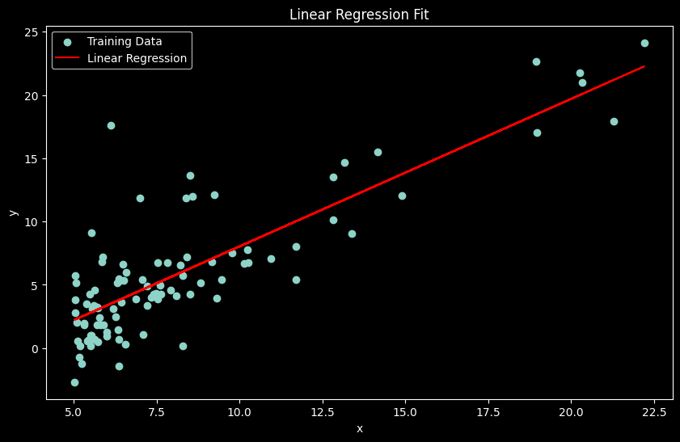
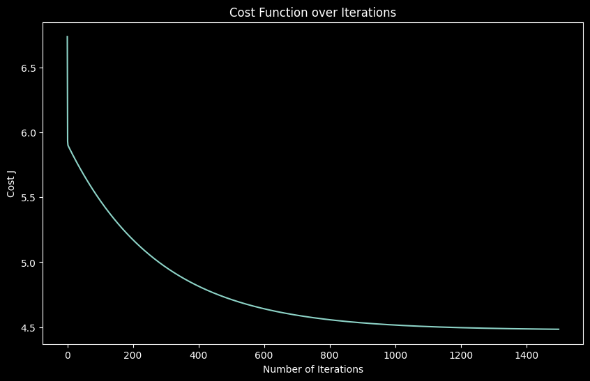

# Lab 01 实验报告

> 实验题目：使用梯度下降法训练线性回归模型

计算机与信息工程学院实验报告

## 实验题目

使用梯度下降法训练线性回归模型

## 实验目的

掌握线性回归的基本原理，以及梯度下降法和最小二乘法；

## 实验环境

Anaconda/Jupyter notebook

## 实验内容

1. 编码实现基于梯度下降的单变量线性回归算法，包括梯度的计算与验证；
2. 画数据散点图，以及得到的直线；
3. 画梯度下降过程中损失的变化图；
4. 基于训练得到的参数，输入新的样本数据，输出预测值；
## 实验步骤

```python
import numpy as np
import matplotlib.pyplot as plt
# 1. 加载数据
data = np.loadtxt("data1.txt", delimiter=",")
X = data[:, 0]
y = data[:, 1]
m = len(y) # 样本数量
# 为X添加一列，用于表示截距项
X = np.stack([np.ones(m), X], axis=1)
# 2. 定义模型和假设函数
# 假设函数 h(x) = theta[0] + theta[1] * x
def hypothesis(X, theta):
return np.dot(X, theta)
# 3. 定义损失函数 (均方误差)
def compute_cost(X, y, theta):
m = len(y)
predictions = hypothesis(X, theta)
sq_errors = (predictions - y) ** 2
return 1 / (2 * m) * np.sum(sq_errors)
# 4. 梯度下降
def gradient_descent(X, y, theta, alpha, iterations):
m = len(y)
J_history = [] # 用来记录每次迭代的损失值
for i in range(iterations):
predictions = hypothesis(X, theta)
errors = predictions - y
# 计算梯度
gradient = (1 / m) * np.dot(X.T, errors)
# 更新参数
theta = theta - alpha * gradient
# 记录损失值
J_history.append(compute_cost(X, y, theta))
return theta, J_history
# 5. 初始化参数并开始训练
theta = np.zeros(2) # 初始化 theta 为 [0, 0]
alpha = 0.01 # 学习率
iterations = 1500 # 迭代次数
theta_final, J_history = gradient_descent(X, y, theta, alpha, iterations)
print("通过梯度下降法得到的参数 theta:", theta_final)
print("最终损失值:", J_history[-1])
# --- 画图 ---
# 6. 数据散点图以及得到的直线
plt.figure(figsize=(10, 6))
plt.scatter(X[:, 1], y, label="Training Data") # 训练数据
plt.plot(X[:, 1], hypothesis(X, theta_final), color="red", label="Linear Regression")
plt.title("Linear Regression Fit") # 线性回归拟合
plt.xlabel("x")
plt.ylabel("y")
plt.legend()
plt.show()
# 7. 梯度下降过程中损失的变化图
plt.figure(figsize=(10, 6))
plt.plot(range(iterations), J_history)
plt.title("Cost Function over Iterations") # 迭代过程中损失函数的变化
plt.xlabel("Number of Iterations") # 迭代次数
plt.ylabel("Cost J") # 损失值 J
plt.show()
# 8. 基于训练得到的参数，进行预测
predict1 = np.dot([1, 3.5], theta_final) * 10000
print(f"x为 35,000 , y为: {predict1:,.2f}")
predict2 = np.dot([1, 7.0], theta_final) * 10000
print(f"x为 70,000 , y为: {predict2:,.2f}")
```

**实验数据记录**

通过梯度下降法得到的参数 theta: [-3.63029144 1.16636235]

**最终损失值：** 4.483388256587725



线性回归拟合



梯度下降过程中损失的变化图

从图中可以看出，损失函数在前期的迭代中迅速下降，后期逐渐趋于平稳，表明算法已收敛。

基于训练得到的参数，进行预测(这里为了方便,35000的输入设置为3.5,即以10000为单位):

x为 35,000 , y为: 4,519.77

x为 70,000 , y为: 45,342.45

## 问题讨论

1 matplotlib.pyplot中文报错

**f：** \Tools\Anaconda\envs\lab01\lib\site-packages\IPython\core\pylabtools.py:152: UserWarning: Glyph 21033 (\N{CJK UNIFIED IDEOGRAPH-5229}) missing from font(s) DejaVu Sans.

```python
fig.canvas.print_figure(bytes_io, **kw)
```

**链接**

不过为了避免,以后还是使用英文,中文保留为注释

2 配置环境问题

刚开始使用conda create --name lab01时,后面没带python=3.9.7这个版本号,导致运行失败,后续删除重来,一定要带版本号

此外,下载的时候pip install最好使用conda install

Install的时候不能挂代理

Vscode里的Powershell不能激活环境,需要到cmd激活
