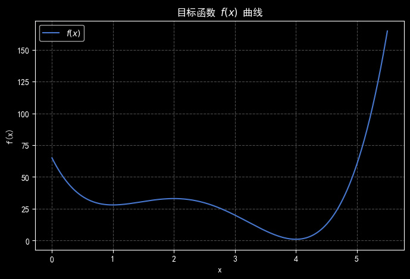
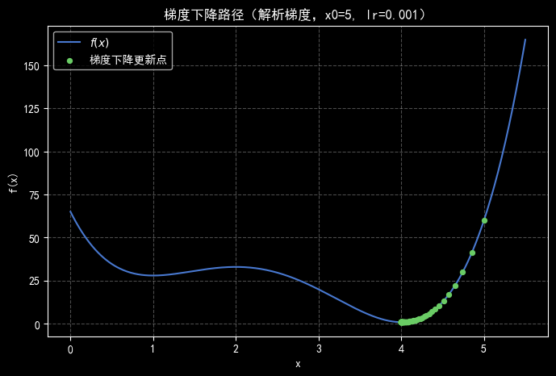
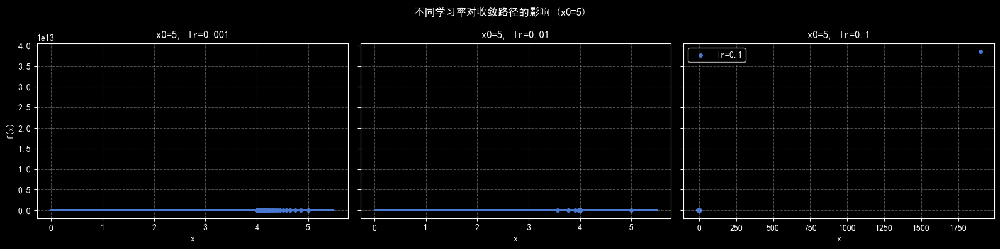
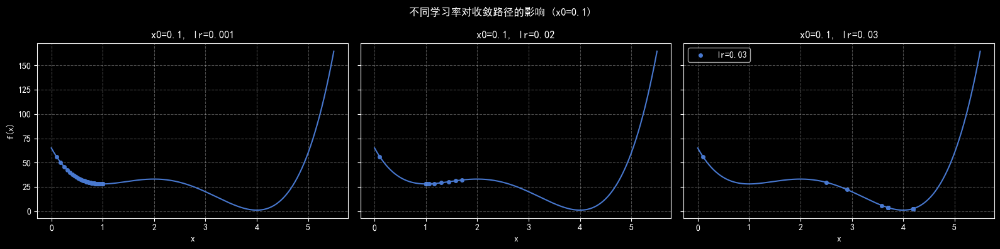
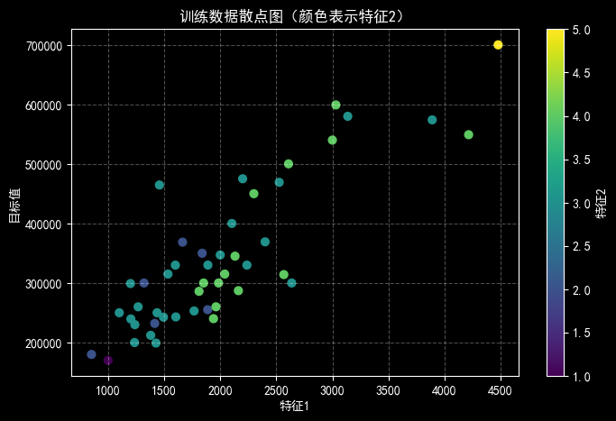
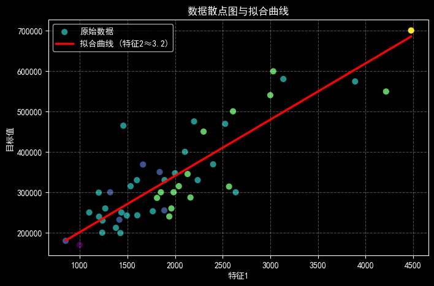
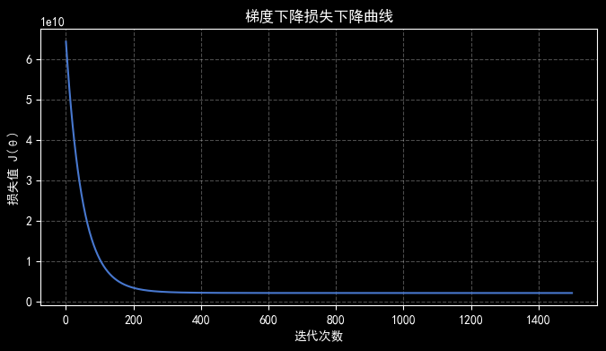

# Lab 02 实验报告

> 实验题目：使用梯度下降法训练多元线性回归模型

计算机与信息工程学院实验报告

## 实验题目

使用梯度下降法训练多元线性回归模型

## 实验目的

掌握线性回归的基本原理，以及梯度下降算法

## 实验环境

Anaconda/Jupyter notebook

## 实验内容

一、掌握梯度下降的基本思想，具体要求如下：

编写基于梯度下降算法求局部极优解的流程：

```python
（1）目标函数：f(x) = 3*x^4-28*x^3+84*x^2-96*x+65，画出函数在[0, 5.5]上的曲线图；
（2）梯度可用以下两种形式计算：derivate(x) =( f(x+h) - f(x-h))/2*h，h可取0.001；也可以直接对目标函数进行求导。
```

3. 初始x0=5，迭代500次，学习率ξ=0.001，在目标函数的曲线上绘制出x更新过程的散点图；
4. 尝试不同的学习率ξ，如0.01，0.1等，观察x更新过程有什么不同；
5. 初始x0=0.1，迭代500次，学习率ξ=0.001，0.02，0.03，在目标函数的曲线上绘制出x更新过程的散点图。
二、使用梯度下降法训练多元线性回归模型，数据为附件中data2.txt文件；具体要求如下：

1. 编码实现基于梯度下降的多元线性回归算法，包括梯度的计算与验证；
2. 画数据散点图，以及得到的直线；
3. 画梯度下降过程中损失的变化图；
4. 基于训练得到的参数，输入新的样本数据，输出预测值；
## 实验步骤

```python
import numpy as np
import matplotlib.pyplot as plt
from pathlib import Path
plt.rcParams["font.sans-serif"] = ["SimHei"]
plt.rcParams["axes.unicode_minus"] = False
plt.style.use("seaborn-v0_8-muted")
# f(x) = 3x^4 - 28x^3 + 84x^2 - 96x + 65
def quartic_function(x: np.ndarray) -> np.ndarray:
```

"""计算目标函数值。"""

```python
return 3 * x**4 - 28 * x**3 + 84 * x**2 - 96 * x + 65
def quartic_derivative(x: np.ndarray) -> np.ndarray:
```

"""解析求导得到的梯度。"""

```python
return 12 * x**3 - 84 * x**2 + 168 * x - 96
def numerical_derivative(x: float, h: float = 1e-3) -> float:
```

"""数值方式估计梯度。"""

```python
return (quartic_function(x + h) - quartic_function(x - h)) / (2 * h)
def gradient_descent_1d(
```

**start_x：** float, lr: float, n_iters: int, grad_func, diverge_threshold: float = 1e6

) -> np.ndarray:

"""一维梯度下降，返回每次迭代的 x 值；若检测到发散则提前终止。"""

```python
xs = [start_x]
x = start_x
for _ in range(n_iters):
```

**try**

```python
grad = grad_func(x)
```

except OverflowError:

```python
print(f"梯度在 x={x:.3e} 处计算溢出，提前停止。")
```

break

```python
new_x = x - lr * grad
if not np.isfinite(new_x) or abs(new_x) > diverge_threshold:
print(f"x={new_x:.3e} 超出阈值，迭代终止。")
```

break

```python
x = new_x
xs.append(x)
return np.array(xs)
def plot_descent_path(
```

**xs：** np.ndarray, label: str, color: str = "C1", clip: float = 1e3

**) -> None**

"""在目标函数曲线上绘制梯度下降的点。"""

```python
valid_mask = np.isfinite(xs) & (np.abs(xs) < clip)
xs_valid = xs[valid_mask]
ys = quartic_function(xs_valid)
plt.scatter(xs_valid, ys, s=18, color=color, label=label, zorder=3)
# 目标函数在 [0, 5.5] 上的曲线
x_vals = np.linspace(0, 5.5, 500)
y_vals = quartic_function(x_vals)
plt.figure(figsize=(8, 5))
plt.plot(x_vals, y_vals, label="$f(x)$")
plt.title("目标函数 $f(x)$ 曲线")
plt.xlabel("x")
plt.ylabel("f(x)")
plt.legend()
plt.grid(True, linestyle="--", alpha=0.3)
plt.show()
```



```python
# 使用解析梯度，初始 x0 = 5，学习率 0.001，迭代 500 次
initial_x = 5.0
lr = 1e-3
n_iters = 500
path = gradient_descent_1d(initial_x, lr, n_iters, quartic_derivative)
plt.figure(figsize=(8, 5))
plt.plot(x_vals, y_vals, label="$f(x)$")
plot_descent_path(path, label="梯度下降更新点")
plt.title("梯度下降路径（解析梯度，x0=5, lr=0.001）")
plt.xlabel("x")
plt.ylabel("f(x)")
plt.legend()
plt.grid(True, linestyle="--", alpha=0.3)
plt.show()
```



解析梯度最终 x ≈ 4.000000, 数值梯度最终 x ≈ 4.000000

```python
# 对比数值梯度最后位置
path_numeric = gradient_descent_1d(
```

initial_x, lr, n_iters, lambda x: numerical_derivative(x)

)

```python
print(f"解析梯度最终 x ≈ {path[-1]:.6f}, 数值梯度最终 x ≈ {path_numeric[-1]:.6f}")
# 比较不同学习率在 x0 = 5 时的表现
learning_rates = [1e-3, 1e-2, 1e-1]
fig, axes = plt.subplots(1, len(learning_rates), figsize=(16, 4), sharey=True)
for ax, lr in zip(axes, learning_rates):
path = gradient_descent_1d(5.0, lr, n_iters, quartic_derivative)
ax.plot(x_vals, y_vals)
ys = quartic_function(path)
ax.scatter(path, ys, s=16, label=f"lr={lr}")
ax.set_title(f"x0=5, lr={lr}")
ax.set_xlabel("x")
ax.grid(True, linestyle="--", alpha=0.3)
```

axes[0].set_ylabel("f(x)")

```python
axes[-1].legend(loc="best")
plt.suptitle("不同学习率对收敛路径的影响 (x0=5)")
plt.tight_layout()
plt.show()
```



检测到 x=-8.162e+09 超出阈值，迭代终止。

```python
# 初始 x0 = 0.1，比较不同学习率的迭代效果
learning_rates_small = [1e-3, 0.02, 0.03]
fig, axes = plt.subplots(1, len(learning_rates_small), figsize=(16, 4), sharey=True)
for ax, lr in zip(axes, learning_rates_small):
path = gradient_descent_1d(0.1, lr, n_iters, quartic_derivative)
ax.plot(x_vals, y_vals)
ys = quartic_function(path)
ax.scatter(path, ys, s=16, label=f"lr={lr}")
ax.set_title(f"x0=0.1, lr={lr}")
ax.set_xlabel("x")
ax.grid(True, linestyle="--", alpha=0.3)
```

axes[0].set_ylabel("f(x)")

```python
axes[-1].legend(loc="best")
plt.suptitle("不同学习率对收敛路径的影响 (x0=0.1)")
plt.tight_layout()
plt.show()
```



```python
# 读取数据集：列分别为 [特征1, 特征2, 目标值]
data_path = Path("data2.txt")
data = np.loadtxt(data_path, delimiter=",")
X_raw = data[:, :2] # 特征：特征1、特征2
y_raw = data[:, 2] # 目标变量
print(f"样本数量: {X_raw.shape[0]}, 特征维度: {X_raw.shape[1]}")
print("前 5 条数据:\n", np.hstack([X_raw[:5], y_raw[:5, None]]))
```

**样本数量：** 47, 特征维度: 2

**前 5 条数据**

[[2.104e+03 3.000e+00 3.999e+05]

[1.600e+03 3.000e+00 3.299e+05]

[2.400e+03 3.000e+00 3.690e+05]

[1.416e+03 2.000e+00 2.320e+05]

[3.000e+03 4.000e+00 5.399e+05]]

```python
# 可视化特征1与目标值的关系，颜色区分特征2
plt.figure(figsize=(8, 5))
scatter = plt.scatter(X_raw[:, 0], y_raw, c=X_raw[:, 1], cmap="viridis", s=40)
plt.xlabel("特征1")
plt.ylabel("目标值")
plt.title("训练数据散点图（颜色表示特征2）")
cbar = plt.colorbar(scatter)
cbar.set_label("特征2")
plt.grid(True, linestyle="--", alpha=0.3)
plt.show()
```



```python
# 特征缩放：均值归一化，提升梯度下降效率
X_mean = X_raw.mean(axis=0)
X_std = X_raw.std(axis=0)
X = (X_raw - X_mean) / X_std
# 添加偏置项（常数 1）
X_with_bias = np.hstack([np.ones((X.shape[0], 1)), X])
y = y_raw
# 定义损失函数（均方误差的一半）与梯度
def compute_loss(theta: np.ndarray, Xb: np.ndarray, y_true: np.ndarray) -> float:
"""计算损失函数 J(θ) = (1/2m) * Σ(hθ(x) - y)^2。"""
m = len(y_true)
preds = Xb @ theta
return np.sum((preds - y_true) ** 2) / (2 * m)
def compute_gradient(theta: np.ndarray, Xb: np.ndarray, y_true: np.ndarray) -> np.ndarray:
"""解析梯度：∂J/∂θ = (1/m) * X^T (hθ(x) - y)。"""
m = len(y_true)
preds = Xb @ theta
return Xb.T @ (preds - y_true) / m
def numerical_gradient(theta: np.ndarray, Xb: np.ndarray, y_true: np.ndarray, epsilon: float = 1e-4) -> np.ndarray:
```

"""使用有限差分验证梯度的正确性。"""

```python
num_grad = np.zeros_like(theta)
for i in range(len(theta)):
theta_plus = theta.copy()
theta_minus = theta.copy()
theta_plus[i] += epsilon
theta_minus[i] -= epsilon
loss_plus = compute_loss(theta_plus, Xb, y_true)
loss_minus = compute_loss(theta_minus, Xb, y_true)
num_grad[i] = (loss_plus - loss_minus) / (2 * epsilon)
return num_grad
def gradient_descent_multi(theta_init: np.ndarray, Xb: np.ndarray, y_true: np.ndarray, lr: float, n_iters: int):
```

"""多元线性回归的梯度下降，返回 θ 以及损失历史。"""

```python
theta = theta_init.copy()
losses = []
for _ in range(n_iters):
grad = compute_gradient(theta, Xb, y_true)
```

theta -= lr * grad

```python
losses.append(compute_loss(theta, Xb, y_true))
return theta, losses
# 梯度校验：随机初始化 θ，比较解析梯度与数值梯度
np.random.seed(42)
theta_test = np.random.randn(X_with_bias.shape[1])
analytic_grad = compute_gradient(theta_test, X_with_bias, y)
numeric_grad = numerical_gradient(theta_test, X_with_bias, y)
diff_norm = np.linalg.norm(analytic_grad - numeric_grad)
print("解析梯度:", analytic_grad)
print("数值梯度:", numeric_grad)
print(f"梯度差的二范数: {diff_norm:.6e}")
```

**解析梯度：** [-340412.16286032 -105763.90907278 -54708.25149081]

**数值梯度：** [-340412.29248047 -105763.93127441 -54708.36639404]

**梯度差的二范数：** 1.746340e-01

```python
# 训练模型：使用学习率 0.01，迭代 1500 次
lr_multi = 0.01
n_iters_multi = 1500
theta_init = np.zeros(X_with_bias.shape[1])
theta_trained, loss_history = gradient_descent_multi(theta_init, X_with_bias, y, lr_multi, n_iters_multi)
print("训练后的 θ:", theta_trained)
print(f"最终损失: {loss_history[-1]:.4f}")
```

**训练后的 θ：** [340412.56301439 109370.05670466 -6500.61509507]

**最终损失：** 2043282709.9328

```python
# 利用训练得到的参数绘制拟合结果（固定特征2为平均值）
feature1_range = np.linspace(X_raw[:, 0].min(), X_raw[:, 0].max(), 200)
avg_feature2 = X_raw[:, 1].mean()
# 构造对应的特征矩阵并执行同样的归一化
features_for_plot = np.column_stack([feature1_range, np.full_like(feature1_range, avg_feature2)])
features_norm = (features_for_plot - X_mean) / X_std
features_with_bias = np.hstack([np.ones((features_norm.shape[0], 1)), features_norm])
pred_values = features_with_bias @ theta_trained
plt.figure(figsize=(8, 5))
plt.scatter(X_raw[:, 0], y_raw, c=X_raw[:, 1], cmap="viridis", s=40, label="原始数据")
plt.plot(feature1_range, pred_values, color="red", linewidth=2.5, label=f"拟合曲线 (特征2≈{avg_feature2:.1f})")
plt.xlabel("特征1")
plt.ylabel("目标值")
plt.title("数据散点图与拟合曲线")
plt.legend()
plt.grid(True, linestyle="--", alpha=0.3)
plt.show()
```



```python
# 绘制梯度下降过程中损失函数的变化
plt.figure(figsize=(8, 4))
plt.plot(loss_history)
plt.xlabel("迭代次数")
plt.ylabel("损失值 J(θ)")
plt.title("梯度下降损失下降曲线")
plt.grid(True, linestyle="--", alpha=0.3)
plt.show()
```



```python
# 基于训练好的参数输出预测值
new_samples = np.array([
```

[1650, 3],

[2500, 4],

[1200, 2]

```python
], dtype=float)
new_samples_norm = (new_samples - X_mean) / X_std
new_samples_with_bias = np.hstack([np.ones((new_samples_norm.shape[0], 1)), new_samples_norm])
predictions = new_samples_with_bias @ theta_trained
np.round(predictions, 2)
array([293098.47, 402708.73, 239132.92])
```

**实验数据记录**

数据记录见各个代码段的运行结果

## 问题讨论

## 遇到的问题

一开始学习率设得太大，函数值直接发散；多元模型里各特征量级差异明显，导致损失下降得很慢；梯度校验时还碰到过数值不稳定的情况。

**解决思路：** 针对发散问题给迭代过程加了阈值判断，并多试了几组较小的学习率；对特征做了均值归一化后训练速度明显提升；梯度校验时适当调整有限差分的步长，最终让解析梯度和数值梯度保持一致，确认实现正确。
