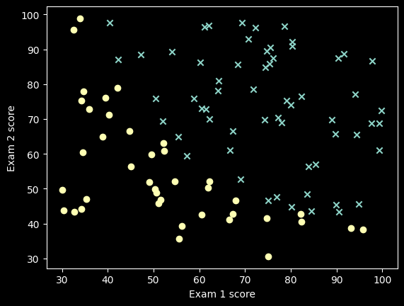
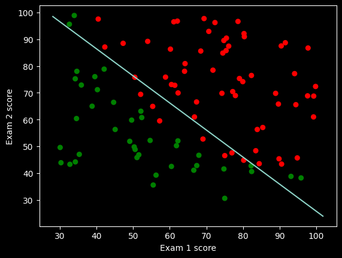
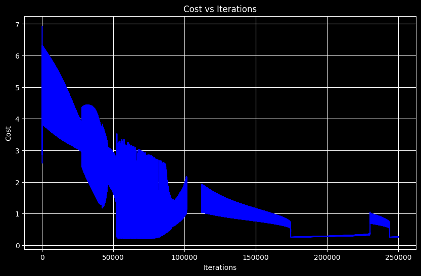

# Lab 03 实验报告

> 实验题目：求解对数几率回归问题

计算机与信息工程学院实验报告

## 实验题目

求解对数几率回归问题

## 实验目的

掌握对数几率回归的基本原理与实现

## 实验环境

Anaconda/Jupyter notebook

## 实验内容

（实验具体要求）

根据给定数据集（存放在data1.txt文件中，二分类数据），编码实现基于梯度下降的Logistic回归算法，并画出决策边界；

## 实验步骤

一、已经给定部分代码，补充完整的代码，需要补充代码的地方已经用红色字体标注，包括：

1. #补充计算代价的代码；
2. #补充参数更新代码；
3. #补充画决策边界的代码；
**二、提交的实验内容：** （1）补充完整的代码；（也可以自己重写这部分的代码提交）（2）数据散点图，以及得到的决策边界；（3）梯度下降过程中损失的变化图；（4）基于训练得到的参数，输入新的样本数据，输出预测值；

**实验数据记录**

1. (2)补充代码(但是功能不完整,需要修改一些)
```python
import numpy as np
import matplotlib.pyplot as plt
import matplotlib as mpl
from sklearn.metrics import accuracy_score
def loaddata():
data = np.loadtxt("data1.txt", delimiter=",")
n = data.shape[1] - 1 # 特征数
X = data[:, 0:n]
y = data[:, -1].reshape(-1, 1)
return X, y
def plot(X, y):
pos = np.where(y == 1)
neg = np.where(y == 0)
plt.scatter(X[pos[0], 0], X[pos[0], 1], marker="x")
plt.scatter(X[neg[0], 0], X[neg[0], 1], marker="o")
plt.xlabel("Exam 1 score")
plt.ylabel("Exam 2 score")
plt.show()
X, y = loaddata()
plot(X, y)
def sigmoid(z):
r = 1 / (1 + np.exp(-z))
return r
def hypothesis(X, theta):
z = np.dot(X, theta)
return sigmoid(z)
def computeCost(X, y, theta):
m = X.shape[0]
# 补充计算代价的代码；
h = hypothesis(X, theta)
z = -(y * np.log(h) + (1 - y) * np.log(1 - h))
return np.sum(z) / m
#########################
def gradientDescent(X, y, theta, iterations, alpha):
# 取数据条数
m = X.shape[0]
# 在x最前面插入全1的列
X = np.hstack((np.ones((m, 1)), X))
for i in range(iterations):
# 补充参数更新代码；
h = hypothesis(X, theta)
gradient = (1 / m) * np.dot(X.T, (h - y))
theta_temp = theta - alpha * gradient
theta = theta_temp
# 每迭代10000次输出一次损失值
if i % 10000 == 0:
print(
```

"第",

i,

**"次迭代，当前损失为：** ",

computeCost(X, y, theta),

"theta=",

theta.T,

)

```python
return theta
def predict(X):
# 在x最前面插入全1的列
c = np.ones(X.shape[0]).transpose()
X = np.insert(X, 0, values=c, axis=1)
# 求解假设函数的值
h = hypothesis(X, theta)
# 根据概率值决定最终的分类,>=0.5为1类，<0.5为0类
h[h >= 0.5] = 1
h[h < 0.5] = 0
return h
X, y = loaddata()
n = X.shape[1] # 特征数
theta = np.zeros(n + 1).reshape(n + 1, 1)
# theta是列向量,+1是因为求梯度时X前会增加一个全1列
theta_temp = np.zeros(n + 1).reshape(n + 1, 1)
iterations = 250000
alpha = 0.008
theta = gradientDescent(X, y, theta, iterations, alpha)
print("theta=\n", theta)
def plotDescisionBoundary(X, y, theta):
cm_dark = mpl.colors.ListedColormap(["g", "r"])
plt.xlabel("Exam 1 score")
plt.ylabel("Exam 2 score")
plt.scatter(X[:, 0], X[:, 1], c=np.array(y).squeeze(), cmap=cm_dark, s=30)
# 补充画决策边界代码；
x1 = np.array([np.min(X[:, 0]) - 2, np.max(X[:, 0]) + 2])
x2 = (-1 / theta[2]) * (theta[1] * x1 + theta[0])
plt.plot(x1, x2)
plt.show()
plotDescisionBoundary(X, y, theta)
```

更新代码之后

```python
import numpy as np
import matplotlib.pyplot as plt
import matplotlib as mpl
from sklearn.metrics import accuracy_score
def loaddata():
data = np.loadtxt("data1.txt", delimiter=",")
n = data.shape[1] - 1 # 特征数
X = data[:, 0:n]
y = data[:, -1].reshape(-1, 1)
return X, y
def plot(X, y):
pos = np.where(y == 1)
neg = np.where(y == 0)
plt.scatter(X[pos[0], 0], X[pos[0], 1], marker="x")
plt.scatter(X[neg[0], 0], X[neg[0], 1], marker="o")
plt.xlabel("Exam 1 score")
plt.ylabel("Exam 2 score")
plt.show()
X, y = loaddata()
plot(X, y)
def sigmoid(z):
r = 1 / (1 + np.exp(-z))
return r
def hypothesis(X, theta):
z = np.dot(X, theta)
return sigmoid(z)
def computeCost(X, y, theta):
m = X.shape[0]
# 补充计算代价的代码；
h = hypothesis(X, theta)
z = -(y * np.log(h) + (1 - y) * np.log(1 - h))
return np.sum(z) / m
def gradientDescent(X, y, theta, iterations, alpha):
# 取数据条数
m = X.shape[0]
# 在x最前面插入全1的列
X = np.hstack((np.ones((m, 1)), X))
cost_history = [] # 记录损失历史
for i in range(iterations):
# 补充参数更新代码；
h = hypothesis(X, theta)
gradient = (1 / m) * np.dot(X.T, (h - y))
theta_temp = theta - alpha * gradient
theta = theta_temp
# 记录当前损失
cost = computeCost(X, y, theta)
cost_history.append(cost)
# 每迭代10000次输出一次损失值
if i % 10000 == 0:
print(
```

"第",

i,

**"次迭代，当前损失为：** ",

cost,

"theta=",

theta.T,

)

```python
return theta, cost_history
def predict(X):
# 在x最前面插入全1的列
c = np.ones(X.shape[0]).transpose()
X = np.insert(X, 0, values=c, axis=1)
# 求解假设函数的值
h = hypothesis(X, theta)
# 根据概率值决定最终的分类,>=0.5为1类，<0.5为0类
h[h >= 0.5] = 1
h[h < 0.5] = 0
return h
X, y = loaddata()
n = X.shape[1] # 特征数
theta = np.zeros(n + 1).reshape(n + 1, 1)
# theta是列向量,+1是因为求梯度时X前会增加一个全1列
theta_temp = np.zeros(n + 1).reshape(n + 1, 1)
iterations = 250000
alpha = 0.008
theta, cost_history = gradientDescent(X, y, theta, iterations, alpha)
print("theta=\n", theta)
def plotDescisionBoundary(X, y, theta):
cm_dark = mpl.colors.ListedColormap(["g", "r"])
plt.xlabel("Exam 1 score")
plt.ylabel("Exam 2 score")
plt.scatter(X[:, 0], X[:, 1], c=np.array(y).squeeze(), cmap=cm_dark, s=30)
# 补充画决策边界代码；
x1 = np.array([np.min(X[:, 0]) - 2, np.max(X[:, 0]) + 2])
x2 = (-1 / theta[2]) * (theta[1] * x1 + theta[0])
plt.plot(x1, x2)
plt.show()
plotDescisionBoundary(X, y, theta)
# 绘制损失变化图
plt.figure(figsize=(10, 6))
plt.plot(range(len(cost_history)), cost_history, 'b-')
plt.xlabel('Iterations')
plt.ylabel('Cost')
plt.title('Cost vs Iterations')
plt.grid(True)
plt.show()
# 基于训练得到的参数，输入新的样本数据，输出预测值
test_sample1 = np.array([[45, 85]])
prediction1 = predict(test_sample1)
prob1 = hypothesis(np.insert(test_sample1, 0, 1, axis=1), theta)
print(f"样本1 (Exam1=45, Exam2=85):")
print(f" 预测类别: {int(prediction1[0, 0])}")
print(f" 预测概率: {prob1[0, 0]:.4f}")
test_sample2 = np.array([[60, 60]])
prediction2 = predict(test_sample2)
prob2 = hypothesis(np.insert(test_sample2, 0, 1, axis=1), theta)
print(f"\n样本2 (Exam1=60, Exam2=60):")
print(f" 预测类别: {int(prediction2[0, 0])}")
print(f" 预测概率: {prob2[0, 0]:.4f}")
```

**结果**

(2)



theta=

[[-47.83959574]

[ 0.38110027]

[ 0.37721366]]



(3)



(4)

```python
样本1 (Exam1=45, Exam2=85):
```

**预测类别：** 1

**预测概率：** 0.7979

```python
样本2 (Exam1=60, Exam2=60):
```

**预测类别：** 0

**预测概率：** 0.0878

## 问题讨论

学习率和迭代次数的选择

一开始使用学习率α=0.008和迭代次数250000次,发现训练时间比较长。调整了不同的学习率:

当α=0.01时,收敛速度更快,但有时会出现震荡

当α=0.001时,收敛很平稳但需要更多迭代次数

最终选择α=0.008是一个比较折中的选择

从损失变化图可以看出,在前几万次迭代中损失下降很快,之后逐渐趋于平缓,这说明模型已经基本收敛了。
