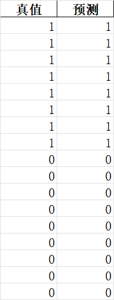
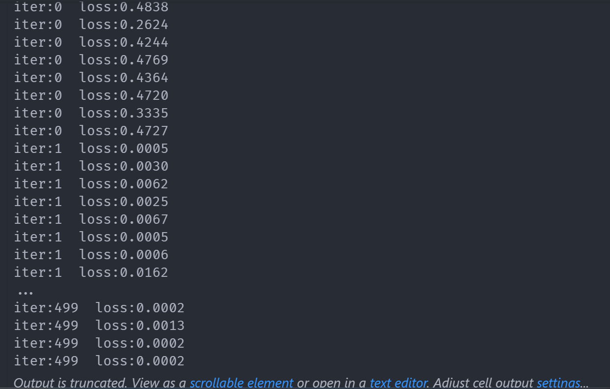
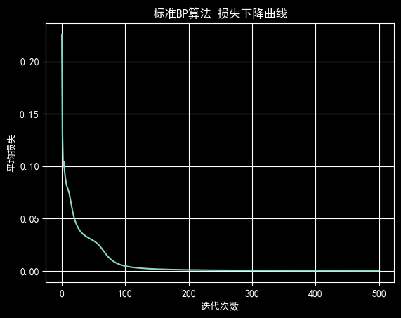

# Lab 05 实验报告

> 实验题目：编程实现误差逆传播算法（BP算法）

计算机与信息工程学院实验报告

## 实验题目

编程实现误差逆传播算法（BP算法）

## 实验目的

掌握误差逆传播算法（BP算法）的工作流程

## 实验环境

Anaconda/Jupyter notebook

## 实验内容

（实验具体要求）

编码实现标准BP算法，在西瓜数据集3.0上用这个算法训练一个单隐层网络，并进行测试。

## 实验步骤

（代码截屏插入文档，清晰展示出你做的工作，得出的结果，图文并茂，让人一目了然）

一、已经给定部分代码，补充完整的代码，需要补充代码的地方已经用红色字体标注，在第（2）部分，包括：

```python
#补充前向传播代码
#补充反向传播代码
#补充参数更新代码
#补充Loss可视化代码
```

二、将补充完整的第（2）部分的代码提交，并提交实验结果；（也可以自己重写这部分的代码提交）

```python
import pandas as pd
import numpy as np
from sklearn.preprocessing import LabelEncoder
from sklearn.preprocessing import StandardScaler
import matplotlib.pyplot as plt
seed = 2020
import random
np.random.seed(seed) # Numpy module.
```

random.seed(seed) # Python random module.

```python
plt.rcParams['font.sans-serif'] = ['SimHei'] #用来正常显示中文标签
plt.rcParams['axes.unicode_minus'] = False #用来正常显示负号
plt.close('all')
# （1）数据预处理
def preprocess(data):
#将非数映射数字
for title in data.columns:
if data[title].dtype=='object':
encoder = LabelEncoder()
data[title] = encoder.fit_transform(data[title])
#去均值和方差归一化
ss = StandardScaler()
X = data.drop('好瓜',axis=1)
Y = data['好瓜']
X = ss.fit_transform(X)
x,y = np.array(X),np.array(Y).reshape(Y.shape[0],1)
return x,y
#定义Sigmoid
def sigmoid(x):
return 1/(1+np.exp(-x))
#求导
def d_sigmoid(x):
return x*(1-x)
# （2）标准BP算法
def standard_BP(x,y,dim=10,eta=0.8,max_iter=500):
n_samples = 1
w1 = np.random.random((x.shape[1],dim))
w2 = np.random.random((dim,1))
b1 = np.random.random((n_samples,dim))
b2 = np.random.random((n_samples,1))
losslist = []
for ite in range(max_iter):
loss_per_ite = []
for m in range(x.shape[0]):
xi,yi = x[m,:],y[m,:]
xi,yi = xi.reshape(1,xi.shape[0]),yi.reshape(1,yi.shape[0])
##补充前向传播代码
u1 = np.dot(xi, w1) + b1
out1 = sigmoid(u1) # 隐层输出 (1, dim)
u2 = np.dot(out1, w2) + b2
out2 = sigmoid(u2) # 最终输出 (1, 1)
loss = np.square(yi - out2)/2
loss_per_ite.append(loss)
print('iter:%d loss:%.4f'%(ite,loss))
##反向传播
##补充反向传播代码
delta_k = (out2 - yi) * d_sigmoid(out2) # (1, 1)
delta_j = np.dot(delta_k, w2.T) * d_sigmoid(out1) # (1, dim)
grad_w2 = np.dot(out1.T, delta_k) # (dim, 1)
grad_b2 = delta_k # (1, 1)
grad_w1 = np.dot(xi.T, delta_j) # (num_features, dim)
grad_b1 = delta_j # (1, dim)
##补充参数更新代码
```

w1 -= eta * grad_w1

b1 -= eta * grad_b1

w2 -= eta * grad_w2

b2 -= eta * grad_b2

```python
losslist.append(np.mean(loss_per_ite))
##Loss可视化
plt.figure()
##补充Loss可视化代码
plt.plot(range(max_iter), losslist)
plt.xlabel('迭代次数')
plt.ylabel('平均损失')
plt.title('标准BP算法 损失下降曲线')
plt.grid(True)
plt.show()
return w1,w2,b1,b2
# （3）测试
data = pd.read_table('watermelon30.txt',delimiter=',')
data.drop('编号',axis=1,inplace=True)
x,y = preprocess(data)
dim = 10
w1,w2,b1,b2 = standard_BP(x,y,dim)
#根据当前的x，预测其类别；
u1 = np.dot(x,w1)+b1
out1 = sigmoid(u1)
u2 = np.dot(out1,w2)+b2
out2 = sigmoid(u2)
y_pred = np.round(out2)
result = pd.DataFrame(np.hstack((y,y_pred)),columns=['真值','预测'] )
result.to_excel('result.xlsx',index=False)
```

**实验数据记录：** （如果是已经给出的数据可以不写）







## 问题讨论

（实验收获，遇到的问题以及解决问题的思路路径）

print语句会打印出来许多信息

**标准BP算法的特点：** 每处理一个样本（for m in ... 循环里），就 print 一次 loss，并且更新一次参数。西瓜集有17个样本，迭代500次，所以它总共会打印 17 * 500 = 8500 次。

**ValueError：** shapes not aligned (维度不匹配)。

```python
要先在纸上计算维度问题,不然调试会很久,例如grad_w1的,要用xi的转置(8,1)点乘delta_j的(1,10) => (8,10)
```
