# Lab 06 实验报告

> 实验题目：全连接神经网络

计算机与信息工程学院实验报告

## 实验题目

全连接神经网络

## 实验目的

掌握全连接神经网络用于回归和分类的工作流程

## 实验环境

Anaconda/Jupyter notebook

## 实验内容

（实验具体要求）

使用发布的“nihe.csv”数据集，使用前三列作为输入特征，最后一列作为回归标签，构建一个全连接神经网络，进行标量回归任务。画出训练集和验证集的损失变化曲线，以及测试集的真实值vs预测值曲线。

使用Keras框架下的MNIST手写数字数据集，搭建一个全连接神经网络，进行手写数字分类任务，画出训练集和验证集的损失变化曲线，以及对测试集的评估结果（准确率）。

CIFAR-10和CIFAR-100是来自于80 million张小型图片的数据集，图片收集者是Alex Krizhevsky, Vinod Nair, and Geoffrey Hinton。暂时先不管CIFAR-100数据集，以下是CIFAR-10数据集介绍：

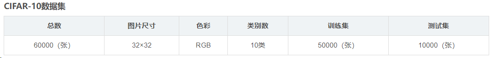

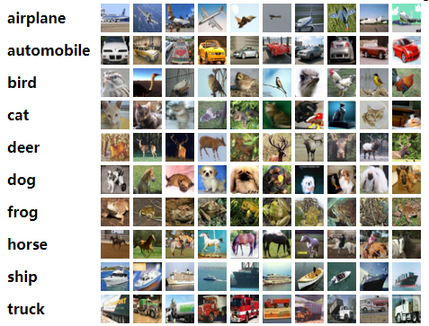

Keras中，可以用load_data()函数进行加载，与MNIST数据集加载方式类似，具体加载示例如下：

**实验要求：** 参考第2题中MNIST数据集的分类网络（全连接神经网络），在其基础上进行适当修改，使之能正确运行，从而进行图片分类任务。

使用CIFAR-10数据集，搭建一个卷积神经网络对图片进行分类（可参考PPT课件提供的案例），并与第3题中全连接神经网络结果进行对比。思考：从两种网络的参数量和准确率等方面对网络的性能进行综合评估。

## 实验步骤

（代码截屏插入文档，清晰展示出你做的工作，得出的结果，图文并茂，让人一目了然）

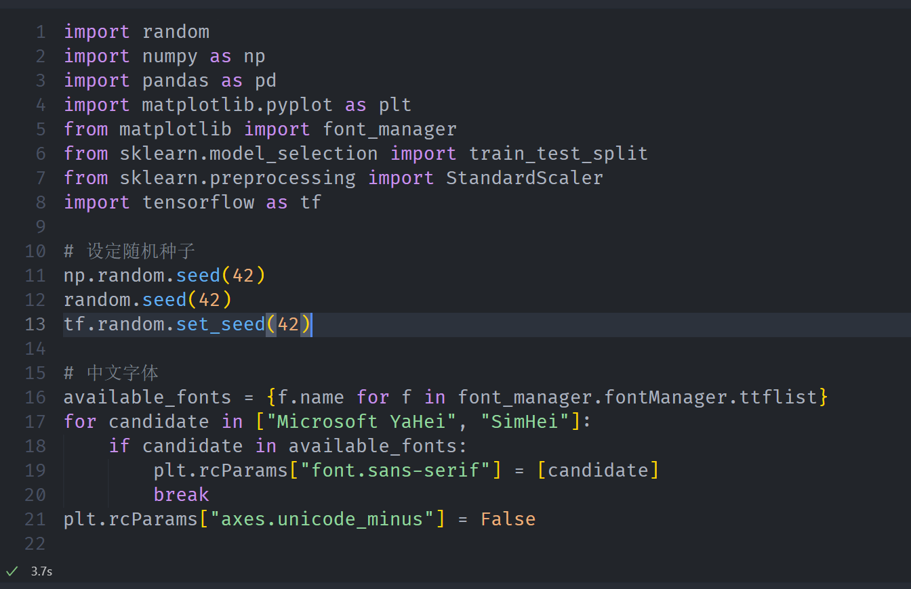

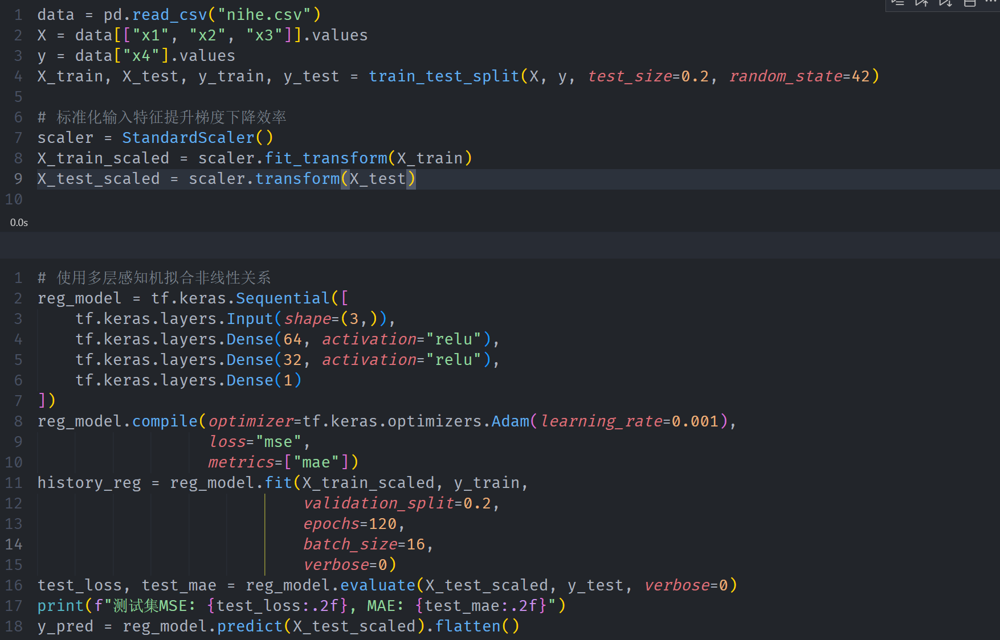

**测试集MSE：** 2.99, MAE: 1.27

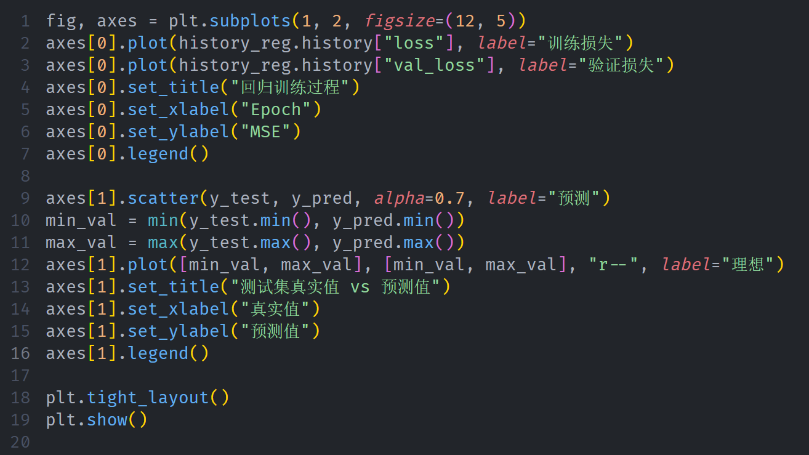

MNIST全连接分类实验

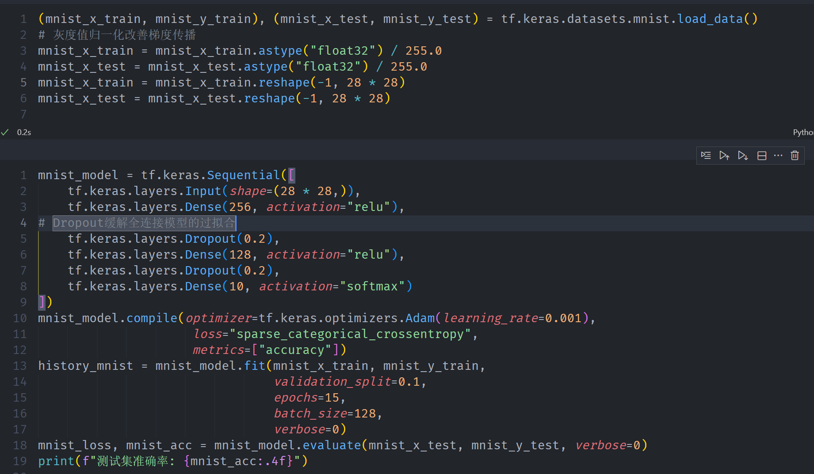

**测试集准确率：** 0.9830

CIFAR-10全连接与卷积网络对比

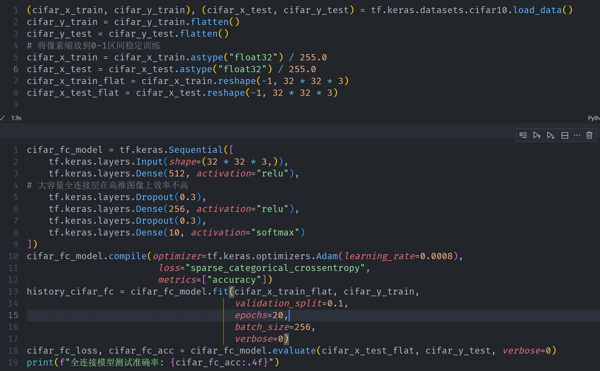

**全连接模型测试准确率：** 0.4672

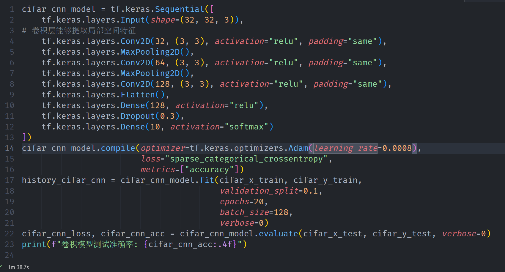

**卷积模型测试准确率：** 0.7260

**实验数据记录：** （如果是已经给出的数据可以不写）

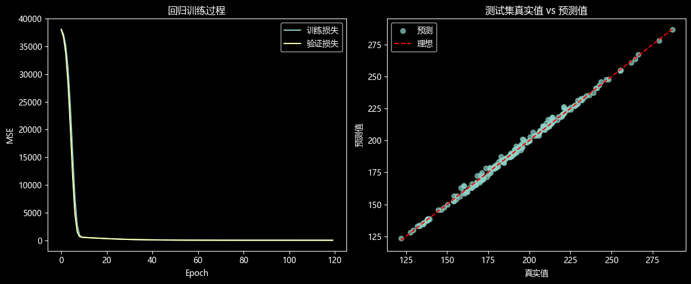

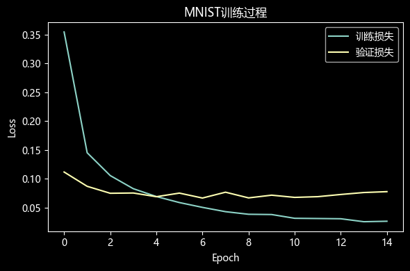

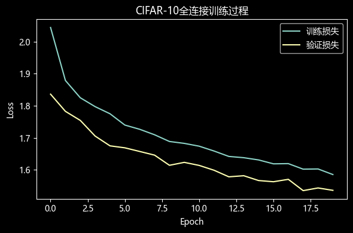

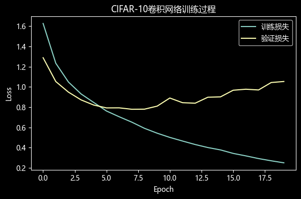

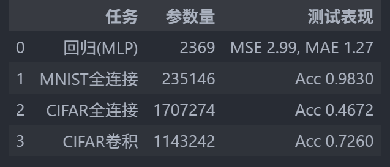

## 问题讨论

（实验收获，遇到的问题以及解决问题的思路路径）

回归任务通过标准化和MLP拟合效果较好，预测图检验了拟合情况。

MNIST全连接网络达到较高准确率，验证曲线帮助监控过拟合。

CIFAR-10中卷积网络的泛化能力显著优于全连接结构，参数量与精度同时提升。
