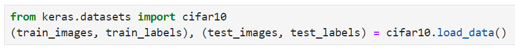
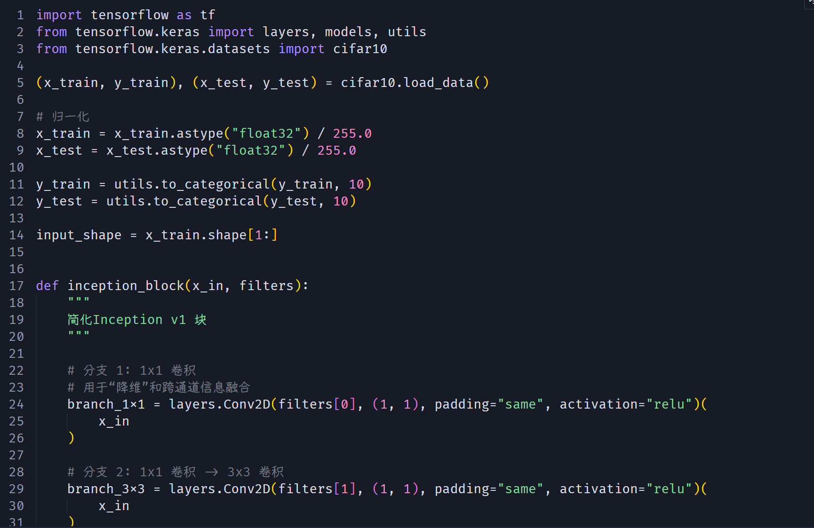
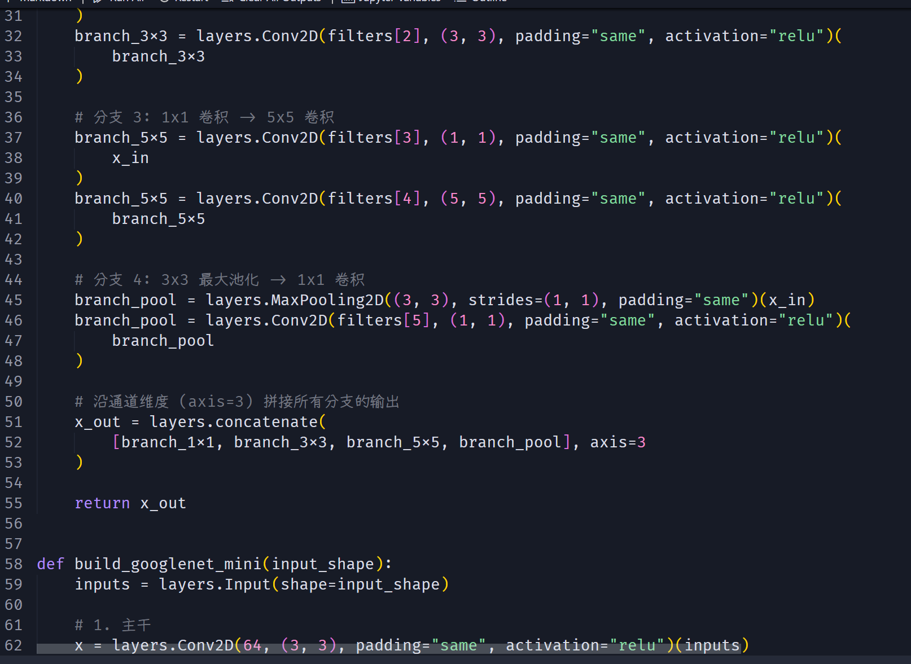
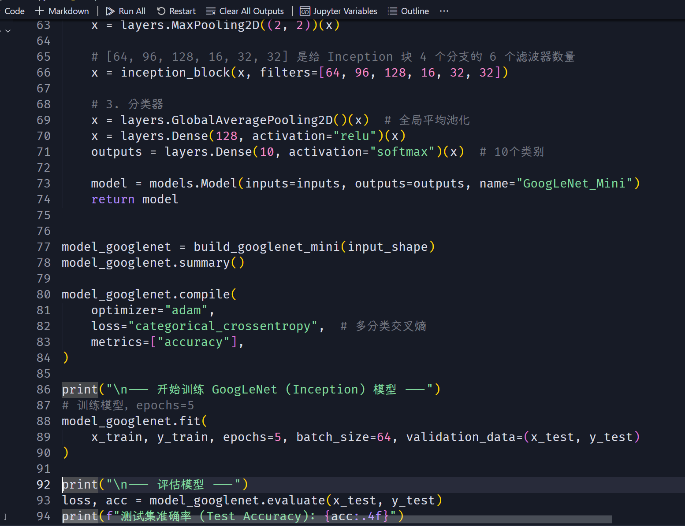
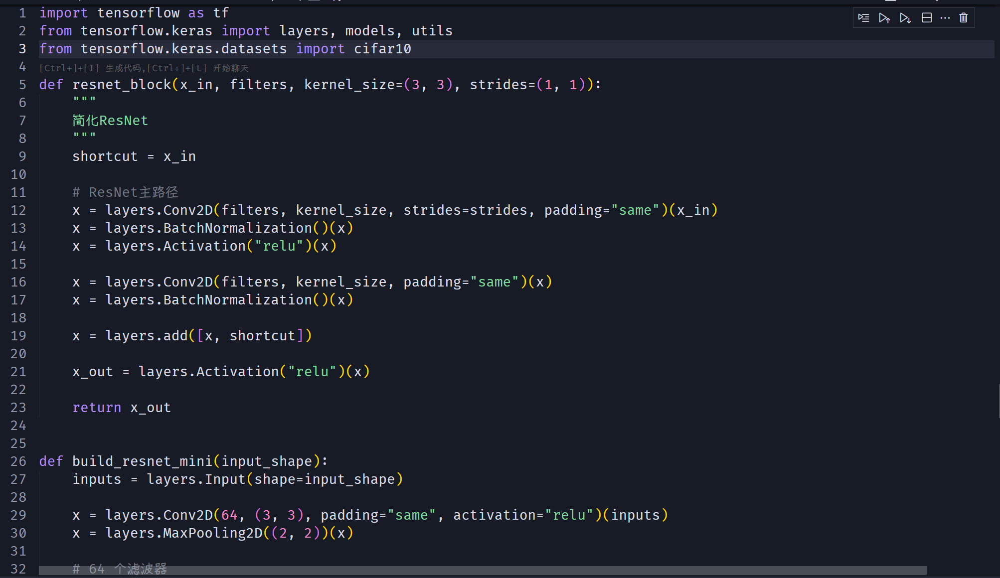
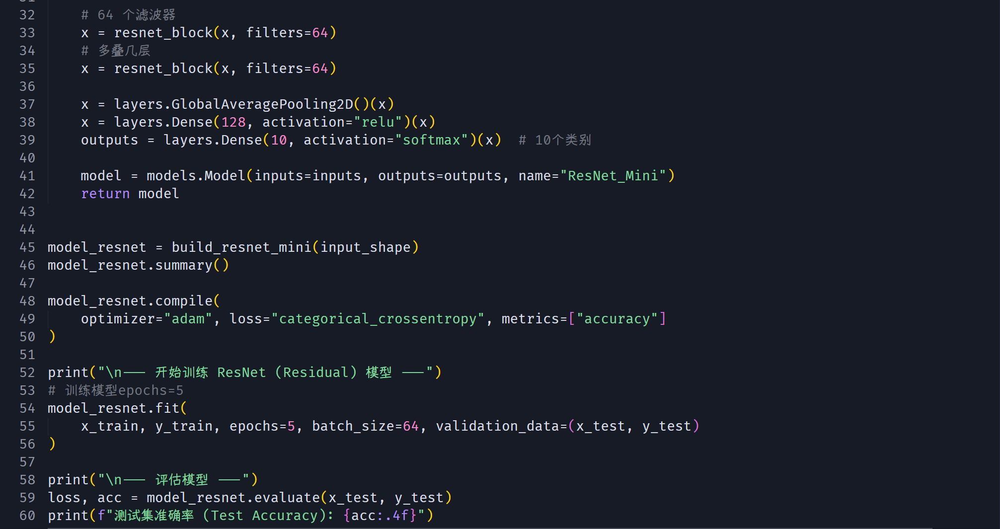
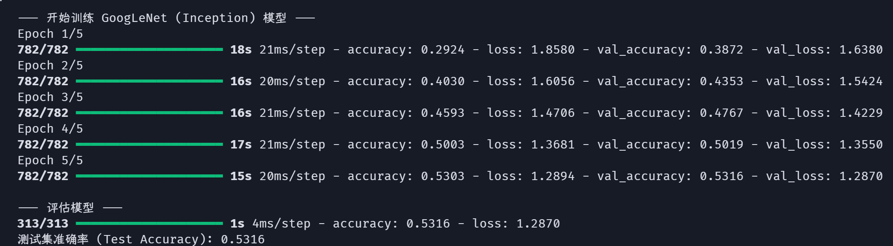
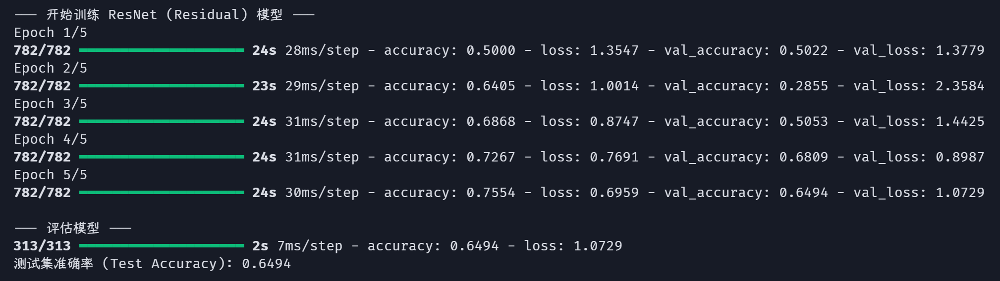

# Lab 07 实验报告

> 实验题目：卷积神经网络

计算机与信息工程学院实验报告

## 实验题目

卷积神经网络

## 实验目的

掌握卷积神经网络用于多分类的工作流程

## 实验环境

Anaconda/Jupyter notebook

## 实验内容

（实验具体要求）

CIFAR-10和CIFAR-100是来自于80 million张小型图片的数据集，图片收集者是Alex Krizhevsky, Vinod Nair, and Geoffrey Hinton。暂时先不管CIFAR-100数据集，以下是CIFAR-10数据集介绍：

Keras中，可以用load_data()进行加载，与MNIST数据集加载方式类似，具体加载示例如下：

**实验要求：** 参考本周PPT讲解内容，用卷积神经网络实现GoogleNet和ResNet进行上述图像数据集分类任务。只需搭建一个Inception块和ResNet块。迭代次数设置在5-10即可。

## 实验步骤

（代码截屏插入文档，清晰展示出你做的工作，得出的结果，图文并茂，让人一目了然）

GoogLeNet (Inception) 模型

ResNet (Residual) 模型

**实验数据记录：** （如果是已经给出的数据可以不写）

GoogLeNet (Inception) 模型

ResNet

## 问题讨论

（实验收获，遇到的问题以及解决问题的思路路径）

## 实验收获

通过实现Inception块和ResNet块 理解了现代卷积神经网络的核心设计思想以及多分类任务实践经验 掌握了使用CNN处理复杂图像分类任务的完整流程

**Keras层维度不匹配**

**在Inception中：** 4个并行的分支必须产生具有相同空间维度的输出，才能在通道维度上进行拼接。

**在ResNet中：** “捷径”x与主路径的输出F(x)必须具有完全相同的形状（batch, height, width, channel），才能执行layers.add元素-wise的相加。
