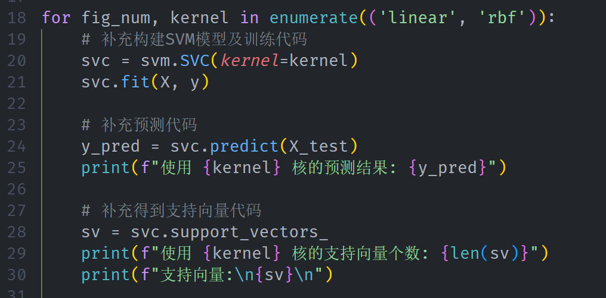
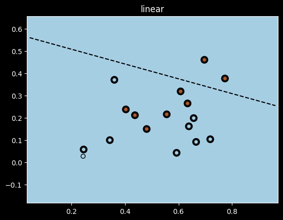
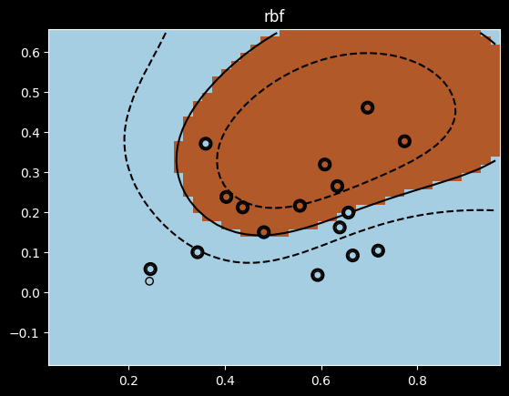

# Lab 08 实验报告

> 实验题目：用线性核与高斯核训练支持向量机

计算机与信息工程学院实验报告

## 实验题目

用线性核与高斯核训练支持向量机

## 实验目的

掌握支持向量机的原理及应用

## 实验环境

Anaconda/Jupyter notebook

## 实验内容

（实验具体要求）

一、已经给定部分代码，补充完整的代码，需要补充代码的地方已经用红色字体标注，包括：

1. #补充构建SVM模型及训练代码
2. #补充预测代码
3. #补充得到支持向量代码
二、将补充完整的代码提交，并提交实验结果；（也可以自己重写这部分的代码提交）

```python
data_file_watermelon_3a = "watermelon_3a.csv"
import pandas as pd
import numpy as np
import matplotlib.pyplot as plt
df = pd.read_csv(data_file_watermelon_3a, header=None, )
df.columns = ['id', 'density', 'sugar_content', 'label']
df.set_index(['id'])
X = df[['density', 'sugar_content']].values
y = df['label'].values
########## SVM training and comparison
# based on linear kernel as well as gaussian kernel
from sklearn import svm
for fig_num, kernel in enumerate(('linear', 'rbf')):
#补充构建SVM模型及训练代码
#给定新的样本X_test，预测其标签
X_test = [[0.719,0.103]]
#补充预测代码
#补充得到支持向量代码
##### draw decision zone
plt.figure(fig_num)
plt.clf()
# plot point and mark out support vectors
plt.scatter( X[:,0], X[:,1], edgecolors='k', c=y, cmap=plt.cm.Paired, zorder=10)
plt.scatter(sv[:,0], sv[:,1], edgecolors='k', facecolors='none', s=80, linewidths=2, zorder=10)
# plot the decision boundary and decision zone into a color plot
x_min, x_max = X[:, 0].min() - 0.2, X[:, 0].max() + 0.2
y_min, y_max = X[:, 1].min() - 0.2, X[:, 1].max() + 0.2
XX, YY = np.meshgrid(np.arange(x_min, x_max, 0.02), np.arange(y_min, y_max, 0.02))
Z = svc.decision_function(np.c_[XX.ravel(), YY.ravel()])
Z = Z.reshape(XX.shape)
plt.pcolormesh(XX, YY, Z>0, cmap=plt.cm.Paired)
plt.contour(XX, YY, Z, colors=['k', 'k', 'k'], linestyles=['--', '-', '--'], levels=[-.5, 0, .5])
plt.title(kernel)
plt.axis('tight')
plt.show()
```

## 实验步骤

（代码截屏插入文档，清晰展示出你做的工作，得出的结果，图文并茂，让人一目了然）



补充的代码如图

**实验数据记录：** （如果是已经给出的数据可以不写）

使用 linear 核的预测结果: [0]

使用 linear 核的支持向量个数: 16

**支持向量**

[[0.666 0.091]

[0.245 0.057]

[0.343 0.099]

[0.639 0.161]

[0.657 0.198]

[0.36 0.37 ]

[0.593 0.042]

[0.719 0.103]

[0.697 0.46 ]

[0.774 0.376]

[0.634 0.264]

[0.608 0.318]

[0.556 0.215]

[0.403 0.237]

[0.481 0.149]

[0.437 0.211]]

使用 rbf 核的预测结果: [0]

使用 rbf 核的支持向量个数: 16

**支持向量**

[[0.666 0.091]

[0.245 0.057]

[0.343 0.099]

[0.639 0.161]

[0.657 0.198]

[0.36 0.37 ]

[0.593 0.042]

[0.719 0.103]

[0.697 0.46 ]

[0.774 0.376]

[0.634 0.264]

[0.608 0.318]

[0.556 0.215]

[0.403 0.237]

[0.481 0.149]

[0.437 0.211]]





## 问题讨论

（实验收获，遇到的问题以及解决问题的思路路径）

```python
使用 svm.SVC(kernel=kernel) 创建SVM分类器
```

使用 fit(X, y) 方法进行模型训练

使用predict() 方法进行样本预测

**线性核：** 决策边界为直线，适用于线性可分的数据

**高斯核：** 可以构建非线性决策边界，适用于更复杂的数据分布

通过本次实验，验证了SVM在小样本数据集上的分类能力。线性核和高斯核虽然支持向量数量相同，但决策边界形态不同：线性核形成直线边界，高斯核形成曲线边界，能更好地拟合数据的非线性分布特征。
