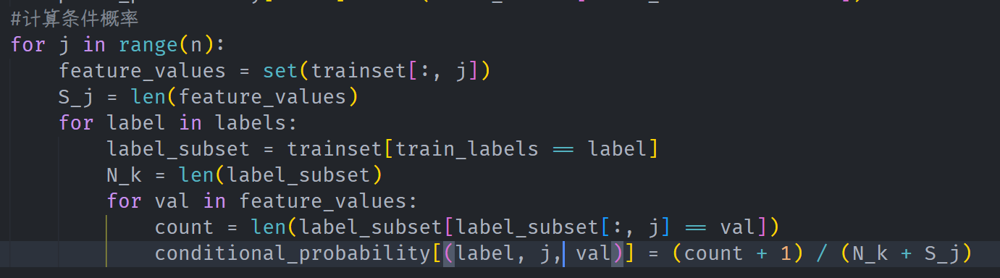
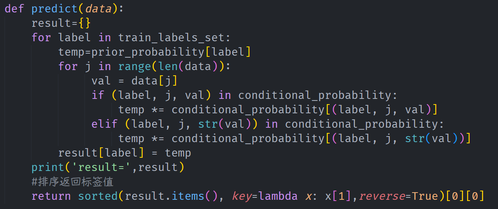

# Lab 09 实验报告

> 实验题目：实现拉普拉斯修正的朴素贝叶斯分类器

计算机与信息工程学院实验报告

## 实验题目

实现拉普拉斯修正的朴素贝叶斯分类器

## 实验目的

掌握朴素贝叶斯分类器的原理及应用

## 实验环境

Anaconda/Jupyter notebook

## 实验内容

（实验具体要求）

编码实现拉普拉斯修正的朴素贝叶斯分类器，基于给定的训练数据，对测试样本进行判别。

一、已经给定部分代码，补充完整的代码，需要补充代码的地方已经用红色字体标注，包括：

1. #补充计算条件概率的代码；
2. #补充预测代码；
二、将补充完整的代码提交，并提交实验结果；（也可以自己重写这部分的代码提交）

```python
import numpy as np
def loaddata():
X = np.array([[1,'S'],[1,'M'],[1,'M'],[1,'S'],
```

[1, 'S'], [2, 'S'], [2, 'M'], [2, 'M'],

[2, 'L'], [2, 'L'], [3, 'L'], [3, 'M'],

[3, 'M'], [3, 'L'], [3, 'L']])

```python
y = np.array([-1,-1,1,1,-1,-1,-1,1,1,1,1,1,1,1,-1])
return X, y
def Train(trainset,train_labels):
m = trainset.shape[0]
n = trainset.shape[1]
prior_probability = {}# 先验概率 key是类别值，value是类别的概率值
conditional_probability ={}# 条件概率 key的构造：类别，特征,特征值
#类别的可能取值
labels = set(train_labels)
# 计算先验概率(此时没有除以总数据量m)
for label in labels:
prior_probability[label] = len(train_labels[train_labels == label])+1
#计算条件概率
#补充计算条件概率的代码；
# 最终的先验概率(此时除以总数据量m)
for label in labels:
prior_probability[label] = prior_probability[label]/ (m+len(labels))
return prior_probability,conditional_probability_final,labels
def predict(data):
result={}
for label in train_labels_set:
temp=1.0
#补充预测代码；
print('result=',result)
#排序返回标签值
return sorted(result.items(), key=lambda x: x[1],reverse=True)[0][0]
X,y = loaddata()
prior_probability,conditional_probability,train_labels_set = Train(X,y)
r_label = predict([2,'S'])
print(' r_label =', r_label)
```

## 实验步骤

（代码截屏插入文档，清晰展示出你做的工作，得出的结果，图文并茂，让人一目了然）





**实验数据记录：** （如果是已经给出的数据可以不写）

```python
result= {np.int64(1): 0.0326797385620915, np.int64(-1): 0.06100217864923746}
r_label = -1
```

## 问题讨论

（实验收获，遇到的问题以及解决问题的思路路径）

**深入理解朴素贝叶斯原理：** 实现Train和predict函数，理解了朴素贝叶斯分类器的核心——利用贝叶斯公式和特征条件独立假设，将复杂的联合概率计算简化为先验概率与各个特征条件概率乘积的计算。

**掌握拉普拉斯平滑的作用：** 在计算条件概率时，如果某个特征值在训练集中未出现，会导致该类别的后验概率为0，从而无法分类。实验中通过引入拉普拉斯平滑，有效地解决了“零概率”问题，提高了模型的泛化能力。
