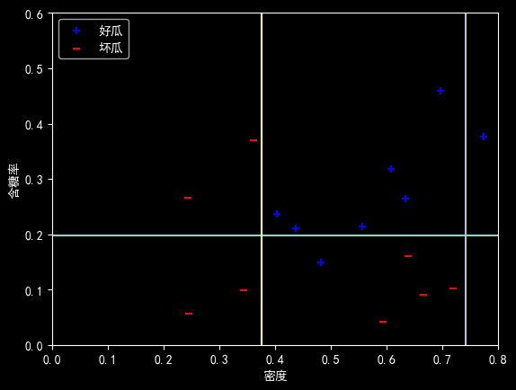
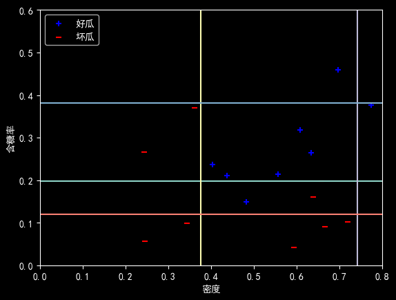
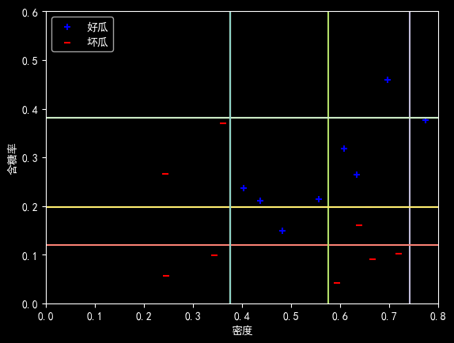

# Lab 10 实验报告

> 实验题目：编程实现AdaBoost分类器

计算机与信息工程学院实验报告

## 实验题目

编程实现AdaBoost分类器

## 实验目的

掌握AdaBoost算法的求解过程

## 实验环境

Anaconda/Jupyter notebook

## 实验内容

（实验具体要求）

编程实现AdaBoost，以不剪枝决策树为基学习器，在西瓜数据集3.0α上训练一个AdaBoost集成，并与图8.4进行比较.

## 实验步骤

（代码截屏插入文档，清晰展示出你做的工作，得出的结果，图文并茂，让人一目了然）

```python
import numpy as np
import matplotlib.pyplot as plt
from numpy import linspace
plt.rcParams['font.sans-serif'] = ['SimHei']
plt.rcParams['axes.unicode_minus'] = False
def getDataSet():
```

"""

西瓜数据集3.0alpha。 列：[密度，含糖量，好瓜]

:return: np数组。

"""

```python
dataSet = [
```

[0.697, 0.460, '是'],

[0.774, 0.376, '是'],

[0.634, 0.264, '是'],

[0.608, 0.318, '是'],

[0.556, 0.215, '是'],

[0.403, 0.237, '是'],

[0.481, 0.149, '是'],

[0.437, 0.211, '是'],

[0.666, 0.091, '否'],

[0.243, 0.267, '否'],

[0.245, 0.057, '否'],

[0.343, 0.099, '否'],

[0.639, 0.161, '否'],

[0.657, 0.198, '否'],

[0.360, 0.370, '否'],

[0.593, 0.042, '否'],

[0.719, 0.103, '否']

]

```python
for i in range(len(dataSet)):
if dataSet[i][-1] == '是':
dataSet[i][-1] = 1
else:
dataSet[i][-1] = -1
return np.array(dataSet)
def calErr(dataSet, feature, threshVal, inequal, D):
```

"""

计算数据带权值的错误率。

:param dataSet: [密度，含糖量，好瓜]

:param feature: [密度，含糖量]

:param threshVal:

:param inequal: 'lt' or 'gt. (大于或小于）

:param D: 数据的权重。错误分类的数据权重会大。

:return: 错误率。

"""

```python
DFlatten = D.flatten() #
errCnt = 0
i = 0
if inequal == 'lt': #
for data in dataSet:
if (data[feature] <= threshVal and data[-1] == -1) or \
(data[feature] > threshVal and data[-1] == 1): #
errCnt += 1 * DFlatten[i] # 累加错误样本的权重
```

i += 1

```python
else:
for data in dataSet:
if (data[feature] >= threshVal and data[-1] == -1) or \
(data[feature] < threshVal and data[-1] == 1):
errCnt += 1 * DFlatten[i]
```

i += 1

```python
return errCnt
def buildStump(dataSet, D):
```

"""

通过带权重的数据，建立错误率最小的决策树桩。

:param dataSet:

:param D:

:return: 包含建立好的决策树桩的信息,如feature，threshVal，inequal，err。

"""

```python
m, n = dataSet.shape
bestErr = np.inf
bestStump = {}
numSteps = 16.0 #
for i in range(n-1): # 遍历每一个特征
rangeMin = dataSet[:, i].min()
rangeMax = dataSet[:, i].max() #
stepSize = (rangeMax - rangeMin) / numSteps #
for j in range(m): # 遍历步长
threVal = rangeMin + float(j) * stepSize #
#threVal = dataSet[j][i]
for inequal in ['lt', 'gt']: # 遍历不等号方向
err = calErr(dataSet, i, threVal, inequal, D) # 计算错误率
if err < bestErr: # 保存最小错误率对应的树桩
bestErr = err
bestStump["feature"] = i
bestStump["threshVal"] = threVal
bestStump["inequal"] = inequal
bestStump["err"] = err
return bestStump
def predict(data, bestStump):
```

"""

通过决策树桩预测数据

:param data: 待预测数据

:param bestStump: 决策树桩。

:return:

"""

```python
if bestStump["inequal"] == 'lt':
if data[bestStump["feature"]] <= bestStump["threshVal"]:
return 1
else:
return -1
else:
if data[bestStump["feature"]] >= bestStump["threshVal"]:
return 1
else:
return -1
def AdaBoost(dataSet, T):
```

"""

每学到一个学习器，根据其错误率确定两件事。

1. 确定该学习器在总学习器中的权重。正确率越高，权重越大。
2. 调整训练样本的权重。被该学习器误分类的数据提高权重，正确的降低权重，
目的是在下一轮中重点关注被误分的数据，以得到更好的效果。

:param dataSet: 数据集。

:param T: 迭代次数，即训练多少个分类器

:return: 字典，包含了T个分类器。

"""

```python
m, n = dataSet.shape
D = np.ones((1, m)) / m # 初始化权重 D
classLabel = dataSet[:, -1].reshape(1, -1) #
G = {} #
for t in range(T):
stump = buildStump(dataSet, D) # 建立树桩
err = stump["err"]
alpha = np.log((1 - err) / err) / 2 # 计算分类器权重 alpha
pre = np.zeros((1, m))
for i in range(m):
pre[0][i] = predict(dataSet[i], stump)
a = np.exp(-alpha * classLabel * pre)
D = D * a / np.dot(D, a.T) # 更新样本权重 D
G[t] = {}
G[t]["alpha"] = alpha
G[t]["stump"] = stump
return G
def adaPredic(data, G):
```

"""

通过Adaboost得到的总的分类器来进行分类。

:param data: 待分类数据。

:param G: 字典，包含了多个决策树桩

:return: 预测值

"""

```python
score = 0
for key in G.keys():
pre = predict(data, G[key]["stump"]) #
score += G[key]["alpha"] * pre # 累加加权预测值
flag = 0
if score > 0:
flag = 1
else:
flag = -1
return flag
def calcAcc(dataSet, G):
```

"""

计算准确度

:param dataSet: 数据集

:param G: 字典，包含了多个决策树桩

:return:

"""

```python
rightCnt = 0
for data in dataSet:
pre = adaPredic(data, G)
if pre == data[-1]:
```

rightCnt += 1

```python
return rightCnt / float(len(dataSet))
# 绘制数据集，clf为获得的集成学习器
def plotData(data, clf):
X1, X2 = [], []
Y1, Y2 = [], []
datas=data
labels=data[:,2]
#print(np.argwhere(data==1))
for data, label in zip(datas, labels):
if label > 0:
X1.append(data[0])
Y1.append(data[1])
else:
X2.append(data[0])
Y2.append(data[1])
x = linspace(0, 0.8, 100)
y = linspace(0, 0.6, 100)
for key in clf.keys():
#print(clf[key]["stump"]["threshVal"])
z = [clf[key]["stump"]["threshVal"]]*100
if clf[key]["stump"]["feature"] == 0:
plt.plot(z, y)
else:
plt.plot(x, z)
plt.scatter(X1, Y1, marker='+', label='好瓜', color='b')
plt.scatter(X2, Y2, marker='_', label='坏瓜', color='r')
plt.xlabel('密度')
plt.ylabel('含糖率')
plt.xlim(0, 0.8) # 设置x轴范围
plt.ylim(0, 0.6) # 设置y轴范围
plt.legend(loc='upper left')
plt.show()
def main():
dataSet = getDataSet()
for t in [3, 5, 11]: # 学习器的数量
G = AdaBoost(dataSet, t)
print('集成学习器（字典）：',f"G{t} = {G}")
print('准确率=',calcAcc(dataSet, G))
#绘图函数
plotData(dataSet,G)
if __name__ == '__main__':
main()
```

**实验数据记录：** （如果是已经给出的数据可以不写）

```python
集成学习器（字典）： G3 = {0: {'alpha': np.float64(0.7702225204735745), 'stump': {'feature': 1, 'threshVal': np.float64(0.19875), 'inequal': 'gt', 'err': np.float64(0.1764705882352941)}}, 1: {'alpha': np.float64(0.7630281517475247), 'stump': {'feature': 0, 'threshVal': np.float64(0.37575000000000003), 'inequal': 'gt', 'err': np.float64(0.17857142857142855)}}, 2: {'alpha': np.float64(0.5988515956561702), 'stump': {'feature': 0, 'threshVal': np.float64(0.7408125000000001), 'inequal': 'gt', 'err': np.float64(0.23188405797101452)}}}
```

准确率= 0.9411764705882353



```python
集成学习器（字典）： G5 = {0: {'alpha': np.float64(0.7702225204735745), 'stump': {'feature': 1, 'threshVal': np.float64(0.19875), 'inequal': 'gt', 'err': np.float64(0.1764705882352941)}}, 1: {'alpha': np.float64(0.7630281517475247), 'stump': {'feature': 0, 'threshVal': np.float64(0.37575000000000003), 'inequal': 'gt', 'err': np.float64(0.17857142857142855)}}, 2: {'alpha': np.float64(0.5988515956561702), 'stump': {'feature': 0, 'threshVal': np.float64(0.7408125000000001), 'inequal': 'gt', 'err': np.float64(0.23188405797101452)}}, 3: {'alpha': np.float64(0.517116813427337), 'stump': {'feature': 1, 'threshVal': np.float64(0.12037500000000001), 'inequal': 'gt', 'err': np.float64(0.2622641509433963)}}, 4: {'alpha': np.float64(0.38449883125155576), 'stump': {'feature': 1, 'threshVal': np.float64(0.381625), 'inequal': 'gt', 'err': np.float64(0.31669597186700765)}}}
```

准确率= 0.9411764705882353



```python
集成学习器（字典）： G11 = {0: {'alpha': np.float64(0.7702225204735745), 'stump': {'feature': 1, 'threshVal': np.float64(0.19875), 'inequal': 'gt', 'err': np.float64(0.1764705882352941)}}, 1: {'alpha': np.float64(0.7630281517475247), 'stump': {'feature': 0, 'threshVal': np.float64(0.37575000000000003), 'inequal': 'gt', 'err': np.float64(0.17857142857142855)}}, 2: {'alpha': np.float64(0.5988515956561702), 'stump': {'feature': 0, 'threshVal': np.float64(0.7408125000000001), 'inequal': 'gt', 'err': np.float64(0.23188405797101452)}}, 3: {'alpha': np.float64(0.517116813427337), 'stump': {'feature': 1, 'threshVal': np.float64(0.12037500000000001), 'inequal': 'gt', 'err': np.float64(0.2622641509433963)}}, 4: {'alpha': np.float64(0.38449883125155576), 'stump': {'feature': 1, 'threshVal': np.float64(0.381625), 'inequal': 'gt', 'err': np.float64(0.31669597186700765)}}, 5: {'alpha': np.float64(0.47604085356392073), 'stump': {'feature': 0, 'threshVal': np.float64(0.37575000000000003), 'inequal': 'gt', 'err': np.float64(0.2784663666224749)}}, 6: {'alpha': np.float64(0.5942588663532777), 'stump': {'feature': 0, 'threshVal': np.float64(0.574875), 'inequal': 'lt', 'err': np.float64(0.23352414290742707)}}, 7: {'alpha': np.float64(0.3627838131592714), 'stump': {'feature': 0, 'threshVal': np.float64(0.37575000000000003), 'inequal': 'gt', 'err': np.float64(0.3261681339165855)}}, 8: {'alpha': np.float64(0.5331663215215912), 'stump': {'feature': 1, 'threshVal': np.float64(0.381625), 'inequal': 'gt', 'err': np.float64(0.25610113944887325)}}, 9: {'alpha': np.float64(0.44858780164993206), 'stump': {'feature': 1, 'threshVal': np.float64(0.19875), 'inequal': 'gt', 'err': np.float64(0.2896312573986316)}}, 10: {'alpha': np.float64(0.5858601163372881), 'stump': {'feature': 0, 'threshVal': np.float64(0.37575000000000003), 'inequal': 'gt', 'err': np.float64(0.23654418489732038)}}}
```

准确率= 1.0



## 问题讨论

（实验收获，遇到的问题以及解决问题的思路路径）

**AdaBoost算法理解：** 通过本次实验，深入理解了AdaBoost算法“加法模型 前向分步算法”的精髓。它通过迭代训练一系列弱分类器（本实验中为决策树桩），并根据分类误差率动态调整分类器权重和样本权重，最终组合成一个强分类器。

**权重更新机制：** 代码实现中，D（样本权重）的更新是核心。被错误分类的样本权重在下一轮训练中会增大，从而迫使基学习器关注“难分类”的样本。

**集成效果：** 从实验结果可以看出，随着基学习器数量 T 的增加（从3到5再到11），集成学习器的准确率逐步提升，最终达到了100%的准确率，验证了通过集成弱分类器可以得到强分类器的理论。
