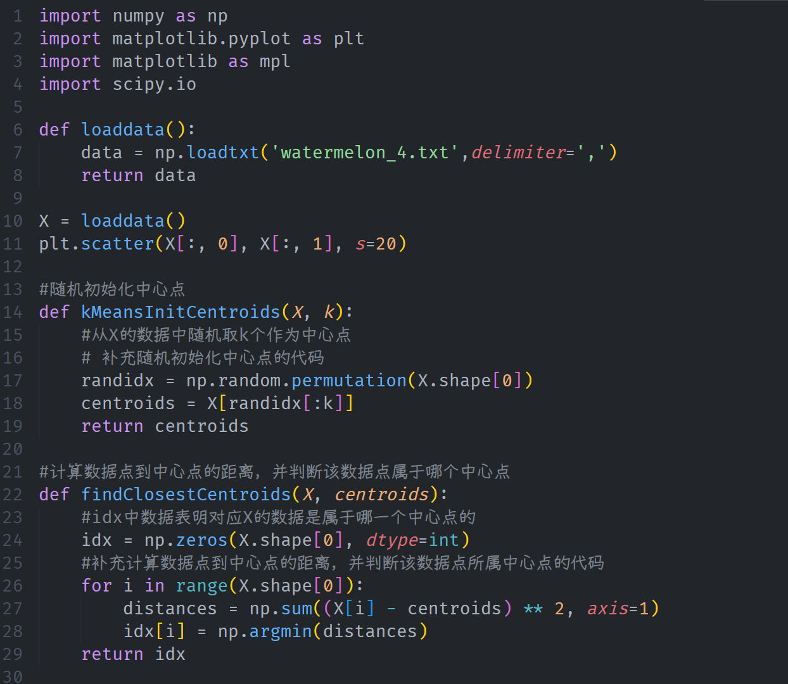
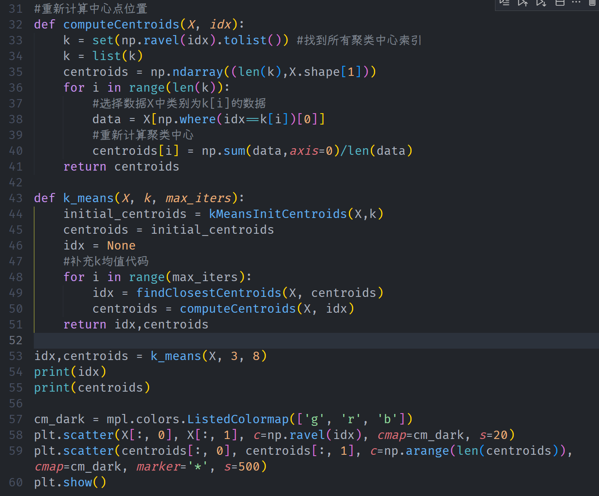
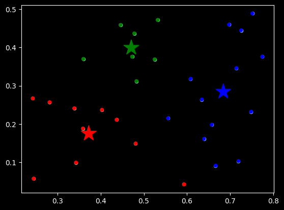

# Lab 11 实验报告

> 实验题目：编程实现k均值算法

计算机与信息工程学院实验报告

## 实验题目

编程实现k均值算法

## 实验目的

掌握k均值聚类算法的推导过程和基本原理

## 实验环境

Anaconda/Jupyter notebook

## 实验内容

（实验具体要求）

编码实现k均值算法，设置三组不同的k值、三组不同的初始中心点，在西瓜数据集4.0上进行实验比较，并讨论什么样的初始中心有利于取得好结果。

## 实验步骤

（代码截屏插入文档，清晰展示出你做的工作，得出的结果，图文并茂，让人一目了然）

**实验数据记录：** （如果是已经给出的数据可以不写）

[2 2 2 2 2 1 1 1 2 1 1 1 2 2 0 1 2 1 1 1 2 2 0 0 0 2 0 0 2 0]

[[0.471 0.39928571]

[0.3725 0.1748 ]

[0.68369231 0.28446154]]

## 问题讨论

（实验收获，遇到的问题以及解决问题的思路路径）

实验收获

深入理解 K-Means 算法原理：通过亲手实现 kMeansInitCentroids（初始化）、findClosestCentroids（簇分配）和 computeCentroids（中心更新）三个核心函数，深刻理解了 K-Means 算法“期望-最大化”（EM）的迭代思想。

提升 Numpy 向量化编程能力：在计算样本点到中心点的距离时，应用了 Numpy 的广播机制，避免了多重循环，提高了代码的运行效率和简洁度。

**数据聚类分析：** 直观地看到了不同初始中心点对最终聚类结果可能产生的影响（局部最优解问题），虽然本实验数据较简单，但原理相通。
