# lab01 实验一 Linux 基本操作 实验报告

本文档已完成姓名、学号等个人信息脱敏，并保留原实验内容与关键实现。

## 实验内容

1. **基本目录和文件操作**
2. **使用 `man` 命令获得帮助**
3. **进程控制**
4. **查看文件系统加载状况**
5. **其它**

---

## 实验步骤

### 1. 基本目录和文件操作

使用虚拟机方式进入 Linux 命令界面，完成基本的目录和文件操作如下：

- 查看登录进入后的主目录位置
- 查看 `/` 目录下的目录结构
- 在主目录下建立、删除、移动(重命名)子目录，形成树形结构
- 在主目录下的子目录中复制、删除、移动(重命名)文件

### 2. 使用 `man` 命令获得帮助

使用 `man` 命令获得一些命令的详细信息，例如 `man` 自身、`ps` 命令、`kill` 命令等。

### 3. 进程控制

使用 `ps` 命令查看当前进程状态，使用 `kill` 命令终止某个进程（例如当前使用的命令解释器进程）查看效果。

### 4. 查看文件系统加载状况

使用 `mount` 命令查看当前文件系统加载情况。

### 5. 其它

使用自己感兴趣的其它命令，并做分析和记录。

---

## 实验数据记录

### 1. 基本目录和文件操作

查看登录进入后的主目录位置，查看 `/` 目录下的目录结构：

在主目录下建立、删除：

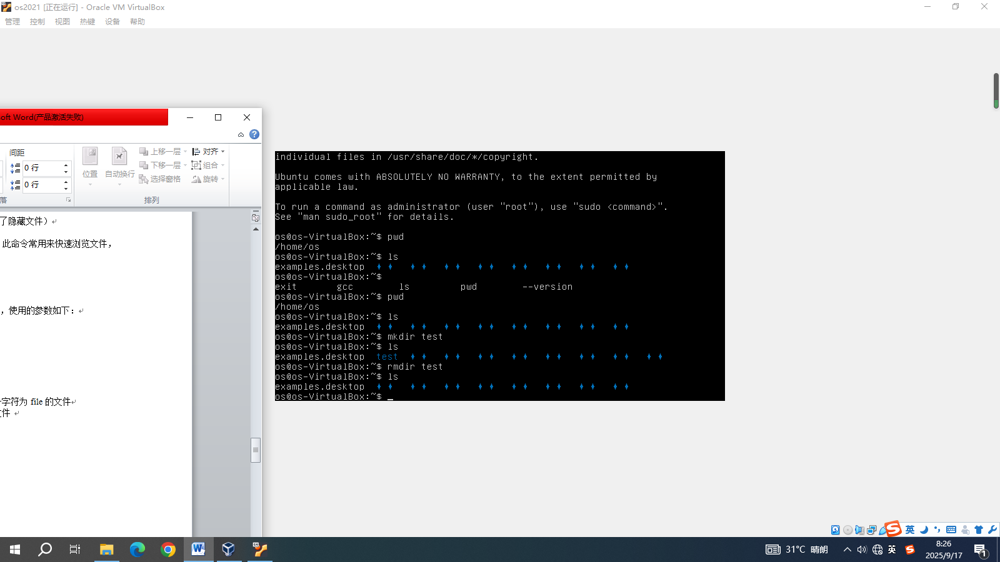

移动(重命名)子目录，形成树形结构：

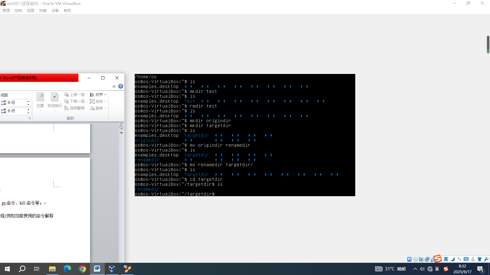

在主目录下的子目录中复制、删除、移动(重命名)文件：

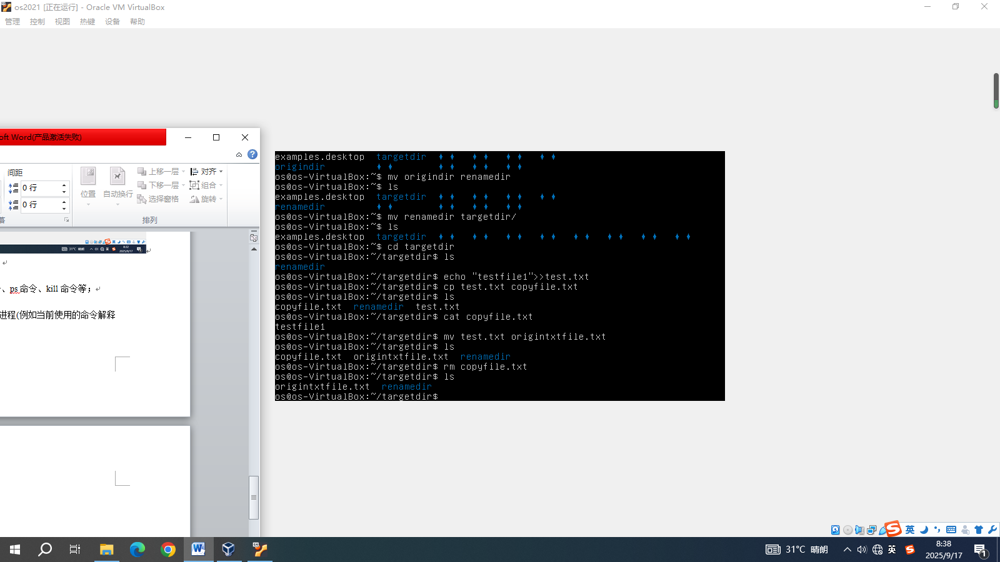

### 2. 使用 `man` 命令获得帮助

使用 `man` 命令获得一些命令的详细信息，例如 `man` 自身、`ps` 命令、`kill` 命令等：

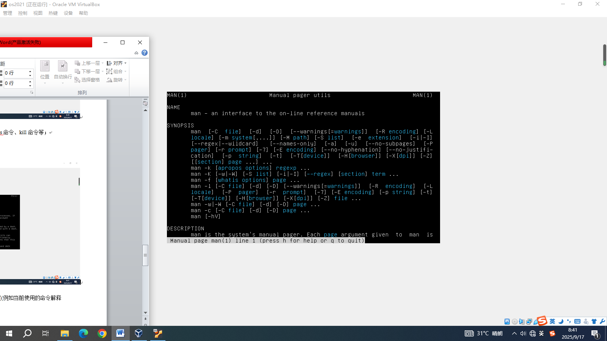

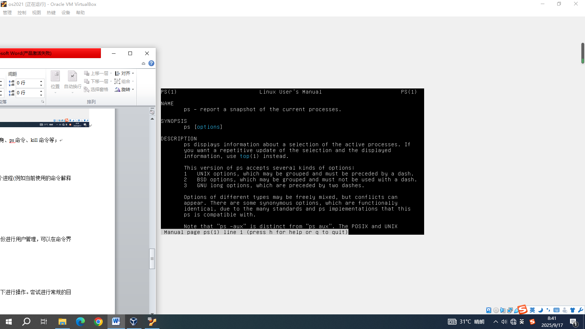

### 3. 进程控制

使用 `ps` 命令查看当前进程状态，使用 `kill` 命令终止某个进程查看效果：

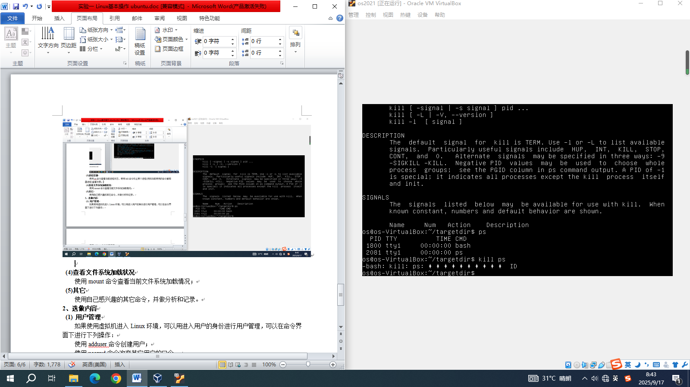

### 4. 查看文件系统加载状况

使用 `mount` 命令查看当前文件系统加载情况：

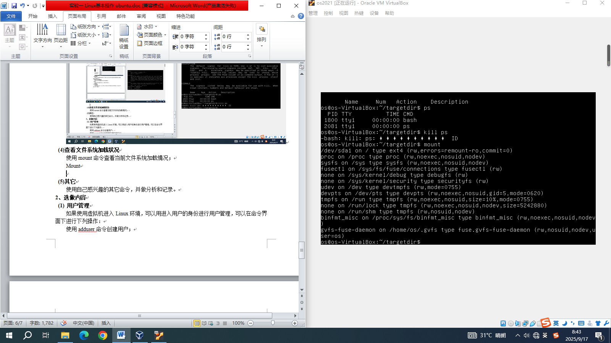

### 5. 其它

使用自己感兴趣的其它命令，并做分析和记录。`date` 和 `file`：

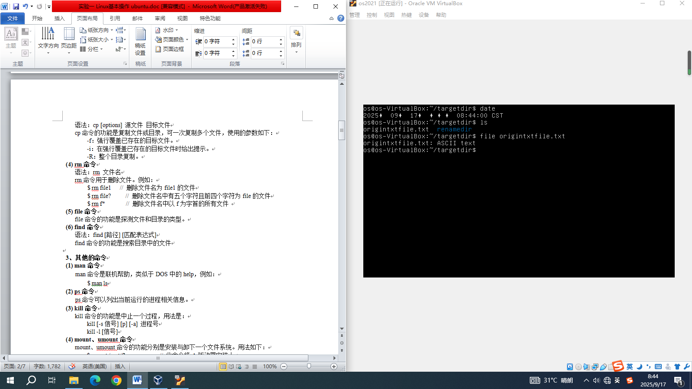

---

### 6. 用户管理

如果使用虚拟机进入 Linux 环境，可以用进入用户的身份进行用户管理，可以在命令界面下进行下列操作：

使用 `adduser` 命令创建用户：

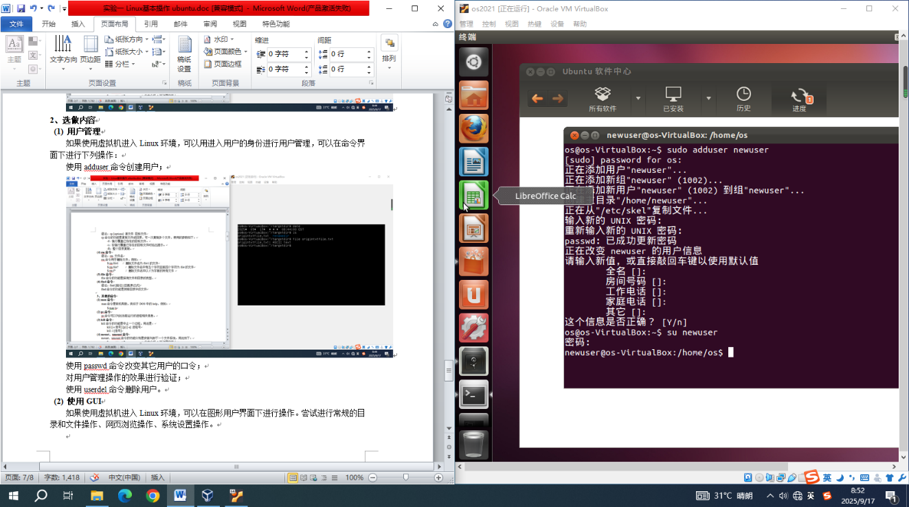

使用 `passwd` 命令改变其它用户的口令：

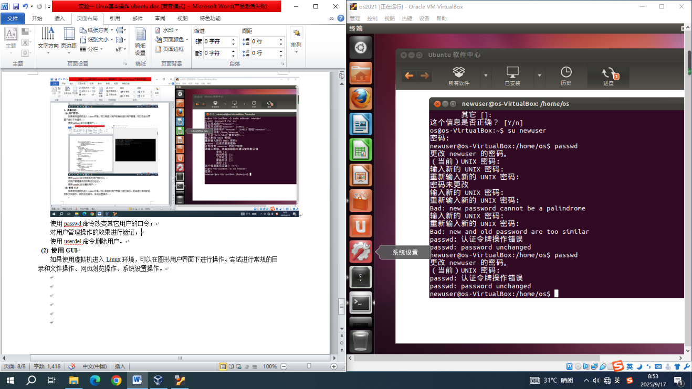

尝试密码 `123456`、`000000`、`654321` 均因太简单被拒绝：

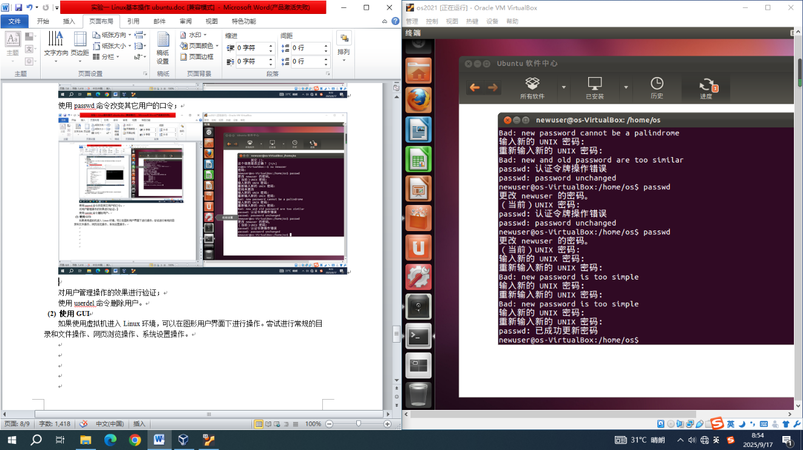

尝试 `xyz123`（太简单）、`Acctestpwd123`（通过）：

对用户管理操作的效果进行验证：

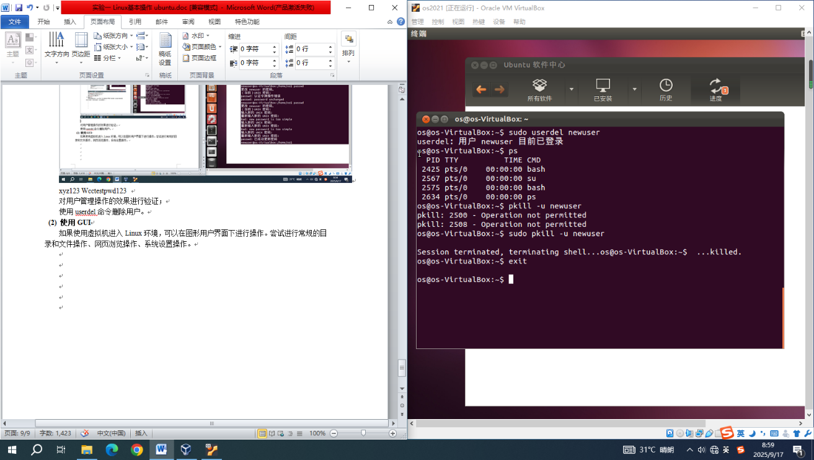

使用 `userdel` 命令删除用户：

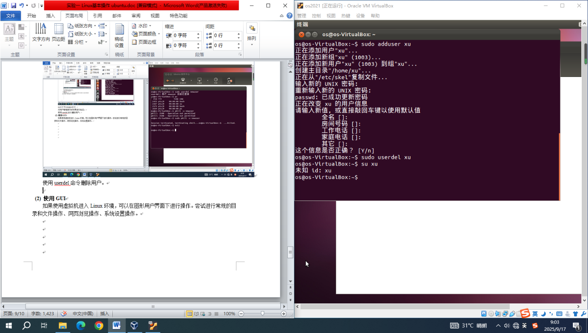

---

## 问题讨论

Linux 的命令与 Windows 差别很大，需要注意，例如 `tree` 命令，Windows 的参数不如 Linux 多。
