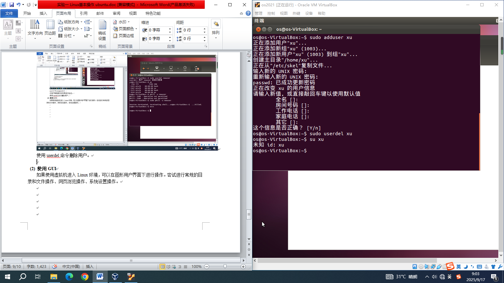

# 实验一 Linux 基本操作 题目整理

本文件根据原始实验题目材料整理，已统一为适合 GitHub 提交的 Markdown 版本。

---

## 题目材料 1：实验一

\(2\) 经过一段时间的等待，会出现一个图形登录界面，使用**用户名"OS"、密码"123456"登录进入**图形用户界面。备注：如果要进入命令界面：快捷键 `CTRL+ALT+F1`，返回图形界面 `CTRL+ALT+F7`。

### 三、Linux 常用命令

#### 1、有关目录的命令

##### (1) `pwd` 命令

`pwd`（即 print working directory，打印工作路径）命令的功能是显示当前的工作路径。如现在是在 `/home/CAI` 目录下，则可以用此命令来证实。例如：

```bash
$ pwd                                    # "$" 表示在 Linux 系统的提示符下
/home/CAI                                # pwd 命令证明的确是在 "/home/CAI" 下
```

##### (4) `rmdir` / `rm` 命令

语法：`rmdir 目录名` 或 `rm 目录名`

该命令用于删除目录，例如：

```bash
$ rmdir dir1                             # 删除目录 dir1，但 dir1 目录下必需没有文件存在，否则无法删除
$ rm -r dir1                             # 删除目录 dir1 及其子目录下所有文件，注意 -r 参数
```

#### 2、有关文件的命令

##### (1) `ls` 命令

语法：`ls [-atFlgR] [name]`

`ls` 命令的功能是显示指定目录的内容，例如：

```bash
$ cd
$ ls -a                                  # 此命令显示当前工作目录下的所有文件（参数 "a" 表示所有文件，"-" 号是用来控制参数）
```

显示时，文件名前带 `.` 号表示隐含文件。

各参数代表的含义如下所示：

| 参数 | 含义 |
|------|------|
| `ls` | 列出当前目录下的文件名 |
| `ls -a` | 列出以 `.` 开始的隐藏文件的所有文件名 |
| `ls -t` | 依照文件最后修改时间的顺序列出文件名 |
| `ls -F` | 列出当前目录下的文件名及其类型，以 `/` 结尾表示为目录名，以 `*` 结尾表示为可执行文件，以 `@` 结尾表示为符号链接 |
| `ls -lg` | 列出目录下所有文件的权限、所有者、文件大小、修改时间及名称 |
| `ls -l` | 同上，并列出文件的所有者工作组名 |
| `ls -R` | 显示出目录下以及其所有子目录的文件名（包括了隐藏文件） |

##### (2) `cat` 命令

`cat` 命令的功能是显示文件内容，也可用于文件的连接。此命令常用来快速浏览文件，使用方法如：

```bash
$ cat .bashrc
```

浏览文件的其他命令还有 `more` 等。

##### (3) `cp` 命令

语法：`cp [options] 源文件 目标文件`

`cp` 命令的功能是复制文件或目录，可一次复制多个文件，使用的参数如下：

- `-f`：强行覆盖已存在的目标文件。
- `-i`：在强行覆盖已存在的目标文件时给出提示。
- `-R`：整个目录复制。

##### (4) `rm` 命令

语法：`rm 文件名`

`rm` 命令用于删除文件。例如：

```bash
$ rm file1                               # 删除文件名为 file1 的文件
$ rm file?                               # 删除文件名中有五个字符且前四个字符为 file 的文件
$ rm f*                                  # 删除文件名中以 f 为字首的所有文件
```

#### 3、其他的命令

##### (3) `kill` 命令

`kill` 命令的功能是中止一个过程，用法是：

```bash
kill [-s信号] [p] [-a] 进程号
kill -l [信号]
```

##### (5) `passwd` 命令

`passwd` 命令用于更改登录密码。普通用户只能更改自身密码，`root` 可以更改其它用户的密码。

##### (7) `su` 命令

`su` 命令的功能是使普通用户以 `root` 帐号登录，用法是：键入 `su` 命令，Shell 要求 `root` 密码。键入密码按回车键则进入 `root` 帐号。

---

### 四、实验内容

#### 1、必做内容

##### (1) 基本目录和文件操作

使用虚拟机方式进入 Linux 命令界面，完成基本的目录和文件操作如下：

- 查看登录进入后的主目录位置：`pwd`
- 查看 `/` 目录下的目录结构：`ls`
- 在主目录下建立、删除、


移动(重命名)子目录，形成树形结构：


在主目录下的子目录中复制、删除、移动(重命名)文件：


##### (2) 使用 `man` 命令获得帮助

使用 `man` 命令获得一些命令的详细信息，例如 `man` 自身、`ps` 命令、`kill` 命令等：

```bash
$ man man
```


```bash
$ man ps
```


```bash
$ man kill
```


##### (3) 进程控制

使用 `ps` 命令查看当前进程状态，使用 `kill` 命令终止某个进程（例如当前使用的命令解释器进程）查看效果：

```bash
$ ps
```


```bash
$ kill <pid>
```


##### (4) 查看文件系统加载状况

使用 `mount` 命令查看当前文件系统加载情况：

```bash
$ mount
```


##### (5) 其它

使用自己感兴趣的其它命令，并做分析和记录。

```bash
$ date
$ file <filename>
```


---

#### 2、选做内容

##### (1) 用户管理

如果使用虚拟机进入 Linux 环境，可以用进入用户的身份进行用户管理，可以在命令界面下进行下列操作：

使用 `adduser` 命令创建用户：


使用 `passwd` 命令改变其它用户的口令：


尝试密码 `123456`、`000000`、`654321` 均因太简单被拒绝：


尝试 `xyz123`（太简单）、`Acctestpwd123`（通过）：

对用户管理操作的效果进行验证：


使用 `userdel` 命令删除用户：



##### (2) 使用 GUI

如果使用虚拟机进入 Linux 环境，可以在图形用户界面下进行操作。尝试进行常规的目录和文件操作、网页浏览操作、系统设置操作。
