# lab02 实验二 Linux 编程基础 实验报告

本文档已完成姓名、学号等个人信息脱敏，并保留原实验内容与关键实现。

## 实验内容

1. 使用 `vi` 编辑 C 语言源程序
2. 使用 `gcc`、`make` 等工具进行编译；执行编译生成的执行文件并分析结果

---

## 实验步骤

- （一）编辑器 `vi` 的使用
- （二）`gcc` 和 `make` 的使用

---

## 实验数据记录

### （一）编辑器 `vi` 的使用

#### 1、调用 `vi`

```bash
$ vi a.c
```

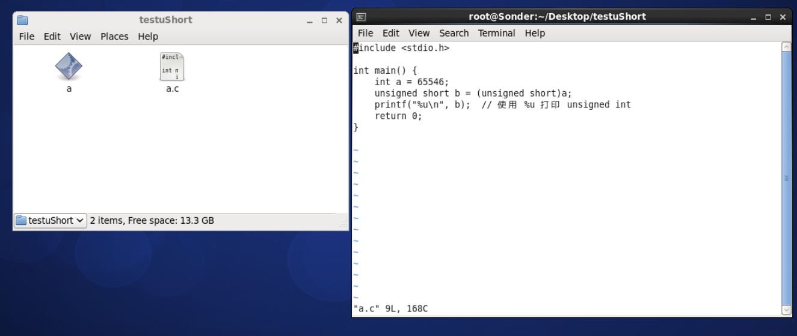

#### 2、文件的保存和退出

```bash
ESC :wq b.c
```

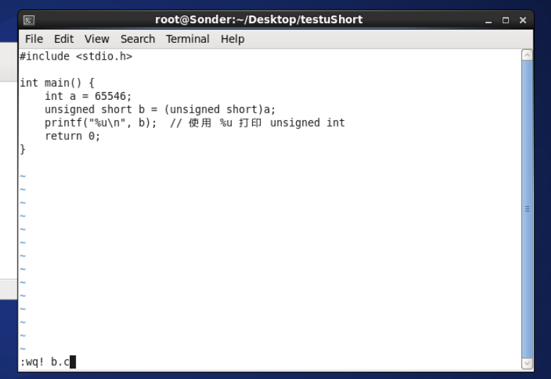

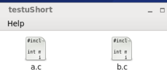

#### 3、可视模式

```bash
ESC V
```

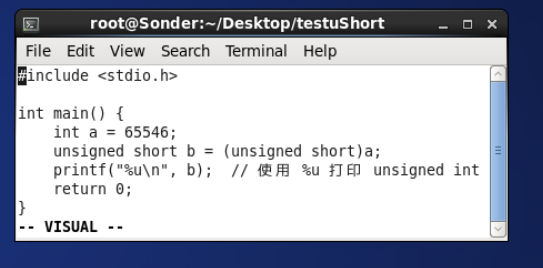

#### 9、行号

```bash
:set number
```

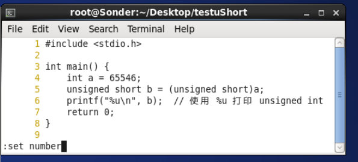

#### 10、查找功能

```bash
/t
```

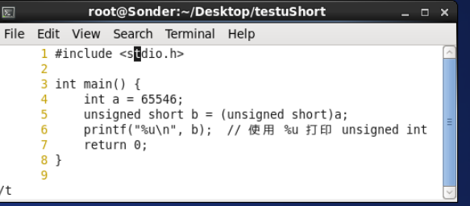

`n` 查找下一个：

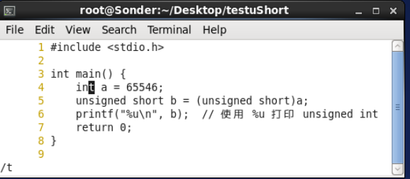

#### 11、替换功能

```bash
:s /b/a/g
```

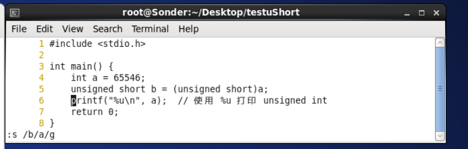

---

### （二）`gcc` 和 `make` 的使用

#### 1、`gcc` 的使用

##### (1) 简单使用方法

```bash
$ gcc a.c
```

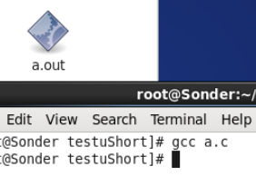

```bash
$ gcc -o testa a.c
```

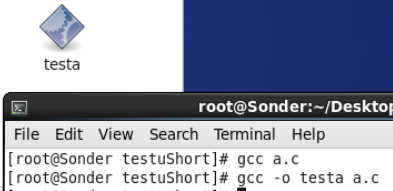

##### (2) 分解使用

```bash
$ gcc -E a.c -o a.i
```

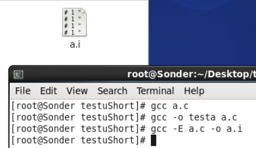

```bash
$ gcc -c hello.i -o hello.o
```

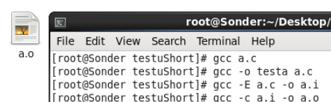

```bash
$ gcc a.o -o aa
```

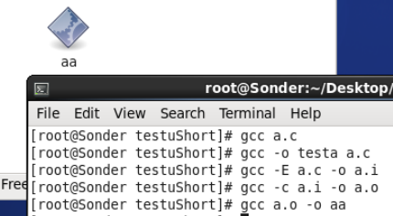

##### (3) 常用参数

#### 2、`make` 的使用

##### (1) `make` 工具简介

```bash
$ make [option] [macrodef] [target]
$ man make
```

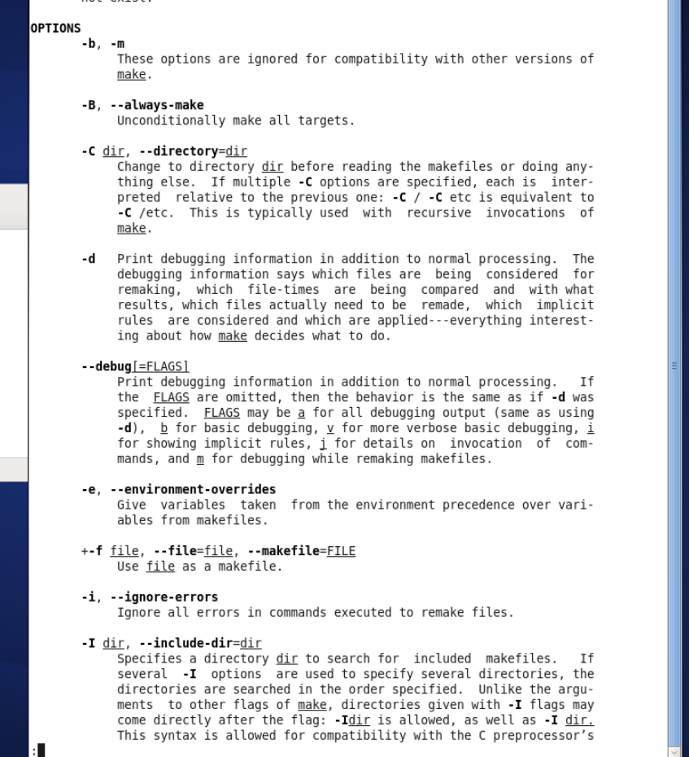

##### (2) `makefile` 文件编写

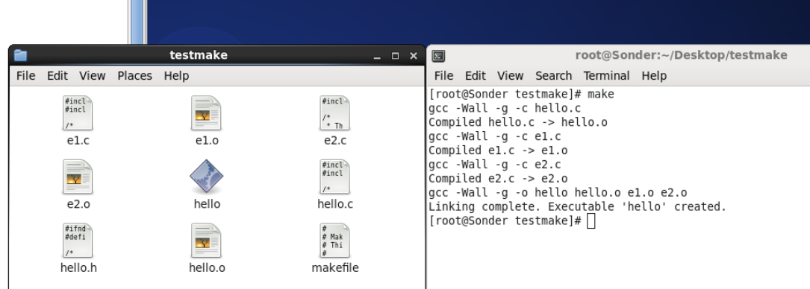

---

## 问题讨论

1. 系统 CentOS 6，在 `gcc` 生成 `.h` 文件之后，如果删除会直接卡死，可能是正在占用没关闭
2. 用 `make` 之后，再使用 `make` 需要删除之前 `make` 生成的
