# lab03 实验三 进程管理与同步 实验报告

本文档已完成姓名、学号等个人信息脱敏，并保留原实验内容与关键实现。

## 实验三_进程管理1_fork调用

**1.练习在shell环境下编译执行程序**

（注意：①在 `vi` 编辑器中编写名为 `sample.c` 的 C 语言源程序

②用 Linux 自带的编译器 `gcc` 编译程序，例如：`gcc –o test sample.c`

③编译后生成名为 `test.out` 的可执行文件；

④最后执行分析结果；命令为：`./test`）

注意：Linux 自带的编译程序 `gcc` 的语法是：`gcc –o 目标程序名 源程序名`，例如：`gcc –o sample1 sample1.c`，然后利用命令：`./sample` 来执行。如果仅用 `gcc 源程序名`，将会把任何名字的源程序都编译成名为 `a.out` 的目标程序，这样新编译的程序会覆盖原来的程序，所以最好给每个源程序都起个新目标程序名。

**2.进程的创建**

仿照例子自己编写一段程序，使用系统调用 `fork()` 创建两个子进程。当此程序运行时，在系统中有一个父进程和两个子进程活动。让每一个进程在屏幕上显示一个字符：父进程显示 `a`，子进程分别显示字符 `b` 和 `c`。观察记录屏幕上的显示结果，并分析原因。

**3.分析程序**

实验内容要在给出的例子程序基础上，根据要求进行修改，对执行结果进行分析。

- **子进程对存储空间的复制**

**(1) 使用文本编辑器输入源程序**

输入如下源程序：

```c
#include <sys/types.h>
#include <unistd.h>
#include <stdio.h>
int main(void)
{
int x, i;
printf("Input a initial value for i: ");
scanf("%d", &i);
while((x=fork())==-1);
if(x==0) /* child run */
{
printf("When child runs, i=%d\n", i);
printf("Input a value in child: ");
scanf("%d", &i);
printf("i=%d\n", i);
}
else /* parent run */
{
wait();
printf("After child runs, in parent, i=%d\n", i);
}
}
```

**(2) 预测程序的执行结果**

阅读程序，根据自己的理解，预期程序执行后的结果。

**(3) 实际执行结果分析**

编译生成执行文件，执行后记录结果，说明与预期的结果是否一致。分析为什么是这样的结果。

- **父子进程执行过程分析**

**(1) 按照给定框架编程**

按照如下程序框架，完成源程序编写：

```c
#include <sys/types.h>
#include <unistd.h>
#include <stdio.h>
int main(void)
{
// ①
pid=fork();
// ②
if(pid==0)
{
sleep(3);
printf("Child: pid=%d, ppid=%d\n", getpid(), getppid());
}
else
{
printf("Parent: Child=%d, pid=%d, ppid=%d\n", pid, getpid(), getppid());
wait();
printf("After Child ends.\n");
}
printf("In which process?\n"); // ③
```

**(2) 预测程序的执行结果**

阅读程序，根据自己的理解，预期程序执行后的结果。

**(3) 实际执行结果分析**

编译生成执行文件，执行后记录结果，说明与预期的结果是否一致。分析为什么是这样的结果。

**(4) 修改程序并分析执行结果**

把程序框架中最后一句输出语句（位置③处）分别移至位置①和②处，预期输出结果是什么？实际执行结果如何？分析原因。

**(5) 修改程序验证父子进程关系**

修改程序，使父进程先执行完成，验证子进程是否会一起终止？如果不是，前后子进程的父进程号是否变化？记录并分析结果。

### 实验三\_进程管理2\_进程互斥

#### 二、实验题目

使用共享存储区机制，使多个并发进程分别模拟生产者－消费者模式同步关系、临界资源的互斥访问关系，使用信号量机制实现相应的同步和互斥。

#### 三、背景材料

##### （一）需要用到的系统调用

实验可能需要用到的主要系统调用和库函数在下面列出，详细的使用方法说明通过 `man 2 系统调用名` 或者 `man 3 函数名` 命令获取。

- `fork()` 创建一个子进程，通过返回值区分是在父进程还是子进程中执行
- `wait()` 等待子进程执行完成
- `shmget()` 建立一个共享存储区
- `shmctl()` 操纵一个共享存储区
- `shmat()` 把一个共享存储区附接到进程内存空间
- `shmdt()` 把一个已经附接的共享存储区从进程内存空间断开
- `semget()` 建立一个信号量集
- `semctl()` 操纵一个信号量集，包括赋初值
- `semop()` 对信号量集进行 `wait` 和 `signal` 操作
- `signal()` 设置对信号的处理方式或处理过程

#### （二）模拟生产者－消费者的示例程序

本示例主要体现进程间的直接制约关系，由于使用共享存储区，也存在间接制约关系。进程分为服务进程和客户进程，服务进程只有一个，作为消费者，在每次客户进程改变共享存储区内容时显示其数值。各客户进程作为生产者，如果共享存储区内容已经显示（被消费），可以接收用户从键盘输入的整数，放在共享存储区。

编译后执行，第一个进程实例将作为服务进程，提示：

`ACT CONSUMER!!! To end, try Ctrl+C or use kill.`

服务进程一直循环执行，直到用户按 `Ctrl+C` 终止执行，或使用 `kill` 命令杀死服务进程。

其他进程实例作为客户进程，提示：

`Act as producer. To end, input 0 when prompted.`

客户进程一直循环执行，直到用户输入 `0`。

示例程序代码如下：

```c
#include <sys/types.h>
#include <unistd.h>
#include <signal.h>
#include <stdio.h>
#include <string.h>
#include <sys/ipc.h>
#include <sys/shm.h>
#include <sys/sem.h>
#define MY_SHMKEY 10071500 // need to change
#define MY_SEMKEY 10071500 // need to change
void sigend(int);
int shmid, semid;
int main(void)
{
int *shmptr, semval, local;
struct sembuf semopbuf;
if((shmid=shmget(MY_SHMKEY, sizeof(int), IPC_CREAT|IPC_EXCL|0666)) < 0)
{ /* shared memory exists, act as client */
shmid=shmget(MY_SHMKEY, sizeof(int), 0666);
semid=semget(MY_SEMKEY, 2, 0666);
shmptr=(int *)shmat(shmid, 0, 0);
printf("Act as producer. To end, input 0 when prompted.\n\n");
printf("Input a number:\n");
scanf("%d", &local);
while( local )
{
semopbuf.sem_num=0;
semopbuf.sem_op=-1;
semopbuf.sem_flg=SEM_UNDO;
semop(semid, &semopbuf, 1); /* P(S1) */
*shmptr = local;
semopbuf.sem_num=1;
semopbuf.sem_op=1;
semopbuf.sem_flg=SEM_UNDO;
semop(semid, &semopbuf, 1); /* V(S2) */
printf("Input a number:\n");
scanf("%d", &local);
}
}
else /* acts as server */
{
semid=semget(MY_SEMKEY, 2, IPC_CREAT|0666);
shmptr=(int *)shmat(shmid, 0, 0);
semval=1;
semctl(semid, 0, SETVAL, semval); /* set S1=1 */
semval=0;
semctl(semid, 1, SETVAL, semval); /* set S2=0 */
signal(SIGINT, sigend);
signal(SIGTERM, sigend);
printf("ACT CONSUMER!!! To end, try Ctrl+C or use kill.\n\n");
while(1)
{
semopbuf.sem_num=1;
semopbuf.sem_op=-1;
semopbuf.sem_flg=SEM_UNDO;
semop(semid, &semopbuf, 1); /* P(S2) */
printf("Shared memory set to %d\n", *shmptr);
semopbuf.sem_num=0;
semopbuf.sem_op=1;
semopbuf.sem_flg=SEM_UNDO;
semop(semid, &semopbuf, 1); /* V(S1) */
}
}
}
void sigend(int sig)
{
shmctl(shmid, IPC_RMID, 0);
semctl(semid, IPC_RMID, 0);
exit(0);
}
```

#### （三）模拟临界资源访问的示例程序

本示例的临界资源是一个建立在共享存储区的栈，由服务进程建立并初始化。初始状态下共享栈满，里面顺序放置一系列正整数（自栈顶向下：1,2,3...），代表空闲块号。客户进程利用共享栈进行数据块的分配和释放，以得到、归还一个块号代表，并不进行任何后续操作。程序中 `getblock` 过程从共享栈中弹出一个块号（分配），`relblock` 过程把一个已分配块号压入共享栈（释放）。为简单起见，已分配块号在本地也使用栈结构保存，因而每次释放的是最后分配的块号。

编译后执行，第一个进程实例将作为服务进程，提示：

`NO OTHER OPERATION but press Ctrl+C or use kill to end.`

服务进程完成初始化后将进入睡眠状态，直到用户按 `Ctrl+C` 终止执行，或使用 `kill` 命令杀死服务进程。

其他进程实例作为客户进程，进入后首先有命令帮助提示，然后显示命令提示符 `?>`，在命令提示下可以使用的命令包括：

- `help` 显示可用命令
- `list` 列出所有已分配块号
- `get` 分配一个新块
- `rel` 释放最后分配块号
- `end` 退出程序

示例程序的代码如下：

```c
#include <sys/types.h>
#include <unistd.h>
#include <signal.h>
#include <stdio.h>
#include <string.h>
#include <sys/ipc.h>
#include <sys/shm.h>
#define MY_SHMKEY 10071800 // need to change
#define MAX_BLOCK 1024
#define MAX_CMD 8
struct shmbuf {
int top;
int stack[MAX_BLOCK];
} *shmptr, local;
char cmdbuf[MAX_CMD];
int shmid, semid;
void sigend(int);
void relblock(void);
int getblock(void);
void showhelp(void);
void showlist(void);
void getcmdline(void);
int main(void)
{
if((shmid=shmget(MY_SHMKEY, sizeof(struct shmbuf), IPC_CREAT|IPC_EXCL|0666)) < 0)
{ /* shared memory exists, act as client */
shmid=shmget(MY_SHMKEY, sizeof(struct shmbuf), 0666);
shmptr=(struct shmbuf *)shmat(shmid, 0, 0);
local.top=-1;
showhelp();
getcmdline();
while(strcmp(cmdbuf,"end\n"))
{
if(!strcmp(cmdbuf,"get\n"))
getblock();
else if(!strcmp(cmdbuf,"rel\n"))
relblock();
else if(!strcmp(cmdbuf,"list\n"))
showlist();
else if(!strcmp(cmdbuf,"help\n"))
showhelp();
getcmdline();
}
}
else /* acts as server */
{
int i;
shmptr=(struct shmbuf *)shmat(shmid, 0, 0);
signal(SIGINT, sigend);
signal(SIGTERM, sigend);
printf("NO OTHER OPERATION but press Ctrl+C or use kill to end.\n");
shmptr->top=MAX_BLOCK-1;
for(i=0; i<MAX_BLOCK; i++)
shmptr->stack[i]=MAX_BLOCK-i;
sleep(1000000); /* cause sleep forever. */
}
}
void sigend(int sig)
{
shmctl(shmid, IPC_RMID, 0);
semctl(semid, IPC_RMID, 0);
exit(0);
}
void relblock(void)
{
if(local.top<0)
{
printf("No block to release!");
return;
}
shmptr->top++;
shmptr->stack[shmptr->top]=local.stack[local.top--];
}
int getblock(void)
{
if(shmptr->top<0)
{
printf("No free block to get!");
return;
}
local.stack[++local.top]=shmptr->stack[shmptr->top];
shmptr->top--;
}
void showhelp(void)
{
printf("\navailable COMMAND:\n\n");
printf("help\tlist this help\n");
printf("list\tlist all gotten block number\n");
printf("get\tget a new block\n");
printf("rel\trelease the last gotten block\n");
printf("end\texit this program\n");
}
void showlist(void)
{
int i;
printf("List all gotten block number:\n");
for(i=0; i<=local.top; i++)
printf("%d\t", local.stack[i]);
}
void getcmdline(void)
{
printf("\n?> ");
fgets(cmdbuf, MAX_CMD-1, stdin);
}
```

### 四、实验内容
本实验要求内容如下：
#### 1、模拟生产者－消费者
实现相应的示例程序功能，记录执行结果；改造该程序，取消所有的同步机制，记录执行结果，看是否能观察到程序出现错误情况；进一步改造程序，使错误情况易于观察到；记录执行情况并进行分析。
> 【注意】取消同步机制后，消费者进程会连续输出。可以采用诸如增加延时、等待用户输入等方法修改程序，以便观察和记录执行结果。
#### 2、模拟临界资源访问
实现相应的示例程序功能，记录执行结果，看是否能观察到程序出现错误情况；改造该程序，使错误情况易于观察到，记录执行情况并进行分析；利用信号量机制实现进程互斥功能，记录执行结果，并进行对比分析。

---
## 实验步骤
### 实验三\_进程管理1\_fork 调用
#### 子进程对存储空间的复制
**2.进程的创建**
```c
#include <sys/types.h>
#include <unistd.h>
#include <stdio.h>
#include <sys/wait.h>
#include <stdlib.h>
int main(void)
{
    int pid1, pid2;
    pid1 = fork();
    if (pid1 == 0)
    {
        printf("b");
        exit(0);
    }
    pid2 = fork();
    if (pid2 == 0)
    {
        printf("c");
        exit(0);
    }
    printf("a");
    wait(NULL);
    wait(NULL);
    printf("\n");
    return 0;
}
```

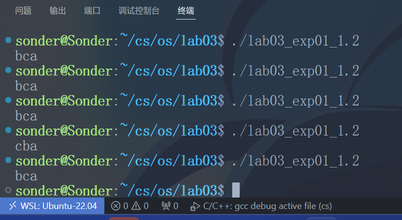

执行之后发现，`bca` 和 `cba` 的顺序随机出现

**3.分析程序**

- **子进程对存储空间的复制**

**(2) 预测程序的执行结果**

预测执行的结果为：

子进程输出子进程的结果，父进程输出父进程原来的结果，互相不干扰。

例如父进程为 `i = 2`，子进程为 `i = 3`，那么修改子进程的不会修改父进程的 `i` 的值。

**(3) 实际执行结果分析**

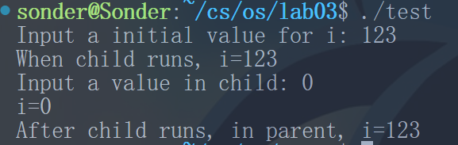

父进程为 123，子进程为 0，与预测正确。

解释：因为子进程和父进程的 `i` 是不一样的，可以把它们理解为在世界上名字相同的两个人，但是修改其中的一个，另一个不会变，是独立的个体，单独有内存空间进行存储。

### 父子进程执行过程分析

**(2) 预测程序的执行结果**

`Parent` 的先输出，之后等待 `child`，`child` 会 `sleep` 3 秒，再输出 `child`。

之后两个一起输出结尾的，输出如下：

```
Parent: Child=%d, pid=%d, ppid=%d
（等待三秒）
Child: pid=%d, ppid=%d
After Child ends.
In which process?
In which process?
```

**(3) 实际执行结果分析**

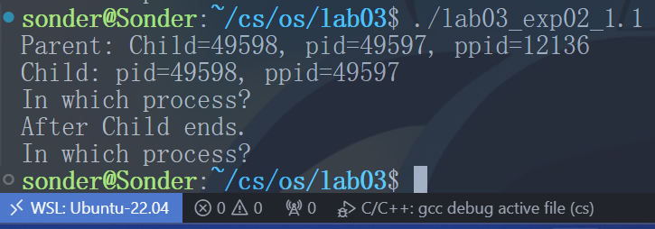

和预期结果不一致

实际执行顺序是：

```
Parent: Child=%d, pid=%d, ppid=%d
（等待三秒）
Child: pid=%d, ppid=%d
In which process?
After Child ends.
In which process?
```

推测第一个 `In which process?` 是子进程的，因为下一句的 `After Child ends` 是父进程的 `if` 语句块的内容。

正确的顺序应该是 `sleep` 之后，先执行完子进程的再执行父进程，因为子进程执行完所有代码后才退出，父进程的 `wait()` 才会返回。

**(4) 修改程序并分析执行结果**

位置1处：

预期输出：只会输出一次 `In which process?`

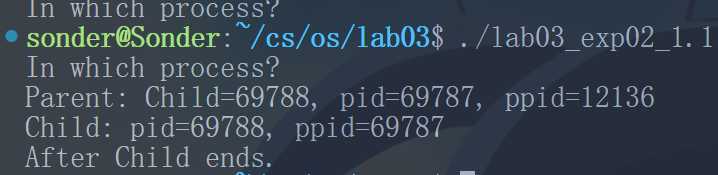

1处是在创建子进程 `fork` 之前运行的，所以只会执行一次。

位置2处：

预测：会连续出现两次 `In which process?`

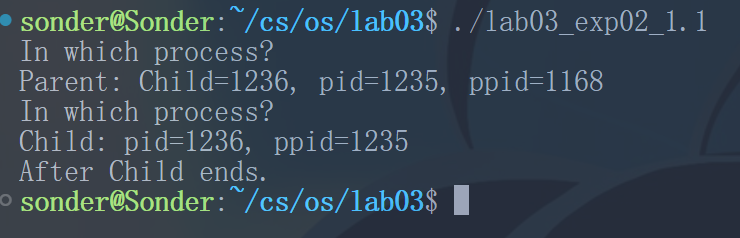

由于第一个打印的后面跟随的是 `Parent` 的，因此第一个输出的应该是 `Parent` 主程序的，第二个是子程序的，原因：

- 父进程先输出：父进程没有延迟，直接输出父进程信息
- 子进程延迟 3 秒：由于 `sleep(3)`，子进程延迟后才输出
- 父进程等待：`wait(NULL)` 使父进程等待子进程结束

**(5) 修改程序验证父子进程关系**

代码如图：

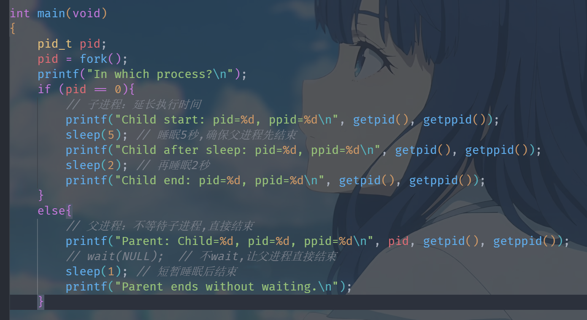

debug 输出：

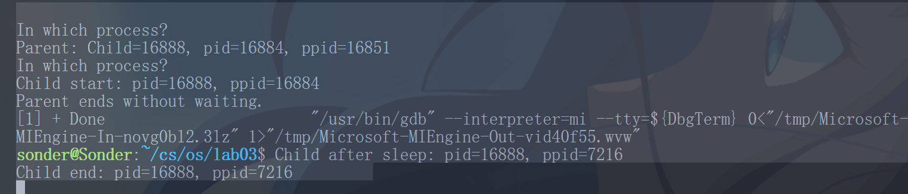

可执行文件输出：

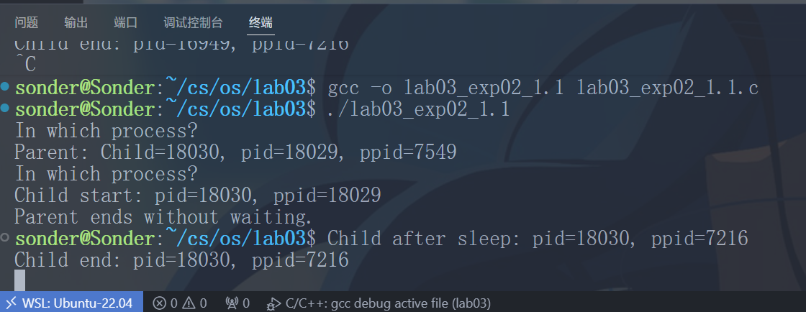

两者输出一致（`id` 每次运行不同，不用管），我们只分析直接运行文件的结果：

```
sonder@Sonder:~/cs/os/lab03$ ps -p 7216 -o pid,ppid,cmd
PID  PPID CMD
7216 7215 /init
```

查看 `ppid`，也就是结束父进程之后，新的父进程，可以看到是 `/init` 进程，被新的父进程收养，由此可知，子进程会被新的父进程收养。

## 实验三_进程管理2_进程互斥

### 1、模拟生产者－消费者

实现相应的示例程序功能，记录执行结果；

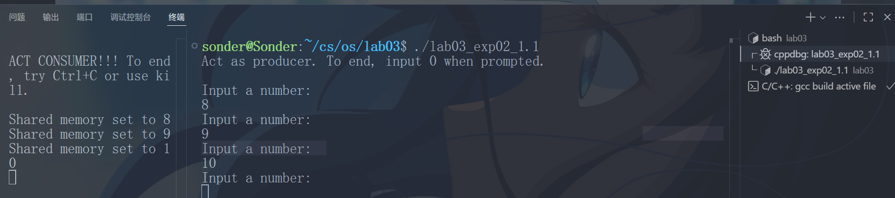

改造该程序，取消所有的同步机制，记录执行结果，看是否能观察到程序出现错误情况；进一步改造程序，使错误情况易于观察到；记录执行情况并进行分析。

```c
#include <sys/types.h>
#include <unistd.h>
#include <signal.h>
#include <stdio.h>
#include <string.h>
#include <sys/ipc.h>
#include <sys/shm.h>
#include <sys/sem.h>
#include <stdlib.h>
#define MY_SHMKEY 10071502
#define MY_SEMKEY 10071502
void sigend(int);
int shmid;
int is_server = 0;
int main(void)
{
    int *shmptr, local;
    char input[10];
    if ((shmid = shmget(MY_SHMKEY, sizeof(int), IPC_CREAT | IPC_EXCL | 0666)) < 0)
    {
        /* shared memory exists, act as client/producer */
        shmid = shmget(MY_SHMKEY, sizeof(int), 0666);
        shmptr = (int *)shmat(shmid, 0, 0);
        printf("=== Acting as PRODUCER (No Synchronization) ===\n");
        printf("To end, input 0 when prompted.\n\n");
        while (1)
        {
            printf("Input a number: ");
            fflush(stdout);
            scanf("%d", &local);
            if (local == 0)
            {
                printf("Producer exiting...\n");
                break;
            }
            // 取消P(S1) 不再等待消费者读取
            printf("[Producer] Writing %d to shared memory...\n", local);
            *shmptr = local;
            printf("[Producer] Write complete. Value in memory: %d\n", *shmptr);
            // 取消V(S2) 不再通知消费者
            // 添加短暂延时以便观察
            sleep(1);
        }
        shmdt(shmptr);
    }
    else
    {
        /* acts as server/consumer */
        is_server = 1;
        shmptr = (int *)shmat(shmid, 0, 0);
        *shmptr = -1; // 初始化共享内存
        signal(SIGINT, sigend);
        signal(SIGTERM, sigend);
        printf("=== Acting as CONSUMER (No Synchronization) ===\n");
        printf("Process ID: %d\n", getpid());
        printf("To end, press Ctrl+C\n\n");
        int count = 0;
        int last_value = -1;
        while (1)
        {
            // 取消P(S2) 不再等待生产者写入
            int current_value = *shmptr;
            printf("[Consumer #%d] Read value: %d\n", ++count, current_value);
            // 检测是否读到重复值（说明生产者还没更新）
            if (current_value == last_value && current_value != -1)
            {
                printf("Read same value twice! (Race condition detected)\n");
            }
            last_value = current_value;
            // 取消V(S1)不通知生产者可以写入
            // 添加延时和等待用户输入，便于观察
            printf("  Press Enter to continue reading...");
            fflush(stdout);
            fgets(input, sizeof(input), stdin);
        }
    }
    return 0;
}
void sigend(int sig)
{
    printf("\n\n=== Cleaning up resources ===\n");
    if (is_server)
    {
        if (shmctl(shmid, IPC_RMID, 0) < 0)
        {
            perror("shmctl error");
        }
        else
        {
            printf("Shared memory removed successfully.\n");
        }
    }
    exit(0);
}
```

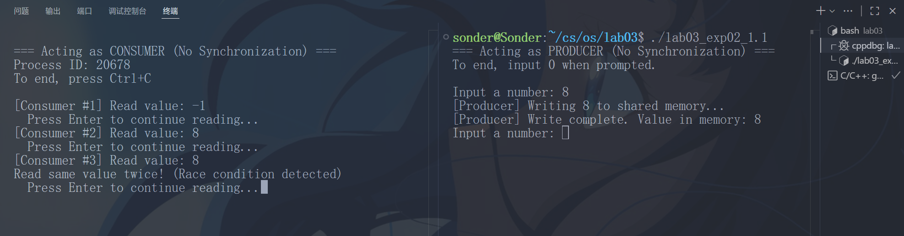

### 2、模拟临界资源访问

实现相应的示例程序功能，记录执行结果，看是否能观察到程序出现错误情况；

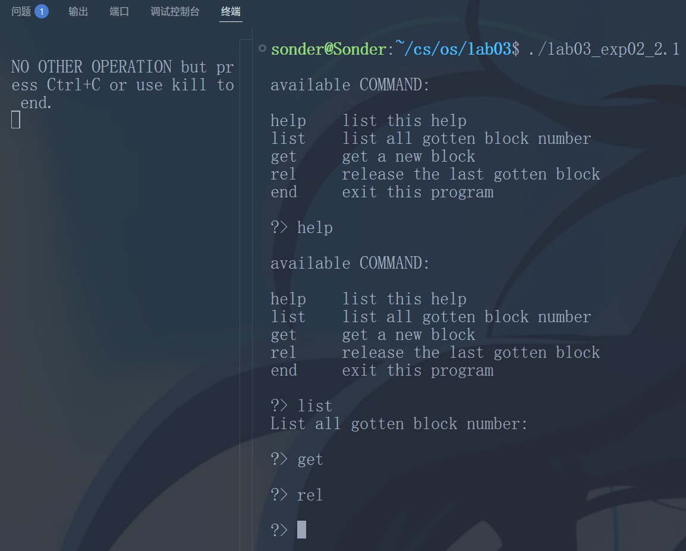

未修改的程序如上图，什么都没有

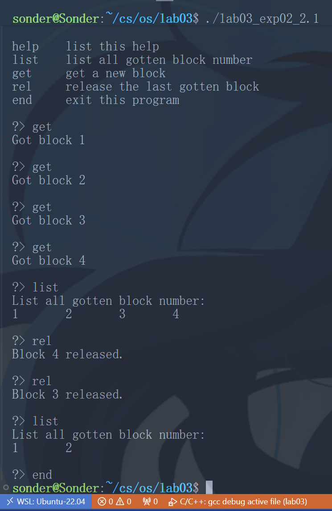

```c
#include <sys/types.h>
#include <unistd.h>
#include <signal.h>
#include <stdio.h>
#include <string.h>
#include <sys/ipc.h>
#include <sys/shm.h>
#include <sys/sem.h>
#include <stdlib.h>
#define MY_SHMKEY 10071810 // need to change
#define MAX_BLOCK 1024
#define MAX_CMD 8
struct shmbuf
{
    int top;
    int stack[MAX_BLOCK];
} *shmptr, local;
char cmdbuf[MAX_CMD];
int shmid, semid;
void sigend(int);
void relblock(void);
int getblock(void);
void showhelp(void);
void showlist(void);
void getcmdline(void);
int main(void)
{
    if ((shmid = shmget(MY_SHMKEY, sizeof(struct shmbuf), IPC_CREAT | IPC_EXCL | 0666)) < 0)
    { /* shared memory exists, act as client */
        shmid = shmget(MY_SHMKEY, sizeof(struct shmbuf), 0666);
        shmptr = (struct shmbuf *)shmat(shmid, 0, 0);
        local.top = -1;
        showhelp();
        getcmdline();
        while (strcmp(cmdbuf, "end\n"))
        {
            if (!strcmp(cmdbuf, "get\n"))
                getblock();
            else if (!strcmp(cmdbuf, "rel\n"))
                relblock();
            else if (!strcmp(cmdbuf, "list\n"))
                showlist();
            else if (!strcmp(cmdbuf, "help\n"))
                showhelp();
            getcmdline();
        }
        shmdt(shmptr);
    }
    else /* acts as server */
    {
        int i;
        shmptr = (struct shmbuf *)shmat(shmid, 0, 0);
        signal(SIGINT, sigend);
        signal(SIGTERM, sigend);
        printf("NO OTHER OPERATION but press Ctrl+C or use kill to end.\n");
        shmptr->top = MAX_BLOCK - 1;
        for (i = 0; i < MAX_BLOCK; i++)
            shmptr->stack[i] = MAX_BLOCK - i;
        sleep(1000000); /* cause sleep forever. */
    }
    return 0;
}
void sigend(int sig)
{
    shmctl(shmid, IPC_RMID, 0);
    semctl(semid, IPC_RMID, 0);
    exit(0);
}
void relblock(void)
{
    if (local.top < 0)
    {
        printf("No block to release!\n");
        return;
    }
    shmptr->top++;
    shmptr->stack[shmptr->top] = local.stack[local.top--];
    printf("Block %d released.\n", shmptr->stack[shmptr->top]);
}
int getblock(void)
{
    if (shmptr->top < 0)
    {
        printf("No free block to get!\n");
        return -1;
    }
    local.stack[++local.top] = shmptr->stack[shmptr->top];
    shmptr->top--;
    printf("Got block %d\n", local.stack[local.top]);
    return 0;
}
void showhelp(void)
{
    printf("\navailable COMMAND:\n\n");
    printf("help\tlist this help\n");
    printf("list\tlist all gotten block number\n");
    printf("get\tget a new block\n");
    printf("rel\trelease the last gotten block\n");
    printf("end\texit this program\n");
}
void showlist(void)
{
    int i;
    printf("List all gotten block number:\n");
    for (i = 0; i <= local.top; i++)
        printf("%d\t", local.stack[i]);
    printf("\n");
}
void getcmdline(void)
{
    printf("\n?> ");
    fgets(cmdbuf, MAX_CMD - 1, stdin);
}
```

这里完成了相应的功能，添加头文件，修复函数的代码等。

改造该程序，使错误情况易于观察到，记录执行情况并进行分析；

```c
#include <sys/types.h>
#include <unistd.h>
#include <signal.h>
#include <stdio.h>
#include <string.h>
#include <sys/ipc.h>
#include <sys/shm.h>
#include <sys/sem.h>
#include <stdlib.h>
#define MY_SHMKEY 10071821
#define MAX_BLOCK 10
#define MAX_CMD 8
struct shmbuf
{
    int top;
    int stack[MAX_BLOCK];
} *shmptr, local;
char cmdbuf[MAX_CMD];
int shmid, semid;
void sigend(int);
void relblock(void);
int getblock(void);
void showhelp(void);
void showlist(void);
void getcmdline(void);
int main(void)
{
    if ((shmid = shmget(MY_SHMKEY, sizeof(struct shmbuf), IPC_CREAT | IPC_EXCL | 0666)) < 0)
    {
        /* shared memory exists, act as client */
        shmid = shmget(MY_SHMKEY, sizeof(struct shmbuf), 0666);
        shmptr = (struct shmbuf *)shmat(shmid, 0, 0);
        local.top = -1;
        showhelp();
        getcmdline();
        while (strcmp(cmdbuf, "end\n"))
        {
            if (!strcmp(cmdbuf, "get\n"))
                getblock();
            else if (!strcmp(cmdbuf, "rel\n"))
                relblock();
            else if (!strcmp(cmdbuf, "list\n"))
                showlist();
            else if (!strcmp(cmdbuf, "help\n"))
                showhelp();
            getcmdline();
        }
        shmdt(shmptr);
    }
    else /* acts as server */
    {
        int i;
        shmptr = (struct shmbuf *)shmat(shmid, 0, 0);
        signal(SIGINT, sigend);
        signal(SIGTERM, sigend);
        printf("NO OTHER OPERATION but press Ctrl+C or use kill to end.\n");
        shmptr->top = MAX_BLOCK - 1;
        for (i = 0; i < MAX_BLOCK; i++)
            shmptr->stack[i] = MAX_BLOCK - i;
        sleep(1000000); /* cause sleep forever. */
    }
    return 0;
}
void sigend(int sig)
{
    shmctl(shmid, IPC_RMID, 0);
    semctl(semid, IPC_RMID, 0);
    exit(0);
}
void relblock(void)
{
    if (local.top < 0)
    {
        printf("No block to release!\n");
        return;
    }
    int block_num = local.stack[local.top];
    printf("[PID %d] 准备释放块 %d, 当前共享栈top=%d\n", getpid(), block_num, shmptr->top);
    /* 分步操作,暴露临界区 */
    int old_top = shmptr->top;
    sleep(1); // 延时1秒,增加竞态条件发生概率
    shmptr->top = old_top + 1;
    sleep(1); // 再延时1秒
    shmptr->stack[shmptr->top] = local.stack[local.top--];
    printf("[PID %d] 释放完成, 共享栈top=%d, 栈顶值=%d\n",
           getpid(), shmptr->top, shmptr->stack[shmptr->top]);
}
int getblock(void)
{
    if (shmptr->top < 0)
    {
        printf("No free block to get!\n");
        return -1;
    }
    printf("[PID %d] 准备获取块, 当前共享栈top=%d\n", getpid(), shmptr->top);
    /* 分步操作,暴露临界区 */
    int old_top = shmptr->top;
    sleep(1); // 延时1秒,增加竞态条件发生概率
    int block_num = shmptr->stack[old_top];
    sleep(1); // 再延时1秒
    shmptr->top = old_top - 1;
    local.stack[++local.top] = block_num;
    printf("[PID %d] 获取块 %d 完成, 共享栈top=%d\n", getpid(), block_num, shmptr->top);
    return 0;
}
void showhelp(void)
{
    printf("\navailable COMMAND:\n\n");
    printf("help\tlist this help\n");
    printf("list\tlist all gotten block number\n");
    printf("get\tget a new block\n");
    printf("rel\trelease the last gotten block\n");
    printf("end\texit this program\n");
}
void showlist(void)
{
    int i;
    printf("List all gotten block number:\n");
    for (i = 0; i <= local.top; i++)
        printf("%d\t", local.stack[i]);
    printf("\n");
}
void getcmdline(void)
{
    printf("\n?> ");
    fgets(cmdbuf, MAX_CMD - 1, stdin);
}
```

这个为运行两个客户端的结果：

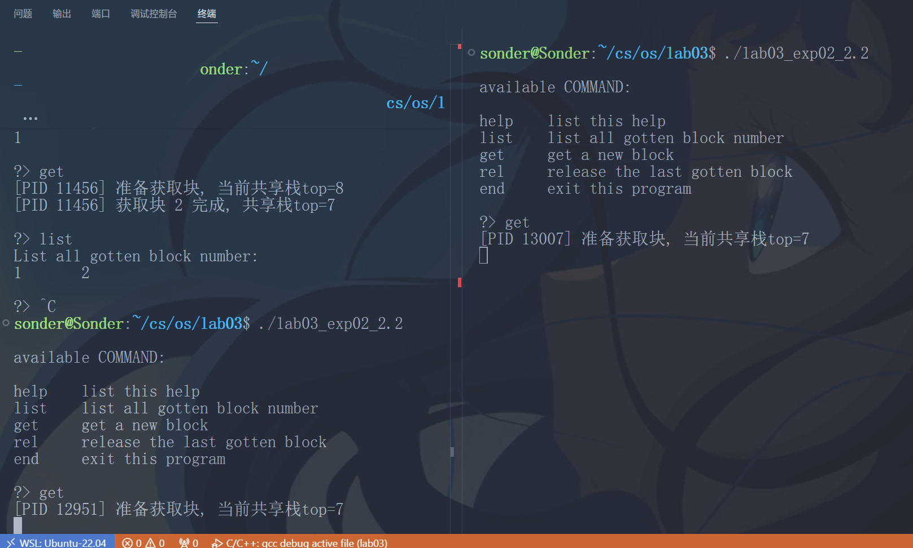

这里为同时 `get`：

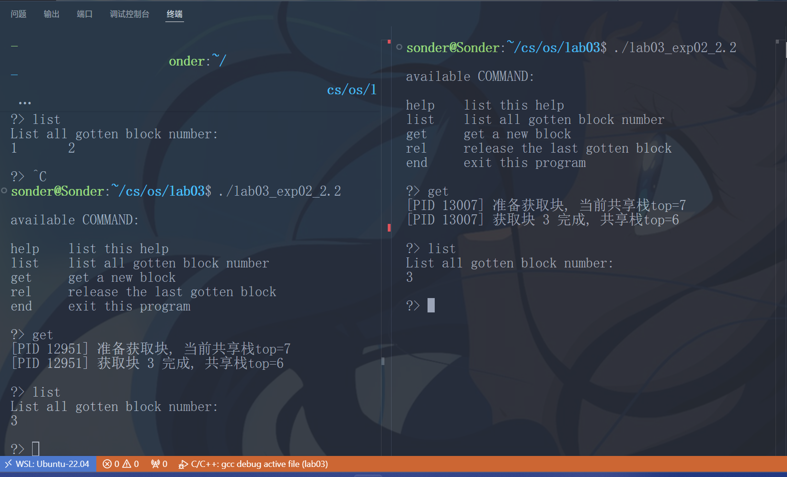

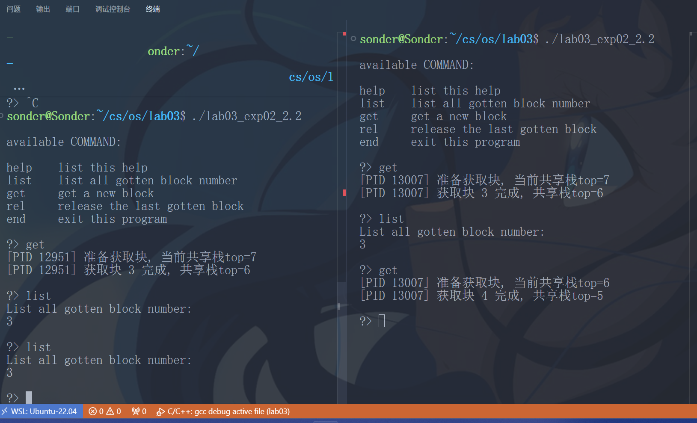

这里为右边 `get` 之后左边 `list`。

多进程通过共享内存通信，但各自维护私有状态。竞态条件会导致共享资源（块号）被重复分配。

利用信号量机制实现进程互斥功能，记录执行结果，并进行对比分析。

```c
#include <sys/types.h>
#include <unistd.h>
#include <signal.h>
#include <stdio.h>
#include <string.h>
#include <sys/ipc.h>
#include <sys/shm.h>
#include <sys/sem.h>
#include <stdlib.h>
#define MY_SHMKEY 10071822
#define MY_SEMKEY 10071823
#define MAX_BLOCK 10
#define MAX_CMD 8
struct shmbuf
{
    int top;
    int stack[MAX_BLOCK];
} *shmptr, local;
char cmdbuf[MAX_CMD];
int shmid, semid;
union semun
{
    int val;
    struct semid_ds *buf;
    unsigned short *array;
};
void sigend(int);
void relblock(void);
int getblock(void);
void showhelp(void);
void showlist(void);
void getcmdline(void);
void P(int semid);
void V(int semid);
int main(void)
{
    if ((shmid = shmget(MY_SHMKEY, sizeof(struct shmbuf), IPC_CREAT | IPC_EXCL | 0666)) < 0)
    {
        /* shared memory exists, act as client */
        shmid = shmget(MY_SHMKEY, sizeof(struct shmbuf), 0666);
        shmptr = (struct shmbuf *)shmat(shmid, 0, 0);
        semid = semget(MY_SEMKEY, 1, 0666);
        local.top = -1;
        showhelp();
        getcmdline();
        while (strcmp(cmdbuf, "end\n"))
        {
            if (!strcmp(cmdbuf, "get\n"))
                getblock();
            else if (!strcmp(cmdbuf, "rel\n"))
                relblock();
            else if (!strcmp(cmdbuf, "list\n"))
                showlist();
            else if (!strcmp(cmdbuf, "help\n"))
                showhelp();
            getcmdline();
        }
        shmdt(shmptr);
    }
    else /* acts as server */
    {
        int i;
        union semun arg;
        shmptr = (struct shmbuf *)shmat(shmid, 0, 0);
        /* 创建信号量,初始值为1 */
        semid = semget(MY_SEMKEY, 1, IPC_CREAT | IPC_EXCL | 0666);
        arg.val = 1;
        semctl(semid, 0, SETVAL, arg);
        signal(SIGINT, sigend);
        signal(SIGTERM, sigend);
        printf("NO OTHER OPERATION but press Ctrl+C or use kill to end.\n");
        shmptr->top = MAX_BLOCK - 1;
        for (i = 0; i < MAX_BLOCK; i++)
            shmptr->stack[i] = MAX_BLOCK - i;
        sleep(1000000);
    }
    return 0;
}
void sigend(int sig)
{
    shmctl(shmid, IPC_RMID, 0);
    semctl(semid, 0, IPC_RMID, 0);
    exit(0);
}
void P(int semid)
{
    struct sembuf sbuf;
    sbuf.sem_num = 0;
    sbuf.sem_op = -1;
    sbuf.sem_flg = 0;
    semop(semid, &sbuf, 1);
}
void V(int semid)
{
    struct sembuf sbuf;
    sbuf.sem_num = 0;
    sbuf.sem_op = 1;
    sbuf.sem_flg = 0;
    semop(semid, &sbuf, 1);
}
void relblock(void)
{
    if (local.top < 0)
    {
        printf("No block to release!\n");
        return;
    }
    P(semid); /* 进入临界区 */
    shmptr->top++;
    shmptr->stack[shmptr->top] = local.stack[local.top--];
    V(semid); /* 退出临界区 */
}
int getblock(void)
{
    P(semid); /* 进入临界区 */
    if (shmptr->top < 0)
    {
        printf("No free block to get!\n");
        V(semid);
        return -1;
    }
    local.stack[++local.top] = shmptr->stack[shmptr->top];
    shmptr->top--;
    V(semid); /* 退出临界区 */
    return 0;
}
void showhelp(void)
{
    printf("\navailable COMMAND:\n\n");
    printf("help\tlist this help\n");
    printf("list\tlist all gotten block number\n");
    printf("get\tget a new block\n");
    printf("rel\trelease the last gotten block\n");
    printf("end\texit this program\n");
}
void showlist(void)
{
    int i;
    printf("List all gotten block number:\n");
    for (i = 0; i <= local.top; i++)
        printf("%d\t", local.stack[i]);
    printf("\n");
}
void getcmdline(void)
{
    printf("\n?> ");
    fgets(cmdbuf, MAX_CMD - 1, stdin);
}
```

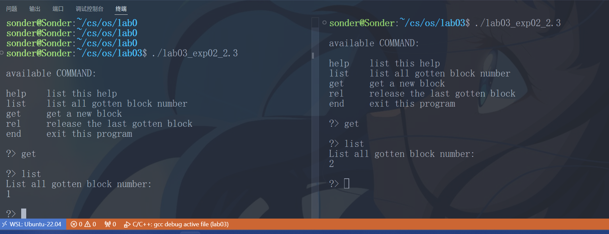

两个同时进行 `get`，发现不会冲突。

---

## 实验数据记录

详情见实验步骤部分的每个问题下面。

---

## 问题讨论

1. 实验三\_进程管理1\_fork 里面第一个 C 文件有点错误，要加上头文件 `#include <sys/wait.h>`，还有 `wait()` 改成 `wait(NULL)` 否则会报错
2. 实验三\_进程管理1\_fork 里面第二个 C 文件有点错误，要加上头文件 `#include <sys/wait.h>`，还有 `wait()` 改成 `wait(NULL)`，以及需要声明 `pid`（类型 `pid_t`）
3. 实验三\_进程管理1\_fork 第二个 C 文件的实验：**修改程序并分析执行结果** 放在 2 处的时候，发现 `gcc -o` 编译运行的结果和我 VSCode 直接 F5 debug 出来的结果不一样

如下为 VSCode F5 调试运行 debug 的结果：

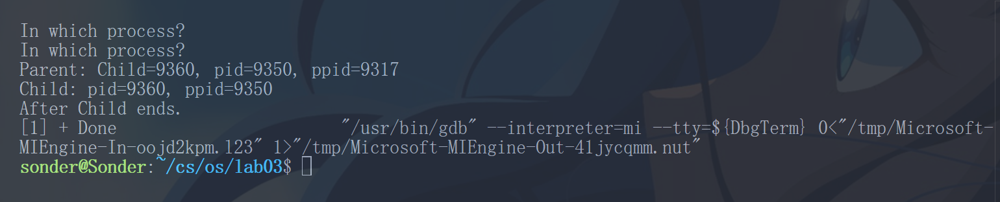

直接运行可执行文件：


在网上找到了一篇博客：[https://juejin.cn/post/7083469428397981704](https://juejin.cn/post/7083469428397981704) 但似乎跟这个问题没什么关系，其实也有关系，但是影响不止一个。

感觉更可能是取决于调度的问题，问了下朋友：

1. 单核系统上父子进程执行顺序不确定，多核系统上可能同时执行
2. `stdout` 写的时候会抢占锁，有可能导致输出顺序抢占
3. VSCode 环境下，父进程的父进程即 VSCode 本身有可能携带标志位影响调度器，涉及多方面的因素
