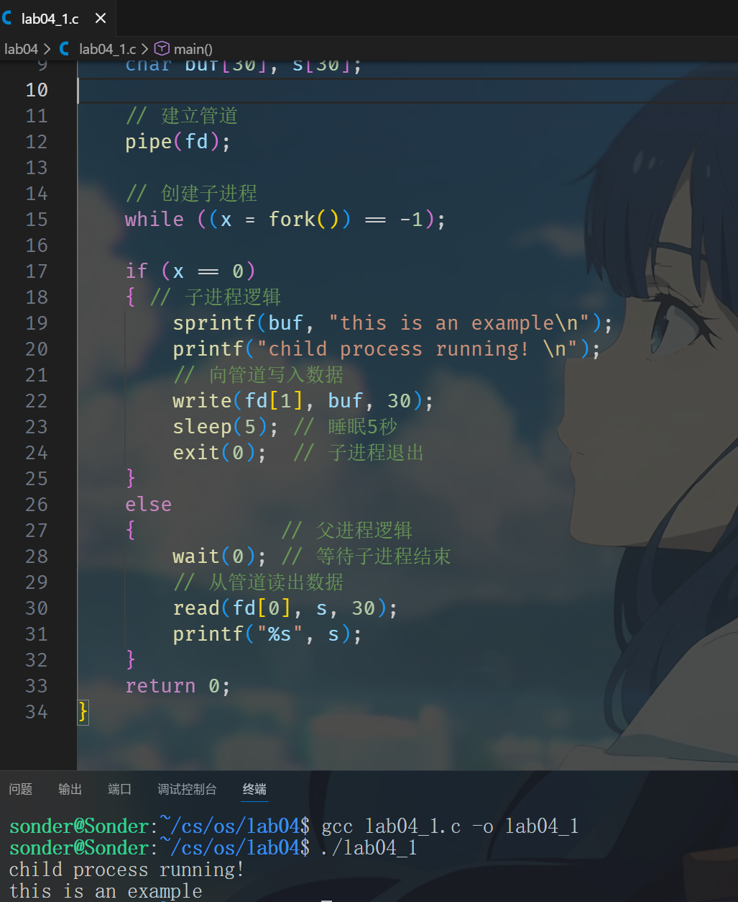
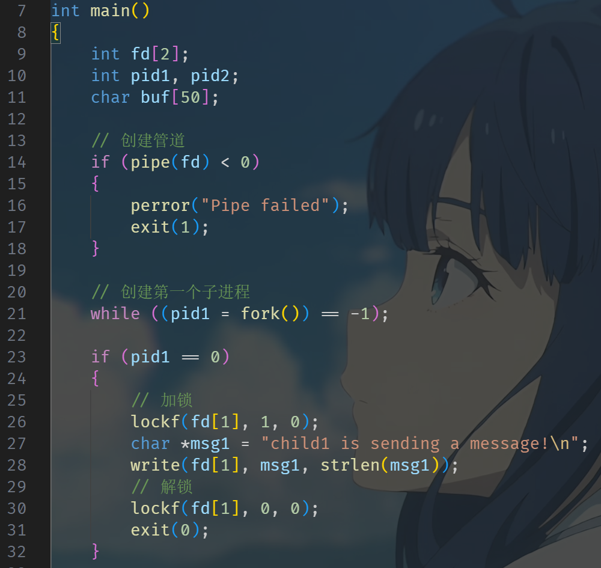
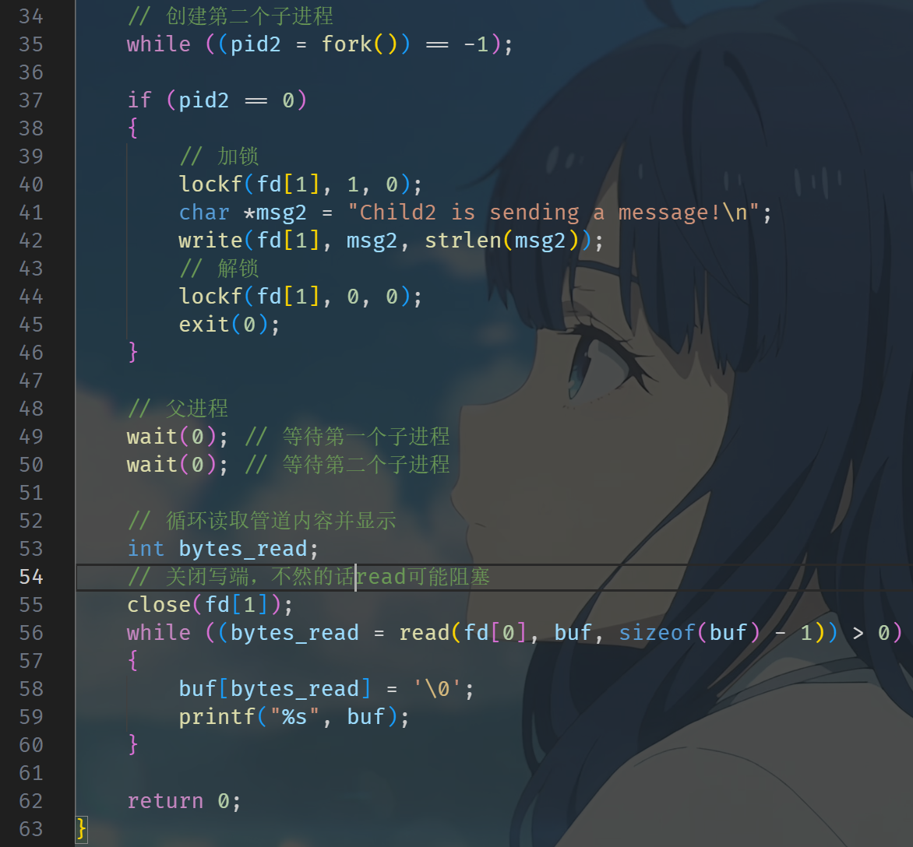
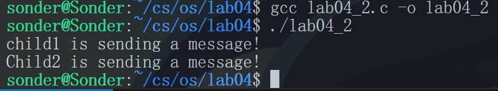
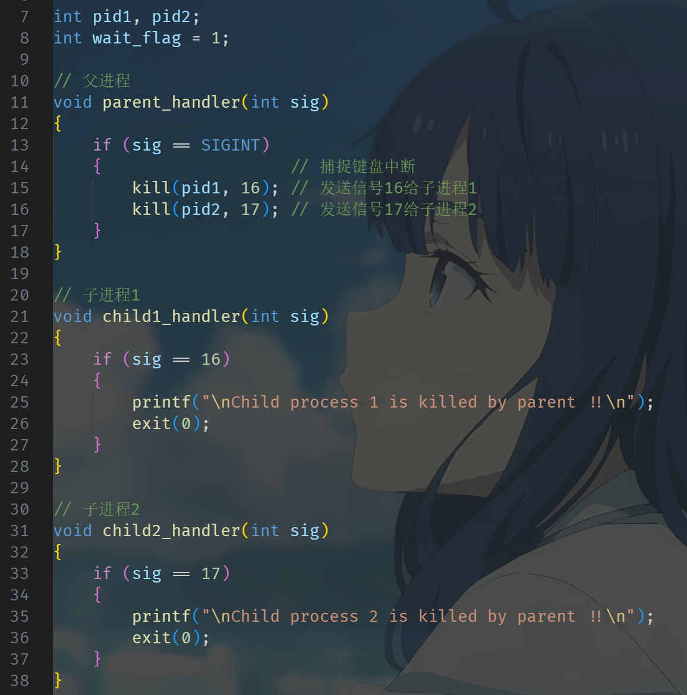
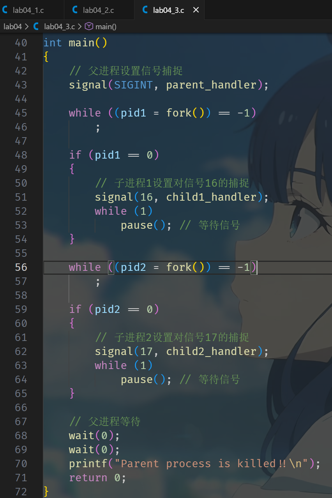
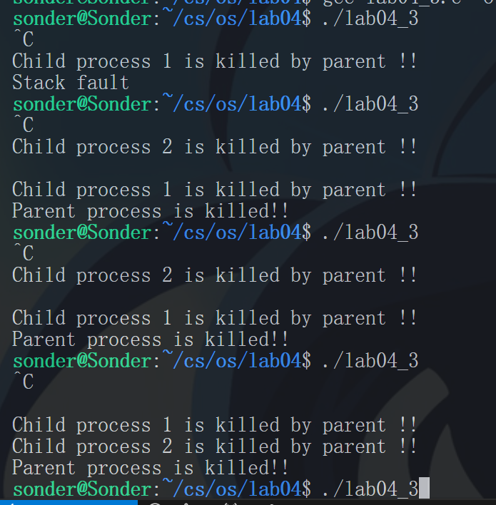
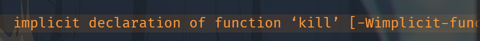

# lab04 实验四 进程通信 实验报告

本文档已完成姓名、学号等个人信息脱敏，并保留原实验内容与关键实现。

## 实验内容

### 1. 分析示例程序且编译执行

编写一个程序，建立一个 `pipe`，同时父进程产生一个子进程，子进程向 `pipe` 中写入一个字符串，父进程相隔 5 秒钟从该 `pipe` 中读出该字符串。

```c
#include <stdio.h>
main()
{
    int x, fd[2];
    char buf[30], s[30];
    pipe(fd);
    while ((x=fork())==-1);
    if (x==0)
    {
        sprintf(buf, "this is an example\n");
        printf("child process running! \n");
        write(fd[1], buf, 30);  /* 把 buf 中的字符写入管道 */
        sleep(5);               /* 睡眠 5 秒，让父进程读 */
        exit(0);                /* 关闭 x，子进程自我中止 */
    }
    else
    {
        wait(0);                /* 父进程挂起直到其某一子进程中止为止 */
        read(fd[0], s, 30);
        printf("%s", s);
    }
}
```

### 2. 编写一段程序

使用系统调用 `pipe()` 建立一条管道线，同时父进程生成 2 个子进程分别向这条管道写一句话：`child1 is sending a message!` `Child2 is sending a message!` 父进程则循环从管道中读出信息，显示在屏幕上。（提示：两个子进程向管道中写入字符的时候要保持互斥，使用 `lockf`）

```c
{
    lockf(fd[1], 1, 0);
    // ...
    lockf(fd[1], 0, 0);
}
```

### 3. (选做) 编制一段程序，实现软中断通信

使用系统调用 `fork()` 创建两个子进程，再用系统调用 `signal()` 让父进程捕捉键盘上来的中断信号，当父进程接受到这两个软中断的其中某一个后，父进程用系统调用 `kill()` 向两个子进程分别发送整数值为 16 和 17 软中断信号，子进程获得对应软中断信号后，分别输出下列信息后终止：

- `Child process 1 is killed by parent !!`
- `Child process 2 is killed by parent !!`

父进程调用 `wait()` 函数等待两个子进程终止后，输出以下信息后终止：

- `Parent process is killed!!`

多运行几次编写的程序，简略分析出现**不同结果**的原因。

软中断，是对硬中断的一种模拟，发送软中断就是向接收进程的 `proc` 结构中的相应项发送一个特定意义的信号。软中断必须等到接收进程执行时才能生效。

---

## 实验步骤

### 1. 分析示例程序且编译执行



`child process running` 出来之后，过一段时间 `sleep` 之后将 `printf` 出来 `this is an example`。

### 2. 编写一段程序





运行结果：



### 3. (选做) 编制一段程序，实现软中断通信







可以观察到，每次运行结果可能不一样（测试：将进程运行时间长短不一样）。

---

## 问题讨论

### 1. `kill` 函数的隐式声明问题

在第三个小问题中，`kill` 函数出现了 `implicit declaration of function 'kill'`：



只是添加 `<signal.h>` 的头文件不行，还需要添加 `<sys/types.h>`。

### 2. 关于 `read()` 与 `write()` 的阻塞机制

父进程在子进程睡眠期间处于什么状态：

管道通信具有同步机制。如果管道中没有数据，父进程调用的 `read(fd[0], ...)` 操作会默认处于阻塞（Block）状态，直到有数据写入或管道写端被关闭。同样，如果管道被写满（超过 4096 字节缓冲），写进程也会被阻塞。

本实验中，父进程通过 `wait(0)` 挂起等待子进程结束，确保了父进程不会在子进程写入之前就尝试读取并退出。这种阻塞和等待机制是进程间协调运行速度的关键。

### 3. 关于进程调度顺序的不确定性

在实验中，每次运行程序，屏幕上显示的 `Child1...` 和 `Child2...` 的顺序可能不同。

为何子进程的输出顺序随机？

`fork()` 创建子进程后，父进程、子进程 1、子进程 2 处于平等的竞争状态。CPU 的调度策略决定了谁先获得时间片执行。操作系统内核的调度是不可预测的，因此无法预知哪个子进程先执行到 `lockf` 并写入数据。

进程的执行顺序取决于操作系统的调度算法。
