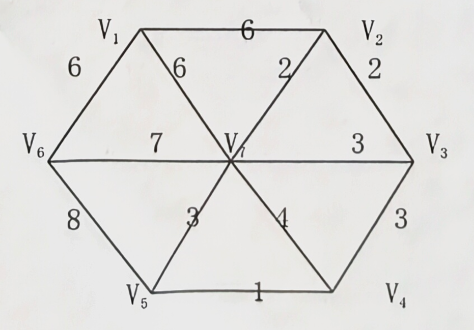

# 河南大学数学与信息科学学院 2013～2014 学年第 1 学期期末考试

## 运筹学 试卷 B卷

**考试方式：** 闭卷
**考试时间：** 120 分钟
**卷面总分：** 100 分

---

### 一、选择题（每题 3 分，共 15 分）

1. 线性规划最优解不唯一是指 【 】

   * A. 可行解集合无界
   * B. 存在某个检验数 $\lambda_k > 0$ 且 $\alpha_{ik} \le 0 \ (i=1,\dots,m)$
   * C. 最优表中存在非基变量的检验数为零
   * D. 可行解集合为空集
2. 互为对偶的两个问题存在关系 【 】

   * A. 原问题无可可行解，对偶问题也无可可行解
   * B. 对偶问题有可行解，原问题也有可行解
   * C. 原问题有最优解，对偶问题可能没有最优解
   * D. 原问题无界解，对偶问题无可可行解
3. 有 4 个产地 6 个销地的平衡运输问题模型具有特征 【 】

   * A. 有 24 个变量 10 个约束条件
   * B. 有 10 个变量 24 个约束条件
   * C. 有 24 个变量 9 个约束条件
   * D. 有 9 个变量 24 个约束条件
4. 要求不低于目标值，其目标函数是 【 】

   * A. $\max Z = d^-$
   * B. $\min Z = d^-$
   * C. $\max Z = d^+$
   * D. $\min Z = d^+$
5. 在中国邮递员问题的最优方案中，图中每个圈的重复边的总权不大于该圈总权的一半。“日”字形图的圈数为 3，“田”字形图的圈数为 【 】

   * A. 5
   * B. 9
   * C. 11
   * D. 13

---

### 二、填空题（每题 3 分，共 30 分）

1. 将目标函数 $\max Z = 10x_1 - 5x_2 + 8x_3$ 转化为求极小值是 ________________________。
2. 线性规划问题中，如果在约束条件中出现等式约束，我们通常用增加 ________________________ 的方法来产生初始可行基。
3. 原问题的第一个约束方程是“=”型，则对偶问题相应的变量是 ________________________ 变量。
4. 用大 M 法求解 Max 型线性规划问题时，人工变量在目标函数中的系数均为 ________________________。
5. 有 $m$ 个产地，$n$ 个销售地的平衡运输问题，其约束条件系数矩阵的非零元素等于 ________________________。
6. 目标规划总是求目标函数的极 ________________________ 值，且目标函数中没有线性规划中的价值系数，而是在各偏差变量前加上级别不同的 ________________________。
7. 动态规划的理论基础是 ________________________。
8. 用标号法求解网络最大流问题，当得到最大流的同时，也得到了最小截集，它是由 ________________________ 点集和 ________________________ 点集构成的截集中的 ________________________ 弧组成。
9. 若 $e_{ij}$ 为某增广链的后向弧，则 $f_{ij}$ ________________________。
10. 求最小生成树问题，常用的方法有：避圈法和 ________________________。

---

### 三、计算题（共 45 分）

1. 用两阶段法求解下述线性规划问题。（10 分）

   $$
   \min \quad z = 2x_1 + 3x_2 - 5x_3
   $$

   $$
   \text{s.t.} \quad \begin{cases}
   x_1 + 4x_2 + 2x_3 \ge 8 \\
   3x_1 + 2x_2 \ge 6 \\
   x_1, x_2, x_3 \ge 0
   \end{cases}
   $$
2. 用图解法求下述目标规划问题的满意解。（8 分）

   $$
   \min \quad Z = p_1(2d_1^+ + 3d_2^+) + p_2 d_3^- + p_3 d_4^+
   $$

   $$
   \text{s.t.} \quad \begin{cases}
   x_1 + x_2 + d_1^- - d_1^+ = 10 \\
   x_1 + d_2^- - d_2^+ = 4 \\
   5x_1 + 3x_2 + d_3^- - d_3^+ = 56 \\
   x_1 + x_2 + d_4^- - d_4^+ = 12 \\
   x_1, x_2 \ge 0; \quad d_i^-, d_i^+ \ge 0 \quad (i = 1,2,3,4)
   \end{cases}
   $$
3. 求下图的最小支撑树：（8 分）



   ```mermaid
   graph TD
       V1((V1)) --- |6| V2((V2))
       V2 --- |2| V3((V3))
       V3 --- |3| V4((V4))
       V4 --- |1| V5((V5))
       V5 --- |8| V6((V6))
       V6 --- |6| V1
       V1 --- |6| V7((V7))
       V2 --- |2| V7
       V3 --- |3| V7
       V4 --- |4| V7
       V5 --- |3| V7
       V6 --- |7| V7
   ```


4. 考虑下列线性规划：

   $$
   \max \quad Z = -5x_1 + 5x_2 + 13x_3
   $$

   $$
   \text{s.t.} \quad \begin{cases}
   -x_1 + x_2 + 3x_3 \le 20 \\
   12x_1 + 4x_2 + 10x_3 \le 90 \\
   x_1, x_2, x_3 \ge 0
   \end{cases}
   $$

   最优单纯形表为：

   | $X_B$ | $b'$ | $x_1$ | $x_2$ | $x_3$ | $x_4$ | $x_5$ |
   | :-----: | :----: | :-----: | :-----: | :-----: | :-----: | :-----: |
   | $x_2$ |   20   |   -1   |    1    |    3    |    1    |    0    |
   | $x_5$ |   10   |   16   |    0    |   -2   |   -4   |    1    |
   | $-Z$ |  -100  |    0    |    0    |    2    |    5    |    0    |


   * (1) 写出此线性规划的最优解、最优基 $B$ 和它的逆 $B^{-1}$；（6 分）
   * (2) 求此线性规划的对偶问题的最优解；（4 分）
5. 已知运输问题的供应量 $a = (3,4,7)^T$ 和需求量 $b = (2,8,4)^T$ 及单位运价表为：

   $$
   C_{ij} = \begin{pmatrix}
   2 & 4 & 5 \\
   14 & 13 & 17 \\
   7 & 8 & 3
   \end{pmatrix}
   $$

   用最小元素法求近似运输方案。（仅写结果表格）（9 分）

---

### 四、建模（10 分）

某化学工厂用甲、乙两种原料混合配制一种药品。甲、乙两种原料都含有 A、B、C 三种化学成分，其含量是甲为 12%、2%、3%；乙为 3%、3%、5%。规定产品中三种化学成分含量不低于 4%、2%、5%。甲、乙两种原料的成本分别为每千克 3 元和 2 元。问如何配制产品，使总成本最小？试建立该问题的线性规划模型，不必求解。
