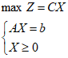
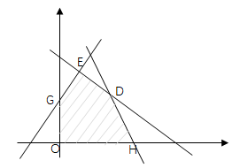

# 第二章 线性规划复习题

## 一、选择题

### 1. 人工变量法
使用人工变量法求解极大化线性规划问题时，当所有的检验数λj≤0，在基变量中仍含有非零的人工变量，表明该线性规划问题（）

- A. 有唯一的最优解
- B. 有无穷多最优解
- C. 为无界解
- D. 无可行解

### 2. 线性规划标准型特征
关于线性规划标准型的特征，哪一项不正确（）

- A. 决策变量全部大于等于0
- B. 约束条件全为线性等式
- C. 约束条件右端常数无约束
- D. 目标函数值求最大

### 3. 线性规划可行解集合
线性规划可行解集合非空时一定（）

- A. 包含原点
- B. 有界
- C. 无解
- D. 是凸集

### 4. 单纯形法迭代规则
为什么单纯形法迭代的每一个解都是可行解？答：因为遵循了下列规则（）

- A. 按最小比值规则选择出基变量
- B. 先进基后出基规则
- C. 标准型要求变量非负规则
- D. 按检验数最大的变量进基规则

---

## 二、填空题

1. 线性规划问题中，如果在约束条件中出现等式约束，我们通常用增加 **________** 的方法来产生初始可行基。

2. 在线性规划问题中，称满足所有约束条件方程和非负限制的解为 **________**。

3. 若线性规划问题的最优基为B，则问题的最优值为 **________**，线性规划的对偶问题的最优解是 **________**，其中CB是基B所对应的基变量在目标函数中的系数向量。

   线性规划问题是：
   
   MAX Z = C X
   AX = b
   X ≥ 0


4. 在基本可行解中非基变量一定为 **________**。

5. 在线性规划问题中，图解法适合用于处理 **________** 为两个的线性规划问题。

6. 线性规划模型有三种参数，其名称分别为价值系数、**________** 和 **________**。

7. 在单纯形法迭代中，任何从基变量中替换出来的变量在紧接着的下一次迭代中 **________** 立即入基。

8. 如果把约束方程：
   ```
   x₁ + 3x₂ ≤ 4
   2x₁ + 5x₂ ≥ 5
   ```
   标准化为：
   ```
   x₁ + 3x₂ + x₃ = 4
   2x₁ + 5x₂ - x₄ + x₅ = 5
   ```
   时：
   - x₁是 **________** 变量
   - x₂是 **________** 变量
   - x₃是 **________** 变量
   - x₄是 **________** 变量
   - x₅是 **________** 变量

9. 线性规划问题的基本可行解与基本解的区别是基本可行解的分量 **________**。

10. 求目标最大的LP中，有无穷最优解的条件是 **________**。

11. 线性规划单纯形法中确定出基变量采用 **________** 规则。

12. 原问题和对偶问题均存在可行解，则两者均存在 **________**。

13. 对于平面中的某线性规划问题的约束集合，其可行解为 **________**，基本解为 **________**，基本可行解为 **________**。

14. 

---

## 三、判断题

1. **任何一个线性规划都可以转化为标准型。** （ ）

2. **单纯形法中采用最小比值规则确定出基变量。** （ ）

3. **两阶段法第一阶段的目标函数是原线性规划问题的目标函数。** （ ）

4. **对于求最小值线性规划问题，如果所有检验数小于等于0，得到最优解。** （ ）

5. **线性规划问题的标准型可以求最小值。** （ ）

6. **线性规划模型中减少一个约束条件，可行域的范围一定增大。** （ ）

7. **对于求最大值线性规划问题，如果某个非基变量检验数为0，则存在无穷个最优解。** （ ）

8. **单纯形法求解过程中，基变量个数和非基变量个数是变化的。** （ ）

9. **需要求得所有非基变量的检验数才能判断当前解是否是最优解。** （ ）


# Answer
好的，这是这份线性规划复习题的答案与解析。

***

## 一、选择题

### 1. 人工变量法
**答案：D. 无可行解**

**解析：** 在使用人工变量法（如大M法或两阶段法）求解最大化问题时，当所有检验数 $\lambda_j \le 0$ 时，表明已达到最优性条件。但如果此时基变量中仍含有**大于零**的人工变量，说明为了满足约束条件，必须让一个“不存在”的变量取正值。这违反了原问题的约束，因此原问题**没有可行解**。

---
### 2. 线性规划标准型特征
**答案：C. 约束条件右端常数无约束**

**解析：** 线性规划的标准型 ($max \ Z = CX, s.t. AX=b, X \ge 0$) 特征包括：
* **A.** 决策变量非负 ($X \ge 0$)
* **B.** 约束条件为等式 ($AX=b​$)
* **D.** 目标函数求最大值
* **C.** 是错误的。标准型要求约束条件右端的常数项 $b$ **必须为非负** ($b \ge 0$)，以便于找到初始可行基。如果某个 $b_i < 0$，需要将该约束方程两边同乘-1。

---
### 3. 线性规划可行解集合
**答案：D. 是凸集**

**解析：** 这是线性规划的一个基本性质。由一系列线性不等式或等式所界定的区域（即可行域）在几何上总是一个**凸集**（可能为空、有界或无界）。
* **A.** 不一定包含原点，例如约束可以是 $x_1 \ge 5$。
* **B.** 不一定有界，可行域可以是开放的。
* **C.** 题目已假设可行解集合非空。

---
### 4. 单纯形法迭代规则
**答案：A. 按最小比值规则选择出基变量**

**解析：** 单纯形法每次迭代都是从一个基本可行解（顶点）移动到另一个相邻的基本可行解。为了保证移动后得到的新解仍然是**可行解**（即所有变量值均非负），必须遵循**最小比值规则**来确定出基变量。这个规则确保了新的基变量值不会出现负数。

***

## 二、填空题

1.  线性规划问题中，如果在约束条件中出现等式约束，我们通常用增加 **人工变量** 的方法来产生初始可行基。
    > **解析：** 等式约束自身无法提供单位矩阵中的列向量作为初始基变量，因此需要引入人工变量。

2.  在线性规划问题中，称满足所有约束条件方程和非负限制的解为 **可行解**。
    > **解析：** 这是可行解 (Feasible Solution) 的定义。

3.  若线性规划问题的最优基为B，则问题的最优值为 **$C_B B^{-1} b$**，线性规划的对偶问题的最优解是 **$C_B B^{-1}$**，其中 $C_B$ 是基B所对应的基变量在目标函数中的系数向量。
    > **解析：** 这是单纯形法中的重要公式。$Z_{opt} = C_B X_B = C_B B^{-1} b$。根据对偶理论，对偶问题的最优解（影子价格）$Y_{opt} = C_B B^{-1}$。

4.  在基本可行解中非基变量一定为 **0**。
    > **解析：** 这是基本解的定义，将变量分为基变量和非基变量，非基变量的值被设为0。

5.  在线性规划问题中，图解法适合用于处理 **决策变量** 为两个的线性规划问题。
    > **解析：** 图解法在二维平面上进行，因此只能处理两个决策变量的问题。

6.  线性规划模型有三种参数，其名称分别为价值系数、**技术系数** 和 **右端项常数**。
    > **解析：** 价值系数 ($c_j$)、技术系数 ($a_{ij}$) 和右端项常数 ($b_i$) 是构成LP模型的三个要素。

7.  在单纯形法迭代中，任何从基变量中替换出来的变量在紧接着的下一次迭代中 **不能** 立即入基。
    > **解析：** 一个变量刚被换出基，其检验数必然是不满足入基条件的（例如在最大化问题中，其检验数小于0），因此在下一次迭代中不可能被选为入基变量。

8.  如果把约束方程标准化...时：
    * $x_1$ 是 **决策** 变量
    * $x_2$ 是 **决策** 变量
    * $x_3$ 是 **松弛** 变量 (Slack Variable)
    * $x_4$ 是 **剩余** 变量 (Surplus Variable)
    * $x_5​$ 是 **人工** 变量 (Artificial Variable)
    > **解析：** $x_3$ 加入"≤"不等式使其变为等式。$x_4$ 从"≥"不等式中减去使其变为等式。$x_5$ 是为"≥"约束（在减去剩余变量后）添加的，用于构成初始基。

9.  线性规划问题的基本可行解与基本解的区别是基本可行解的分量 **必须非负**。
    > **解析：** 基本解只要求满足等式约束 $AX=b$（非基变量为0），而基本可行解在基本解的基础上，还要求所有变量满足非负约束 $X \ge 0$。

10. 求目标最大的LP中，有无穷最优解的条件是 **在最优单纯形表中，存在检验数为0的非基变量**。
    > **解析：** 如果最优解对应的检验数均 $\le 0​$，此时若有某个非基变量的检验数等于0，则可将此变量换入基中，目标函数值不变，但得到一个新的最优基本可行解。

11. 线性规划单纯形法中确定出基变量采用 **最小比值** 规则。
    > **解析：** 这是保证迭代后新解仍为可行解的关键步骤。

12. 原问题和对偶问题均存在可行解，则两者均存在 **最优解**。
    > **解析：** 这是线性规划的强对偶定理。

13. 对于平面中的某线性规划问题的约束集合，其可行解为 **阴影多边形区域 OGDH（含边界）**，基本解为 **几个约束直线的交点 O, G, E, D, H**，基本可行解为 **可行域的顶点 O, G, D, H**。
    > **解析：**
    > * **可行解**：满足所有约束的点的集合，即图中的阴影区域。
    * **基本解**：约束线两两相交的点。即使交点在可行域外（如E点），它也是一个基本解，只是不是可行解。
    * **基本可行解**：既是基本解又是可行解的点，即 可行域的顶点。

***

## 三、判断题

1.  **任何一个线性规划都可以转化为标准型。**
    **答案：√ (对)**
    > **解析：** 通过引入松弛/剩余变量、替换无约束变量、转换目标函数等方法，任何LP问题都能化为标准型。

2.  **单纯形法中采用最小比值规则确定出基变量。**
    **答案：√ (对)**
    > **解析：** 这是单纯形法的核心规则之一，用于保证迭代的可行性。

3.  **两阶段法第一阶段的目标函数是原线性规划问题的目标函数。**
    **答案：× (错)**
    > **解析：** 两阶段法第一阶段的目标是**最小化所有人工变量之和**，目的是找到原问题的一个基本可行解。原问题的目标函数在第二阶段才使用。

4.  **对于求最小值线性规划问题，如果所有检验数小于等于0，得到最优解。**
    **答案：× (错)**
    > **解析：** 对于**最小值**问题，当所有检验数**大于等于0** ($c_j - z_j \ge 0​$) 时，才达到最优解。所有检验数小于等于0是**最大值**问题的最优准则。

5.  **线性规划问题的标准型可以求最小值。**
    **答案：× (错)**
    > **解析：** 按照严格定义，标准型的目标函数是**求最大值 (max)**。虽然可以通过 $min \ Z = -max(-Z)$ 的转换来求解最小值问题，但这已经不是标准型本身了。

6.  **线性规划模型中减少一个约束条件，可行域的范围一定增大。**
    **答案：× (错)**
    > **解析：** 如果被减少的约束是一个**冗余约束**（即它被其他约束所蕴含），那么去掉它对可行域没有任何影响，可行域范围不变。所以“一定增大”是错误的。

7.  **对于求最大值线性规划问题，如果某个非基变量检验数为0，则存在无穷个最优解。**
    **答案：√ (对)**
    > **解析：** 这是存在无穷多最优解的判别条件。检验数为0的非基变量可以入基而不改变最优目标函数值，从而得到另一个最优解。

8.  **单纯形法求解过程中，基变量个数和非基变量个数是变化的。**
    **答案：× (错)**
    > **解析：** 在单纯形法中，基变量的个数始终等于约束条件的个数 ($m$)，非基变量的个数也始终是固定的 ($n-m$)。变化的是**哪些变量**是基变量，而不是它们的**数量**。

9.  **需要求得所有非基变量的检验数才能判断当前解是否是最优解。**
    **答案：√ (对)**
    > **解析：** 必须检查**所有**非基变量的检验数，以确保没有可以使目标函数值继续优化的入基变量。如果只检查一部分，可能会漏掉更优的解。