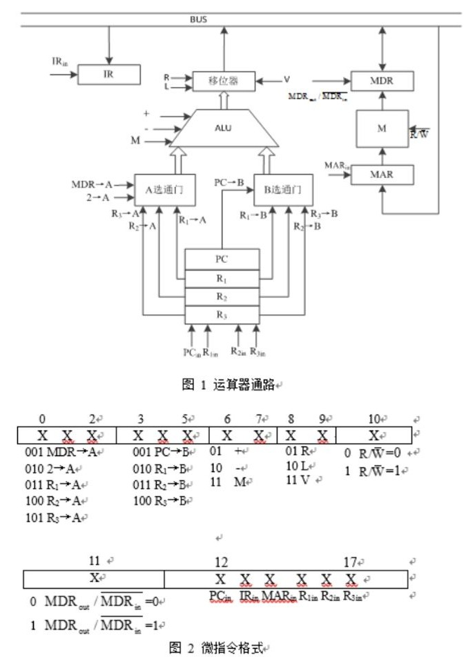

# 2017~2018 学年第2学期《计算机组成原理》试卷 A 卷参考答案

---

## 一、单项选择题（本题共25小题，每小题2分，共50分）

1. CPU中不包括_____。 [ C ]

   * A. 操作控制器
   * B. 指令寄存器
   * C. 地址控制器
   * D. 通用寄存器

2. 按照IEEE754标准定义的32位浮点数41A4C000H，对应的十进制数是_____。 [ D ]

   * A. 4.59375
   * B. -20.59375
   * C. -4.59375
   * D. 20.59375

3. 若片选地址为111时，选定某一$32\text{K} \times 16$的存储芯片工作，则该芯片在存储器中的首地址和末地址分别是_____。 [ B ]

   * A. 00000H，01000H
   * B. 38000H，3FFFFH
   * C. 3800H，3FFFH
   * D. 0000H，0100H

4. 在全相联映射、直接映射和组相联映射中，块冲突概率最小的是_____。 [ A ]

   * A. 全相联映射
   * B. 直接映射
   * C. 组相联映射
   * D. 不确定

5. 下列数中最大的为_____。 [ B ]

   * A. (101001)₂
   * B. (2000)₃
   * C. (52)₇
   * D. (2E)₁₆

6. 计算机操作的最小单位时间是_____。 [ C ]

   * A. 时钟频率
   * B. 指令周期
   * C. CPU周期
   * D. 中断周期

7. 设机器数采用移码表示（含1位符号位），若寄存器内容为9BH，则对应的十进制数为_____。 [ A ]

   * A. 27
   * B. -97
   * C. -101
   * D. 155

8. 下列有关浮点数加减操作运算的叙述中，正确的是_____。
   - I. 对阶操作不会引起阶码上溢或下溢
   - II. 右规和尾数舍入都可能引起阶码上溢
   - III. 左规时可能引起阶码下溢
   - IV. 尾数溢出时结果不一定溢出

   * A. 仅II、III
   * B. 仅I、II、IV
   * C. 仅I、III、IV
   * D. I、II、III、IV

9. 某存储器容量为$64\text{KB}$，按字节编址，地址4000H-5FFFH为ROM区，其余为RAM区，若用$8\text{K} \times 4$位的SRAM芯片设计，则需要这芯片的数量为_____。 [ C ]

   * A. 7
   * B. 8
   * C. 14
   * D. 16

10. 下列命令组合中，一次访存过程中，不可能发生的是_____。 [ D ]

   * A. TLB未命中，Cache未命中，Page未命中
   * B. TLB未命中，Cache命中，Page命中
   * C. TLB命中，Cache未命中，Page命中
   * D. TLB命中，Cache命中，Page未命中

11. 设机器字长为32位，一个容量为$16\text{MB}$的存储器，CPU按半字寻址，其可寻址的单元数是_____。 [ B ]

   * A. $2^{24}$
   * B. $2^{23}$
   * C. $2^{22}$
   * D. $2^{21}$

12. 在下列几种存储器中，CPU不能直接访问的是_____。 [ A ]

   * A. 硬盘
   * B. 内存
   * C. Cache
   * D. 寄存器

13. 计算机的存储系统是指_____。 [ D ]

   * A. RAM
   * B. ROM
   * C. 主存储器
   * D. Cache、主存储器和外存储器

14. 双端口RAM在_____情况下可能发生读/写冲突。 [ B ]

   * A. 左端口和右端口的地址码不同
   * B. 左端口和右端口的地址码相同
   * C. 左端口和右端口的数据码不同
   * D. 左端口和右端口的数据码相同

15. 在高速缓存系统中，主存容量为$12\text{MB}$，Cache容量为$400\text{KB}$，则该存储系统的容量为_____。 [ B ]

   * A. $12\text{MB}$+$400\text{KB}$
   * B. $12\text{MB}$
   * C. $12\text{MB}$-$12\text{MB}$+$400\text{KB}$
   * D. $12\text{MB}$-$400\text{KB}$

16. 假设某址寄存器R的内容为1000H，指令中的形式地址为2000H，地址1000H中的内容为2000H，地址2000H中的内容为3000H，地址3000H中的内容为4000H，则变址寻址方式下访问到的操作数在_____。 [ C ]

   * A. 1000H
   * B. 2000H
   * C. 3000H
   * D. 4000H

17. 指令中地址码给出的是操作数的有效地址，则该指令采用_____。 [ A ]

   * A. 直接寻址
   * B. 立即寻址
   * C. 寄存器寻址
   * D. 间接寻址

18. 微程序控制存储器属于_____的一部分。 [ C ]

   * A. 主存
   * B. 外存
   * C. CPU
   * D. 缓存

19. 在一个16位的总线系统中，若时钟频率为100MHz，总线周期为5个时钟周期传输一个字，则总线带宽是_____。 [ B ]

   * A. $4\text{MB}$/s
   * B. $40\text{MB}$/s
   * C. $16\text{MB}$/s
   * D. $64\text{MB}$/s

20. 某计算机的指令流水线由四个功能段组成，指令流经各功能段的时间(忽略各功能段之间的缓存时间)分别是90ns、80ns、70ns和60ns，则该计算机的CPU时钟周期至少是_____。 [ A ]

   * A. 90ns
   * B. 80ns
   * C. 70ns
   * D. 60ns

21. 某计算机的控制器采用微程序控制方式，微指令中的操作控制字段采用编码表示法，共有33个微命令，构成5个互斥类，分别包含7、3、12、5和6个微命令，则操作控制字段至少有_____。 [ C ]

   * A. 5位
   * B. 6位
   * C. 15位
   * D. 33位

22. 一次总线事务中，主设备只需给出一个首地址，从设备就能从首地址开始的若干个连续单元读出或写入多个数据，这种总线事务方式称为_____。 [ C ]

   * A. 并行传输
   * B. 串行传输
   * C. 突发传输
   * D. 同步传输

23. Cache的容量为$4\text{MB}$，主存的容量为$256\text{MB}$。若主存读写时间为30ns，Cache的读写时间为3ns，平均读写时间为3.27ns，则Cache的命中率为_____。 [ D ]

   * A. 92%
   * B. 95%
   * C. 98%
   * D. 99%

24. 下列情况下可能不会发生中断请求的是_____。 [ B ]

   * A. DMA操作结束
   * B. 一条指令执行完毕
   * C. 机器出现故障
   * D. 外中断

25. 某机有5个中断源L0～L4，按中断响应优先级从高到低依次为L0 $\to$ L1 $\to$ L2 $\to$ L3 $\to$ L4，现要求将中断处理次序改为L1 $\to$ L3 $\to$ L4 $\to$ L0 $\to$ L2，L4的中断字为_____。 [ A ]

   * A. 10101
   * B. 00001
   * C. 01010
   * D. 00011

---

## 二、计算题（本题共4小题，每小题6分，共24分）

1. 已知X=-0.10110和Y=-0.10100，用变形补码计算X-Y和X·Y。

2. 用一台50MHz处理机执行某标准测试程序，它包含的混合指令数和相应所需的平均时钟周期数如下表所示：

   | 指令类型 | 指令数目 | 平均时钟周期数 |
   | -------- | -------- | -------------- |
   | 整数运算 | 45000    | 1              |
   | 数据传送 | 32000    | 2              |
   | 浮点运算 | 15000    | 2              |
   | 控制传送 | 8000     | 2              |

   求有效CPI、MIPS、处理机程序执行时间tcpu。

3. 某指令系统中有64条单字长(32位)地址RS型指令，已知系统中通用寄存器16个，操作数S可选用直接寻址、间接寻址、变址寻址、基址寻址、相对寻址、寄存器间接寻址6种寻址方式，采用专用的基址和变址寄存器。直接寻址方式中，可直接寻址的存储空间为多大？(写出指令格式并写出推导过程)
好的，这是一个经典的计算机指令格式设计问题。我们来逐步分析和推导。

### 推导过程

要设计指令格式，我们首先需要确定指令中各个字段所需的位数。一条32位的RS型指令通常包含以下几个部分：

1. **操作码 (Opcode)**: 用于指定具体执行哪一条指令。
2. **寄存器操作数 (R)**: 用于指定16个通用寄存器中的一个。
3. **寻址模式 (Addressing Mode)**: 用于指定源操作数S的寻址方式。
4. **地址/位移量 (Address/Displacement)**: 用于计算源操作数S的地址。

现在我们来计算每个字段所需的位数：

* **操作码 (OP) 位数**: 系统共有64条不同的指令。为了唯一标识这64条指令，操作码字段至少需要 $N_{op}$ 位，其中 $2^{N_{op}} \ge 64$。
    因此，$N_{op} = 6$ 位。

* **寄存器 (R) 字段位数**: 系统中有16个通用寄存器。为了唯一指定其中一个，寄存器字段需要 $N_{reg}$ 位，其中 $2^{N_{reg}} \ge 16$。
    因此，$N_{reg} = 4$ 位。

* **寻址模式 (AM) 字段位数**: 源操作数S有6种寻址方式（直接、间接、变址、基址、相对、寄存器间接）。为了区分这6种方式，寻址模式字段需要 $N_{am}$ 位，其中 $2^{N_{am}} \ge 6$。
    $2^{2}$ = 4$ (不够)，$2^{3}$ = 8$ (足够)。
    因此，$N_{am} = 3$ 位。

* **地址/位移量 (D) 字段位数**: 这是指令字长32位中剩余的部分。
    $N_{d} = \text{总位数} - N_{op} - N_{reg} - N_{am}$
    $N_{d} = 32 - 6 - 4 - 3 = 19$ 位。

### 指令格式

根据以上推导，我们可以设计出如下的32位指令格式：

| 字段     | OP (操作码) | R (寄存器) | AM (寻址模式) | D (地址/位移量) |
| :------- | :---------- | :--------- | :------------ | :-------------- |
| **位数** | 6           | 4          | 3             | 19              |
| **位域** | 31 - 26     | 25 - 22    | 21 - 19       | 18 - 0          |

### 直接寻址的存储空间

现在我们来回答核心问题：**在直接寻址方式下，可直接寻址的存储空间是多大？**

* **定义**: 在直接寻址方式中，指令的地址字段 (D) 直接给出了操作数在主存中的有效地址。
* **计算**: 根据我们的指令格式设计，地址字段D的长度为 **19位**。
* **寻址能力**: 19位的地址字段可以表示 $2^{19}$ 个不同的地址。
    $2^{19} = 524,288$

由于题目提到“单字长(32位)地址”，这通常意味着内存是按字（Word）编址的。每个地址对应一个32位的字。

因此，**可直接寻址的存储空间为 $2^{19}$ 个字，即 524,288 个字，通常表示为 512K 字 (Words)。**

> **补充说明**: 如果系统是按字节（Byte）编址的（这是现代计算机更常见的做法），且每个字等于4个字节（32位），那么寻址空间将是：
> $512K \text{ 字} \times 4 \text{ 字节/字} = 2048K \text{ 字节} = 2M \text{ 字节 (MB)}$
> 但根据题目“单字长地址”的描述，以“字”为单位回答更为贴切。

4. 已知某磁盘组共有10个盘片，盘片存储区域内直径10cm，道密度为40道/cm，共有220个磁道，最小位密度200位/cm。试计算该磁盘组的总存储容量，请写出具体的计算过程。

---

## 三、综合题（本题共1小题，共13分）

1. 某系统的存储容量为$16\text{MB}$，Cache的容量为$8\text{KB}$，按字节编址，每字块为32B。设计一个4路组相联映射的Cache组织。

(1) 设计主存地址格式，请指出该主存地址每一构成部分的位数。(5分)

(2) 设Cache初始状态为空，CPU依次从主存0、1、2、...、99号单元中读出100个字节(主存一次读出一个字节)，问命中率是多少？(4分)

(3) 采用相联组映射时，若地址为3C05A1H的主存块要调入Cache中，在Cache中的地址是什么？请写出任意一种可能地址并写出具体的计算过程。(4分)

---

## 四、分析题（本题共1小题，共13分）

1. 设运算器通路如图1所示，ALU有+、-、M(传送)三种操作功能，其中"-"操作为A-B，移位器有R(右移)、L(左移)、V(直传)，指令系统为双字长定长指令格式，即每次取指之后执行PC=PC+2操作。

> 注：微操作"2 $\to$ A"表示将数据2送入A选通门，微操作"MDR(out) / MDR(in)(上面一横线)"表示将总线数据送入MDR寄存器或将MDR寄存器内容至总线，微操作"PCin、IRin、MARin、R(1in)、R(2in)、R(3in)"表示总线数据送入相应寄存器。

   (1) 微指令格式如图2所示，写出取指阶段的流程图及相应的微指令，写出推导过程并将编码形式转换为十六进制。(5分)

   (2) 写出指令ADD R2, R1执行阶段的相应微指令，写出推导过程，并将编码形式转换为十六进制。(5分)

   (3) 请至少列出三组互斥的微指令。(3分)



根据计算机组成原理的知识，我来分析这些选择题的答案：

## 选择题答案

1. **C** - CPU中不包括地址控制器。CPU主要包含运算器、控制器、寄存器等部件。

2. **D** - IEEE754标准32位浮点数41A4C000H：
   - 符号位：0（正数）
   - 指数位：10000011 = 131，实际指数：131-127=4
   - 尾数：010010011000000000000000
   - 结果：1.01001101 × $2^{4}$ = 20.59375

3. **B** - $32\text{K} \times 16$存储芯片，片选地址为111：
   - 32K = 2¹⁵，需要15位地址线
   - 片选地址111对应高3位，首地址：38000H，末地址：3FFFFH

4. **A** - 全相联映射的块冲突概率最小，因为任何主存块都可以映射到Cache的任意位置。

5. **D** - 转换为十进制比较：
   - (101001)₂ = 41
   - (2000)₃ = 54
   - (52)₇ = 37
   - (2E)₁₆ = 46，最大

6. **C** - CPU周期是计算机操作的最小单位时间。

7. **A** - 移码表示，9BH = 155，移码偏移量128，实际值：155-128=27

8. **B** - 浮点数运算特点分析，正确的是I、II、IV。

9. **C** - $64\text{KB}$总容量，ROM区$8\text{KB}$，RAM区$56\text{KB}$，$8\text{K} \times 4$位芯片，需要14个芯片。

10. **D** - TLB命中表示页表在TLB中，Page不可能未命中。

11. **A** - $16\text{MB}$存储器，按半字（16位）寻址：$16\text{MB}$÷2B = $2^{24}$个单元

12. **A** - CPU不能直接访问硬盘，需要通过I/O控制器。

13. **D** - 存储系统包括Cache、主存储器和外存储器的层次结构。

14. **B** - 双端口RAM在左右端口地址码相同时可能发生读/写冲突。

15. **B** - 存储系统容量以主存容量为准，为$12\text{MB}$。

16. **C** - 变址寻址：有效地址 = 寄存器内容 + 形式地址 = 1000H + 2000H = 3000H

17. **A** - 地址码直接给出操作数地址为直接寻址。

18. **C** - 微程序控制存储器属于CPU控制器的一部分。

19. **B** - 总线带宽 = (100MHz÷5) × 2字节 = $40\text{MB}$/s

20. **A** - 流水线时钟周期取决于最慢的功能段，为90ns。

21. **C** - 5个互斥类分别需要⌈log₂7⌉+⌈log₂3⌉+⌈log₂12⌉+⌈log₂5⌉+⌈log₂6⌉ = 3+2+4+3+3 = 15位

22. **C** - 这种传输方式称为突发传输。

23. **D** - 平均访问时间公式：T = h×Tc + (1-h)×Tm，解得h = 99%

24. **B** - 一条指令执行完毕不一定会产生中断请求。

25. **D** - 根据中断优先级设置，L4的中断字为00011。

## 计算题2解答

### 已知条件
- 处理机时钟频率：50MHz
- 各类指令的数目和平均时钟周期数如表所示

### 解题步骤

**1. 计算有效CPI（每条指令平均时钟周期数）**

````text
总指令数 = 45000 + 32000 + 15000 + 8000 = 100000条

总时钟周期数 = 45000×1 + 32000×2 + 15000×2 + 8000×2
             = 45000 + 64000 + 30000 + 16000
             = 155000个时钟周期

有效CPI = 总时钟周期数 / 总指令数
        = 155000 / 100000
        = 1.55
````

**2. 计算MIPS（每秒百万条指令数）**

````text
MIPS = 时钟频率 / CPI
     = 50MHz / 1.55
     = 50,000,000 / 1.55
     = 32.26 MIPS
````

**3. 计算处理机程序执行时间tcpu**

````text
方法一：
tcpu = 总时钟周期数 / 时钟频率
     = 155000 / 50,000,000
     = 0.0031秒 = 3.1ms

方法二：
tcpu = 总指令数 / (MIPS × 10^6)
     = 100000 / (32.26 × 10^6)
     = 0.0031秒 = 3.1ms
````

### 最终答案

- **有效CPI = 1.55**
- **MIPS = 32.26**
- **处理机程序执行时间tcpu = 3.1ms**

### 验证
可以用公式验证：tcpu = CPI × 总指令数 / 时钟频率 = 1.55 × 100000 / 50,000,000 = 0.0031秒 ✓

好的，我们来详细分析和解答这道关于Cache组织的经典问题。

### (1) 设计主存地址格式

首先，我们需要根据给定的参数计算主存地址的各个字段的位数。

1. **计算主存地址总位数：**
    * 主存容量为 $16\text{MB}$。
    * 按字节编址，所以总地址空间为 $16 \times 1024 \times 1024 = $2^{4}$ \times 2^{10} \times 2^{10} = 2^{24}$ 字节。
    * 因此，主存地址总共需要 **24** 位。

2. **计算块内地址（字块内偏移）位数：**
    * 每字块大小为 32B。
    * 为了在块内寻址到每一个字节，需要 $\log_2(32) = 5$ 位。
    * 因此，块内地址（Offset）占 **5** 位。

3. **计算Cache组号（索引）位数：**
    * Cache容量为 $8\text{KB}$ = $8 \times 1024 = $2^{3}$ \times 2^{10} = 2^{13}$ 字节。
    * Cache中的块（行）数 = Cache总容量 / 每块大小 = $2^{13} \text{B} / 32\text{B} = $2^{8}$ = 256$ 块。
    * 采用4路组相联映射，所以Cache的组数 = Cache总块数 / 路数 = $256 / 4 = 64$ 组。
    * 为了从这64组中选出特定的一组，组号（Set/Index）需要 $\log_2(64) = 6$ 位。
    * 因此，组号（Set）占 **6** 位。

4. **计算Tag（标记）位数：**
    * 标记位的数量由总位数减去其他字段的位数得到。
    * Tag位数 = 总地址位数 - 组号位数 - 块内地址位数
    * Tag位数 = $24 - 6 - 5 = 13$ 位。
    * 因此，标记（Tag）占 **13** 位。

**主存地址格式设计如下：**

| 字段     | Tag (标记) | Set (组号) | Offset (块内地址) |
| :------- | :--------- | :--------- | :---------------- |
| **位数** | 13 位      | 6 位       | 5 位              |

---

### (2) 计算命中率

CPU依次访问主存地址 0, 1, 2, ..., 99。Cache初始为空。

1. **分析访问模式：**
    * CPU的访问是顺序的，每次访问一个字节。
    * Cache的块大小为32字节。当发生一次缺失（Miss）时，一整个块（32字节）的数据会被从主存调入Cache。

2. **追踪访问过程：**
    * **访问地址 0：** Cache为空，必定**缺失 (Miss)**。此时，包含地址0的整个主存块（即地址范围 **0-31**）被调入Cache的一个空闲行中。
    * **访问地址 1 至 31：** 这31次访问都属于刚刚调入的块（0-31）。因此，这31次访问全部**命中 (Hit)**。
    * **访问地址 32：** 这个地址属于新的主存块（地址范围 **32-63**），该块当前不在Cache中。因此，发生**缺失 (Miss)**。主存块（32-63）被调入Cache。
    * **访问地址 33 至 63：** 这31次访问都属于刚调入的块（32-63）。因此，这31次访问全部**命中 (Hit)**。
    * **访问地址 64：** 这个地址属于新的主存块（地址范围 **64-95**）。发生**缺失 (Miss)**。主存块（64-95）被调入Cache。
    * **访问地址 65 至 95：** 这31次访问都属于刚调入的块（64-95）。全部**命中 (Hit)**。
    * **访问地址 96：** 这个地址属于新的主存块（地址范围 **96-127**）。发生**缺失 (Miss)**。主存块（96-127）被调入Cache。
    * **访问地址 97 至 99：** 这3次访问都属于刚调入的块（96-127）。全部**命中 (Hit)**。

3. **统计与计算：**
    * 总访问次数 = 100 次。
    * 总缺失次数 = 4 次 (分别在访问地址 0, 32, 64, 96 时发生)。
    * 总命中次数 = 总访问次数 - 总缺失次数 = $100 - 4 = 96$ 次。
    * 命中率 = (总命中次数 / 总访问次数) $\times 100\%$ = $(96 / 100) \times 100\% = 96\%$。

**答：命中率为 96%。**

---

### (3) 计算Cache地址

当地址为 `3C05A1H` 的主存块要调入Cache时，我们需要确定它应该放在Cache的哪个组，以及对应的Tag是什么。

1. **将主存地址转换为二进制：**
    * 主存地址 `3C05A1H` 是一个24位的地址（$16\text{MB}$主存）。
    * `3` $\to$ `0011`
    * `C` $\to$ `1100`
    * `0` $\to$ `0000`
    * `5` $\to$ `0101`
    * `A` $\to$ `1010`
    * `1` $\to$ `0001`
    * 所以，24位二进制地址为：`0011 1100 0000 0101 1010 0001`

2. **按地址格式进行划分：**
    * 根据(1)中设计的格式：| Tag (13位) | Set (6位) | Offset (5位) |
    * 我们将二进制地址按此格式划分：
        `0011110000000` | `101101` | `00001`

3. **分析划分结果：**
    * **Tag (标记):** `0011110000000`
    * **Set (组号):** `101101`
    * **Offset (块内地址):** `00001`

4. **确定Cache地址：**
    * **Cache组号**由Set字段决定。我们将二进制的Set字段转换为十进制：
        `101101` (二进制) = $1 \times $2^{5}$ + 0 \times $2^{4}$ + 1 \times $2^{3}$ + 1 \times $2^{2}$ + 0 \times $2^{1}$ + 1 \times $2^{0}$ = 32 + 0 + 8 + 4 + 0 + 1 = 45$ (十进制)。
    * 这意味着该主存块应该被映射到 **Cache的第45组**。

**结论与可能地址：**

该主存块将被调入 **Cache的第45组**。由于是4路组相联，第45组内有4个可以存放该块的行（Way 0, Way 1, Way 2, Way 3）。我们可以选择其中任意一个空闲的行存放。

**任意一种可能地址为：该主存块存放在Cache的 `第45组` 的 `第0行` (Way 0) 中，其在该行中存储的标记(Tag)为 `0011110000000`。**
