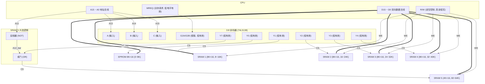

# 河南大学计算机与信息工程学院 计算机组成原理 期末考试练习题（附答案）

**考试方式：** 闭卷
**卷面总分：** 100 分

---

### 一、单项选择题（每小题 1 分，共 60 分）

1. 完整的计算机系统应包括 **【 】**

   A. 运算器、存储器和控制器
   B. 外部设备和主机
   C. 主机和实用程序
   D. 配套的硬件设备和软件系统

   **答案：** D

2. 计算机系统中的存储器系统是指 **【 】**

   A. RAM 存储器
   B. ROM 存储器
   C. 主存储器
   D. 主存储器和外存储器

   **答案：** D

3. 冯·诺依曼机工作方式的基本特点是 **【 】**

   A. 多指令流单数据流
   B. 按地址访问并顺序执行指令
   C. 堆栈操作
   D. 存储器按内部选择地址

   **答案：** B

4. 下列说法中不正确的是 **【 】**

   A. 任何可以由软件实现的操作也可以由硬件来实现
   B. 固件就功能而言类似于软件，而从形态来说又类似于硬件
   C. 在计算机系统的层次结构中，微程序级属于硬件级，其他四级都是软件级
   D. 面向高级语言的机器是完全可以实现的

   **答案：** D

5. 在下列数中最小的数为 **【 】**

   A. $(101001)_2$
   B. $(52)_8$
   C. $(101001)_{\text{BCD}}$
   D. $(233)_{16}$

   **答案：** C

6. 在下列数中最大的数为 **【 】**

   A. $(10010101)_2$
   B. $(227)_8$
   C. $(143)_5$
   D. $(96)_{16}$

   **答案：** B

7. 在机器中，零的表示形式是唯一的是 **【 】**

   A. 原码
   B. 补码
   C. 反码
   D. 原码和反码

   **答案：** B

8. 针对 8 位二进制数，下列说法中正确的是 **【 】**

   A. –127 的补码为 10000000
   B. –127 的反码等于 0 的移码
   C. +1 的移码等于 –127 的反码
   D. 0 的补码等于 –1 的反码

   **答案：** B

9. 一个 8 位二进制整数采用补码表示，且由 3 个"1"和 5 个"0"组成，则最小值为 **【 】**

   A. –127
   B. –32
   C. –125
   D. –3

   **答案：** B

10. 计算机系统中采用补码运算的目的是为了 **【 】**

    A. 与手工运算方式保持一致
    B. 提高运算速度
    C. 简化计算机的设计
    D. 提高运算的精度

    **答案：** C

11. 若某数 $x$ 的真值为 –0.1010，在计算机中该数表示为 1.0110，则该数所用的编码方法是 **【 】**

    A. 原码
    B. 补码
    C. 反码
    D. 移码

    **答案：** B

12. 长度相同但格式不同的 2 种浮点数，假定前者阶码长、尾数短，后者阶码短、尾数长，其他规定均相同，则它们可表示的数的范围和精度为 **【 】**

    A. 两者可表示的数的范围和精度相同
    B. 前者可表示的数的范围大但精度低
    C. 后者可表示的数的范围大且精度高
    D. 前者可表示的数的范围大且精度高

    **答案：** B

13. 某机字长 32 位，采用定点小数表示，符号位为 1 位，尾数为 31 位，则可表示的最大正小数为______，最小负小数为______ **【 】**

    A. $+(2^{31}-1)$
    B. $-(1-2^{-32})$
    C. $+(1-2^{-31}) \approx +1$
    D. $-(1-2^{-31}) \approx -1$

    **答案：** D

14. 运算器虽有许多部件组成，但核心部分是 **【 】**

    A. 数据总线
    B. 算术逻辑运算单元
    C. 多路开关
    D. 通用寄存器

    **答案：** B

15. 在定点二进制运算器中，减法运算一般通过______来实现 **【 】**

    A. 原码运算的二进制减法器
    B. 补码运算的二进制减法器
    C. 补码运算的十进制加法器
    D. 补码运算的二进制加法器

    **答案：** D

16. 在定点运算器中，无论采用双符号位还是单符号位，必须有______，它一般用______来实现 **【 】**

    A. 译码电路，与非门
    B. 编码电路，或非门
    C. 溢出判断电路，异或门
    D. 移位电路，与或非门

    **答案：** C

17. 下列说法中正确的是 **【 】**

    A. 采用变形补码进行加减运算可以避免溢出
    B. 只有定点数运算才有可能溢出，浮点数运算不会产生溢出
    C. 只有带符号数的运算才有可能产生溢出
    D. 将两个正数相加有可能产生溢出

    **答案：** D

18. 在定点数运算中产生溢出的原因是 **【 】**

    A. 运算过程中最高位产生了进位或借位
    B. 参加运算的操作数超过了机器的表示范围
    C. 运算的结果的操作数超过了机器的表示范围
    D. 寄存器的位数太少，不得不舍弃最低有效位

    **答案：** C

19. 下溢指的是 **【 】**

    A. 运算结果的绝对值小于机器所能表示的最小绝对值
    B. 运算的结果小于机器所能表示的最小负数
    C. 运算的结果小于机器所能表示的最小正数
    D. 运算结果的最低有效位产生的错误

    **答案：** A

20. 存储单元是指 **【 】**

    A. 存放一个二进制信息位的存储元
    B. 存放一个机器字的所有存储元集合
    C. 存放一个字节的所有存储元集合
    D. 存放两个字节的所有存储元集合

    **答案：** B

21. 和外存储器相比，内存储器的特点是 **【 】**

    A. 容量大、速度快、成本低
    B. 容量大、速度慢、成本高
    C. 容量小、速度快、成本高
    D. 容量小、速度快、成本低

    **答案：** C

22. 某计算机字长 16 位，存储器容量 $64\text{KB}$，若按字编址，那么它的寻址范围是 **【 】**

    A. 64K
    B. 32K
    C. $64\text{KB}$
    D. $32\text{KB}$

    **答案：** B

23. 某 DRAM 芯片，其存储容量为 $512\text{K} \times 8$ 位，该芯片的地址线和数据线数目为 **【 】**

    A. 8，512
    B. 512，8
    C. 18，8
    D. 19，8

    **答案：** C

24. 某计算机字长 32 位，其存储容量为 $4\text{MB}$，若按字编址，它的寻址范围是 **【 】**

    A. 1M
    B. $4\text{MB}$
    C. 4M
    D. $1\text{MB}$

    **答案：** D

25. 主存储器和 CPU 之间增加 Cache 的目的是 **【 】**

    A. 解决 CPU 和主存之间的速度匹配问题
    B. 扩大主存储器的容量
    C. 扩大 CPU 中通用寄存器的数量
    D. 既扩大主存容量又扩大 CPU 通用寄存器数量

    **答案：** A

26. EPROM 是指 **【 】**

    A. 只读存储器
    B. 随机存储器
    C. 可编程只读存储器
    D. 可擦写可编程只读存储器

    **答案：** D

27. 寄存器间接寻址方式中，操作数处在 **【 】**

    A. 通用寄存器
    B. 内存单元
    C. 程序计数器
    D. 堆栈

    **答案：** B

28. 扩展操作码是 **【 】**

    A. 操作码字段外辅助操作字段的代码
    B. 操作码字段中用来进行指令分类的代码
    C. 指令格式中的操作码
    D. 一种指令优化技术，不同地址数指令可以具有不同的操作码长度

    **答案：** D

29. 指令系统中采用不同寻址方式的目的主要是 **【 】**

    A. 实现存储程序和程序控制
    B. 缩短指令长度、扩大寻址空间、提高编程灵活性
    C. 可以直接访问外存
    D. 提供扩展操作码的可能并降低指令译码难度

    **答案：** B

30. 单地址指令中为了完成两个数的算术运算，除地址码指明的一个操作数外，另一个数常采用 **【 】**

    A. 堆栈寻址模式
    B. 立即寻址方式
    C. 隐含寻址方式
    D. 间接寻址方式

    **答案：** C

31. 对某个寄存器中操作数的寻址方式称为______寻址 **【 】**

    A. 直接
    B. 间接
    C. 寄存器
    D. 寄存器间接

    **答案：** C

32. 寄存器间接寻址方式中，操作数处在 **【 】**

    A. 通用寄存器
    B. 主存单元
    C. 程序计数器
    D. 堆栈

    **答案：** B

33. 变址寻址方式中，操作数的有效地址等于 **【 】**

    A. 基值寄存器内容加上形式地址（位移量）
    B. 堆栈指示器内容加上形式地址
    C. 变址寄存器内容加上形式地址
    D. 程序计数器内容加上形式地址

    **答案：** C

34. 程序控制类指令的功能是 **【 】**

    A. 进行算术运算和逻辑运算
    B. 进行主存与 CPU 之间的数据传送
    C. 进行 CPU 和 I/O 设备之间的数据传送
    D. 改变程序执行的顺序

    **答案：** D

35. 同步控制方式是 **【 】**

    A. 只适用于 CPU 控制的方式
    B. 只适用于外设控制的方式
    C. 由统一时序信号控制的方式
    D. 所有指令执行时间都相同的方式

    **答案：** C

36. 异步控制方式常用于______作为其主要控制方式 **【 】**

    A. 在单总线结构计算机中访问主存与外设时
    B. 微型机的 CPU 控制中
    C. 组合逻辑控制的 CPU 中
    D. 微程序控制器中

    **答案：** A

37. 在一个微周期中 **【 】**

    A. 只能执行一个微操作
    B. 能执行多个微操作，但它们一定是并行操作的
    C. 能顺序执行多个微操作
    D. 只能执行相斥性的操作

    **答案：** D

38. 指令周期是指 **【 】**

    A. CPU 从主存取出一条指令的时间
    B. CPU 执行一条指令的时间
    C. CPU 从主存取出一条指令加上执行这条指令的时间
    D. 时钟周期时间

    **答案：** C

39. 在 CPU 中跟踪指令后继地址的寄存器是 **【 】**

    A. 主存地址寄存器
    B. 程序计数器
    C. 指令寄存器
    D. 状态寄存器

    **答案：** B

40. 中央处理器是指 **【 】**

    A. 运算器
    B. 控制器
    C. 运算器和控制器
    D. 运算器、控制器和主存储器

    **答案：** C

41. 计算机操作的最小时间单位是 **【 】**

    A. 时钟周期
    B. 指令周期
    C. CPU 周期
    D. 外围设备

    **答案：** A

42. 微程序控制器中，机器指令与微指令的关系是 **【 】**

    A. 每一条机器指令由一条微指令来执行
    B. 每一条机器指令由一段用微指令编成的微程序来解释执行
    C. 一段机器指令组成的程序可由一条微指令来执行
    D. 一条微指令由若干条机器指令组成

    **答案：** B

43. 为了确定下一条微指令的地址，通常采用断定方式，其基本思想是 **【 】**

    A. 用程序计数器 PC 来产生后继微指令地址
    B. 用微程序计数器 $\mu\text{PC}$ 来产生后继微指令地址
    C. 通过微指令控制字段由设计者指定或者由设计者指定的判别字段控制产生后继微指令地址
    D. 通过指令中指定的一个专门字段来控制产生后继微指令地址

    **答案：** C

44. 就微命令的编码方式而言，若微操作命令的个数已确定，则 **【 】**

    A. 直接表示法比编码表示法的微指令字长短
    B. 编码表示法比直接表示法的微指令字长短
    C. 编码表示法与直接表示法的微指令字长相等
    D. 编码表示法与直接表示法的微指令字长大小关系不确定

    **答案：** B

45. 下列说法中正确的是 **【 】**

    A. 微程序控制方式和硬布线控制方式相比较，前者可以使指令的执行速度更快
    B. 若采用微程序控制方式，则可用 $\mu$PC 取代 PC
    C. 控制存储器可以用掩模 ROM、EPROM 或闪速存储器实现
    D. 指令周期也称为 CPU 周期

    **答案：** C

46. 系统总线中地址线的功用是 **【 】**

    A. 用于选择主存单元
    B. 用于选择进行信息传输的设备
    C. 用于指定主存单元和 I/O 设备接口电路的地址
    D. 用于传送主存物理地址和逻辑地址

    **答案：** C

47. 数据总线的宽度由总线的 ______ 定义 **【 】**

    A. 物理特性
    B. 功能特性
    C. 电气特性
    D. 时间特性

    **答案：** A

48. 在单机系统中，多总线结构的计算机的总线系统一般由 ______ 组成 **【 】**

    A. 系统总线、内存总线和 I/O 总线
    B. 数据总线、地址总线和控制总线
    C. 内部总线、系统总线和 I/O 总线
    D. ISA 总线、VESA 总线和 PCI 总线

    **答案：** A

49. 下列陈述中不正确的是 **【 】**

    A. 总线结构传送方式可以提高数据的传输速度
    B. 与独立请求方式相比，链式查询方式对电路的故障更敏感
    C. PCI 总线采用同步时序协议和集中式仲裁策略
    D. 总线的带宽即总线本身所能达到的最高传输速率

    **答案：** A

50. 中断发生时，由硬件更新程序计数器 PC，而不是由软件完成，主要是为了 **【 】**

    A. 能进入中断处理程序并正确返回源程序
    B. 节省内容
    C. 提高处理机的速度
    D. 使中断处理程序易于编址，不易出错

    **答案：** C

51. 在 I/O 设备、数据通道、时钟和软件这 4 项中，可能成为中断源的是 **【 】**

    A. I/O 设备
    B. I/O 设备和数据通道
    C. I/O 设备、数据通道和时钟
    D. I/O 设备、数据通道、时钟和软件

    **答案：** D

52. 单级中断与多级中断的区别是 **【 】**

    A. 单级中断只能实现单中断，而多级中断可以实现多重中断
    B. 单级中断的硬件结构是一维中断，而多级中断的硬件结构是二维中断
    C. 单级中断处理机只通过一根外部中断请求线接到它的外部设备系统；而多级中断，每一个 I/O 设备都有一根专用的外部中断请求线

    **答案：** A

53. 在单级中断系统中，CPU 一旦响应中断，则立即关闭______标志，以防止本次中断服务结束前同级的其他中断源产生另一次中断进行干扰 **【 】**

    A. 中断允许
    B. 中断请求
    C. 中断屏蔽

    **答案：** A

54. 为了便于实现多级中断，保存现场信息最有效的方法是采用 **【 】**

    A. 通用寄存器
    B. 堆栈
    C. 储存器
    D. 外存

    **答案：** B

55. 为实现 CPU 与外部设备并行工作，必须引入的基础硬件是 **【 】**

    A. 缓冲器
    B. 通道
    C. 时钟
    D. 相联寄存器

    **答案：** A

56. 中断允许触发器用来 **【 】**

    A. 表示外设是否提出了中断请求
    B. CPU 是否响应了中断请求
    C. CPU 是否在进行中断处理
    D. 开放或关闭可屏蔽硬中断

    **答案：** D

57. 采用 DMA 方式传递数据时，每传送一个数据就要占用一个______时间 **【 】**

    A. 指令周期
    B. 机器周期
    C. 存储周期
    D. 总线周期

    **答案：** C

58. 周期挪用方式常用于______方式的输入/输出中 **【 】**

    A. DMA
    B. 中断
    C. 程序传送
    D. 通道

    **答案：** A

59. 通道是重要的 I/O 方式，其中适合连接大量终端及打印机的通道是 **【 】**

    A. 数组多路通道
    B. 选择通道
    C. 字节多路通道

    **答案：** C

60. 磁表面存储器不具备的特点是 **【 】**

    A. 存储密度高
    B. 可脱机保存
    C. 速度快
    D. 容量大

    **答案：** C

61. 计算机的外部设备是指 **【 】**

    A. 输入/输出设备
    B. 外存设备
    C. 远程通信设备
    D. 除了 CPU 和内存以外的其他设备

    **答案：** D

62. 在微型机系统中外部设备通过______与主板的系统总线相连接 **【 】**

    A. 累加器
    B. 设备控制器
    C. 计数器
    D. 寄存器

    **答案：** B

---

### 二、简答题

**1. 冯·诺依曼型计算机的基本特点是什么？**

**答：** 冯·诺依曼原理的基本思想是：
* 采用二进制形式表示数据和指令。指令由操作码和地址码组成。
* 将程序和数据存放在存储器中，使计算机在工作时从存储器取出指令加以执行，自动完成计算任务。这就是"存储程序"和"程序控制"（简称存储程序控制）的概念。
* 指令的执行是顺序的，即一般按照指令在存储器中存放的顺序执行，程序分支由转移指令实现。
* 计算机由存储器、运算器、控制器、输入设备和输出设备五大基本部件组成，并规定了 5 部分的基本功能。

冯·诺依曼型计算机的基本特点也可以用"存储程序"和"程序控制"来高度概括。

---

**2. 计算机硬件有哪些部件，各部件的作用是什么？**

**答：** 计算机的硬件系统由有形的电子器件等构成的，它包括运算器、存储器、控制器、输入输出设备及总线系统组成。而总线分为数据总线、地址总线、控制总线，其结构有单总线结构、双总线结构及多总线结构。存储器（Memory）是用来存放数据和程序的部件；运算器是对信息进行运算处理的部件；控制器是整个计算机的控制核心。它的主要功能是读取指令、翻译指令代码、并向计算机各部分发出控制信号，以便执行指令；输入设备能将数据和程序变换成计算机内部所能识别和接受的信息方式，并顺序地把它们送入存储器中；输出设备将计算机处理的结果以人们能接受的或其它机器能接受的形式送出。

---

**3. 什么是总线？以总线组成计算机有哪几种组成结构？**

**答：** 总线（Bus）就是计算机中用于传送信息的公用通道，是为多个部件服务的一组信息传送连接线。按照总线的连接方式，计算机组成结构可以分为单总线结构、双总线结构和多总线结构等（详细内容见第 7 章）。

---

**4. 什么是硬件、软件和固件？什么是软件和硬件的逻辑等价？在什么意义上软件和硬件是不等价的？**

**答：** 计算机硬件（Hardware）是指构成计算机的所有实体部件的集合，通常这些部件由电路（电子元件）、机械等物理部件组成。计算机软件（Software）是指能使计算机工作的程序和程序运行时所需要的数据，以及与这些程序和数据有关的文字说明和图表资料，其中文字说明和图表资料又称为文档。固件（Firmware）是一种介于传统的软件和硬件之间的实体，功能上类似软件，但形态上又是硬件。微程序是计算机硬件和软件相结合的重要形式。

软件和硬件的逻辑等价含义：
（1）任何一个由软件所完成的操作也可以直接由硬件来实现
（2）任何一条由硬件所执行的指令也能用软件来完成

在物理意义上软件和硬件是不等价的。

---

**5. 计算机系统按程序设计语言划分为哪几个层次？**

**答：** 计算机系统是一个由硬件、软件组成的多级层次结构，它通常由微程序级、一般机器级、操作系统级、汇编语言级、高级语言级组成，每一级上都能创造程序设计，且得到下级的支持。

---

**6. 解释如下概念：ALU，CPU，主机和字长。**

**答：** 算术逻辑运算部件（ALU：Arithmetic Logic Unit），是运算器的核心组成，功能是完成算数和逻辑运算。"中央处理单元"（CPU：Central Processing Unit）包括运算器和控制器，是计算机的信息处理的中心部件。存储器、运算器和控制器在信息处理操作中起主要作用，是计算机硬件的主体部分，通常被称为"主机"。字长决定了计算机的运算精度、指令字长度、存储单元长度等，可以是 8/16/32/64/128 位（bit）等。

---

**7. 常用的计算机性能指标有哪些？**

**答：** 评价计算机性能是一个复杂的问题，早期只限于字长、运算速度和存储容量 3 大指标。目前要考虑的因素有如下几个方面。

(1) **主频**：主频很大程度上决定了计算机的运行速度，它的单位是兆赫兹（MHz）。

(2) **字长**：字长决定了计算机的运算精度、指令字长度、存储单元长度等，可以是 8/16/32/64/128 位（bit）。

(3) **运算速度**：衡量计算机运算速度的早期方法是每秒执行加法指令的次数，现在通常用等效速度。

(4) **存储容量**：以字为单位的计算机常以字数乘字长来表明存储容量。

(5) **可靠性**：系统是否运行稳定非常重要，常用平均无故障时间（MTBF）衡量。

(6) **可维护性**：系统可维护性是指系统出了故障能否尽快恢复，可用平均修复时间（MTRF）表示，它是指从故障发生到机器修复平均所需要的时间。

(7) **可用性**：是指计算机的使用效率。

(8) **兼容性**：兼容是广泛的概念，是指设备或程序可以用于多种系统的性能。兼容使得机器的资源得以继承和发展，有利于计算机的推广和普及。

---

**8. 多媒体的含义是什么？**

**答：** 多媒体技术是指能够同时获取、处理、编辑、存储和展示两个以上不同信息类型媒体的技术。计算机信息的形式可以是文字、声音、图形和图象等。

---

**9. 简单描述计算机的层次结构，说明各层次的主要特点。**

**答：** 现代计算机系统是一个硬件与软件组成的综合体，可以把它看成是按功能划分的多级层次结构。

- 第 0 级为硬件组成的实体。
- 第 1 级是微程序级。这级的机器语言是微指令集，程序员用微指令编写的微程序一般是直接由硬件执行的。
- 第 2 级是传统机器级。这级的机器语言是该机的指令集，程序员用机器指令编写的程序可以由微程序进行解释。
- 第 3 级操作系统级。从操作系统的基本功能来看，一方面它要直接管理传统机器中的软硬件资源，另一方面它又是传统机器的延伸。
- 第 4 级是汇编语言级。这级的机器语言是汇编语言，完成汇编语言翻译的程序叫做汇编程序。
- 第 5 级是高级语言级。这级的机器语言就是各种高级语言，通常用编译程序来完成高级语言翻译工作。
- 第 6 级是应用语言级。这一级是为了使计算机满足某种用途而专门设计的，因此这一级语言就是各种面向问题的应用语言。

---

**10. 计算机系统的主要技术指标有哪些？**

**答：** 计算机系统的主要技术指标有：机器字长、数据通路宽度、主存储器容量和运算速度等。

- 机器字长是指参与运算的数的基本位数，它是由加法器、寄存器的位数决定的。
- 数据通路宽度是指数据总线一次所能并行传送信息的位数。
- 主存储器容量是指主存储器所能存储的全部信息。
- 运算速度与机器的主频、执行什么样的操作、主存储器本身的速度等许多因素有关。

---

**11. 试计算采用 32×32 点阵字形的一个汉字字形占多少字节？存储 6763 个 16×16 点阵以及 24×24 点阵字形的汉字库各需要多少存储容量？**

**答：**
* 32×32 点阵汉字字形占用的字节数：$$\frac{32 \times 32}{8} = 128 \text{ B}$$
* 存储 6763 个 16×16 点阵汉字所需的容量：$$6763 \times \frac{16 \times 16}{8} = 6763 \times 32 \text{ B} = 216,416 \text{ B}$$
* 存储 6763 个 24×24 点阵汉字所需的容量：$$6763 \times \frac{24 \times 24}{8} = 6763 \times 72 \text{ B} = 486,936 \text{ B}$$

---

**12. 海明校验码的编码规则有哪些？**

**答：** 若海明码的最高位号为 $m$，最低位号为 $1$，即 $H_m H_{m-1} \dots H_2 H_1$，则海明码的编码规则是：

（1）校验位与数据位之和为 $m$，每个校验位 $P_i$ 在海明码中被分在位号 $2^{i-1}$ 的位置上，其余各位为数据位，并按从低向高逐位依次排列的关系分配各数据位。

（2）海明码的每一位位码 $H_i$（包括数据位和校验位）由多个校验位校验，其关系是被校验的每一位位号要等于校验它的各校验位的位号之和。

---

**13. 简述 CRC 码的纠错原理。**

**答：** CRC 码是一种纠错能力较强的编码。在进行校验时，将 CRC 码多项式与生成多项式 $G(X)$ 相除，若余数为 0，则表明数据正确；当余数不为 0 时，说明数据有错。只要选择适当的生成多项式 $G(X)$，余数与 CRC 码出错位位置的对应关系是一定的，由此可以用余数作为依据判断出错位置从而纠正错码。

---

**14. 运算器由哪几部分组成？**

**答：** 运算器的基本结构应包括以下几个部分：

(1) 能实现算术和逻辑运算功能的部件 ALU；

(2) 存放待加工的信息或加工后的结果信息的通用寄存器组；

(3) 按操作要求控制数据输入的部件：多路开关或数据锁存器；

(4) 按操作要求控制数据输出的部件：输出移位和多路开关；

(5) 计算器与其它部件进行信息传送的总线以及总线接收器与发送器；总线接收器与发送器通常是由三态门构成的。

---

**15. 主存储器有哪些性能指标？它们的含义是什么？**

**答：** 存储器的性能指标是对存储器进行设计、使用和提高时的主要依据，存储器性能指标也称为存储器参数。

（1）**存储容量**：是指一个功能完备的存储器所能容纳的二进制信息总量，即可存储多少位二进制信息代码。

（2）**存储器速度**：存储器取数时间和存储器存取周期。

（3）**数据传输率**：单位时间可写入存储器或从存储器取出信息的最大数量，称为数据传输率或称为存储器传输带宽 $b_M$。

（4）**可靠性**：存储器的可靠性是指在规定时间内存储器无故障的情况，一般用平均无故障时间 MTBF 来衡量。

（5）**价格**：又称成本，它是衡量主存储器经济性能的重要指标。

---

**16. 主存的基本组成有哪些部分？各部分主要的功能是什么？**

**答：** 主存储器的基本组成：

（1）贮存信息的存储体。一般是一个全体基本存储单元按照一定规则排列起来的存储阵列。存储体是存储器的核心。

（2）信息的寻址机构，即读出和写入信息的地址选择机构。这包括：地址寄存器（MAR）和地址译码器。地址译码器完成地址译码，地址寄存器具有地址缓冲功能。

（3）存储器数据寄存器 MDR。在数据传送中可以起数据缓冲作用。

（4）写入信息所需的能源，即写入线路、写驱动器等。

（5）读出所需的能源和读出放大器，即读出线路、读驱动器和读出放大器。

（6）存储器控制部件。包括主存时序线路、时钟脉冲线路、读逻辑控制线路，写或重写逻辑控制线路以及动态存储器的定时刷新线路等，这些线路总称为存储器控制部件。

---

**17. 静态 MOS 存储元、动态 MOS 存储元各有什么特点？**

**答：** 在 MOS 半导体存储器中，根据存储信息机构的原理不同，又分为静态 MOS 存储器（SRAM）和动态 MOS 存储器（DRAM），前者利用双稳态触发器来保存信息，只要不断电，信息不会丢失，后者利用 MOS 电容存储电荷来保存信息，使用时需不断给电容充电才能使信息保持。

---

**18. 什么是刷新？为什么要刷新？有哪几种常用的刷新方式？**

**答：** 对动态存储器要每隔一定时间（通常是 2ms）给全部基本存储元的存储电容补充一次电荷，称为 RAM 的刷新，2ms 是刷新间隔时间。由于存放信息的电荷会有泄漏，动态存储器的电荷不能象静态存储器电路那样，由电源经负载管源源不断地补充，时间一长，就会丢失信息，所以必须刷新。常用的刷新方式有两种：集中式刷新、分布式刷新。

---

**19. 简要说明提高存储器速度有哪些措施？**

**答：** 高速缓冲存储器、多体交叉存储器。

---

**20. Cache 有哪些特点？**

**答：** Cache 具有如下特点：

(1) 位于 CPU 与主存之间，是存储器层次结构中级别最高的一级。

(2) 容量比主存小，目前一般有数 KB 到数 MB。

(3) 速度一般比主存快 5~10 倍，通常由存储速度高的双极型三极管或 SRAM 组成。

(4) 其容量是主存的部分副本。

(5) 可用来存放指令，也可用来存放数据。

(6) 快存的功能全部由硬件实现，并对程序员透明。

---

**21. 如何区别存储器和寄存器？两者是一回事的说法对吗？**

**答：** 存储器和寄存器不是一回事。存储器在 CPU 的外边，专门用来存放程序和数据，访问存储器的速度较慢。寄存器属于 CPU 的一部分，访问寄存器的速度很快。

---

**22. 存储器的主要功能是什么？为什么要把存储系统分成若干个不同层次？主要有哪些层次？**

**答：** 存储器的主要功能是用来保存程序和数据。存储系统是由几个容量、速度和价格各不相同的存储器用硬件、软件以及硬件与软件相结合的方法连接起来的系统。把存储系统分成若干个不同层次的目的是为了解决存储容量、存取速度和价格之间的矛盾。由高速缓冲存储器、主存储器和辅助存储器构成的三级存储系统可以分为两个层次，其中高速缓冲和主存间称为 Cache－主存存储层次（Cache 存储系统）；主存和辅存间称为主存－辅存存储层次（虚拟存储系统）。

---

**23. 说明存储周期和存取时间的区别。**

**答：** 存取周期是指主存进行一次完整的读写操作所需的全部时间，即连续两次访问存储器操作之间所需要的最短时间。存取时间是指从启动一次存储器操作到完成该操作所经历的时间。存取周期一定大于存取时间。

---

**24. 指令格式设计的准则有哪些？**

**答：** 一台计算机选择怎样的指令格式，涉及多方面因素。一般要求指令的字长要短一些，以得到时间和空间上的优势。但指令也必须有足够的长度以利于增加信息量。再者，指令字长一般应是机器字符长度的整数倍以便存储系统的管理。另外，指令格式的设计还与如何选定指令中操作数地址的位数有关。

---

**25. 指令是灵活多变的，体现在哪些方面？**

**答：** 指令是灵活多变的，主要体现在以下几个方面：指令格式多样；寻址方式丰富；指令类型多种；操作码位数可随地址码个数变化而变化（扩展操作码方式）；指令长度可变等。

---

**26. 试比较基址寻址和变址寻址的异同点。**

**答：** 基址寻址方式和变址寻址方式，在形式上是类似的。但用户可使用变址寻址方式编写程序，而基址寻址方式中对于基址寄存器，用户程序无权操作和修改，由系统软件管理控制程序使用特权指令来管理的。再者基址寻址方式主要用以解决程序在存储器中的定位和扩大寻址空间等问题。

---

**27. 堆栈是什么？它有什么特点？功能有哪些？**

**答：**

（1）**堆栈的概念**：
* 是若干个存储单元（或寄存器）的有序集合，它顺序地存放一组元素。
* 数据的存取都只能在栈顶单元内进行，即数据的进栈与出栈都只能经过栈顶单元这个"出入口"。
* 堆栈中的数据采用"先进后出"或"后进先出"的存取工作方式。

（2）**堆栈结构在计算机中的作用**：
* 具有堆栈结构的机器使用零地址指令，这不仅指令长度短，指令结构简单，机器硬件简化。
* 实现程序调用，子程序嵌套调用和递归调用。
* 对于"中断"技术，堆栈更是不可缺少的，保存"断点"和"现场"。

（3）**堆栈的操作**：设数据进栈方向为从高地址向低地址发展，当向堆栈压入数据时，SP 的内容先自动递减而指向一个新的空栈顶单元，再把数据写入此栈顶单元；当数据弹出堆栈时，立即读出 SP 所指向的栈顶单元内容，再把 SP 内容自动递增而指向新的栈顶位置。即

- PUSH X：$(\text{SP})-1 \to \text{SP}$，$(X) \to (\text{SP})$
- POP X：$((\text{SP})) \to X$，$(\text{SP})+1 \to \text{SP}$

---

**28. 指令长度和机器字长有什么关系？半字长指令、单字长指令、双字长指令分别表示什么？**

**答：** 指令长度与机器字长没有固定关系，指令长度可以等于机器字长，也可以大于或小于机器字长。通常，把指令长度等于机器字长的指令称为单字长指令；指令长度等于半个机器字长的指令称为半字长指令；指令长度等于两个机器字长的指令称为双字长指令。

---

**29. 计算机进行程序控制工作的基本原理是怎样的？**

**答：** 程序控制原理：
（1）编程；
（2）送 MM（通过输入设备）；
（3）机器工作时，是按一定的序列逐条取出指令，分析指令，执行指令，并自动转到下一条指令执行，直到程序规定的任务完成；
（4）程序控制由控制器承担，程序存储由存储器完成。

---

**30. 控制器的基本功能是什么？基本组成部件包括哪些？**

**答：** 控制器的基本功能就是负责指令的读出，进行识别和解释，并指挥协调各功能部件执行指令。控制器的基本结构包括：指令部件、时序部件、微操作控制线路、中断控制逻辑。

---

**31. 微程序控制的基本思想是什么？**

**答：** 微程序控制技术在现今计算机设计中得到广泛的采用，其实质是用程序设计的思想方法来组织操作控制逻辑。

---

**32. 说明机器指令和微指令的关系。**

**答：** 抽象级别不同。机器指令是由一组二进制代码组成的。微指令是具有微地址的控制字。一系列微指令的有序集合构成微程序。在微程序控制逻辑法中，机器指令由微程序实现。格式不同。机器指令包括操作码和操作数地址码字段，微指令根据编译法的不同有多种情况，一般包括微操作信息和下地址字段。

---

**33. 控制器有哪几种控制方式？各自有什么特点？**

**答：** 控制器的控制方式可以分为 3 种：同步控制方式、异步控制方式和联合控制方式。

- **同步控制方式**：各项操作都由统一的时序信号控制，在每个机器周期中产生统一数目的节拍电位和工作脉冲。这种控制方式设计简单，容易实现；但是对于许多简单指令来说会有较多的空闲时间，造成较大数量的时间浪费，从而影响了指令的执行速度。
- **异步控制方式**：各项操作不采用统一的时序信号控制，而根据指令或部件的具体情况决定，需要多少时间，就占用多少时间。异步控制方式没有时间上的浪费，因而提高了机器的效率，但是控制比较复杂。
- **联合控制方式**：是同步控制和异步控制相结合。

---

**34. 指令和数据都存放在主存，如何识别从主存储器中取出的是指令还是数据？**

**答：** 指令和数据都存放在主存，它们都以二进制代码形式出现，区分的方法为：

（1）取指令或数据时所处的机器周期不同：取指周期取出的是指令；分析、取数或执行周期取出的是数据。

（2）取指令或数据时地址的来源不同：指令地址来源于程序计算器；数据地址来源于地址形成部件。

---

**35. 什么是微指令和微操作？微程序和机器指令有何关系？微程序和程序之间有何关系？**

**答：** 微指令是控制计算机各部件完成某个基本微操作的命令。微操作是指计算机中最基本的、不可再分解的操作。微指令和微操作是一一对应的，微指令是微操作的控制信号，微操作是微指令的操作过程。微指令是若干个微命令的集合。微程序是机器指令的实时解释器，每一条机器指令都对应一个微程序。

微程序和程序是两个不同的概念。微程序是由微指令组成的，用于描述机器指令，实际上是机器指令的实时解释器，微程序是由计算机的设计者事先编制好并存放在控制存储器中的，一般不提供给用户；程序是由机器指令组成的，由程序员事先编制好并存放在主存放器中。

---

**36. 比较水平微指令和垂直微指令的优缺点。**

**答：**

（1）水平型微指令并行操作能力强、效率高并且灵活性强，而垂直型微指令则较差。

（2）水平型微指令执行一条指令的时间短，垂直型微指令执行时间长。

（3）由水平型微指令解释指令的微程序，因而具有微指令字比较长，但微程序短的特点，而垂直型微指令则正好相反。

（4）水平型微指令用户难以掌握，而垂直型微指令与指令相似，相对来说比较容易。

---

**37. 比较单总线、双总线和多总线结构的性能特点。**

**答：**

- 在**单总线结构**中，要求连接到总线上的逻辑部件必须高速运行，以便在某些设备需要使用总线时，能迅速获得总线控制权；而当不再使用总线时，能迅速放弃总线控制权。否则，由于一条总线由多种功能部件共用，可能导致很大的时间延迟。
- 在**双总线结构**中，存在 2 种总线：存储总线，用于 CPU 与主存储器的信息交换；I/O 总线，用于外设与主机的信息交换。
- 在双总线结构的基础之上，为了使高速外设（如磁盘机）能高速度地与主存储器进行数据交换，在高速外设与主存储器之间可以增设直接存储器访问（DMA：Direct Memory Access）方式的高速 I/O 总线（DMA 总线），从而形成**多总线结构**。

---

**38. 什么叫总线周期、时钟周期、指令周期？它们之间一般有什么关系？**

**答：** 时钟周期是系统工作的最小时间单位，它由计算机主频决定；总线周期指总线上两个设备进行一次信息传输所需要的时间（如 CPU 对存储器或 I/O 端口进行一次读/写操作所需的时间）；指令周期指 CPU 执行一条指令所需要的时间。

三者之间的关系是：时钟周期是基本动作单位；一个总线周期通常由 $n$ 个时钟周期组成；而一个指令周期中可能包含有一个或几个总线周期，也可能一个总线周期都没有，这取决于该指令的功能。

---

**39. 说明总线结构对计算机系统性能的影响。**

**答：** 主要影响有以下三方面：

（1）**最大存储容量**：单总线系统中，最大内存容量必须小于由计算机字长所决定的可能地址总线。双总线系统中，存储容量不会受到外围设备数量的影响。

（2）**指令系统**：双总线系统，必须有专门的 I/O 指令系统；单总线系统，访问内存和 I/O 使用相同指令。

（3）**吞吐量**：总线数量越多，吞吐能力越大。

---

**40. 接口电路在系统结构中的作用是什么？**

**答：** 外设接口（或叫作 I/O 接口）是主机和外设（控制器）之间的实体部件，是实现主机与外设之间信息交换所必不可少的硬件支持。

---

**41. 接口电路应具备哪些基本功能？**

**答：** 接口电路应具有的基本的功能：（1）数据的暂存与缓冲；（2）保存设备的工作状态；（3）信息交换方式的控制；（4）通信联络控制；（5）外设的识别；（6）数据格式的变换控制。

---

**42. 外部设备在系统中如何编址，如何与主机连接？**

**答：** 通常根据与存储器地址的关系，有两种编址方式。

（1）**统一编址**：指外设接口中的 I/O 寄存器和主存单元一样看待，将它们和主存单元组合在一起编排地址；或者说，将主存的一部分地址空间用作 I/O 地址空间。这样就可以用访问主存的指令去访问外设的某个寄存器，因而也就不需要专门的 I/O 指令，可以简化 CPU 的设计。

（2）**单独编址**：为了更清楚地区别 I/O 操作和存储器操作，I/O 地址通常与存储地址分开独立编址。这样，在系统中就存在了另一种与存储地址无关的 I/O 地址，CPU 也必须具有专用于输入输出操作的 I/O 指令和控制逻辑。

---

**43. 什么是 I/O 组织方式？有哪几种 I/O 组织方式？各自的特点是什么？**

**答：** I/O 组织是指计算机主机与外部设备之间的信息交换方式。计算机主机与外设之间的信息交换方式有 5 种：程序查询式、中断式、DMA 式、通道式、外围处理机方式。

从系统结构的观点看，前两种方式是以 CPU 为中心的控制，都需要 CPU 执行程序来进行 I/O 数据传送，而 DMA 式和通道式这两种方式是以主存贮器为中心的控制，数据可以在主存和外设之间直接传送。对于最后一种方式，则是用微型或小型计算机进行输入和输出控制。程序查询和程序中断方式适用于数据传输率比较低的外设，而 DMA、通道和外围处理机使用于数据传输率比较高的外设。程序查询式控制简单，但系统效率很低；中断式通过服务程序完成数据交换，实现了主机与外设的并行性；DMA 式通过硬件实现了数据传送，速度快，但只能控制同一类外设；通道式采用执行通道程序实现对不同类型设备的控制和管理，并行性进一步提高；外围处理机方式具有更大的灵活性和并行性。

---

**44. 查询方式和中断方式的主要异同点是什么？**

**答：** 两种方式都是以 CPU 为中心的控制方式，都需要 CPU 执行程序来进行 I/O 数据传送。程序查询式控制简单，但系统效率很低，无法实现并行操作；中断式通过服务程序完成数据交换，实现了主机与外设的并行性。

---

**45. 什么是中断？中断技术给计算机系统带来了什么作用？**

**答：** 中断是指这样一个过程：当计算机执行正常程序时，系统中出现某些异常情况或特殊请求，CPU 暂停它正在执行的程序，而转去处理所发生的事件；CPU 处理完毕后，自动返回到原来被中断了的程序继续运行。

中断的作用：（1）主机与外部设备并行工作；（2）实现实时处理；（3）硬件故障处理；（4）实现多道程序和分时操作。

---

**46. 中断系统为什么要进行中断判优？何时进行中断判优？如何进行判优？**

**答：**

（1）中断优先级有两个方面的含义：（A）一是中断请求与 CPU 现行程序优先级的问题；（B）另一含义是各中断源之间，谁更迫切的问题。

（2）方法：（A）软件；（B）硬件：为了得到较高的效率，一般采用硬件判优方法。判优逻辑随着判优方案的不同可有不同的结构，其组成部分既可能在设备接口之中，也可能在 CPU 内部，也可能这两部分都有。其作用是决定 CPU 的响应并且找出最高优先请求者，如果确定接收这个请求的话，就由 CPU 发出中断响应信号 INTA。（C）软硬件结合。

中断判优发生在中断过程的第二步，中断请求之后，中断响应之前。

---

**47. 外部设备有哪些主要功能？可以分为哪些大类？各类中有哪些典型设备？**

**答：** 外部设备的主要功能有数据的输入、输出、成批存储以及对信息的加工处理等。外部设备可以分为五大类：输入输出设备、辅助存储器、终端设备、过程控制设备和脱机设备。其典型设备有键盘、打印机、磁盘、智能终端、数/模转换器和键盘－软盘数据站等。

---

**48. 磁表面存储器的特点有哪些？**

**答：** 磁表面存储器有如下显著的特点：

（1）存储密度高，记录容量大，每位价格低；

（2）记录介质可以重复使用；

（3）记录信息可长时间保存而不致丢失；

（4）非破坏性读出，读出时不需再生信息；

（5）存取速度较低，机械结构复杂，对工作环境要求较严。

---

### 三、分析与计算题

**1. 设机器字长 32 位，定点表示，尾数 31 位，数符 1 位，问：**

* (1) 定点原码整数表示时，最大正数是多少？最大负数是多少？
* (2) 定点原码小数表示时，最大正数是多少？最大负数是多少？

**解：**

* (1) **定点原码整数表示**：
  * 最大正数：$+(2^{31} - 1)_{10}$
  * 最大负数：$-(2^{31} - 1)_{10}$
* (2) **定点原码小数表示**：
  * 最大正数：$+(1 - 2^{-31})_{10}$
  * 最大负数：$-(1 - 2^{-31})_{10}$

---

**2. 现有 $1024 \times 1$ 的存储芯片，若用它组成容量为 $16\text{K} \times 8$ 的存储器。试求：**

* (1) 实现该存储器所需的芯片数量？
* (2) 若将这些芯片分装在若干个块板上，每块板的容量为 $4\text{K} \times 8$，该存储器所需的地址线总位数是多少？其中几位用于选板？几位用于选片？几位用作片内地址？

**解：**

* (1) **所需的芯片数量**：
  $$\frac{16\text{K} \times 8}{1024 \times 1} = \frac{16 \times 1024 \times 8}{1024 \times 1} = 128 \text{ 片}$$

* (2) **地址分配分析**：
  * **地址线总位数**：根据存储器容量 $16\text{K} = 2^{14}$，所需的地址线总位数为 **14 位**。
  * **选板位数**：板数为 $\frac{16\text{K} \times 8}{4\text{K} \times 8} = 4$ 块，因此选板需要 **2 位**（即 $\log_2 4 = 2$）。
  * **选片位数**：每块板容量为 $4\text{K} \times 8$，由于芯片是 $1024 \times 1$ 位，因此每个存储单元需要 8 片并联成 8 位字长。在深度方向，每块板需要 $\frac{4\text{K}}{1024} = 4$ 组芯片串联，故选片（组）需要 **2 位**（即 $\log_2 4 = 2$）。
  * **片内地址位数**：每个芯片容量为 $1024$ 单元，片内寻址需要 **10 位**（即 $\log_2 1024 = 10$）。

---

**3. 设存储器容量为 32 位，字长 64 位，模块数 $m = 8$，分别用顺序方式和交叉方式进行组织。若存储周期 $T = 200\text{ns}$，数据总线宽度为 64 位，总线传送周期为 $\tau = 50\text{ns}$，则顺序存储器和交叉存储器带宽各是多少？**

**解：**

顺序存储器和交叉存储器连续读出 $m = 8$ 个字的信息总量都是：
$$q = 64 \text{ 位} \times 8 = 512 \text{ 位}$$

* (1) **顺序存储器**：
  * 连续读出 8 个字所需的时间：
    $$t_2 = mT = 8 \times 200\text{ ns} = 1600\text{ ns} = 1.6 \times 10^{-6}\text{ s}$$
  * 带宽：
    $$W_2 = \frac{q}{t_2} = \frac{512\text{ 位}}{1.6 \times 10^{-6}\text{ s}} = 3.2 \times 10^8\text{ 位/s} = 32 \times 10^7\text{ 位/s}$$

* (2) **交叉存储器**：
  * 连续读出 8 个字所需的时间：
    $$t_1 = T + (m - 1)\tau = 200\text{ ns} + (8 - 1) \times 50\text{ ns} = 550\text{ ns} = 5.5 \times 10^{-7}\text{ s}$$
  * 带宽：
    $$W_1 = \frac{q}{t_1} = \frac{512\text{ 位}}{5.5 \times 10^{-7}\text{ s}} \approx 93.09 \times 10^7\text{ 位/s}$$

---

**4. CPU 的地址总线 16 根（$A_{15} \sim A_0$，$A_0$ 是低位），双向数据总线 16 根（$D_{15} \sim D_0$），控制总线中与主存有关的信号有 $\overline{\text{MREQ}}$（允许访存，低电平有效），$\text{R/}\overline{\text{W}}$（高电平读命令，低电平写命令）。主存地址空间分配如下：$0 \sim 8191$ 为系统程序区，由 EPROM 芯片组成；从 8192 起一共 $32\text{K}$ 地址空间为用户程序区；最后（最大地址）$4\text{K}$ 地址空间为系统程序工作区。上述地址为十进制，按字编址。**

**现有如下芯片可供选择：**
* EPROM：$8\text{K} \times 16$ 位（控制端仅有 $\overline{\text{CS}}$）
* SRAM：$16\text{K} \times 1$ 位，$2\text{K} \times 8$ 位，$4\text{K} \times 16$ 位，$8\text{K} \times 16$ 位

**请从上述芯片中选择芯片设计该计算机的主存储器，画出主存逻辑框图。**

**解：**

**(1) 地址空间及芯片选择分析**

按字编址（1 字 = 16 位），16 位地址线可寻址 $2^{16} = 64\text{K}$ 地址空间（$0 \sim 65535$）：

1. **系统程序区**：$0 \sim 8191$（$0\text{K} \sim 8\text{K}$），选用 **1 片** $8\text{K} \times 16$ 位的 EPROM。
2. **用户程序区**：$8192 \sim 40959$（$8\text{K} \sim 40\text{K}$，共 $32\text{K}$ 地址空间），选用 **4 片** $8\text{K} \times 16$ 位的 SRAM。
3. **系统工作区**：最后 $4\text{K}$ 空间，即 $61440 \sim 65535$（$60\text{K} \sim 64\text{K}$），选用 **1 片** $4\text{K} \times 16$ 位的 SRAM。
4. **空闲区**：$40960 \sim 61439$（即 $40\text{K} \sim 60\text{K}$，共 $20\text{K}$ 空间）留空。

| 地址范围（十进制） | 地址范围（十六进制） | 空间大小 | 芯片选择 | 片选译码信号 |
| :---: | :---: | :---: | :---: | :---: |
| $0 \sim 8191$ | `0x0000 ~ 0x1FFF` | $8\text{K}$ | $8\text{K} \times 16$ EPROM（1 片） | $Y_0$ |
| $8192 \sim 16383$ | `0x2000 ~ 0x3FFF` | $8\text{K}$ | $8\text{K} \times 16$ SRAM（1 片） | $Y_1$ |
| $16384 \sim 24575$ | `0x4000 ~ 0x5FFF` | $8\text{K}$ | $8\text{K} \times 16$ SRAM（1 片） | $Y_2$ |
| $24576 \sim 32767$ | `0x6000 ~ 0x7FFF` | $8\text{K}$ | $8\text{K} \times 16$ SRAM（1 片） | $Y_3$ |
| $32768 \sim 40959$ | `0x8000 ~ 0x9FFF` | $8\text{K}$ | $8\text{K} \times 16$ SRAM（1 片） | $Y_4$ |
| $40960 \sim 61439$ | `0xA000 ~ 0xEFFF` | $20\text{K}$ | *无（留空）* | — |
| $61440 \sim 65535$ | `0xF000 ~ 0xFFFF` | $4\text{K}$ | $4\text{K} \times 16$ SRAM（1 片） | $Y_7 \cdot A_{12}$ |

**(2) 译码与片选逻辑**

* 使用一片 **3:8 译码器（74LS138）** 对高位地址进行译码：
  * 译码器输入 $A, B, C$ 分别连接 CPU 地址线 $A_{13}, A_{14}, A_{15}$。
  * 译码器输出 $Y_0 \sim Y_4$ 分别接 EPROM 和前 4 片 SRAM。
  * 对于系统工作区（SRAM 5），其地址范围是 $60\text{K} \sim 64\text{K}$，在译码器输出 $Y_7$（$56\text{K} \sim 64\text{K}$）且 $A_{12} = 1$ 时选中，因此其片选信号为：
    $$\overline{\text{CS}} = Y_7 + \overline{A_{12}}$$
* **使能端控制**：译码器的使能输入接 CPU 的访存控制信号 $\overline{\text{MREQ}}$。

**(3) 主存逻辑连接框图**

---

**5. 某计算机指令字长 16 位，地址码是 6 位，指令有无地址、一地址和二地址 3 种格式，设有 $N$ 条二地址指令，无地址指令 $M$ 条，试问一地址指令最多有多少条？**

**解：**

设 1 地址指令最多有 $X$ 条。根据操作码扩展技术规则，前导位扩展关系如下：

* 2 地址指令使用 2 个 6 位地址码，操作码剩下 $16 - 2 \times 6 = 4$ 位。共有 $2^4 = 16$ 种编码组合。
* 扣除 $N$ 条 2 地址指令后，剩下 $(2^4 - N)$ 个编码用于向 1 地址指令扩展。
* 扩展到 1 地址指令时，多出 6 位地址线空间，因此 1 地址指令总的可用编码组合为 $(2^4 - N) \times 2^6$。
* 扣除 $X$ 条 1 地址指令后，剩下 $((2^4 - N) \times 2^6 - X)$ 个编码用于向无地址指令扩展。
* 扩展到无地址指令时，再多出 6 位空间，即总编码组合为 $((2^4 - N) \times 2^6 - X) \times 2^6$。
* 对应无地址指令数 $M$，有：
  $$\left((2^4 - N) \times 2^6 - X\right) \times 2^6 = M$$
* 解得 1 地址指令最多条数 $X$ 为：
  $$X = (2^4 - N) \times 2^6 - M \times 2^{-6}$$

---

**6. 假设某计算机指令长度为 20 位，具有双操作数、单操作数和无操作数 3 类指令格式，每个操作数地址规定用 6 位表示。问：若操作码字段固定为 8 位，现已设计出 $m$ 条双操作数指令，$n$ 条无操作数指令，在此情况下，这台计算机最多可以设计出多少条单操作数指令？**

**解：**

* 由于指令的操作码字段固定为 8 位，因此这台计算机最多拥有的指令编码总数为 $2^8 = 256$ 条。
* 在操作码字段固定的情况下，无法使用操作码扩展技术，所有指令共享这 256 个编码。
* 故单操作数指令最多还可以设计出：
  $$\text{最多单操作数指令数} = 256 - m - n \text{ 条}$$

---

**7. 有 4 级流水线分别完成取指、指令译码并取数、运算、送结果 4 步操作，假设完成各步操作的时间依次为 $100\text{ns}$、$80\text{ns}$、$50\text{ns}$（假设最后一级为 $50\text{ns}$ 左右）。**

* (1) 流水线的操作周期应设计为多少？
* (2) 若相邻 2 条指令发生数据相关，而且在硬件上不采取措施，那么第 2 条指令要推迟多少时间进行？
* (3) 如果在硬件设计上加以改进，至少需推迟多少时间？

**解：**

* (1) 流水线的操作周期（时钟周期）$\tau$ 按四步操作中最长的时间来考虑，因此：
  $$\tau = 100\text{ ns}$$

* (2) 设相邻两条指令存在数据相关冲突（例如：`ADD R1, R2, R3` 写入 $R1$，随后 `SUB R4, R1, R5` 读取 $R1$）：

  | 指令 \ 时钟周期 | 1 | 2 | 3 | 4 | 5 | 6 | 7 |
  | :---: | :---: | :---: | :---: | :---: | :---: | :---: | :---: |
  | **ADD** | IF（取指） | ID（译码） | EX（执行） | WR（送结果） | | | |
  | **SUB** | | IF（取指） | ID（译码） | EX（执行） | WR（送结果） | | |

  `ADD` 指令在时钟周期 4 结束时才能将结果写入寄存器堆，但 `SUB` 指令在时钟周期 3 的 `ID` 阶段就要读取寄存器堆。如果硬件上不采取任何措施，`SUB` 必须等 `ADD` 写回完毕，因此 `SUB` 的 `ID` 阶段需要被推迟到时钟周期 5 进行，即第二条指令需要推迟 **2 个时钟周期**：
  $$\text{推迟时间} = 2 \times 100\text{ ns} = 200\text{ ns}$$

* (3) 如果在硬件上加以改进（例如采用**旁路技术/数据前推（Data Forwarding）**），可以在 `ADD` 的 `EX` 阶段（时钟周期 3 结束）直接将数据旁路送给 `SUB` 的 `EX` 阶段输入，此时 `SUB` 只需要推迟 **1 个时钟周期**：
  $$\text{推迟时间} = 1 \times 100\text{ ns} = 100\text{ ns}$$

---

**8. 指令流水线由取指（IF）、译码（ID）、执行（EX）、访存（MEM）、写回寄存器堆（WB）5 个过程段组成，共有 20 条指令连续输入此流水线。**

* (1) 画出流水处理的时空图，假设时钟周期为 $100\text{ns}$。
* (2) 求流水线的实际吞吐率（单位时间里执行完毕的指令数）。

**解：**

* (1) **流水线时空图**：

  | 空间（步骤）\ 时间（周期） | 1 | 2 | 3 | 4 | 5 | 6 | $\dots$ | 20 | 21 | 22 | 23 | 24 |
  | :---: | :---: | :---: | :---: | :---: | :---: | :---: | :---: | :---: | :---: | :---: | :---: | :---: |
  | **IF**（取指） | $I_1$ | $I_2$ | $I_3$ | $I_4$ | $I_5$ | $I_6$ | $\dots$ | $I_{20}$ | | | | |
  | **ID**（译码） | | $I_1$ | $I_2$ | $I_3$ | $I_4$ | $I_5$ | $\dots$ | $I_{19}$ | $I_{20}$ | | | |
  | **EX**（执行） | | | $I_1$ | $I_2$ | $I_3$ | $I_4$ | $\dots$ | $I_{18}$ | $I_{19}$ | $I_{20}$ | | |
  | **MEM**（访存） | | | | $I_1$ | $I_2$ | $I_3$ | $\dots$ | $I_{17}$ | $I_{18}$ | $I_{19}$ | $I_{20}$ | |
  | **WB**（写回） | | | | | $I_1$ | $I_2$ | $\dots$ | $I_{16}$ | $I_{17}$ | $I_{18}$ | $I_{19}$ | $I_{20}$ |

* (2) **实际吞吐率计算**：
  * 流水线级数 $k = 5$，指令数 $n = 20$，时钟周期 $\tau = 100\text{ ns} = 10^{-7}\text{ s}$。
  * 连续执行 20 条指令所需的总时间为：
    $$T = (k + n - 1)\tau = (5 + 20 - 1) \times 100\text{ ns} = 2400\text{ ns} = 2.4 \times 10^{-6}\text{ s}$$
  * 实际吞吐率 $TP$ 为：
    $$TP = \frac{n}{T} = \frac{20}{2.4 \times 10^{-6}\text{ s}} \approx 8.33 \times 10^6 \text{ 条/秒} = 8.33 \text{ M条/秒}$$

---

**9. 某系统总线的一个存取周期最快为 3 个总线时钟周期，在一个总线周期中可以存取 32 位数据。若总线的时钟频率为 $8.33\text{MHz}$，则总线的带宽为多少 $\text{MB/s}$？**

**解：**

* 数据宽度 = $32 \text{ 位} = 4 \text{ 字节（Byte）}$。
* 总线存取周期的频率为时钟频率的 $\frac{1}{3}$，即：
  $$f = \frac{8.33\text{ MHz}}{3} \approx 2.777\text{ MHz}$$
* 总线带宽 $W$ 为：
  $$W = \text{数据宽度} \times \text{传送频率} = 4\text{ Byte} \times 2.777 \times 10^6\text{ s}^{-1} \approx 11.11\text{ MB/s}$$

---

**10. 某磁盘组有 6 片磁盘，每片可有 2 个记录面，存储区域内径为 $22\text{cm}$，外径为 $33\text{cm}$，道密度 $40\text{ 道/cm}$，位密度 $400\text{b/cm}$，转速 $2400\text{ r/min}$。试问：**

* (1) 共有多少个存储面可用？
* (2) 共有多少个圆柱面？
* (3) 整个磁盘组的总存储总量有多少？
* (4) 数据传送率是多少？
* (5) 如果某文件长度超过一个磁盘的容量，应将它记录在同一存储面上还是记录在同一圆柱面上？为什么？
* (6) 如果采用定长信息块记录格式，直接寻址的最小单位是什么？寻址命令中如何表示磁盘地址？

**解：**

* (1) 共有可用存储面数为：
  $$6 \times 2 = 12\text{ 个}$$

* (2) 圆柱面数（单记录面磁道数）为：
  $$\text{圆柱面数} = \frac{33 - 22}{2}\text{ cm} \times 40\text{ 道/cm} = 5.5 \times 40 = 220\text{ 个}$$

* (3) 整个磁盘组的总存储量 $C$ 按照最内层磁道周长（最密处）来计算单道信息容量：
  $$\text{单道信息容量} = 22\pi\text{ cm} \times 400\text{ b/cm} = 8800\pi\text{ 位}$$
  $$\text{总存储量 } C = 12 \text{ 面} \times 220 \text{ 道/面} \times 8800\pi \text{ 位/道} = 2.3232\pi \times 10^7 \text{ 位} \approx 7.30 \times 10^7 \text{ 位}$$

* (4) 磁盘数据传输率 $D_r$：
  磁盘转速 $n = 2400\text{ r/min} = 40\text{ r/s}$。
  $$D_r = \text{单道容量} \times \text{转速} = 8800\pi\text{ 位} \times 40\text{ r/s} = 352,000\pi\text{ b/s} \approx 1.11 \times 10^6\text{ b/s} \approx 0.138 \times 10^6\text{ B/s}$$

* (5) **记录在同一圆柱面上**。因为在读取同一圆柱面上的不同磁道数据时只需切换磁头（电子切换，极快），而不需要物理移动磁头臂进行寻道，故存取速度更快。

* (6) 直接寻址的最小单位是**扇区**。磁盘地址格式表示为：**驱动器号、圆柱面（磁道）号、盘面（磁头）号、扇区号**。

---

**11. 某磁盘存储器的转速为 $3000\text{r/min}$，共有 4 个记录面，道密度 $5\text{ 道/mm}$，每道记录信息为 $12288\text{B}$，最小磁道直径为 $230\text{mm}$，共有 275 道。问：**

* (1) 磁盘存储器的存储容量是多少？
* (2) 最大位密度，最小位密度是多少？
* (3) 磁盘数据传输率是多少？
* (4) 平均等待时间是多少？
* (5) 给出一个磁盘地址格式方案。

**解：**

* (1) **存储容量**：
  $$\text{总容量} = 4 \text{ 面} \times 275 \text{ 道/面} \times 12288 \text{ B} = 13,516,800 \text{ B} \approx 12.89 \text{ MB}$$

* (2) **位密度**：
  * **最大位密度** $D_1$（发生在最小磁道处，最小磁道半径 $R_1 = 115\text{ mm}$）：
    $$D_1 = \frac{12288\text{ 字节}}{2\pi R_1} = \frac{12288}{230\pi} \approx 17\text{ 字节/mm} = 136\text{ 位/mm}$$
  * **最小位密度** $D_2$（发生在最大磁道处）：
    最大磁道半径 $R_2 = R_1 + \frac{275}{5\text{ 道/mm}} = 115 + 55 = 170\text{ mm}$（直径 $340\text{ mm}$）。
    $$D_2 = \frac{12288\text{ 字节}}{2\pi R_2} = \frac{12288}{340\pi} \approx 11.5\text{ 字节/mm} = 92\text{ 位/mm}$$

* (3) **数据传输率** $C$：
  磁盘转速 $r = 3000\text{ r/min} = 50\text{ r/s}$，单道容量为 $12288\text{ B}$。
  $$C = r \times N = 50 \times 12288 = 614,400\text{ 字节/秒} = 600\text{ KB/s}$$

* (4) **平均等待时间**：
  $$T_w = \frac{1}{2r} = \frac{1}{2 \times 50\text{ r/s}} = 0.01\text{ s} = 10\text{ ms}$$

* (5) **磁盘地址格式设计**：
  假设只有一台磁盘驱动器。有 4 个记录面（需要 2 位），每个记录面有 275 个磁道（需要 9 位），假设每个扇区记录 $1024\text{ B}$，则每道扇区数为 $\frac{12288\text{ B}}{1024\text{ B}} = 12$ 个扇区（需要 4 位）。

  | 14 ~ 6 | 5 ~ 4 | 3 ~ 0 |
  | :---: | :---: | :---: |
  | 柱面（磁道）号（9 位） | 盘面（磁头）号（2 位） | 扇区号（4 位） |

---

**12. 一台有 6 个盘片的磁盘组，转速为 $2400\text{ r/min}$，盘面有效记录区域的外直径为 $30\text{cm}$，内直径为 $20\text{cm}$，记录密度为 $640\text{ b/mm}$，磁道间距为 $0.2\text{cm}$，盘片设有 2 个保护面，1 个伺服面。试计算：**

* (1) 盘组的存储容量。
* (2) 数据传输率。

**解：**

* (1) **盘组的存储容量计算**：
  * **有效记录面数**：6 片磁盘共有 12 个面，扣除 2 个保护面和 1 个伺服面，有效记录面数为：$9\text{ 面}$
  * **磁道数**：由内外直径差算出记录面物理宽度，再除以磁道间距：
    $$\text{磁道数} = \frac{30\text{cm} - 20\text{cm}}{2} \div 0.2\text{cm} = 25\text{ 道}$$
  * **最内层磁道容量**（即单磁道信息容量）：
    最内层磁道半径 $R_1 = 100\text{ mm}$，周长 $L = 2\pi R_1 = 200\pi\text{ mm}$。
    $$\text{单道容量} = 200\pi\text{ mm} \times 640\text{ b/mm} = 128,000\pi\text{ 位}$$
  * **总存储容量** $C$：
    $$C = 9\text{ 面} \times 25\text{ 道/面} \times 128,000\pi\text{ 位} = 2.88\pi \times 10^7\text{ 位} \approx 9.048 \times 10^7\text{ 位} \approx 11.31\text{ MB}$$

* (2) **数据传输率** $D_r$：
  转速 $n = 2400\text{ r/min} = 40\text{ r/s}$。
  $$D_r = \text{单道容量} \times n = 128,000\pi\text{ 位} \times 40\text{ r/s} = 5.12\pi \times 10^6\text{ b/s} \approx 16.08\text{ Mb/s} \approx 2.01\text{ MB/s}$$

---

**13. 设有两个浮点数 $x = 2^{E_x} \times S_x$，$y = 2^{E_y} \times S_y$，阶码 $E_x = (-10)_2$，尾数 $S_x = (+0.1001)_2$；阶码 $E_y = (+10)_2$，尾数 $S_y = (+0.1011)_2$。若尾数数值位 4 位，数符 1 位，阶码 2 位，阶符 1 位，求 $x+y$ 并写出运算步骤及结果。**

**解：**

* (1) **对阶**：
  * 阶差计算：$\Delta E = E_x - E_y = (-10)_2 - (+10)_2 = -2_{10} - 2_{10} = -4_{10}$
  * 因 $E_x < E_y$，需向大阶看齐。将 $S_x$ 向右移 4 位，同时阶码 $E_x$ 加 4 变为 $E_y$。
  * $S_x$ 右移 4 位后为 $0.00001001_2$。按尾数 4 位数值位进行舍入处理，得 $S_x' = 0.0001_2$。
  * 对阶、舍入后：$x = 0.0001_2 \times 2^{(+10)_2}$

* (2) **尾数求和**：
  $$S_x' + S_y = 0.0001_2 + 0.1011_2 = 0.1100_2$$

* (3) **规格化与结果**：
  求和尾数为 $0.1100_2$，第一位数值位为 1，无需进行规格化。
  所以结果为：
  $$x + y = 0.1100_2 \times 2^{(+10)_2}$$

---

**14. 设有两个十进制数，$x = -0.875 \times 2^1$，$y = 0.625 \times 2^2$：**

* (1) 将 $x$、$y$ 的尾数转换为二进制补码形式。
* (2) 设阶码 2 位，阶符 1 位，数符 1 位，尾数 3 位，通过补码运算规则求出 $z = x - y$ 的二进制浮点规格化结果。

**解：**

* (1) **尾数补码表示**：
  * $S_x = -0.875_{10} = -0.111_2 \implies [S_x]_\text{补} = 11.001$（使用双符号位）
  * $S_y = 0.625_{10} = +0.101_2 \implies [S_y]_\text{补} = 00.101$（使用双符号位）

* (2) **计算 $z = x - y$**：
  * **对阶**：
    阶码 $j_x = +1 = 01_2$，$j_y = +2 = 10_2$。
    阶差 $\Delta j = j_x - j_y = 01_2 - 10_2 = -1_{10} = -01_2$。
    因 $j_x < j_y$，较小阶的尾数右移 1 位，阶码加 1。
    $S_x$ 右移 1 位后为 $-0.0111_2$。尾数限制 3 位（不含符号位），进行舍入处理后，得：
    $$S_1 = -0.100_2 \implies [S_1]_\text{补} = 11.100$$
    此时，对阶完毕：
    $$x = (-0.100)_2 \times 2^2, \quad y = (+0.101)_2 \times 2^2$$

  * **尾数求和（相减）**：
    $$[S_1 - S_2]_\text{补} = [S_1]_\text{补} + [-S_2]_\text{补}$$
    由于 $[S_2]_\text{补} = 00.101$，故 $[-S_2]_\text{补} = 11.011$。
    $$\begin{array}{rl} & [S_1]_\text{补} = 11.100 \\ + & [-S_2]_\text{补} = 11.011 \\ \hline & [S_1 - S_2]_\text{补} = 10.111 \end{array}$$
    符号位为 $10$，表明尾数相加溢出（绝对值大于 1）。

  * **规格化与舍入（右规）**：
    将尾数右移 1 位，阶码加 1：
    $$[S_1 - S_2]_\text{补}' = 11.011, \quad j_z = 10_2 + 1 = 11_2$$

  * **最终规格化结果**：
    $$z = 11.011_2 \times 2^{11_2} = -0.101_2 \times 2^3 = -5_{10}$$
    *（注：由于对阶舍入误差，真值 $-4.25$ 在此机器规格中表示为 $-5$）*
