# 河南大学 · 期末复习题5 · 之《软件工程》二辑

**甘士成** | 2013/1/8

---

## 试题一

### 第一部分 选择题

#### 一、单项选择题（本大题共20小题，每小题1分，共20分）

在每小题列出的四个备选项中只有一个是符合题目要求的，请将其代码填写在题后的括号内。错选、多选或未选均无分。

1. 经济可行性研究的范围包括（ ）
   A. 资源有效性 B. 管理制度 C. 效益分析 D. 开发风险

2. 结构化设计方法在软件开发中用于（ ）。
   A. 概要设计 B. 详细设计 C. 程序设计 D. 测试用例设计

3. 程序的三种基本控制结构是（ ）
   A. 过程、子程序和分程序 B. 顺序、选择和重复 C. 递归、堆栈和队列 D. 调用、返回和转移

4. 软件测试中，白盒法是通过分析程序的（ ）来设计测试用例的。
   A. 应用范围 B. 内部逻辑 C. 功能 D. 输入数据

5. 软件维护费用高的主要原因是（ ）。
   A. 人员少 B. 人员多 C. 生产率低 D. 生产率高

6. 软件质量必须在（ ）加以保证。
   A. 开发之前 B. 开发之后 C. 可行性研究过程中 D. 设计与实现过程中

7. 确认测试主要涉及的文档是（ ）。
   A. 需求规格说明书 B. 概要设计说明书 C. 详细设计说明书 D. 源程序

8. 模块的内聚性最高的是（ ）
   A. 逻辑内聚 B. 时间内聚 C. 偶然内聚 D. 功能内聚

9. 软件开发过程中，抽取和整理用户需求并建立问题域精确模型的过程叫（ ）
   A. 生存期 B. 面向对象设计 C. 面向对象程序设计 D. 面向对象分析

10. 原型化方法是用户和设计者之间执行的一种交互构成，适用于（ ）系统。
    A. 需求不确定性高的 B. 需求确定的 C. 管理信息 D. 实时

11. CMM提供了一个框架，将软件过程改进的进化步骤组织成5个成熟度等级。除第1级外，每个等级都包含了实现该成熟度等级目标的若干（ ）。
    A. 关键实践 B. 关键过程域 C. 软件过程能力 D. 软件过程

12. （ ）是软件生存期中的一系列相关软件工程活动的集合，它由软件规格说明、软件设计与开发、软件确认、软件改进等活动组成。
    A. 软件过程 B. 软件工具 C. 质量保证 D. 软件工程

13. 下列关于瀑布模型的描述正确的是（ ）。
    A. 利用瀑布模型，如果发现问题修改的代价很低
    B. 瀑布模型的核心是按照软件开发的时间顺序将问题简化
    C. 瀑布模型具有良好的灵活性
    D. 瀑布模型采用结构化的分析与设计方法，将逻辑实现与物理实现分开

14. 总体设计的目的是确定整个系统的（ ）。
    A. 规模 B. 功能及模块结构 C. 费用 D. 测试方案

15. 两个模块彼此传递的信息中有控制信息，这种耦合称为（ ）
    A. 数据耦合 B. 公共环境耦合 C. 内容耦合 D. 控制耦合

16. 为了提高模块的独立性，模块之间最好是（ ）
    A. 控制耦合 B. 公共耦合 C. 内容耦合 D. 数据耦合

17. 产生软件维护的副作用，是指（ ）
    A. 开发时的错误 B. 隐含的错误 C. 因修改软件而造成的错误 D. 运行时误操作

18. 把一组具有相似特性的对象组合在一起，称之为（ ）
    A. 多态性 B. 继承性 C. 类 D. 消息

19. 时序图反映对象之间发送消息的时间顺序，它与（ ）是同构的。
    A. 用例图 B. 类图 C. 活动图 D. 协作图

20. 单元测试的测试用例主要根据（ ）的结果来设计。
    A. 需求分析 B. 源程序 C. 概要设计 D. 详细设计

### 第二部分 非选择题

#### 二、填空题（本大题共10小题，每小题2分，共20分）

1. 软件的定义阶段包括：______、______、需求分析。
2. 好的软件开发环境应采用______和集成化CASE环境。
3. 需求建模主要有：______、面向数据的分析方法、______。
4. 包图描述______，表示包(package)以及包之间的关系。包之间的关系包括继承、______与依赖关系。
5. 软件设计阶段的输出结果为______，此文档经严格复审后将作为______阶段的输入文档。
6. 数据流图用图形符号表示______、______、数据源及外部实体。
7. 设计用户界面要充分考虑到______，还要考虑______，可用的软、硬件技术及应用本身产生的影响。
8. 类A的一个操作调用类B的一个操作，且这两个类之间不存在其他关系，那么类A和类B之间是______关系。
9. 软件项目的规模是影响软件项目______的重要因素。软件项目代码行和______估算是成本和工作量估算的基础。
10. 软件测试既是软件开发阶段的最后一个活动，又是软件质量保证的最后一项措施。它所用的主要技术是______和______。

#### 三、名词解释题（本大题共5小题，每小题3分，共15分）

1. 软件
2. 信息隐藏
3. 对象
4. 软件可维护性
5. 原型

#### 四、简答题（本大题共5小题，每小题5分，共25分）

1. 在软件开发过程中，为了达到软件开发目标，必须遵循哪些原则？
2. CMM的能力成熟度共分哪五级？
3. 用例实现方案的设计方法分为哪三个步骤？
4. 单元测试任务主要有哪些？
5. 面向功能的度量有哪些优点和缺点？

#### 五、综合应用题（第一小题5分，第二小题8分，第三小题7分，共20分）

1. 在下列用例图中，哪些是系统角色（执行者）？

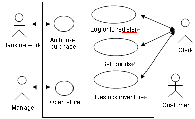

2. 根据下列条件使用等价类划分法设计测试用例。某八位微机，其八进制常数定义为：以零开头的数是八进制整数，其值的范围是-177～177，如05，0127，-065。

3. 用SA方法画出下列问题的顶层和0层数据流图。（7分）

   某运动会管理系统接受来自运动员的报名单、裁判的比赛项目及项目成绩，产生运动员号码单发送给运动员，项目参加者发送给裁判，单项名次、团体名次发送给发布台。该系统有两部分功能：
   - （1）登记报名单：接受报名单、比赛项目，产生运动员号码单、项目参加者，形成运动员名单及团体成绩表两种数据存储。
   - （2）统计成绩：接受项目成绩，查询运动员名单，产生单项名次，填写团体成绩，最后产生团体名次。

---

## 试题二

### 第一部分 选择题

#### 一、单项选择题（本大题共20小题，每小题1分，共20分）

1. 在软件开发模型中，提出最早、应用最广泛的模型是（ ）
   A. 瀑布 B. 螺旋 C. 演化 D. 智能

2. 软件可行性研究一般不考虑（ ）
   A. 是否有足够的人员和相关的技术来支持系统开发
   B. 是否有足够的工具和相关的技术来支持系统开发
   C. 待开发软件是否有市场、经济上是否合算
   D. 待开发的软件是否会有质量问题

3. 软件详细设计的主要任务是确定每个模块的（ ）
   A. 算法和使用的数据结构 B. 外部接口 C. 功能 D. 编程

4. 为了提高软件的可维护性，在编码阶段应注意（ ）
   A. 保存测试用例和数据 B. 提高模块的独立性 C. 文档的副作用 D. 养成好的程序设计风格

5. 快速原型模型的主要特点之一是（ ）
   A. 开发完毕才见到产品 B. 及早提供全部完整的软件产品 C. 开发完毕后才见到工作软件 D. 及早提供工作软件

6. 软件需求分析的主要任务是准确地定义出要开发的软件系统是（ ）
   A. 如何做 B. 怎么做 C. 做什么 D. 对谁做

7. 软件维护产生的副作用，是指（ ）
   A. 开发时的错误 B. 隐含的错误 C. 因修改软件而造成的错误 D. 运行时误操作

8. 软件生命周期中所花费用最多的阶段是（ ）
   A. 详细设计 B. 软件编码 C. 软件测试 D. 软件维护

9. 模块的内聚性最高的是（ ）
   A. 逻辑内聚 B. 时间内聚 C. 偶然内聚 D. 功能内聚

10. 与确认测试阶段有关的文档是（ ）
    A. 需求规格说明书 B. 概要设计说明书 C. 详细设计说明书 D. 源程序

11. 面向对象分析是对系统进行（ ）的一种方法。
    A. 需求建模 B. 程序设计 C. 设计评审 D. 测试验收

12. 下列模型属于成本估算方法的有（ ）
    A. COCOMO模型 B. McCall模型 C. McCabe度量法 D. 时间估算法

13. 因计算机硬件和软件环境的变化而作出的修改软件的过程称为（ ）
    A. 校正性维护 B. 适应性维护 C. 完善性维护 D. 预防性维护

14. 一个模块内部各程序都在同一数据结构上操作，这个模块的内聚性称为（ ）。
    A. 时间内聚 B. 功能内聚 C. 信息内聚 D. 过程内聚

15. 面向对象技术中，对象是类的实例。对象有三种成份：（ ）、属性和方法(或操作)。
    A. 标识 B. 规则 C. 封装 D. 消息

16. 数据字典是用来定义（ ）中的各个成份的具体含义的。
    A. 流程图 B. 功能结构图 C. 系统结构图 D. 数据流图

17. 在软件生产的程序系统时代由于软件规模扩大和软件复杂性提高等原因导致了（ ）
    A. 软件危机 B. 软件工程 C. 程序设计革命 D. 结构化程序设计

18. 软件详细设计主要采用的方法是（ ）
    A. 模块设计 B. 结构化设计 C. PDL语言 D. 结构化程序设计

19. 若有一个计算类型的程序，它的输入量只有一个X，其范围是[-1.0, 1.0]，现从输入的角度考虑一组测试用例：-1.001，-1.0，1.0，1.001。设计这组测试用例的方法是（ ）
    A. 条件覆盖法 B. 等价分类法 C. 边界值分析法 D. 错误推测法

20. 程序的三种基本控制结构是（ ）。
    A. 过程、子程序和分程序 B. 顺序、选择和重复 C. 递归、堆栈和队列 D. 调用、返回和转移

### 第二部分 非选择题

#### 二、填空题（本大题共10小题，每小题2分，共20分）

1. 软件由程序、______、______组成。
2. 需求分析方法包括：______的分析方法、面向过程流的分析方法、______的分析方法。
3. 一般的软件开发环境应有______的支持，有适宜的文档和评审，采用交互处理方式。
4. 1978年Walters和McCall提出了包括______、准则和______的三层次软件质量度量模型。
5. 需求分析的主要任务是实现用户需求的______、______和完全化。
6. 交互图描述对象之间的______。它又可分为顺序图(sequence diagram)与______两种形式。
7. 顺序图强调对象之间消息发送的______。合作图更强调对象间的______关系。
8. 软件过程设计中最常用的技术和工具主要为______、流程图、盒图、______和PDL语言。
9. 采用任一种软件设计方法都将产生系统的______设计、系统的数据设计和系统的______设计。
10. 在学校中，一个学生可以选修多门课程，一门课程可以由多个学生选修，那么学生和课程之间是______关系。

#### 三、名词解释题（本大题共5小题，每小题3分，共15分）

1. 软件工程
2. 适应性维护
3. 数据字典
4. 系统响应时间
5. 重构工程

#### 四、简答题（本大题共5小题，每小题5分，共25分）

1. 规模度量有哪些优点和缺点?
2. 软件总体结构设计的目标是什么？
3. 人们总是希望编制清晰、紧凑、高效的程序，但这些特性在编码时往往互相矛盾，一般应依次考虑哪些原则？
4. 黑盒测试旨在测试软件是否满足功能要求，它主要诊断哪几类错误？
5. 使用哪些工具可帮助开发人员使用快速原型技术完成开发任务?

#### 五、综合应用题（第一小题5分，第二小题10分，第三小题5分，共20分）

1. 请使用N-S图和PDL语言描述下列程序的算法。在数据A(1)～A(10)中求最大数和次大数。

2. 高考录取统分子系统有如下功能：
   - （1）计算标准分：根据考生原始分计算，得到标准分，存入考生分数文件；
   - （2）计算录取线分：根据标准分、招生计划文件中的招生人数，计算录取线，存入录取线文件。

   试根据要求画出该系统的数据流程图，并将其转换为软件结构图。

3. UML关系包括关联、聚合、泛化、实现、依赖等5种类型，请将合适的关系填写在下列描述的（ ）中。
   - ① 用例及其协作之间是（ ）关系。
   - ② 在学校中，一个学生可以选修多门课程，一门课程可以由多个学生选修，那么学生和课程之间是（ ）关系。
   - ③ 类A的一个操作调用类B的一个操作，且这两个类之间不存在其他关系，那么类A和类B之间是（ ）关系。
   - ④ 在MFC类库中，Window类和DialogBox类之间是（ ）关系。
   - ⑤ 森林和树木之间是（ ）关系。

---

## 试题三

### 第一部分 选择题

#### 一、单项选择题（本大题共20小题，每小题1分，共20分）

1. 开发软件所需高成本和产品的低质量之间有着尖锐的矛盾，这种现象称做（ ）
   A. 软件工程 B. 软件周期 C. 软件危机 D. 软件产生

2. 研究开发所需要的成本和资源是属于可行性研究中的研究的一方面。（ ）
   A. 技术可行性 B. 经济可行性 C. 社会可行性 D. 法律可行性

3. 模块的内聚性最高的是（ ）
   A. 逻辑内聚 B. 时间内聚 C. 偶然内聚 D. 功能内聚

4. 在SD方法中全面指导模块划分的最重要的原则是（ ）
   A. 程序模块化 B. 模块高内聚 C. 模块低耦合 D. 模块独立性

5. 软件详细设计主要采用的方法是（ ）
   A. 模块设计 B. 结构化设计 C. PDL语言 D. 结构化程序设计

6. 黑盒测试在设计测试用例时，主要需要研究（ ）
   A. 需求规格说明与概要设计说明 B. 详细设计说明 C. 项目开发计划 D. 概要设计说明与详细设计说明

7. 若有一个计算类型的程序，它的输入量只有一个，其范围是现从输入的角度考虑一组测试用例：设计这组测试用例的方法是（ ）
   A. 条件覆盖法 B. 等价分类法 C. 边界值分析法 D. 错误推测法

8. 下列属于维护阶段的文档是（ ）
   A. 软件规格说明 B. 用户操作手册 C. 软件问题报告 D. 软件测试分析报告

9. 快速原型模型的主要特点之一是（ ）
   A. 开发完毕才见到产品 B. 及早提供全部完整的软件产品 C. 开发完毕后才见到工作软件 D. 及早提供工作软件

10. 因计算机硬件和软件环境的变化而作出的修改软件的过程称为（ ）
    A. 校正性维护 B. 适应性维护 C. 完善性维护 D. 预防性维护

11. 下列文档与维护人员有关的有（ ）
    A. 软件需求说明书 B. 项目开发计划 C. 概要设计说明书 D. 操作手册

12. 下列模型属于成本估算方法的有（ ）
    A. COCOMO模型 B. McCall模型 C. McCabe度量法 D. 时间估算法

13. （ ）是把对象的属性和操作结合在一起，构成一个独立的对象，其内部信息对外界是隐蔽的，外界只能通过有限的接口与对象发生联系。
    A. 多态性 B. 继承 C. 封装 D. 消息

14. 美国卡内基—梅隆大学SEI提出的CMM模型将软件过程的成熟度分为5个等级，以下选项中，属于可管理级的特征是（ ）。
    A. 工作无序，项目进行过程中经常放弃当初的计划
    B. 建立了项目级的管理制度
    C. 建立了企业级的管理制度
    D. 软件过程中活动的生产率和质量是可度量的

15. 在McCall软件质量度量模型中，（ ）属于面向软件产品修改。
    A. 可靠性 B. 可重用性 C. 适应性 D. 可移植性

16. 汽车有一个发动机。汽车和发动机之间的关系是______关系。
    A. 一般具体 B. 整体部分 C. 分类关系 D. 主从关系

17. 对象是OO方法的核心，对象的类型有多种，通常把例如飞行、事故、演出、开会等等，称之为（ ）
    A. 有形实体 B. 作用 C. 事件 D. 性能说明

18. 为软件的运行增加监控设施，这种维护的维护类型是（ ）
    A. 纠正性维护 B. 适应性维护 C. 完善性维护 D. 预防性维护

19. 软件按照设计的要求，在规定时间和条件下达到不出故障，持续运行的要求的质量特性称为（ ）
    A. 可用性 B. 可靠性 C. 正确性 D. 完整性

20. 数据流图（DFD）是（ ）方法中用于表示系统的逻辑模型的一种图形工具。
    A. SA B. SD C. SP D. SC

### 第二部分 非选择题

#### 二、填空题（本大题共10小题，每小题2分，共20分）

1. 软件工程采用层次化的方法，每个层次都包括______、方法、______三要素。
2. CoCoMo模型分为基本、中间、______三个层次，分别用于软件开发的三个不同阶段。
3. 软件规模度量、______、质量度量、______度量、复杂性度量是软件度量的重要组成部分，已引起人们和软件组织的普遍重视。
4. 一个模块拥有的直属下级模块的个数称为______，一个模块的直接上级模块的个数称为______。
5. 类图描述系统的______结构，类图的结点表示系统中的类及其属性和操作，类图的边表示类之间的联系，包括______、关联、依赖、聚合等。
6. 根据领域知识、业务需求描述和既往经验，建立以包图表示的目标软件系统的______，形成以类图表示的______模型。
7. 维护阶段是软件生存周期中花费精力和费用______的阶段。
8. 软件设计过程是对______结构、数据结构和______逐步求精、复审并编制文档的过程。
9. 单元测试过程应为测试模块开发一个______和(或)若干个______。
10. 目前流行的联机求助系统有两类：______和______。

#### 三、名词解释题（本大题共5小题，每小题3分，共15分）

1. 计算机辅助软件工程（CASE）
2. 编程风格
3. 黑盒测试方法
4. 实体—关系图
5. 软件维护的副作用

#### 四、简答题（本大题共5小题，每小题5分，共25分）

1. 简述概要设计，详细设计，实现任务，组装测试，确认测试它们的任务？
2. 制定软件项目进度表有哪两种途径?
3. 简述软件需求分析阶段的主要内容、技术和方法?
4. 简述过程设计语言(PDL)的特点。
5. 简述过程式程序设计语言的基本机制所包括哪些内容。

#### 五、综合应用题（第1小题8分，第2小题7分，第3小题5分，共20分）

1. 某旅馆的电话服务如下：可以拨分机号和外线号码。分机号是从7201至7299。外线号码先拨9，然后是市话号码或长话号码。长话号码是以区号和市话号码组成。区号是从100到300中任意的数字串。市话号码是以局号和分局号组成。局号可以是455, 466, 888, 552中任意一个号码。分局号是任意长度为4的数字串。要求：写出在数据字典中，电话号码的数据条目的定义即组成。

2. 某培训中心要研制一个计算机管理系统。它的业务是：将学员发来的信件收集分类后，按几种不同的情况处理。如果是报名的，则将报名数据送给负责报名事务的职员，他们将查阅课程文件，检查该课程是否额满，然后在学生文件、课程文件上登记，并开出报告单交财务部门，财务人员开出发票给学生。如果是想注销原来已选修的课程，则由注销人员在课程文件、学生文件和帐目文件上做相应的修改，并给学生注销单。如果是付款的，则由财务人员在帐目文件上登记，也给学生一张收费收据。要求：1) 对以上问题画出数据流程图。(3分) 2) 画出该培训管理的软件结构图的主图。(4分)

3. UML关系包括关联、聚合、泛化、实现、依赖等5种类型，请将合适的关系填写在下列描述的（ ）中。
   - 1. 在学校中，一个导师可以指导多个研究生，一个研究生可以由多个导师指导，那么导师和研究生之间是（ ）关系。
   - 2. 交通工具与卡车之间是（ ）关系。
   - 3. 公司与部门之间是（ ）关系。
   - 4. 图形与矩形之间是（ ）关系。
   - 5. 参数类及其实例类之间是（ ）关系。

4. 请画出下面源代码的流程图模型及流图，设计基本路径，对每条基本路径设计测试用例进行测试：

```c
void Func(int nPosX, int nPosY) {
    while (nPosX > 0) {
        int nSum = nPosX + nPosY;
        if (nSum > 1) {
            nPosX--;
            nPosY--;
        }
        else {
            if (nSum < -1) nPosX -= 2;
            else nPosX -= 4;
        }
    } // end of while
}
```

---

## 试题四

### 第一部分 选择题

#### 一、单项选择题（本大题共20小题，每小题1分，共20分）

1. Putnam成本估算模型是一个（ ）模型。
   A. 静态单变量 B. 动态单变量 C. 静态多变量 D. 动态多变量

2. 在McCall软件质量度量模型中，（ ）属于面向软件产品修改。
   A. 可靠性 B. 可重用性 C. 适应性 D. 可移植性

3. 软件复杂性度量的参数包括（ ）
   A. 效率 B. 规模 C. 完整性 D. 容错性

4. 瀑布模型的存在问题是（ ）
   A. 用户容易参与开发 B. 缺乏灵活性 C. 用户与开发者易沟通 D. 适用可变需求

5. 详细设计的结果基本决定了最终程序的（ ）
   A. 代码的规模 B. 运行速度 C. 质量 D. 可维护性

6. 经济可行性研究的范围包括（ ）
   A. 资源有效性 B. 管理制度 C. 效益分析 D. 开发风险

7. 需求分析阶段的任务是确定（ ）
   A. 软件开发方法 B. 软件开发工具 C. 软件开发费 D. 软件系统的功能

8. 为了提高测试的效率，应该（ ）
   A. 随机地选取测试数据
   B. 取一切可能的输入数据作为测试数据
   C. 在完成编码以后制定软件的测试计划
   D. 选择发现错误可能性大的数据作为测试数据

9. 使用白盒测试方法时，确定测试数据应根据（ ）和指定的覆盖标准。
   A. 程序的内部逻辑 B. 程序的复杂结构 C. 使用说明书 D. 程序的功能

10. 结构化程序之所以具有易于阅读，并且有可能验证其正确性，这是由于（ ）
    A. 它强调编程风格 B. 选择良好的数据结构和算法 C. 有限制地使用GOTO语句 D. 只有三种基本结构

11. 在结构化分析方法中，（ ）表达系统内部数据运动的图形化技术。
    A. 数据字典 B. 实体关系图 C. 数据流图 D. 状态转换图

12. （ ）意味着一个操作在不同的类中可以有不同的实现方式。
    A. 多态性 B. 多继承 C. 类的复用 D. 封装

13. 对象是OO方法的核心，对象的类型有多种，通常把例如飞行、事故、演出、开会等等，称之为（ ）
    A. 有形实体 B. 作用 C. 事件 D. 性能说明

14. 开发软件所需高成本和产品的低质量之间有着尖锐的矛盾，这种现象称做（ ）
    A. 软件工程 B. 软件周期 C. 软件危机 D. 软件产生

15. COCOMO模型可用来（ ）
    A. 度量程序复杂程度 B. 计算软件开发成本 C. 估计程序的故障总数 D. 估计软件开发所需时间

16. 软件结构使用的图形工具，一般采用（ ）图。
    A. DFD B. PAD C. SC D. ER

17. 软件复杂性度量的参数包括（ ）
    A. 效率 B. 规模 C. 完整性 D. 容错性

18. 设计测试方案最困难的问题是（ ）
    A. 确定要测试的功能 B. 确定预期的正确输出 C. 确定要测试的对象 D. 设计测试用例

19. 类库这种机制是（ ）级别的信息共享。
    A. 同一类 B. 不同类 C. 同一应用 D. 不同应用

20. 美国卡内基—梅隆大学SEI提出的CMM模型将软件过程的成熟度分为5个等级，以下选项中，属于可管理级的特征是（ ）。
    A. 工作无序，项目进行过程中经常放弃当初的计划
    B. 建立了项目级的管理制度
    C. 建立了企业级的管理制度
    D. 软件过程中活动的生产率和质量是可度量的

### 第二部分 非选择题

#### 二、填空题（本大题共10小题，每小题2分，共20分）

1. 软件工程方法分两类：______方法和______方法。
2. 在基于计算机的系统中，不允许程序停止运行的系统，称为______。如空中交通管理系统。
3. Putnam模型揭示了软件项目的工作量、______和______三者之间的关系。
4. 面向对象(Object-Oriented, 简称OO)的需求分析方法通过提供对象、______等语言机制让分析人员在解空间中直接模拟问题空间中的对象及其行为，从而削减了语义断层，为需求建模活动提供了直观、自然的语言支持和方法学指导。
5. 一个部件可能是一个______文件、一个______文件或一个可执行文件。
6. 构件图用于理解和分析软件各部分之间的______。
7. 实体—关系图是______的基础，它描述______、属性及其关系。
8. 按照软件工程的观点，程序是软件设计的自然结果，程序的质量主要取决于______的质量，而______在很大程度上影响着程序的可读性、可测试性和可维护性。
9. 快速原型的构造过程可以归纳为______、实现、检查、______四个步骤。
10. 软件设计在技术上可分为总体结构设计、______设计、过程设计和______设计四个活动。

#### 三、名词解释题（本大题共5小题，每小题3分，共15分）

1. 软件生存周期
2. 白盒测试
3. 预防性维护
4. 构件图
5. 场景

#### 四、简答题（本大题共5小题，每小题5分，共25分）

1. 简述软件工程目标。
2. 简述CMM优点和缺点。
3. 用SD方法将数据流图转换为软件结构，简述其过程。
4. 试述软件测试过程。
5. 面向对象程序设计语言最基本的机制包括哪些？

#### 五、综合应用题（第一小题8分，第二小题7分，第三小题5分，共20分）

1. 下面是某程序的流程图：

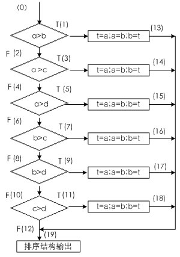

（1）计算它的环路复杂性。
（2）为了完成基本路径测试，求它的一组独立的路径。

2. 根据下列条件使用等价划分法设计测试用例。某一8位微机，其十六进制常数定义为：以0x或0X开头的数是十六进制整数，其值的范围是-7f～7f（表示十六进制的大小写字母不加区别），如0X13, 0X6A, -0X3c。

3. 下图显示了某个学校课程管理系统的部分类图，其中一个学生（student）可以知道所有注册课程的教师（instructor），一个教师也可以知道所有注册课程的学生。

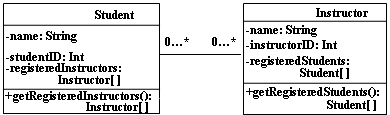

现在提出一个新的需求："一个教师也可以是某些课程的学生"，那么下面设计A～C中哪一个是最好的？为什么？

设计A：

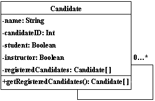

设计B：

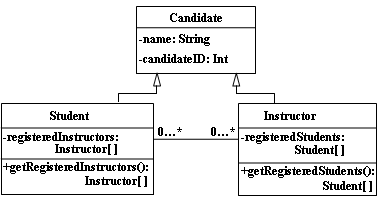

设计C：

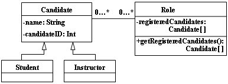

---

## 试题五

### 第一部分 选择题

#### 一、单项选择题（本大题共20小题，每小题1分，共20分）

1. （ ）是软件生存期中的一系列相关软件工程活动的集合，它由软件规格说明、软件设计与开发、软件确认、软件改进等活动组成。
   A. 软件过程 B. 软件工具 C. 质量保证 D. 软件工程

2. 在各种不同的软件需求中，功能需求描述了用户使用产品必须要完成的任务，可以在用例模型或方案脚本中予以说明，（ ）是从各个角度对系统的约束和限制，反映了应用对软件系统质量和特性的额外要求。
   A. 业务需求 B. 功能要求 C. 非功能需求 D. 用户需求

3. 软件测试计划开始于需求分析阶段，完成于（ ）阶段。
   A. 需求分析 B. 软件设计 C. 软件实现 D. 软件测试

4. 下面关于面向对象方法中消息的叙述，不正确的是（ ）。
   A. 键盘、鼠标、通信端口、网络等设备一有变化，就会产生消息
   B. 操作系统不断向应用程序发送消息，但应用程序不能向操作系统发送消息
   C. 应用程序之间可以相互发送消息
   D. 发送与接收消息的通信机制与传统的子程序调用机制不同

5. 美国卡内基—梅隆大学SEI提出的CMM模型将软件过程的成熟度分为5个等级，以下选项中，属于可管理级的特征是（ ）。
   A. 工作无序，项目进行过程中经常放弃当初的计划
   B. 建立了项目级的管理制度
   C. 建立了企业级的管理制度
   D. 软件过程中活动的生产率和质量是可度量的

6. 在McCall软件质量度量模型中，（ ）属于面向软件产品修改。
   A. 可靠性 B. 可重用性 C. 适应性 D. 可移植性

7. 软件生命周期中所花费用最多的阶段是（ ）
   A. 详细设计 B. 软件编码 C. 软件测试 D. 软件维护

8. 需求分析阶段的任务是确定（ ）
   A. 软件开发方法 B. 软件开发工具 C. 软件开发费 D. 软件系统的功能

9. 如果某种内聚要求一个模块中包含的任务必须在同一段时间内执行，则这种内聚为（ ）。
   A. 时间内聚 B. 逻辑内聚 C. 通信内聚 D. 信息内聚

10. 影响软件可维护性的决定因素是（ ）
    A. 文档 B. 可理解性 C. 可测试性 D. 可修改性

11. 实现单入口单出口程序的三种基本控制结构是（ ）
    A. 顺序、选择、循环 B. 过程、子程序、分程序 C. 调用、返回、转移 D. 递归、堆栈、队列

12. 为高质量地开发软件项目，在软件结构设计时，必须遵循（ ）原则。
    A. 信息隐蔽 B. 质量控制 C. 程序优化 D. 数据共享

13. DFD中的每个加工至少需要（ ）
    A. 一个输入流 B. 一个输出流 C. 一个输入或输出流 D. 一个输入流和一个输出流

14. 软件维护困难的主要原因是（ ）
    A. 费用低 B. 人员少 C. 开发方法的缺陷 D. 得不到用户支持

15. 表示对象相互行为的模型是（ ）模型。
    A. 动态模型 B. 功能模型 C. 对象模型 D. 静态模型

16. 快速原型模型的主要特点之一是（ ）
    A. 开发完毕才见到产品 B. 及早提供全部完整的软件产品 C. 开发完毕后才见到工作软件 D. 及早提供工作软件

17. 汽车有一个发动机。汽车和发动机之间的关系是（ ）关系。
    A. 一般具体 B. 整体部分 C. 分类关系 D. 主从关系

18. 在各种不同的软件需求中，（ ）描述了用户使用产品必须要完成的任务，可以在用例模型或方案脚本中予以说明。
    A. 业务需求 B. 功能需求 C. 非功能需求 D. 用户需求

19. CMM提供了一个框架，将软件过程改进的进化步骤组织成5个成熟度等级。除第1级外，每一级都包含了实现这一级目标的若干关键过程域，每一个关键过程域又包含若干（ ）。
    A. 关键实践 B. 软件过程性能 C. 软件过程能力 D. 软件过程

20. 软件测试是为了（ ）而执行程序的过程。
    A. 纠正错误 B. 发现错误 C. 避免错误 D. 证明正确

21. 可行性分析是在系统开发的早期所做的一项重要的论证工作，它是决定该系统是否开发的决策依据，因必须给出（ ）的回答。
    A. 确定 B. 行或不行 C. 正确 D. 无二义

### 第二部分 非选择题

#### 二、填空题（本大题共10小题，每小题2分，共20分）

1. 软件工程方法是完成软件工程项目的______。它支持项目计划和估算、系统和软件需求分析、______、编程、测试和维护。
2. 两个常用的估算模型：______、Putnam模型。
3. 软件修复步骤：发现故障、______、测试、系统重新启动。
4. 系统需求详细说明系统将要提供的______以及系统受到的约束。精确的描述软件的______。
5. 使用______原型可以让用户更多、更早地参与需求分析过程。
6. 面向对象的需求分析方法的核心是利用面向对象的概念和方法为软件需求建造模型。它包含面向对象风格的______以及用于指导需求分析的面向对象方法学。
7. 活动图中包含控制流和______。控制流表示一个操作完成后对其后续操作的触发。
8. 从工程管理的角度看，软件设计可分为______和______两大步骤。
9. 逆向工程与______是目前预防性维护采用的主要技术。
10. 我们将现今广为使用的支持快速原型的CASE工具分为四类：______工具，面向数据库应用的开发工具，______以及可重用工具。

#### 三、名词解释题（本大题共5小题，每小题3分，共15分）

1. 项目风险
2. α测试
3. 完善性维护
4. 技术风险
5. 活动图

#### 四、简答题（本大题共5小题，每小题5分，共25分）

1. 软件危机表现哪些方面？
2. 简述软件项目管理任务。
3. 简述采用信息隐藏原理指导模块设计优点。
4. 黑盒测试完全不考虑程序的内部结构和处理过程，测试仅在程序界面上进行。因此黑盒测试设计测试用例旨在说明什么？
5. 简述设计模型精化需要考虑的任务。

#### 五、综合应用题（第一小题8分，第二小题5分，第三小题7分，共20分）

1. 根据下面给出的规格说明，利用等价类划分的方法，给出足够的测试用例。"一个程序读入3个整数，它们分别代表一个三角形的3个边长。该程序判断所输入的整数是否构成一个三角形，以及该三角形是一般的、等腰的或等边的，并将结果打印出来。"要求：设三角形的3条边分别为A、B、C，并且列出等价类表和设计测试用例。

2. 下图显示了某个学校课程管理系统的部分类图，其中一个学生（student）可以知道所有注册课程的教师（instructor），一个教师也可以知道所有注册课程的学生。


现在提出一个新的需求："一个教师也可以是某些课程的学生"，那么下面设计A～C中哪一个是最好的？为什么？

设计A：


设计B：


设计C：


3. 图书馆的预定图书子系统有如下功能：
   - （1）由供书部门提供书目给订购组；
   - （2）订书组从各单位取得要订的书目；
   - （3）根据供书目录和订书书目产生订书文档留底；
   - （4）将订书信息（包括数目，数量等）反馈给供书单位；
   - （5）将未订书目通知订书者；
   - （6）对于重复订购的书目由系统自动检查，并把结果反馈给订书者。

   试根据要求画出该问题的数据流程图，并把其转换为软件结构图。

---

## 试题六

### 第一部分 选择题

#### 一、单项选择题（每小题1分，共20分）

1. CMM提供了一个框架，将软件过程改进的进化步骤组织成5个成熟度等级。除第1级外，每一级都包含了实现这一级目标的若干关键过程域，每一个关键过程域又包含若干（ ）。
   A. 关键实践 B. 软件过程性能 C. 软件过程能力 D. 软件过程

2. Putnam成本估算模型是一个（ ）模型。
   A. 静态单变量 B. 动态单变量 C. 静态多变量 D. 动态多变量

3. 瀑布模型的存在问题是（ ）
   A. 用户容易参与开发 B. 缺乏灵活性 C. 用户与开发者易沟通 D. 适用可变需求

4. 可行性分析是在系统开发的早期所做的一项重要的论证工作，它是决定该系统是否开发的决策依据，因必须给出（ ）的回答。
   A. 确定 B. 行或不行 C. 正确 D. 无二义

5. 系统流程图是用来（ ）
   A. 描绘程序结构的 B. 描绘系统的逻辑模型 C. 表示信息层次结构的图形工具 D. 描绘物理系统的

6. 最早的结构化语言是（ ）
   A. PASCAL B. Ada C. ALGOL D. FORTRAN

7. 白盒测试主要用于测试（ ）
   A. 程序的内部逻辑 B. 程序的正确性 C. 程序的外部功能 D. 结构合理性

8. 软件开发和维护过程中出现的一系列严重问题称为（ ）
   A. 软件工程 B. 软件开发 C. 软件周期 D. 软件危机

9. 需求规格说明书的作用不包括（ ）
   A. 软件验收的依据
   B. 用户与开发人员对软件要做什么的共同理解
   C. 软件可行性研究的依据
   D. 软件设计的依据

10. 下面关于PDL语言不正确的说法是（ ）
    A. PDL是描述处理过程怎么做
    B. PDL是只描述加工做什么
    C. PDL也称为伪码
    D. PDL的外层语法应符合一般程序设计语言常用的语法规则

11. 快速原型是利用原型辅助软件开发的一种新思想，它是在研究（ ）的方法和技术中产生的。
    A. 需求阶段 B. 设计阶段 C. 测试阶段 D. 软件开发的各个阶段

12. （ ）是为了确保每个开发过程的质量，防止把软件差错传递到下一个过程而进行的工作。
    A. 质量检测 B. 软件容错 C. 软件维护 D. 系统容错

13. 在SD方法中全面指导模块划分的最重要的原则是（ ）
    A. 程序模块化 B. 模块高内聚 C. 模块低耦合 D. 模块独立性

14. 下列属于维护阶段的文档是（ ）
    A. 软件规格说明 B. 用户操作手册 C. 软件问题报告 D. 软件测试分析报告

15. 软件按照设计的要求，在规定时间和条件下达到不出故障，持续运行的要求的质量特性称为（ ）
    A. 可用性 B. 可靠性 C. 正确性 D. 完整性

16. 在软件维护工作中，如果对软件的修改只限制在原需求说明书的范围之内，这种维护是属于（ ）
    A. 纠正性维护 B. 适应性维护 C. 完善性维护 D. 预防性维护

17. 需求分析中开发人员要从用户那里了解（ ）
    A. 软件做什么 B. 用户使用界面 C. 输入的信息 D. 软件的规模

18. 软件需求分析阶段的测试手段一般采用（ ）。
    A. 总结 B. 阶段性报告 C. 需求分析评审 D. 不测试

19. （ ）是将系统化的、规范的、可定量的方法应用于软件的开发、运行和维护的过程，它包括方法、工具和过程三个要素。
    A. 软件过程 B. 软件测试 C. 软件生存周期 D. 软件工程

20. 原型化方法是用户和软件开发人员之间进行的一种交互过程，适用于（ ）系统。
    A. 需求不确定的 B. 需求确定的 C. 管理信息 D. 决策支持

### 第二部分 非选择题

#### 二、填空题（本大题共10小题，每小题2分，共20分）

1. 用户需求用自然语言和______描述，说明系统必须______、系统运行要受哪些约束。
2. 软件工程的目标是在给定成本、______的前提下开发出高质量的、______的软件产品。
3. 为了将软部件合成至当前的软件开发项目之中，可以采用基于功能、基于数据和______的合成技术。
4. 软件设计的主要任务是根据______导出系统的实现方案。
5. 将数据流图映射为程序结构时，所用映射方法涉及信息流的类型。其信息流分为______和______两种类型。
6. 面向对象的分析模型主要由顶层架构图、______、领域概念模型构成。
7. 软件开发过程管理是软件工程的重要组成部分，它涉及软件组织、______、管理的方法、工具等。
8. 从原理上讲，软件工程方法都由建模语言和建模过程组成，UML属于______。
9. 软件维护的副作用大致可分为三类：代码副作用、______副作用、______的副作用。
10. 为了便于对照检查，测试用例应由输入数据和预期的______两部分组成。

#### 三、名词解释题（本大题共5小题，每小题3分，共15分）

1. 内聚性
2. 软件工程方法
3. 适应性维护
4. 数据设计
5. 异步消息(Asynchronous Message)

#### 四、简答题（本大题共5小题，每小题5分，共25分）

1. 子程序是可独立编译的程序单元，子程序一般具备哪三种机制？
2. 试述瀑布模型的优点和缺点？
3. 软件工程的目标是生产高质量的软件，高质量的软件应该具备哪三个条件。
4. 在省略有关建模的技术细节之后，简述域分析过程步骤。
5. 软件总体结构应该包括哪两方面内容?

#### 五、综合应用题（第1小题5分，第2小题8分，第3小题7分，共20分）

1. UML关系包括关联、聚合、泛化、实现、依赖等5种类型，请将合适的关系填写在下列描述的（ ）中。
   - ① 用例及其协作之间是（ ）关系。
   - ② 在学校中，一个学生可以选修多门课程，一门课程可以由多个学生选修，那么学生和课程之间是（ ）关系。
   - ③ 类A的一个操作调用类B的一个操作，且这两个类之间不存在其他关系，那么类A和类B之间是（ ）关系。
   - ④ 在MFC类库中，Window类和DialogBox类之间是（ ）关系。
   - ⑤ 森林和树木之间是（ ）关系。

2. 根据下列条件使用等价划分法设计测试用例。某一8位微机，其十六进制常数定义为：以0x或0X开头的数是十六进制整数，其值的范围是-7f～7f（表示十六进制的大小写字母不加区别），如0X13, 0X6A, -0X3c。

3. 某培训中心要研制一个计算机管理系统。它的业务是：将学员发来的信件收集分类后，按几种不同的情况处理。
   - 如果是报名的，则将报名数据送给负责报名事务的职员，他们将查阅课程文件，检查该课程是否额满，然后在学生文件、课程文件上登记，并开出报告单交财务部门，财务人员开出发票给学生。
   - 如果是想注销原来已选修的课程，则由注销人员在课程文件、学生文件和帐目文件上做相应的修改，并给学生注销单。
   - 如果是付款的，则由财务人员在帐目文件上登记，也给学生一张收费收据。

   要求：(1) 对以上问题画出数据流程图。(3分) (2) 画出该培训管理的软件结构图的主图。(4分)

---

## 试题七

### 第一部分 选择题

#### 一、单项选择题（本大题共20小题，每小题1分，共20分）

1. 详细设计的结果基本决定了最终程序的（ ）
   A. 代码的规模 B. 运行速度 C. 质量 D. 可维护性

2. 需求分析中开发人员要从用户那里了解（ ）
   A. 软件做什么 B. 用户使用界面 C. 输入的信息 D. 软件的规模

3. 结构化程序设计主要强调的是（ ）
   A. 程序的规模 B. 程序的效率 C. 程序设计语言的先进性 D. 程序易读性

4. 通常发现系统需求说明书中的错误的测试步骤是（ ）
   A. 模块测试 B. 子系统测试 C. 验收测试 D. 平行运行

5. 根据程序流程图划分的模块通常是（ ）
   A. 时间内聚的 B. 逻辑内聚的 C. 顺序内聚的 D. 过程内聚的

6. 维护活动必须应用于（ ）
   A. 软件文档 B. 整个软件配置 C. 可执行代码 D. 数据

7. 软件测试中根据测试用例设计的方法的不同可分为黑盒测试和白盒测试两种，它们（ ）
   A. 前者属于静态测试，后者属于动态测试
   B. 前者属于动态测试，后者属于静态测试
   C. 都属于静态测试
   D. 都属于动态测试

8. 维护中，因误删除一个标识符而引起的错误是（ ）副作用。
   A. 文档 B. 数据 C. 编码 D. 设计

9. 因计算机硬件和软件环境的变化而作出的修改软件的过程称为（ ）
   A. 校正性维护 B. 适应性维护 C. 完善性维护 D. 预防性维护

10. 下列文档与维护人员有关的有（ ）
    A. 软件需求说明书 B. 项目开发计划 C. 概要设计说明书 D. 操作手册

11. 下列文档与维护人员有关的有（ ）
    A. 软件需求说明书 B. 项目开发计划 C. 概要设计说明书 D. 操作手册

12. 可行性研究实质上是进行了一次（ ）
    A. 大大压缩简化了的系统分析和设计过程 B. 详尽的系统分析和设计过程 C. 彻底的系统设计过程 D. 深入的需求分析

13. 在详细设计阶段，经常采用的工具有（ ）
    A. PAD B. SA C. SC D. DFD

14. 协作图反映收发消息的对象的结构组织，它与（ ）是同构的。
    A. 用例图 B. 类图 C. 活动图 D. 时序图

15. 黑盒测试在设计测试用例时，主要需要研究（ ）
    A. 需求规格说明与概要设计说明 B. 详细设计说明 C. 项目开发计划 D. 概要设计说明与详细设计说明

16. CMM提供了一个框架，将软件过程改进的进化步骤组织成5个成熟度等级。除第1级外，每个等级都包含了实现该成熟度等级目标的若干（ ）。
    A. 关键实践 B. 关键过程域 C. 软件过程能力 D. 软件过程

17. 在McCall软件质量度量模型中，（ ）属于面向软件产品修改。
    A. 可靠性 B. 可重用性 C. 适应性 D. 可移植性

18. 汽车有一个发动机。汽车和发动机之间的关系是（ ）关系。
    A. 一般具体 B. 整体部分 C. 分类关系 D. 主从关系

19. 对象是OO方法的核心，对象的类型有多种，通常把例如飞行、事故、演出、开会等等，称之为（ ）
    A. 有形实体 B. 作用 C. 事件 D. 性能说明

20. 结构化程序之所以具有易于阅读，并且有可能验证其正确性，这是由于（ ）
    A. 它强调编程风格 B. 选择良好的数据结构和算法 C. 有限制地使用GOTO语句 D. 只有三种基本结构

### 第二部分 非选择题

#### 二、填空题（本大题共10小题，每小题2分，共20分）

1. 软件质量依赖于软件的内部特性及其组合，为了对软件质量进行度量，必须对影响软件质量的要素进行______，并建立实用的______体系或模型。
2. 对场景的完整描述包含场景名称、______、前置条件、______和后置条件。
3. ______作为完成用例任务的责任承担者，协调、控制其他类共同完成用例规定的功能或行为。
4. 设计任何一个人机界面一般必须考虑______、用户求助机制、错误信息处理和命令方式四个方面。
5. UML类之间的关系主要有______、聚集、______和依赖。
6. 数据结构描述各数据分量之间的______，数据结构一经确定，数据的组织形式、访问方法、组合程度及处理策略基本上随之确定，所以数据结构是影响______的重要因素。
7. 快速原型的构造过程可以归纳为______、实现、检查、______四个步骤。
8. 软件维护的内容包括校正性维护、适应性维护、______和预防性维护。
9. 软件设计在技术上可分为总体结构设计、______设计、过程设计和______设计四个活动。
10. ______重用是迄今为止研究最深入、应用最广泛的重用技术。

#### 三、名词解释题（本大题共5小题，每小题3分，共15分）

1. 软件生存周期
2. 结构化程序设计
3. 软件过程(software process)
4. 综合测试
5. 过程抽象

#### 四、简答题（本大题共5小题，每小题5分，共25分）

1. 简述软件危机发生的原因。
2. 程序设计环境的语言机制包括哪些？
3. 简述人机界面的设计过程可分为哪几个步骤?
4. 典型的软件重用过程一般包括哪些？
5. 面向对象程序设计语言最基本的机制包括哪些？

#### 五、综合应用题（第一小题7分，第二小题8分，第三小题5分，共20分）

1. 某旅馆的电话服务如下：可以拨分机号和外线号码。分机号是从7201至7299。外线号码先拨9，然后是市话号码或长话号码。长话号码是以区号和市话号码组成。区号是从100到300中任意的数字串。市话号码是以局号和分局号组成。局号可以是455, 466, 888, 552中任意一个号码。分局号是任意长度为4的数字串。要求：写出在数据字典中，电话号码的数据条目的定义(即组成)。

2. 下面是一段插入排序的程序，将R[k+1]插入到R[1...k]的适当位置。

```
R[0] = R[k+1];
j = k;
while (R[j] > R[0]) {
    R[j+1] = R[j];
    j--;
}
R[j+1] = R[0];
```

用路径覆盖方法为它设计足够的测试用例（while循环次数为0、1、2次）。

3. 建立以下有关"微机"的对象模型。（7分）

   一台微机有一个显示器，一个主机，一个键盘，一个鼠标，汉王笔可有可无。主机包括一个机箱，一个主板，一个电源及储存器等部件。储存器又分为固定储存器和活动存储器两种，固定存储器为内存和硬盘，活动存储器为软盘和光盘。

---

## 试题八

### 第一部分 选择题

#### 一、单项选择题（本大题共20小题，每小题1分，共20分）

1. 研究开发所需要的成本和资源是属于可行性研究中的研究的一方面。（ ）
   A. 技术可行性 B. 经济可行性 C. 社会可行性 D. 法律可行性

2. 模块的内聚性最高的是（ ）
   A. 逻辑内聚 B. 时间内聚 C. 偶然内聚 D. 功能内聚

3. 快速原型模型的主要特点之一是（ ）
   A. 开发完毕才见到产品 B. 及早提供全部完整的软件产品 C. 开发完毕后才见到工作软件 D. 及早提供工作软件

4. 因计算机硬件和软件环境的变化而作出的修改软件的过程称为（ ）
   A. 校正性维护 B. 适应性维护 C. 完善性维护 D. 预防性维护

5. 在McCall软件质量度量模型中，（ ）属于面向软件产品修改。
   A. 可靠性 B. 可重用性 C. 适应性 D. 可移植性

6. 汽车有一个发动机。汽车和发动机之间的关系是（ ）关系。
   A. 一般具体 B. 整体部分 C. 分类关系 D. 主从关系

7. 对象是OO方法的核心，对象的类型有多种，通常把例如飞行、事故、演出、开会等等，称之为（ ）
   A. 有形实体 B. 作用 C. 事件 D. 性能说明

8. 提高程序可读性的有力手段是（ ）
   A. 使用三种标准控制结构 B. 采用有实际意义的变量名 C. 显式说明一切变量 D. 给程序加注释

9. 程序的三种基本控制结构的共同特点是（ ）
   A. 只能用来描述简单程序 B. 不能嵌套使用 C. 单入口，单出口 D. 仅用于自动控制系统

10. 在软件开发的各种资源中，（ ）是最重要的资源。
    A. 开发工具 B. 方法 C. 硬件环境 D. 人员

11. 协作图反映收发消息的对象的结构组织，它与（ ）是同构的。
    A. 用例图 B. 类图 C. 活动图 D. 时序图

12. 详细设计与概要设计衔接的图形工具是（ ）。
    A. DFD图 B. SC图 C. PAD图 D. 程序流程图

13. 确认测试中，作为测试依据的文档是（ ）。
    A. 需求规格说明书 B. 设计说明书 C. 源程序 D. 开发计划

14. 为了适应软硬件环境变化而修改软件的过程是（ ）。
    A. 校正性维护 B. 完善性维护 C. 适应性维护 D. 预防性维护

15. 美国卡内基—梅隆大学SEI提出的CMM模型将软件过程的成熟度分为5个等级，以下选项中，属于可管理级的特征是（ ）。
    A. 工作无序，项目进行过程中经常放弃当初的计划
    B. 建立了项目级的管理制度
    C. 建立了企业级的管理制度
    D. 软件过程中活动的生产率和质量是可度量的

16. 在McCall软件质量度量模型中，（ ）属于面向软件产品修改。
    A. 可靠性 B. 可重用性 C. 适应性 D. 可移植性

17. 软件生命周期中所花费用最多的阶段是（ ）
    A. 详细设计 B. 软件编码 C. 软件测试 D. 软件维护

18. 需求分析阶段的任务是确定（ ）
    A. 软件开发方法 B. 软件开发工具 C. 软件开发费 D. 软件系统的功能

19. 如果某种内聚要求一个模块中包含的任务必须在同一段时间内执行，则这种内聚为（ ）。
    A. 时间内聚 B. 逻辑内聚 C. 通信内聚 D. 信息内聚

20. 在各种不同的软件需求中，功能需求描述了用户使用产品必须要完成的任务，可以在用例模型或方案脚本中予以说明，（ ）是从各个角度对系统的约束和限制，反映了应用对软件系统质量和特性的额外要求。
    A. 业务需求 B. 功能要求 C. 非功能需求 D. 用户需求

#### 二、填空题（本大题共10小题，每小题2分，共20分）

1. 用例的描述既可采用自然语言，也可采用______，其后者表示法更为精确、直观。
2. McCall提出的软件质量模型包括______个软件质量特性。
3. 程序设计环境通常包含三部分内容：开发方法学，语言机制与______。
4. 类之间的继承关系是现实世界中遗传关系的模拟，它表示类之间的内在联系以及对______的共享。
5. 软件元素包括程序代码、______、______、设计过程、需求分析文档甚至领域知识。
6. 确认测试应检查软件能否按合同要求进行工作，即是否满足______的确认标准。
7. 按照原型在软件开发过程中的不同作用划分为______、实验性和______三类原型。
8. 对象之间进行通信的构造叫做______。
9. 耦合的强弱取决于______的复杂性、进入或调用模块的位置以及通过界面传送数据的多少等。
10. 根据基本机制可将程序设计语言分为______程序设计语言、函数式程序设计语言、逻辑程序设计语言和______程序设计语言四类。

#### 三、名词解释题（本大题共5小题，每小题3分，共15分）

1. 软部件合成
2. 进化性原型
3. 软件质量
4. 恢复测试
5. 状态图

#### 四、简答题（本大题共5小题，每小题5分，共25分）

1. 软件产品具有哪些特点?
2. 简述在测试中采用自顶向下集成和自底向上集成的优缺点。
3. 边界类描述目标软件系统与外部环境的交互，简述边界类主要任务是什么？
4. 精化体系结构的目的是什么？
5. 一般而言，衡量某种程序语言是否适合于特定的项目，应考虑哪些因素？

#### 五、综合应用题（第1小题8分，第2小题5分，第3小题7分，共20分）

1. 根据下面给出的规格说明，利用等价类划分的方法，给出足够的测试用例。"一个程序读入3个整数，它们分别代表一个三角形的3个边长。该程序判断所输入的整数是否构成一个三角形，以及该三角形是一般的、等腰的或等边的，并将结果打印出来。"要求：设三角形的3条边分别为A、B、C，并且列出等价类表和设计测试用例。

2. 下图显示了某个学校课程管理系统的部分类图，其中一个学生（student）可以知道所有注册课程的教师（instructor），一个教师也可以知道所有注册课程的学生。


现在提出一个新的需求："一个教师也可以是某些课程的学生"，那么下面设计A～C中哪一个是最好的？为什么？

设计A：


设计B：


设计C：


答案：设计______最好。 理由：

3. 某校教务系统具备以下功能，输入用户ID号及口令后，经验证进入教务管理系统，可进行如下功能的处理：
   - ① 查询成绩：查询成绩以及从名次表中得到名次信息。
   - ② 学籍管理：根据学生总成绩排出名次信息。
   - ③ 成绩处理：处理单科成绩并输入成绩表中。

   就以上系统功能画出0层、1层的DFD图。

---

## 试题九

### 第一部分 选择题

#### 一、单项选择题（本大题共20小题，每小题1分，共20分）

1. 软件可行性研究一般不考虑（ ）
   A. 是否有足够的人员和相关的技术来支持系统开发
   B. 是否有足够的工具和相关的技术来支持系统开发
   C. 待开发软件是否有市场、经济上是否合算
   D. 待开发的软件是否会有质量问题

2. 软件详细设计的主要任务是确定每个模块的（ ）
   A. 算法和使用的数据结构 B. 外部接口 C. 功能 D. 编程

3. 为了提高软件的可维护性，在编码阶段应注意（ ）
   A. 保存测试用例和数据 B. 提高模块的独立性 C. 文档的副作用 D. 养成好的程序设计风格

4. 快速原型模型的主要特点之一是（ ）
   A. 开发完毕才见到产品 B. 及早提供全部完整的软件产品 C. 开发完毕后才见到工作软件 D. 及早提供工作软件

5. 软件需求分析的主要任务是准确地定义出要开发的软件系统是（ ）
   A. 如何做 B. 怎么做 C. 做什么 D. 对谁做

6. 软件维护产生的副作用，是指（ ）
   A. 开发时的错误 B. 隐含的错误 C. 因修改软件而造成的错误 D. 运行时误操作

7. 软件生命周期中所花费用最多的阶段是（ ）
   A. 详细设计 B. 软件编码 C. 软件测试 D. 软件维护

8. 因计算机硬件和软件环境的变化而作出的修改软件的过程称为（ ）
   A. 校正性维护 B. 适应性维护 C. 完善性维护 D. 预防性维护

9. 一个模块内部各程序都在同一数据结构上操作，这个模块的内聚性称为（ ）。
   A. 时间内聚 B. 功能内聚 C. 信息内聚 D. 过程内聚

10. 结构化设计又称为（ ）
    A. 概要设计 B. 面向数据流设计 C. 面向对象设计 D. 详细设计

11. 协作图反映收发消息的对象的结构组织，它与（ ）是同构的。
    A. 用例图 B. 类图 C. 活动图 D. 时序图

12. 黑盒测试在设计测试用例时，主要需要研究（ ）
    A. 需求规格说明与概要设计说明 B. 详细设计说明 C. 项目开发计划 D. 概要设计说明与详细设计说明

13. CMM提供了一个框架，将软件过程改进的进化步骤组织成5个成熟度等级。除第1级外，每个等级都包含了实现该成熟度等级目标的若干（ ）。
    A. 关键实践 B. 关键过程域 C. 软件过程能力 D. 软件过程

14. 结构化程序之所以具有易于阅读，并且有可能验证其正确性，这是由于（ ）
    A. 它强调编程风格 B. 选择良好的数据结构和算法 C. 有限制地使用GOTO语句 D. 只有三种基本结构

15. （ ）意味着一个操作在不同的类中可以有不同的实现方式。
    A. 多态性 B. 多继承 C. 类的复用 D. 封装

16. 对象是OO方法的核心，对象的类型有多种，通常把例如飞行、事故、演出、开会等等，称之为（ ）
    A. 有形实体 B. 作用 C. 事件 D. 性能说明

17. COCOMO模型可用来（ ）
    A. 度量程序复杂程度 B. 计算软件开发成本 C. 估计程序的故障总数 D. 估计软件开发所需时间

18. 为高质量地开发软件项目，在软件结构设计时，必须遵循______原则。（ ）
    A. 信息隐蔽 B. 质量控制 C. 程序优化 D. 数据共享

19. DFD中的每个加工至少需要（ ）
    A. 一个输入流 B. 一个输出流 C. 一个输入或输出流 D. 一个输入流和一个输出流

20. 下面关于面向对象方法中消息的叙述，不正确的是（ ）。
    A. 键盘、鼠标、通信端口、网络等设备一有变化，就会产生消息
    B. 操作系统不断向应用程序发送消息，但应用程序不能向操作系统发送消息
    C. 应用程序之间可以相互发送消息
    D. 发送与接收消息的通信机制与传统的子程序调用机制不同

#### 二、填空题（本大题共10小题，每小题2分，共20分）

1. Putnam模型是一个______模型，适用于软件开发的各个阶段，该估算模型以大型软件项目的______为基础。
2. 对用例的完整描述包括用例名称、______、前置条件、______、0到多个辅事件流、后置条件。
3. 问题分析阶段的核心技术是______、问题分解及______。
4. 单元测试的依据是______描述，单元测试应对模块内所有重要的______设计测试用例，以便发现模块内部的错误。
5. 一个典型的重用组织机构应该由重用管理组、______、______和软部件开发组构成。
6. 软件产品的基本属性是可维护性、______、有效性、______。
7. 测试策略应包含______、______、测试实施和测试结果收集评估等。
8. 影响编码质量的因素包括编程语言、______和______，它们对程序的可靠性、可读性、可测试性和可维护性都将产生深远的影响。
9. 设计模型则包含以包图表示的______，以交互图表示的用例实现图，完整、精确的类图，以及针对复杂对象的状态图、用以描述流程化处理过程的______等。
10. UML的类包含三个部分：类的名称、______、______。

#### 三、名词解释题（本大题共5小题，每小题3分，共15分）

1. 水平原型
2. CASE工具
3. 部署图(deployment diagram)
4. 垂直原型
5. 数据抽象

#### 四、简答题（本大题共5小题，每小题5分，共25分）

1. 简述设计模型精化时需要考虑的任务。
2. 简述人机界面的风格大致经历了哪四代的演变。
3. 简述螺旋模型的基本开发过程。
4. 简述启发式设计策略最常用的几条。
5. 简述采用信息隐藏原理指导模块设计优点。

#### 五、综合应用题（第1小题10分，第2小题10分，共20分）

1. 高考录取统分子系统有如下功能：
   - （1）计算标准分：根据考生原始分计算，得到标准分，存入考生分数文件；
   - （2）计算录取线分：根据标准分、招生计划文件中的招生人数，计算录取线，存入录取线文件。

   试根据要求画出该系统的数据流程图，并将其转换为软件结构图。

2. 输入三个正整数作为边长，判断该三条边构成的三角形是等边、等腰还是一般三角形，"判定三角形类别"程序算法用等价类划分和边界值分析法设计测试用例。

---

## 答案

### 试题一答案

#### 第一部分 选择题

一、单项选择题

1. C 2. A 3. B 4. B 5. C
6. D 7. A 8. D 9. D 10. A
11. B 12. A 13. D 14. B 15. D
16. D 17. C 18. C 19. D 20. D

#### 第二部分 非选择题

二、填空题

1. 问题定义、可行性研究
2. CASE工具
3. 面向数据流的分析方法、面向对象的分析方法
4. 系统的分解
5. 设计规格说明书、编码
6. 数据流、加工
7. 人的因素、界面的风格
8. 依赖
9. 项目成本和工作量、功能点
10. 白盒测试、黑盒测试

三、名词解释题

1. **软件**：是能够完成预定功能和性能，并对相应数据进行加工的程序和描述程序及其操作的文档。
2. **信息隐藏**：模块中的软件设计决策信息封装起来的技术，只知道它的功能以及对外的接口，而不知它的内部细节。
3. **对象**：对象是现实世界中个体或事物的抽象表示，是其属性和相关操作的封装。
4. **软件可维护性**：指软件被理解、改正、调整和改进的难易程度。
5. **原型**：是目标软件系统的一个可操作模型，它实现了目标软件系统的某些重要方面。

四、简答题

1. 在软件开发过程中，为了达到软件开发目标，必须遵循的原则：抽象、模块化、信息隐藏、局部化、一致性、完全性、可验证性。
2. CMM的能力成熟度共分为五级为：L1初始级、L2可重复级、L3已定义级、L4已管理级、L5优化级。
3. 用例实现方案的设计方法分为三个步骤：提取边界类、实体类和控制类；构造交互图；根据交互图精化类图。
4. 单元测试任务主要有：模块接口测试；模块局部数据结构测试；模块边界条件测试；模块中所有独立执行通路测试；模块的各条错误处理通路测试。
5. 面向功能的度量的优点和缺点：
   - 优点：① 与程序设计语言无关，它不仅适用于过程式语言，也适用于非过程式的语言；② 软件项目开发初期就能基本上确定系统的输入、输出等参数，功能点度量能用于软件项目的开发初期。
   - 缺点：① 它涉及到的主观因素比较多，如各种权函数的取值；② 信息领域中的某些数据有时不容易采集；③ FP的值没有直观的物理意义。

五、综合应用题

1. 答：Bank network、Manager、Clerk

2. 答：用等价划分法

   （1）划分等价类并编号：

   八进制整型常量输入条件的等价类表

   | 输入数据 | 合理等价类 | 不合理等价类 |
   |---|---|---|
   | 八进制整数 | 1. 2-4位以0打头的数字串 | 3. 以非0非-打头的串 |
   | | 2. 以-0打头的3-5位数字串 | 4. 0打头含有非数字字符的串 |
   | | | 5. 以-0打头含有非数字字符的串 |
   | | | 6. 多于5个字符 |
   | | | 7. -后非0的多位串 |
   | | | 8. -后有非数字字符 |
   | | | 9. -后多于4个数字 |
   | 八进制数范围 | 10. 在-177~177之间 | 11. 小于-177 |
   | | | 12. 大于177 |

   （2）为合理等价类设计测试用例：

   | 测试数据 | 期望结果 | 覆盖范围 |
   |---|---|---|
   | 023 | 显示有效输入 | 1, 10 |
   | -0156 | 显示有效输入 | 2, 10 |

   （3）为不合理等价类测试用例：

   | 测试数据 | 期望结果 | 覆盖范围 |
   |---|---|---|
   | 102 | 显示无效输入 | 3 |
   | 0A12 | 显示无效输入 | 4 |
   | -0X33 | 显示无效输入 | 5 |
   | -02212 | 显示无效输入 | 6 |
   | -1A1 | 显示无效输入 | 7 |
   | -12a4 | 显示无效输入 | 8 |
   | -2771 | 显示无效输入 | 9 |
   | -0200 | 显示无效输入 | 11 |
   | 0223 | 显示无效输入 | 12 |

3. 答：

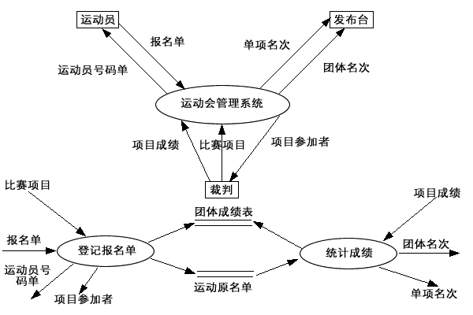

---

### 试题二答案

#### 第一部分 选择题

一、单项选择题

1. A 2. D 3. A 4. D 5. D
6. C 7. C 8. D 9. D 10. A
11. A 12. A 13. C 14. C 15. A
16. D 17. A 18. D 19. C 20. B

#### 第二部分 非选择题

二、填空题

1. 数据、文档
2. 面向数据流、面向对象
3. 软件开发方法学
4. 质量要素、度量
5. 一致化、精确化
6. 消息传递、合作图
7. 时间序、动态协作
8. 结构化程序设计、判定表
9. 总体结构设计、过程
10. 关联

三、名词解释题

1. **软件工程**：软件工程是运用工程、科学和数学的原则与方法研制、维护计算机软件的有关技术和管理的方法。
2. **适应性维护**：是为适应环境的变化而修改软件的活动。
3. **数据字典**：数据字典由数据条目组成，数据字典描述、组织和管理数据流图的数据流、加工、数据源及外部实体。
4. **系统响应时间**：指当用户执行了某个控制动作后（例如，按回车键，点鼠标等），系统作出反应的时间（指输出所期望的信息或执行对应的动作）。
5. **重构工程**：也称修复和改造工程，它是在逆向工程所获信息的基础上修改或重构已有的系统，产生系统的一个新版本。

四、简答题

1. **规模度量优点和缺点**：
   - 优点：用软件代码行数估算软件规模简单易行。
   - 缺点：代码行数的估算依赖于程序设计语言的功能和表达能力；采用代码行估算方法会对设计精巧的软件项目产生不利的影响；在软件项目开发前或开发初期估算它的代码行数十分困难；代码行估算只适用于过程式程序设计语言，对非过程式的程序设计语言不太适用等等。

2. **软件总体结构设计的目标是**：产生一个模块化的程序结构并明确各模块之间的控制关系，此外还要通过定义界面，说明程序的输入输出数据流，进一步协调程序结构和数据结构。

3. **人们总是希望编制清晰、紧凑、高效的程序，但这些特性在编码时往往互相矛盾，一般应依次考虑下列原则**：编制易于修改、维护的代码；编制易于测试的代码；必须将编程与编文档的工作统一开来；编程中采用统一的标准和约定，降低程序复杂性；限定每一层的副作用，减少耦合度；尽可能地重用。

4. **黑盒测试旨在测试软件是否满足功能要求，它主要诊断的错误为**：不正确或遗漏的功能；界面错误；数据结构或外部数据库访问错误；性能错误；初始化和终止条件错误。

5. **使用相应的工具可帮助开发人员使用快速原型技术完成开发任务如下**：用户界面自动生成工具、支持数据库应用的开发工具包、四代语言及相应的开发环境、软件重用工具等都可以直接服务于快速原型的构造与进化。

五、综合应用题

1. 答：

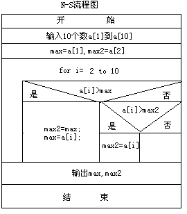

PDL语言描述：

```
GET(a[1], a[2], ...a[10])
max = a[1];
max2 = a[2];
FOR i = 2 TO 10
    IF a[i] > max THEN
        max2 = max;
        max = a[i];
    ELSE IF a[i] > max2 THEN
        max2 = a[i];
    ENDIF
    ENDIF
ENDFOR
PUT(max, max2)
END
```

2. 答：

   （1）数据流图：

   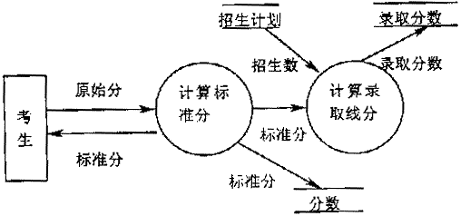

   （2）软件结构图

   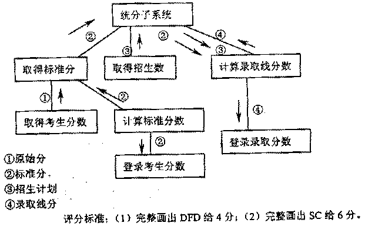

3. 答案：① 实现 ② 关联 ③ 依赖 ④ 泛化 ⑤ 聚合

---

### 试题三答案

#### 第一部分 选择题

一、单项选择题

1. C 2. B 3. D 4. D 5. D
6. A 7. C 8. C 9. D 10. B
11. C 12. A 13. C 14. D 15. C
16. B 17. C 18. D 19. B 20. A

#### 第二部分 非选择题

二、填空题

1. 过程、工具
2. 详细
3. 成本估算、可靠性
4. 模块的扇出、模块的扇入
5. 静态、继承
6. 顶层架构、领域概念
7. 最多
8. 程序、过程细节
9. 驱动模块、桩模块
10. 集成式、叠加式

三、名词解释题

1. **计算机辅助软件工程（CASE）**：将若干工具集成起来，与软件工程数据库和计算机系统构成一个支持软件开发的系统。
2. **编程风格**：是在不影响性能的前提下，有效地编排和组织程序以提高可读性和可维护性。
3. **黑盒测试方法**：是已知产品应该具有的功能，通过测试检验每个功能是否都能正常使用。
4. **实体—关系图**：描述系统所有数据对象的组成和属性，描述数据对象之间关系的图形语言。
5. **软件维护的副作用**：指由于维护或在维护过程中其他一些不期望的行为引入的错误。

四、简答题

1. **概要设计任务**：根据SRS建立目标软件系统的总体结构和模块间的关系、定义各功能模块的接口，设计全局数据库和数据结构，规定设计约束，制定组装测试计划等等。
   **详细设计任务**：细化概要设计所生成的各个模块，并详细描述程序模块的内部细节（算法，数据结构等），形成可编程的程序模块，制订单元测试计划。
   **实现任务**：根据详细设计规格说明书编写源程序，并对程序进行调试、单元测试、系统集成，验证程序与详细设计文档的一致性。
   **组装测试任务**：组装测试应满足概要设计的要求。
   **确认测试任务**：根据软件需求规格说明书，测试软件系统是否满足用户的需求。

2. **制定软件项目进度表的两种途径**：
   - 软件开发小组根据提供软件产品的最后期限从后往前安排时间。
   - 软件项目开发组织根据项目和资源情况制定软件项目开发的初步计划和交付软件产品的日期。

3. **软件需求分析阶段的主要内容、技术和方法分别为**：
   - 需求分析主要内容：问题分析、需求描述、需求评审
   - 技术和方法：初步需求获取技术、需求建模技术、快速原型技术、问题抽象、问题分解与多视点分析

4. **过程设计语言(PDL)的特点**：
   - ① 关键字采用固定语法并支持结构化构件、数据说明机制和模块化
   - ② 处理部分采用自然语言描述
   - ③ 允许说明简单（标量、数组等）和复杂（链表、树等）的数据结构
   - ④ 子程序的定义与调用规则不受具体接口方式的影响

5. **过程式程序设计语言的基本机制所包括内容**：对象说明、数据类型的定义和检查、子程序、控制结构。

五、综合应用题

1. 答：

   电话号码 = 分机号 | 外线号码
   分机号 = 7201...7299
   外线号码 = 9 + [市话号码 | 长话号码]
   长话号码 = 区号 + 市话号码
   区号 = 100...300
   市话号码 = 局号 + 分局号
   局号 = [455 | 466 | 888 | 552]
   分局号 = 4{数字}4

2. 答：

   1) 对以上问题画出数据流程图。(3分)

   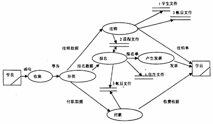

   2) 画出该培训管理的软件结构图的主图。(4分)

   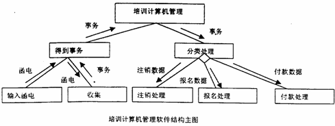

3. 答案：1. 关联 2. 泛化 3. 聚合 4. 泛化 5. 实现

---

### 试题四答案

#### 第一部分 选择题

一、单项选择题

1. D 2. C 3. B 4. B 5. C
6. C 7. D 8. D 9. A 10. D
11. C 12. A 13. C 14. C 15. B
16. C 17. B 18. D 19. D 20. D

#### 第二部分 非选择题

二、填空题

1. 传统、面向对象
2. 不可修复系统
3. 软件开发时间、程序代码长度
4. 对象间消息传递
5. 资源描述、二进制
6. 相互影响程度
7. 数据模型、数据对象
8. 设计、编程的风格
9. 分析与规划、改进
10. 数据、界面

三、名词解释题

1. **软件生存周期**：软件产品从形成概念开始，经过开发、运行（使用）和维护直到退役的全过程称为软件生存周期，包括软件定义、开发、使用和维护三部分。
2. **白盒测试**：是已知产品内部工作过程，通过测试检验产品内部动作是否按照产品规格说明的规定正常进行。
3. **预防性维护**：是为了进一步改善软件系统的可维护性和可靠性，并为以后的改进奠定基础。
4. **构件图**：描述软件实现系统中各组成部件以及它们之间的依赖关系。
5. **场景**：从单个执行者的角度观察目标软件系统的功能和外部行为。

四、简答题

1. **软件工程目标**：在给定成本、进度的前提下，开发出具有可修改性、有效性、可靠性、可适应性、可追踪性、可移植性、可互操作性并满足用户需求的软件产品。

2. **CMM优点和缺点**：
   - 优点：CMM模型概念清晰、层次分明、易于操作。为组织负责人和管理者提供指导组织逐步成熟的、明确的、有效的、单一路途。
   - 缺点：在阶段式模型中，属于较高级别成熟度的过程域不支持较低级别的过程域，如在L2级就无法安排属于L3级的"同行评审"过程域的实践活动。CMM过程域的度量只有通过或不通过，度量比较粗糙没有反映优势和一般。

3. **用SD方法将数据流图转换为软件结构，其过程分为**：确定信息流的类型；划定流界；将数据流图映射为程序结构；提取层次控制结构；通过设计复审和启发式策略精化结构。

4. **试述软件测试过程**：可概括为用单元测试保证模块正确工作，用综合测试保证模块集成到一起后正常工作，用确认测试保证软件需求的满足，用系统测试保证软件与其他系统元素合成后达到系统各项性能要求。

5. **面向对象程序设计语言最基本的机制包括**：类、子类、对象和实例的定义，单继承和多继承，对象的部分—整体关系，消息传递和动态链接等等。

五、综合应用题

1. 答：
   （1）环路复杂性 = 判断数 + 1 = 6 + 1 = 7（个）
   （2）路径1：(0)-①-(13)-(19)
       路径2：(0)-②-③-(14)-(19)
       路径3：(0)-②-④-⑤-(15)-(19)
       路径4：(0)-②-④-⑥-⑦-(16)-(19)
       路径5：(0)-②-④-⑥-⑧-⑨-(17)-(19)
       路径6：(0)-②-④-⑥-⑧-⑩-(18)-(19)
       路径7：(0)-②-④-⑥-⑧-⑩-(12)-(19)

2. 答：等价划分法

   ① 划分等价类并编号：

   十六进制整型常量输入条件的等价类表

   | 输入数据 | 合理等价类 | 不合理等价类 |
   |---|---|---|
   | 十六进制整数 | 1. 0x或0X开头1～2位数字串 | 3. 非0x或非-打头的串 |
   | | 2. 以-0x打头的1～2位数字串 | 4. 含有非数字且(a,b,c,d,e,f)以外字符 |
   | | | 5. 多于5个字符 |
   | | | 6. -后跟非0的多位串 |
   | | | 7. -0后跟数字串 |
   | | | 8. -后多于3个数字 |
   | 十六进制数范围 | 9. 在-7f～7f之间 | 10. 小于-7f |
   | | | 11. 大于7f |

   ② 为合理等价类设计测试用例：

   | 测试数据 | 期望结果 | 覆盖范围 |
   |---|---|---|
   | 0×23 | 显示有效输入 | 1, 9 |
   | -0×15 | 显示有效输入 | 2, 9 |

   ③ 为每个不合理等价类至少设计一个测试用例：

   | 测试数据 | 期望结果 | 覆盖范围 |
   |---|---|---|
   | 2 | 显示无效输入 | 3 |
   | G12 | 显示无效输入 | 4 |
   | 123311 | 显示无效输入 | 5 |
   | -1012 | 显示无效输入 | 6 |
   | -011 | 显示无效输入 | 7 |
   | -0134 | 显示无效输入 | 8 |
   | -0x777 | 显示无效输入 | 10 |
   | 0x87 | 显示无效输入 | 11 |

3. 答案：设计C最好。

   学生和教员均可以从Candidate类继承而来；抽象出Role类，使Candidate类与Role类之间形成多对多的关联关系，实现了"一个人既是教师又是某门课的学生"这个需求。

---

### 试题五答案

#### 第一部分 选择题

一、单项选择题

1. A 2. C 3. B 4. B 5. D
6. C 7. D 8. D 9. A 10. A
11. A 12. D 13. C 14. C 15. D
16. B 17. D 18. A 19. B 20. B

#### 第二部分 非选择题

二、填空题

1. 技术手段、设计
2. CoCoMo
3. 纠正错误
4. 服务、功能
5. 快速
6. 软件需求、图形语言机制
7. 信息流
8. 概要设计、详细设计
9. 重构工程
10. 用户界面自动生成工具、四代语言

三、名词解释题

1. **项目风险**：指项目在预算、进度、人力、资源、顾客和需求等方面的原因对软件项目产生的不良影响。
2. **α测试**：是指软件开发公司组织内部人员模拟各类用户行为对即将面市的软件产品(称为α版本)进行测试，试图发现错误并修正。
3. **完善性维护**：是根据用户在使用过程中提出的一些建设性意见而进行的维护活动。
4. **技术风险**：指软件在设计、实现、接口、验证和维护过程中可能发生的潜在问题，对软件项目带来的危害。
5. **活动图**：描述系统为完成某项功能而执行的操作序列，这些操作序列可以并发和同步。

四、简答题

1. **软件危机表现方面**：软件开发成本过高；软件质量得不到保证；软件开发效率低；难以控制开发进度，工作量估计困难；软件不能满足社会发展的需求，成为社会、经济发展的制约因素；程序规模、工作量与成本的关系。

2. **软件项目管理任务**：制定软件项目的实施计划和方案；对人员进行组织和分工；按照计划进度，以及成本管理、风险管理、质量管理的要求进行软件开发，完成软件项目的各项要求和任务。

3. **采用信息隐藏原理指导模块设计优点**：支持模块的并行开发；减少软件测试和软件维护的工作量。

4. **黑盒测试完全不考虑程序的内部结构和处理过程，测试仅在程序界面上进行。因此黑盒测试设计测试用例旨在说明**：① 软件的功能是否可操作；② 程序能否适当地接收输入数据并产生正确的输出结果或在可能的场景中事件驱动的效果是否尽如人意；③ 能否保持外部信息(如数据文件)的完整性。

5. **简述设计模型精化需要考虑的任务**：以顶层架构图为基础，精化目标软件系统的体系结构；精化类之间的关系；精化类的属性和操作；针对具有明显状态转换特征的类，设计状态图；针对比较复杂的类方法，设计活动图。

五、综合应用题

1. 答：

   （1）列出等价类表

   | 输入条件 | 有效等价类 | 无效等价类 |
   |---|---|---|
   | 是否构成一个三角形 | （1）A＞0且B＞0且C＞0且A＋B＞C且B＋C＞A且A＋C＞B。 | （2）A≤0或B≤0或C≤0 |
   | | | （3）A＋B≤C或A＋C≤B或B＋C≤A |
   | 是否等腰三角形 | （4）A＝B或A＝C或B＝C | （5）A≠B且A≠C且B≠C |
   | 是否等边三角形 | （6）A＝B且A＝C且B＝C | （7）A≠B或A≠C或B≠C |

   （2）设计测试用例

   用例1：输入【3，4，5】覆盖等价类（1, 2, 3, 4, 5, 6），输出结果为构成一般三角形。
   用例2：三者取一
   - 输入【0，1，2】覆盖等价类（2），输出结果为不构成三角形。
   - 输入【1，0，2】覆盖等价类（2），输出结果为不构成三角形。
   - 输入【1，2，0】覆盖等价类（2），输出结果为不构成三角形。
   用例3：三者取一
   - 输入【1，2，3】覆盖等价类（3），输出结果为不构成三角形。
   - 输入【1，3，2】覆盖等价类（3），输出结果为不构成三角形。
   - 输入【3，1，2】覆盖等价类（3），输出结果为不构成三角形。
   用例4：三者取一
   - 输入【3，3，4】覆盖等价类（1）（4），输出结果为等腰三角形。
   - 输入【3，4，4】覆盖等价类（1）（4），输出结果为等腰三角形。
   - 输入【3，4，3】覆盖等价类（1）（4），输出结果为等腰三角形。
   用例5：输入【3，4，5】覆盖等价类（1）（5），输出结果为不是等腰三角形。
   用例6：输入【3，3，3】覆盖等价类（1）（6），输出结果为等边三角形。
   用例7：三者取一
   - 输入【3，4，4】覆盖等价类（1）（4）（7），输出结果为不是等边三角形。
   - 输入【3，4，3】覆盖等价类（1）（4）（7），输出结果为不是等边三角形。
   - 输入【3，3，4】覆盖等价类（1）（4）（7），输出结果为不是等边三角形。

2. 答案：设计C最好。

   学生和教员均可以从Candidate类继承而来；抽象出Role类，使Candidate类与Role类之间形成多对多的关联关系，实现了"一个人既是教师又是某门课的学生"这个需求。

3. 答：

   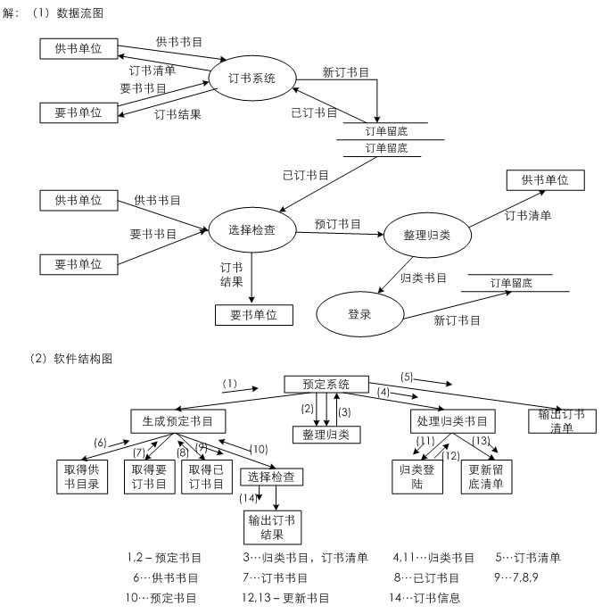

---

### 试题六答案

#### 第一部分 选择题

一、单项选择题

1. A 2. D 3. B 4. B 5. B
6. D 7. A 8. D 9. C 10. D
11. A 12. A 13. D 14. C 15. B
16. C 17. A 18. C 19. D 20. A

#### 第二部分 非选择题

二、填空题

1. 图表描述、提供哪些服务
2. 进度、满足用户需求
3. 面向对象
4. 需求规格说明
5. 变换流、事务流
6. 用例与用例图
7. 软件工程的标准
8. 建模语言
9. 数据、文档
10. 输出结果

三、名词解释题

1. **内聚性**：内聚性是模块独立性的衡量标准之一，它是指模块的功能强度的度量，即一个模块内部各个元素彼此结合的紧密程度的度量。
2. **软件工程方法**：是软件生产的组织方式，包括对软件过程的建议、使用的标记法、进行系统描述的规律和设计指南。
3. **适应性维护**：是为适应环境的变化而修改软件的活动。
4. **数据设计**：是为在需求规格说明中定义的那些数据对象选择合适的逻辑表示，并确定可能作用在这些逻辑结构上的所有操作（包括选用已存在的程序包）。
5. **异步消息(Asynchronous Message)**：表示消息源发出消息后不必等待消息处理过程的返回，即可继续执行自己的后续操作。

四、简答题

1. 子程序是可独立编译的程序单元，子程序一般具备三种机制：子程序说明，它给出子程序与其他程序单元的接口；子程序体，它实现子程序的数据和控制结构；调用方式。

2. **瀑布模型的优点**：软件生命周期模型，使软件开发过程可以在分析、设计、编码、测试和维护的框架下进行；软件开发过程具有系统性、可控性，克服了软件开发的随意性。
   **瀑布模型的缺点**：项目开始阶段用户很难精确的提出产品需求，由于技术进步，用户对系统深入的理解，修改需求十分普遍。项目开发晚期才能得到程序的运行版本，这时修改软件需求和开发中的错误代价很大。采用线性模型组织项目开发经常发生开发小组人员"堵塞状态"，特别是项目的开始和结束。

3. **高质量的软件应该具备三个条件**：① 满足软件需求定义的功能和性能；② 文档符合事先确定的软件开发标准；③ 软件的特点和属性遵循软件工程的目标和原则。

4. **在省略有关建模的技术细节之后，域分析过程步骤**：发现并描述可重用的实体；对这些实体及它们之间的关系进行抽象化、一般化和参数化；对可重用的实体进行分类、归并，以备日后重用。

5. **软件总体结构应该包括两方面内容**：一是由系统中所有过程性部件（即模块）构成的层次结构，亦称为程序结构；二是输入输出数据结构。

五、综合应用题

1. 答：① 实现 ② 关联 ③ 依赖 ④ 泛化 ⑤ 聚合

2. 答：等价划分法（同试题四答案第2题）

3. 答：

   (1) 对以上问题画出数据流程图。(3分)

   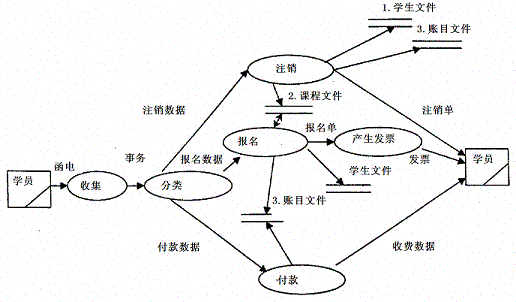

   (2) 画出该培训管理的软件结构图的主图。(4分)

   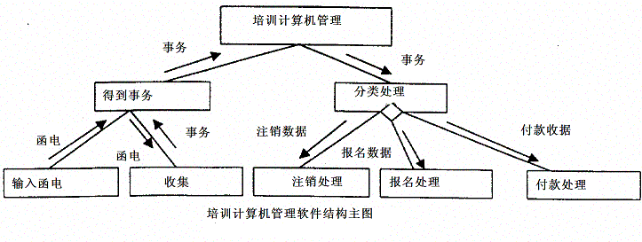

---

### 试题七答案

#### 第一部分 选择题

一、单项选择题

1. C 2. A 3. D 4. C 5. D
6. B 7. D 8. C 9. B 10. C
11. A 12. A 13. A 14. D 15. A
16. B 17. C 18. B 19. C 20. D

#### 第二部分 非选择题

二、填空题

1. 度量、软件质量度量
2. 执行者实例、事件流
3. 控制类
4. 系统响应时间
5. 继承、关联
6. 逻辑关系、软件总体结构
7. 分析与规划、改进
8. 完善性维护
9. 数据、界面
10. 代码级

三、名词解释题

1. **软件生存周期**：软件产品从形成概念开始，经过开发、运行（使用）和维护直到退役的全过程称为软件生存周期，包括软件定义、开发、使用和维护三部分。
2. **结构化程序设计**：是一种程序设计技术，采用自顶向下逐步求精的设计方法和单入口单出口的控制构件。
3. **软件过程(software process)**：软件开发人员为开发和维护软件及相关产品所实施的一系列步骤，这些步骤涉及方法、工具及人的组织和行为。
4. **综合测试**：是组装软件的系统测试技术，按设计要求把通过单元测试的各个模块组装在一起之后，进行综合测试以便发现与接口有关的各种错误。
5. **过程抽象**：把完成一个特定功能的动作序列抽象为一个过程名和参数表，通过指定过程名和实际参数调用此过程。

四、简答题

1. **简述软件危机发生的原因**：软件的规模加大、复杂性提高、性能增强；软件是逻辑产品，尚未完全认识其本质和特点；缺乏有效的、系统的开发、维护大型软件项目的技术手段和管理方法；用户对软件需求的描述和软件开发人员对需求的理解往往存在差异，用户经常要求修改需求，开发人员很难适应；软件开发的技术人员和管理人员缺乏软件工程化的素质和要求，对工程化的开销认识不足。

2. **程序设计环境的语言机制包括**：用于描述用户需求的规格说明语言，用于表示设计文档的设计描述语言，用于书写原型的原型语言以及用于书写目标软件产品的程序设计语言。

3. **简述人机界面的设计过程可分为**：创建系统功能的外部模型；确定为完成此系统功能人和计算机应分别完成的任务；考虑界面设计中的典型问题；借助CASE工具构造界面原型；真正实现设计模型；评估界面质量。

4. **典型的软件重用过程一般包括**：域分析、开发软部件、组织与扩充软部件库、检索与提取软部件、理解与修改软部件、合成软部件等阶段。

5. **面向对象程序设计语言最基本的机制包括**：类、子类、对象和实例的定义，单继承和多继承，对象的部分—整体关系，消息传递和动态链接等等。

五、综合应用题

1. 答：电话号码 = 分机号 | 外线号码
   分机号 = 7201...7299
   外线号码 = 9 + [市话号码 | 长话号码]
   长话号码 = 区号 + 市话号码
   区号 = 100...300
   市话号码 = 局号 + 分局号
   局号 = [455 | 466 | 888 | 552]

2. 答：画出该程序的流程图：

   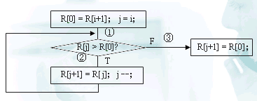

   测试用例设计：

   | 循环次数 | 输入数据 | 预期结果 | 覆盖路径 |
   |---|---|---|---|
   | 0 | j=i, R[i]=1, R[i+1]=2 | j=i, R[i]=1, R[i+1]=2 | ①③ |
   | 0 | j=i, R[i]=1, R[i+1]=1 | j=i, R[i]=1, R[i+1]=1 | ①③ |
   | 1 | j=i, R[i-1]=1, R[i]=3, R[i+1]=2 | j=i-1, R[i-1]=1, R[i]=2, R[i+1]=3 | ①②③ |
   | 1 | j=i, R[i-1]=2, R[i]=3, R[i+1]=2 | j=i-1, R[i-1]=1, R[i]=2, R[i+1]=3 | ①②③ |
   | 2 | j=i, R[i-2]=1, R[i-1]=3, R[i]=4, R[i+1]=2 | j=i-2, R[i-2]=1, R[i-1]=2, R[i]=3, R[i+1]=4 | ①②②③ |
   | 2 | j=i, R[i-2]=2, R[i-1]=3, R[i]=4, R[i+1]=2 | j=i-2, R[i-2]=2, R[i-1]=2, R[i]=3, R[i+1]=4 | ①②②③ |

3. 答：

   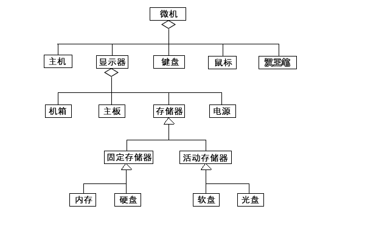

---

### 试题八答案

#### 第一部分 选择题

一、单项选择题

1. B 2. D 3. D 4. B 5. C
6. B 7. C 8. D 9. C 10. D
11. D 12. B 13. A 14. C 15. D
16. C 17. D 18. D 19. A 20. C

#### 第二部分 非选择题

二、填空题

1. 活动图
2. 11
3. CASE工具集
4. 属性和操作
5. 测试用例、设计文档
6. 软件需求说明书中
7. 探索性、进化性
8. 消息
9. 模块间接口
10. 过程式、面向对象

三、名词解释题

1. **软部件合成**：是指将库中的软部件(经适当修改后)相互连接，或者将它们与当前开发项目中的软件元素相连接，最终构成新的目标软件。
2. **进化性原型**：如果原型不仅用来理解问题、试验求解方案，而且用作目标软件系统的基础，在后续开发过程中逐步进化为最终的软件产品。
3. **软件质量**：软件产品满足规定的和隐含的与需求能力有关的全部特征和特性。
4. **恢复测试**：主要检查系统的容错能力。当系统出错时，能否在指定的时间间隔内修正错误并重新启动系统。
5. **状态图**：描述类的对象的动态行为。它包含对象所有可能的状态、在每个状态下能够响应的事件以及事件发生时的状态迁移与响应动作。

四、简答题

1. **软件产品具有哪些特点**：软件开发与传统的产品生产存在本质差别；软件是逻辑产品，而不是物理产品；软件不会磨损。

2. **简述在测试中采用自顶向下集成和自底向上集成的优缺点**：
   - 自顶向下集成的优点在于能尽早地对程序的主要控制和决策机制进行检验，因此较早地发现错误。缺点是在测试较高层模块时，低层处理采用桩模块替代，不能反映真实情况，重要数据不能及时回送到上层模块，因此测试并不充分。
   - 自底向上集成方法不用桩模块，测试用例的设计亦相对简单，但缺点是程序最后一个模块加入时才具有整体形象。它与自顶向下综合测试方法的优缺点正好相反。

3. **边界类描述目标软件系统与外部环境的交互，边界类主要任务**：界面控制：包括输入数据的格式及内容转换，输出结果的呈现，软件运行过程中界面的变化与切换等；外部接口：实现目标软件系统与外部系统或外部设备之间的信息交流和互操作，主要关注跨越目标软件系统边界的通信协议；环境隔离：将目标软件系统与操作系统、数据库管理系统、应用服务器中间件等环境软件进行交互的功能与特性封装于边界类之中，使目标软件系统的其余部分尽可能地独立于环境软件。

4. **精化体系结构的目的是**：寻找一种包的划分方案，使得每个包直接包含的类的数量适中，包的边界清晰、自然，并且包间的耦合度较低。

5. **一般而言，衡量某种程序语言是否适合于特定的项目，应考虑下面一些因素**：应用领域；算法和计算复杂性；软件运行环境；用户需求中关于性能方面的需要；数据结构的复杂性；软件开发人员的知识水平；可用的编译器与交叉编译器。

五、综合应用题

1. 答：（同试题五答案第1题）

2. 答：设计C最好。

   学生和教员均可以从Candidate类继承而来；抽象出Role类，使Candidate类与Role类之间形成多对多的关联关系，实现了"一个人既是教师又是某门课的学生"这个需求。

3. 答：

   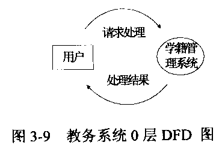

---

### 试题九答案

#### 第一部分 选择题

一、单项选择题

1. A 2. D 3. D 4. D 5. C
6. C 7. D 8. B 9. C 10. B
11. D 12. A 13. B 14. D 15. A
16. C 17. B 18. A 19. D 20. B

#### 第二部分 非选择题

二、填空题

1. 动态多变量、实测数据
2. 参与执行者、一个主事件流
3. 问题抽象、需求建模
4. 详细设计、控制路径
5. 重用支持组、系统开发组
6. 可依赖性、可用性
7. 测试规划、测试用例设计
8. 编程准则、编程风格
9. 软件体系结构图、活动图
10. 属性列表、方法列表

三、名词解释题

1. **水平原型**：是指仅仅模拟目标软件系统某一层面(通常是用户界面层)的原型。
2. **CASE工具**：是一些软件系统，支持软件过程的常规活动，如编辑设计图表、检查图表的连贯性、跟踪已经运行的程序测试等。
3. **部署图(deployment diagram)**：描述软件系统运行环境的硬件及网络的物理体系结构。
4. **垂直原型**：是指模拟目标软件系统某一部分的多个层面的原型。当目标系统的内部功能和用户界面都需要借助原型来确定时，这类原型特别有用。一般的进化性原型都属于垂直原型。
5. **数据抽象**：把一个数据对象的定义(或描述)抽象为一个数据类型名，用此类型名可定义多个具有相同性质的数据对象。

四、简答题

1. **设计模型精化时需要考虑的任务**：以顶层架构图为基础，精化目标软件系统的体系结构；精化类之间的关系；精化类的属性和操作；针对具有明显状态转换特征的类，设计状态图；针对比较复杂的类方法，设计活动图。

2. **人机界面的风格大致经历了四代的演变**：最早，即在图形显示、鼠标、高速工作站等技术出现之前，现实可行的界面方式只能是命令和询问方式，通信完全以正文形式并通过用户命令和用户对系统询问的响应来完成。第二代界面是简单的菜单式。第三代界面是面向窗口的点选界面，亦称为WIMP界面。最新一代HCI把第三代HCI技术与超文本、多任务概念结合起来，使用户可同时执行多个任务（以用户的观点）。

3. **螺旋模型的基本开发过程可描述如下**：需求定义→风险分析→工程实现→评审。上述过程将不断迭代，直至给出用户满意的目标软件产品。

4. **启发式设计策略最常用的几条有**：改造程序结构，减小耦合度，提高内聚度；改造程序结构，减少高扇出，在增加程序深度的前提下追求高扇入；改造程序结构，使任一模块的作用域在其控制域之内；改造程序结构，减少界面的复杂性和冗余程度，提高协调性；模块功能应该可预言，避免对模块施加过多限制；改造程序结构，追求单入口单出口的模块；为满足设计或可移植性的要求，把某些软件用包（Package）封装起来。

5. **采用信息隐藏原理指导模块设计优点**：支持模块的并行开发；减少软件测试和软件维护的工作量。

五、综合应用题

1. 答：

   （1）数据流图：

   

   （2）软件结构图

   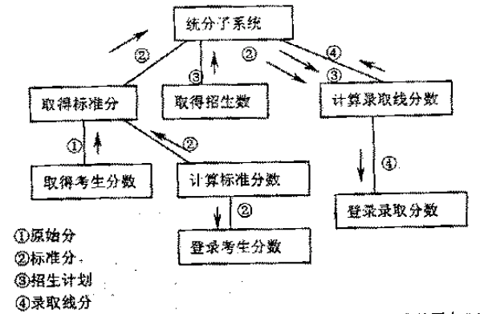

2. 答：

   先划分等价类并编号

   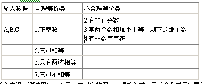

   为合理等价类设计测试用例，对于表中对应的四个合理等价类，用三个测试用例覆盖。

   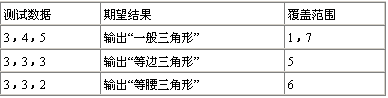

   为每一个不合理等价类设计一个测试用例：

   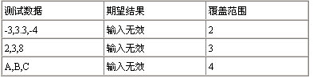

   用边界值法设计测试用例：

   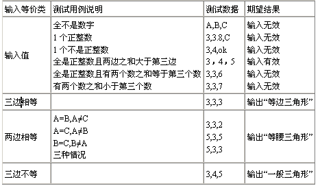
