# 河南大学 · 期末复习题5 · 之《软件工程》

**甘士成** | 2013/1/1

---

## 第一章

1. **软件**：计算机程序、规程以及运行计算机系统可能需要的**相关文档和数据**。

2. **软件危机**：在计算机软件的**开发和维护过程中**所遇到的一系列严重问题。

3. **软件工程**：IEEE计算机学会定义软件工程是将**系统化、规范化、可度量的方法**应用于软件的**开发、运行和维护过程**，即**将工程化应用于软件中的方法**的研究。

   **过程、方法和工具**是软件工程的三个要素。

4. **软件工程的目标**：

   - 付出较低的**开发成本**
   - 达到要求的**软件功能**
   - 取得较好的**软件性能**
   - 开发的软件**易于移植**
   - 需要较低的**维护费用**
   - 能按时完成开发工作，**及时交付**使用

5. **软件工程的原则**：**抽象、信息隐蔽、模块化、局部化、确定性、一致性、完备性、可验证性**

6. **软件开发方法**：

   **(1) 结构化方法**：采用结构化分析方法对软件进行需求分析，然后用结构化设计方法进行总体设计和详细设计，最后是结构化编程。

   结构化分析的主要工作是按照功能分解的原则，自顶向下、逐步求精，直到实现软件功能为止。在分析问题时，系统分析人员一般利用图表的方式描述用户需求，使用的工具有：数据流图、数据字典、问题描述语言、判定表和判定树等。结构化设计是以结构化分析为基础，将分析得到的数据流图推导为描述系统模块之间关系的结构图。

   **(2) 面向对象方法**：比较其他的软件开发方法更符合人类的思维方式。它通过将现实世界问题向面向对象解空间映射的方式，实现对现实世界的直接模拟。

   由于面向对象的软件系统的结构是根据实际问题域的模型建立起来的，它以数据为中心，而不是基于对功能的分解。

---

## 第二章

1. **软件生命周期**：由**软件定义**、**软件开发**和**运行维护**3个时期组成。

2. **各时期的任务**：

   **(1) 软件定义**时期的任务：确定必须完成的总目标；确定工程的可行性；确定完成目标的总策略和必须完成的功能；估计资源、成本；制定工程进度表。（分为3个阶段：**问题定义、可行性研究、需求分析**）

   **(2) 软件开发**时期的任务：把用户的要求转变为软件产品。包括：把需求转换成设计，把设计用代码实现，测试该代码，有时还要进行代码安装和交付运行。这些活动可以重叠，执行时也可迭代。（分为4个阶段：**系统设计{总体设计(概要设计)、详细设计}，系统实现{编码和单元测试、综合测试}**）

   **(3) 运行维护**时期的任务：使软件持久地满足用户的需要。

3. **各个阶段的基本任务**：

   1. 问题定义 —— "要解决的问题是什么？"
   2. 可行性研究 —— "对于上一阶段定义的问题有行得通的解决办法吗？" → 可行性研究报告
   3. 需求分析 —— "目标系统必须做什么？" → 需求规格说明书
   4. 总体设计（概要设计） —— "概括的说，应该怎么实现目标系统？" → 概要设计说明书
   5. 详细设计（模块设计） —— "应该怎么具体地实现这个系统呢？" → 详细设计说明书
   6. 编码和单元测试
   7. 综合测试（集成测试、验收测试）
   8. 软件维护（改正性维护、适应性维护、完善性维护、防御性维护）

4. **软件过程模型**：

   **软件过程**：过程为了获得高质量软件所需要完成的一系列任务的框架，它规定了完成各项任务的工作步骤。描述了 who、when、what、how，用以实现某一个特定的具体目标。定义了运用方法的顺序、应该交付的文档资料、管理措施和标识软件开发各个阶段任务完成的里程碑。

   **软件过程模型**是软件开发全部过程、活动和任务的结构框架，它直观地表达了软件开发的全过程，明确规定了要完成的主要活动、任务和开发策略。软件过程模型也称为软件开发模型、软件工程范型。

   **(1) 瀑布模型**：它规定了软件生命周期中的各项活动，这些活动自上而下，相互衔接呈线性图状，如同瀑布流水，逐级下落。

   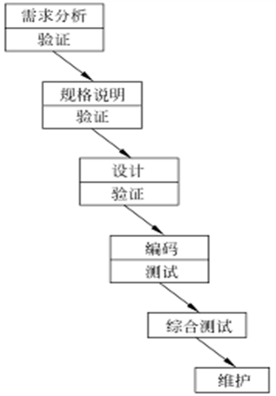

   适用范围：适合于功能、性能明确、完整、无重大变化的软件开发。在开发前均可完整、准确、一致和无二义性地定义其目标、功能和性能等的系统。（结构化开发方法）

   **(2) 原型模型**：将系统主要功能和接口通过快速开发，制作为"软件样机"，以可视化的形式展现给用户，征求意见，从而准确地确定用户需求。

   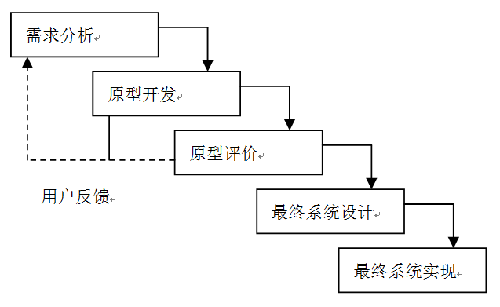

   适用范围：
   - 需求不确定，用户自己也不清楚想要什么
   - 已有类似原型或有原型开发工具
   - 进行产品移植或升级

   **(3) 螺旋模型**：使用原型及其他方法来尽量降低风险。可看作是在每个阶段之前都增加了风险分析过程的快速原型模型。强调版本和版本升级。

   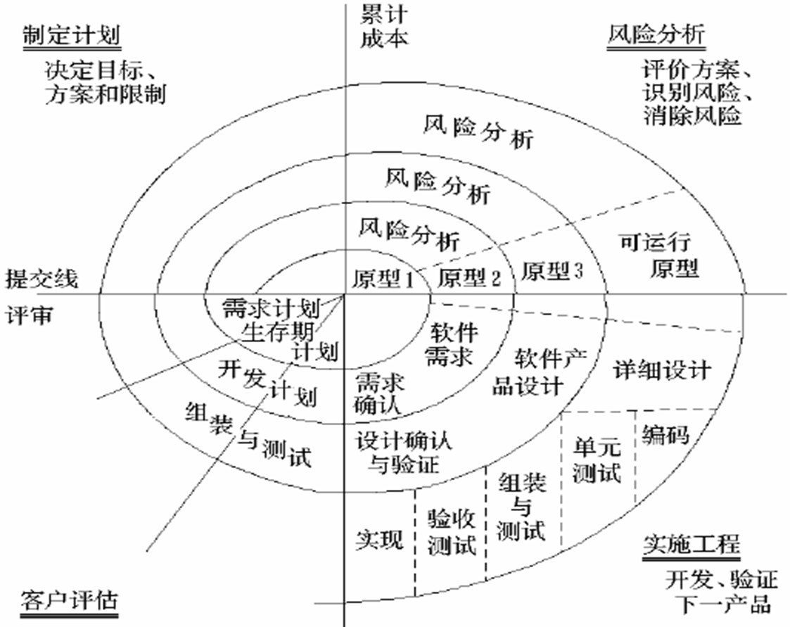

   适用范围：主要适用于内部开发的大规模软件项目。支持需求不明确的大型软件系统的开发，并支持面向规格说明、面向过程、面向对象等多种软件开发方法，是一种具有广阔前景的模型。

   **(4) 喷泉模型**：以用户需求为动力，以对象作为驱动的一种模型，适合于面向对象的开发方法。

   该模型认为软件开发过程自下而上周期的各阶段是相互重叠和多次反复的，就像水喷上去又可以落下来，类似一个喷泉。各个开发阶段没有特定的次序要求，并且可以交互进行，可以在某个开发阶段中随时补充其他任何开发阶段中的遗漏。

   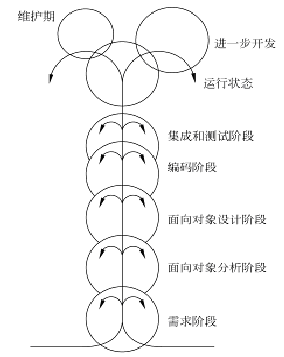

   在应用喷泉模型时需要结合其他模型。

   **(5) 增量模型**：非整体开发的思想，遵循递增方式来进行软件开发。把软件产品作为系统的增量构件来设计、编码、集成和测试。每开发一部分，向用户展示一部分。

   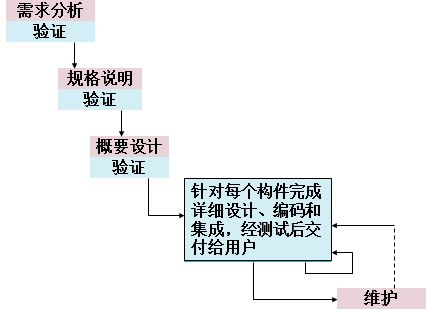

   适用范围：
   - 开发过程中，需求可能发生变化，用户接受分阶段地提交产品
   - 分析设计人员对应用领域不熟悉，难以一步到位
   - 项目风险较高
   - 用户可以参与到整个软件开发过程
   - 软件公司自己有较好的类库和构件库

---

## 第三章

1. **可行性研究的目的**：**用最小的代价在尽可能短的时间内研究并确定客户提出的问题是否有行得通的解决办法。**

2. **可行性研究从以下四个方面进行**：

   - **技术可行性**：做得了吗？做得好吗？做得快吗？
   - **经济可行性**：这个系统的经济效益能超过它的开发成本吗？
   - **操作可行性**：系统的操作方式在这个用户组织内行得通吗？
   - **社会可行性**

3. **可行性研究的过程**：

   1. 确定系统的规模和目标
   2. 研究目前正在使用的系统
   3. 导出新系统的高层逻辑模型
   4. 重新定义问题
   5. 导出和评价选择的解决方案
   6. 推荐行动方针
   7. 草拟开发计划
   8. 书写文档提交审查

---

## 第四章

1. **需求工程的定义**：应用已证实有效的技术、方法进行需求分析，确定客户需求，帮助分析人员理解问题并定义目标系统的所有外部特征的一门学科。

   完整的软件需求工程包括**需求开发**和**需求管理**两个部分。

2. **需求开发**过程包括：需求获取、需求分析与建模、编写需求规格说明书、需求评审4个活动。

   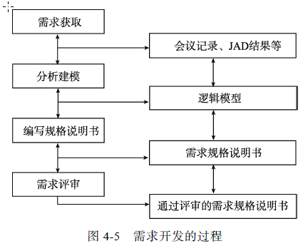

   需求管理包括：需求变更控制、需求版本控制、需求跟踪、需求状态跟踪。

---

## 第五章

1. 掌握数据流图、数据字典（大题）。

---

## 第六章

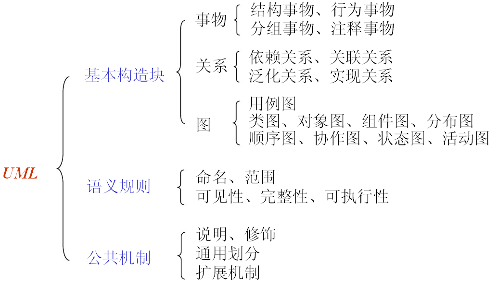

**UML**由**视图**、**模型元素**、**图**等部分组成。

### UML五种视图

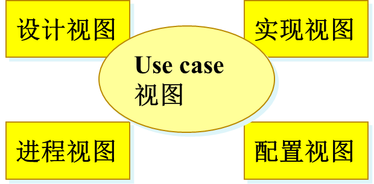

**UML模型元素**：建模过程中涉及的一些基本概念，如类、对象、用例、结点、状态、接口、包（子系统）、注释、构件等。

模型元素与模型元素之间的连接关系也是模型元素，常见的关系有关联、泛化、依赖、聚合和组合，其中聚合和组合是关联的特殊形式。

### UML图

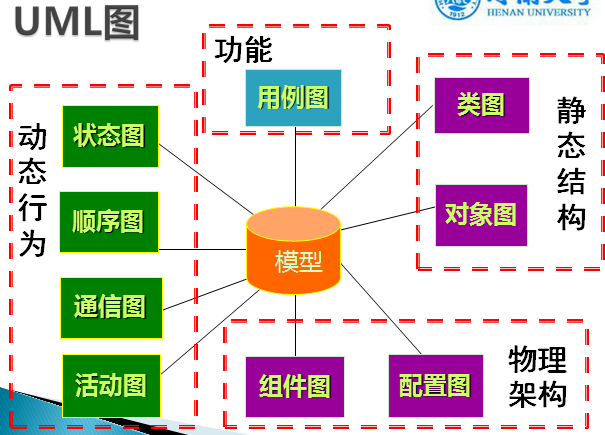

**UML 9种图**：

1. **用例图**：说明和定义软件系统的功能需求，从系统外部观看系统功能，并不描述系统内部对功能的具体实现。展现一组用例、参与者及其它们之间的关系。
2. **类图**：描述系统的静态结构，展示系统中的类、类的属性和操作、以及类与类之间的关系。
3. **对象图**：描述系统在某一刻对象和它们之间的联系，实质上是类图的实例。
4. **构件图**：描述构件以及它们之间的关系，显示代码本身的逻辑结构，表示系统的静态实现视图。
5. **配置图**：描述节点、以及节点和节点之间的关系，反映系统中软件和硬件的物理配置情况和系统体系结构。
6. **顺序图**：也称序列图，描述了一组交互对象间的交互方式，强调完成某项行为的对象和这些对象之间传递消息的时间顺序性。
7. **通信图**：描述了对象与周围对象之间的交互，以及它们之间的链接。顺序图和通信图都可用来表示对象间的协作关系；如果强调时间和顺序，就使用顺序图；如果强调对象间的相互关系，则选择通信图。
8. **活动图**：描述由不同对象所执行的一组活动、以及活动之间的关系，反映系统中各种活动的执行顺序。
9. **状态图**：描述一组状态、以及状态之间的迁移，反映一个特定对象的所有可能状态以及引起状态迁移的事件。

---

## 第七章

### 结构化分析模型的组成结构

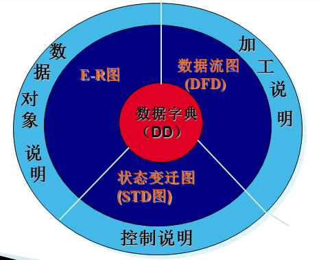

### 面向对象分析模型的组成结构

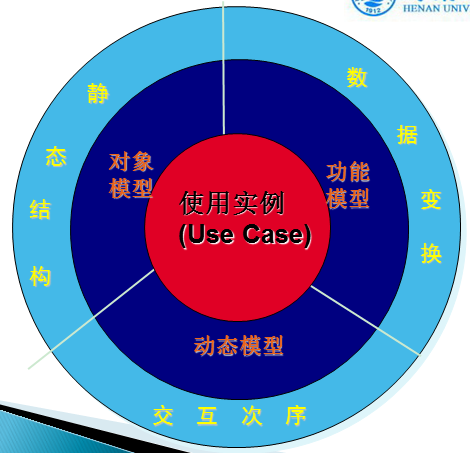

1. **分析类**：分析类是概念层次上的内容，在功能需求分析过程中，描述系统较高层次的对象，它和设计过程中得出的类也没有必然对应关系。

2. 掌握**实体类、边界类、控制类**识别方法：

   - **边界类**：描述与参与者直接打交道的对象，一般是一些UI界面
   - **控制类**：描述系统的行为，即系统做什么
   - **实体类**：描述系统中的数据信息（有些数据是实体类，而有些是实体类的属性）

   **边界类**和**实体类**都对应于用例描述中的**名词**，而**控制类**对应于用例描述中的**动词**。

---

## 第八章

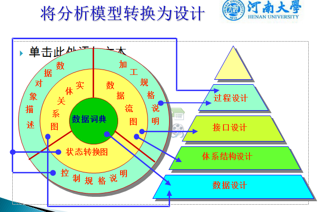

1. **软件设计的概念与原则**：

   - **(1) 模块化与模块独立性**
   - **(2) 抽象与逐步求精**
   - **(3) 信息隐藏**

2. **软件体系结构风格举例**：管道—过滤器、仓库体系结构、分层体系结构、MVC体系结构、三层C/S体系结构、C/S与B/S混合体系结构（要能说出其中的几种）。

---

## 第九章

结构化设计方法把数据流图映射为软件结构图，数据流的类型决定了映射的方法。数据流有两种类型：**变换型、事务型**。

### 变换型

信息沿输入通路进入系统，同时由外部形式变换成内部形式，进入系统的信息通过变换中心，经加工处理以后再沿输出通路变换成外部形式离开软件系统。

当数据流图具有这些特征时，这种信息流就叫作变换流。由输入、变换中心和输出三部分组成。因此变换型的DFD（Data Flow Diagram，数据流图）是一个顺序结构。

### 事务型

数据沿输入通路到达一个处理T，这个处理根据输入数据的类型在若干个动作序列中选出一个来执行。处理T称为事务中心，它完成以下任务：

1. 接收输入数据（输入数据又称为事务）
2. 分析每个事务以确定它的类型
3. 根据事务类型选取一条动作路径

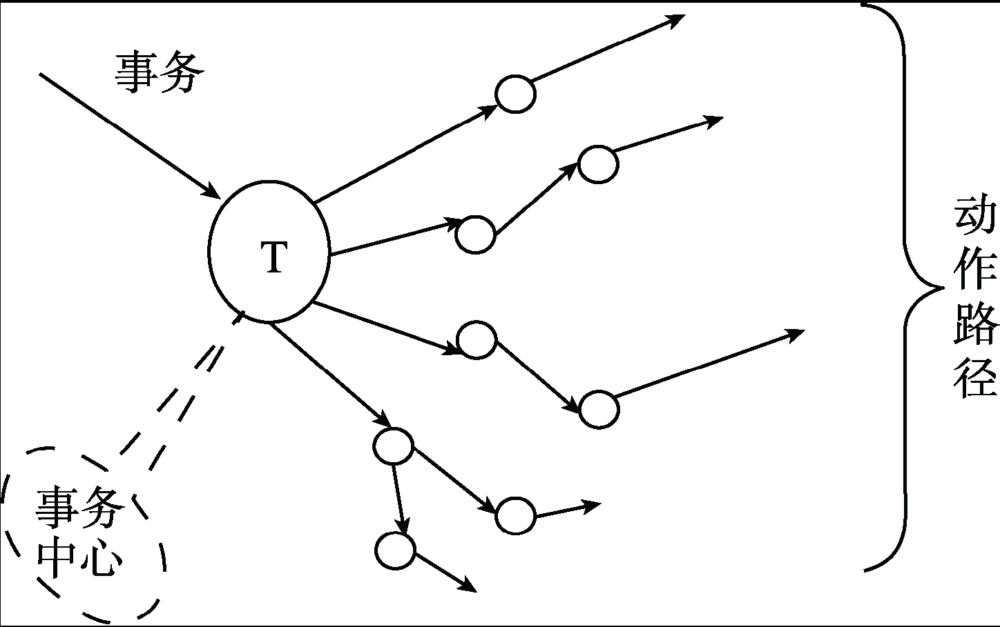

### 变换分析、事务分析、变换—事务混合型分析

**变换分析**：变换分析是一系列设计步骤的总称，经过这些步骤把具有变换流特点的数据流图映射成为一个预定义的程序结构模板。

1. 对DFD图的分析和划分
2. 进行第一级分解，设计顶层和第一层模块
3. 第二级分解，设计中、下层模块

**事务分析**：事务可定义为：引起式、触发式启动单一动作或一串动作的任何数据、控制、信号、事件或状态变化。由事务型数据流图映射为软件结构的过程，称为事务分析。

运用事务分析的具体步骤如下：

1. 确定输入、事务变换和输出路径的集合（划分集合）
2. 根据事务的功能设计一个总控模块（设计总控）
3. 确定顶层模块和第一层模块（建立映射）
4. 继续下层分解（递归自展）

**变换—事务混合型分析**：一个大型系统常常是变换型和事务型的混合结构，为了导出他们的初始SC（Structure Chart，系统结构图），也必须同时采用变换分析和事务分析两种方法。

---

## 第十章

1. **面向对象设计五原则**：单一职责原则、开放-封闭原则、Liskov替换原则、接口隔离原则、依赖倒置原则。

   **开放-封闭原则**是实现面向对象可复用设计的基础，其他的设计原则则是实现这一原则的手段和工具。

   **单一职责原则**：
   - 要求系统中的一个具体设计元素（类）只完成某一类功能（职责）
   - 尽可能避免出现一个"复合"功能的类——在同一个类中完成多个不同的功能

   

   **开放-封闭原则**（Open Closed Principle，OCP）：
   - 软件实体类（类、模块、函数等）应该是可以扩展、但是不可修改的
   - 基本思想：不用修改原有类就能扩展一个类的行为

   **Liskov替换原则**（LSP）：
   - 子类应当可以替换父类并出现在父类能够出现的任何地方
   - 若对每个类型S的对象o1，都存在一个类型T的对象o2，使得在所有针对T编写的程序P中，用o1替换o2后，程序P的行为功能不变，则S是T的子类型
   - **核心思想**：子类型必须能够替换它们的基类型，该原则能够指导设计人员正确地进行类的继承与派生
   - **基本要求**：派生类要与其子类自相容，也就是基本类中的抽象方法都要在子类中声明，并且一个具体的实现类应当只实现其接口和抽象类中声明的方法
   - **如何遵守Liskov替换原则**：
     - 主要针对继承的设计原则
     - 客户端只需要依赖于基类或其接口
   - Liskov替换原则能够指导软件设计人员正确地进行继承关系的设计：
     - 继承是面向对象编程技术中一个很重要的手段，也是类之间很常见的关系之一
     - 如果类之间的继承关系满足Liskov替换原则，则能够实现运行期绑定（动态多态）
       - 实现接口或者继承某个抽象类来实现

   **接口隔离原则**（Interface Segregation Principle，ISP）：
   - 采用多个与特定客户类有关的接口比采用一个通用的涵盖多个业务方法的接口更好
   - 主要思想：
     - 一个类对另外一个类的依赖关系应该是建立在最小接口上的
     - 使用多个专用专门的接口比使用单一的复合总接口要优越
   - 对接口的污染：设计人员为了节省接口数目，而经常将一些功能相近或功能相关的接口合并成一个总的接口 → 臃肿的大接口
   - 如何遵守接口隔离原则：将完成一类相关功能的各个方法放在同一个接口中，形成高内聚的职责

   **依赖倒置原则**（Dependence Inversion Principle，DIP）：
   - 面向过程——自顶向下，逐步求精
   - 依赖倒置原则是指应用系统中的高层模块不应依赖于底层模块，两者都应该依赖于抽象；抽象不应该依赖于细节实现，实现细节应该依赖于抽象
   - 消除两个模块之间的依赖——接口：上层调用接口中方法，下层实现接口
   - 如何满足依赖倒置原则——面向接口编程（结合使用接口和抽象类）
   - 优点：通过接口隔离了"服务的提供者"和"服务的请求者"，复用、灵活性、易维护

2. **设计模式**：广义上讲，设计模式是对被用来在特定场景下解决一般设计问题的类和相互通信的对象的描述；狭义上讲，设计模式就是对特定问题的描述或解决方案，往往直接对应一段程序代码。

   常见的设计模式举例：抽象工厂模式、适配器模式、策略模式、外观模式。

---

## 第十一章

1. **用户界面设计原则**：**置于用户控制之下**、**减轻用户的记忆负担**、**保持界面一致**。

---

## 第十二章

1. **软件编码规范**：

   遵循一定的规范，可提高程序的可靠性、可读性、可修改性、可维护性、一致性，使开发人员之间的工作成果可以共享，充分利用资源。

   内容：头文件规范、注释规范、命名规范、排版规范、目录结构规范等。

2. **提高程序效率的方法**：运行速度的提高、存储空间的优化、输入/输出效率的提高。

   **运行速度的提高**：为了提高程序的运行速度，应遵循以下原则：
   1. 改善循环的效率
   2. 采用快速的算术运算
   3. 对数据结构进行划分和改进，以及对程序算法的优化来提高空间效率
   4. 尽量避免使用指针和复杂的表达式，使用指针时，要防止"野指针"
   5. 不要混淆数据类型，避免在表达式中出现类型混杂
   6. 尽量采用整数算术表达式和布尔表达式
   7. 编码前，尽量简化有关的算术表达式和逻辑表达式
   8. 选用等效的高效率算法

   **存储空间的优化**：
   - 内存采取基于操作系统的分页功能的虚拟存储管理
   - 对于变动频繁的数据最好采用动态存储
   - 采用结构化程序设计，将程序功能合理分块，使每个模块或一组密切相关模块的程序体积大小与每页的容量相匹配，可减少页面调度，减少内外存交换，提高存储效率

---

## 第十三章

1. **软件测试技术**：

   1. 从是否关心软件内部结构和具体实现的角度分为：黑盒测试、白盒测试
   2. 从是否执行程序的角度分为：静态测试、动态测试
   3. 这两种不同的角度出发和组合分为：静态黑盒测试、动态黑盒测试、静态白盒测试、动态白盒测试

2. **软件测试的一般过程**：单元测试、集成测试、确认测试、系统测试。

   

3. **测试与调试的区别和联系**：

   **测试**：软件测试的定义（IEEE）——软件测试是使用人工或自动手段来运行或测定某个系统的过程，检验它是否满足规定的需求或是弄清预期结果与实际结果之间的差别。

   **调试**：将在测试过程中出现的软件缺陷进一步地诊断并且改正程序中存在的潜在缺陷，保证软件运行的正确性和可靠性。分为以下两部分：
   1. 确定程序中可疑缺陷的确切性质和位置
   2. 对程序的设计和编码进行修改，纠正当前缺陷

   **调试是通过现象查找内在原因的一个思维分析过程。**

---

## 第十四章

1. **软件维护的分类**：纠错（改正）性维护、适应性维护、完善性维护、预防性维护。

2. **软件可维护性**：软件能够被理解、改正、适应和完善，以适应新的环境的难易程度。即进行维护活动时的难易程度。是软件产品的一个重要质量特性，是软件开发阶段各个时期的关键指标。

3. **软件可维护性从以下几个方面度量**：可理解性、可靠性、可测试性、可修改性、可移植性、效率、可使用性。

---

## 第十五章

1. **软件项目管理包含的内容**：人员管理、成本管理、时间管理、配置管理、风险管理、软件项目管理。
